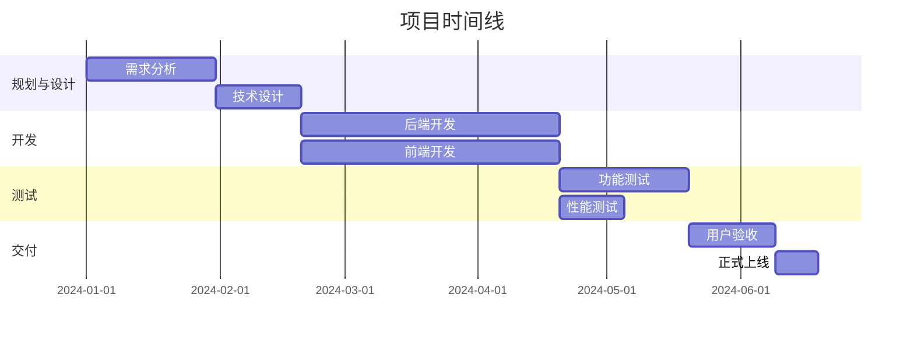

# 项目时间线

> 项目关键里程碑和交付物的时间计划。定期更新实际进度。

## 项目时间轴概览

## 详细时间节点

### 2024年Q1

#### 1月 - 项目启动 & 需求分析
- **项目启动日**: 2024-01-01
  - [ ] 团队组建完成
  - [ ] 开发环境搭建
  - [ ] 工具链配置

- **需求评审日**: 2024-01-15
  - [ ] 业务需求确认
  - [ ] 用户故事评审
  - [ ] 技术方案讨论

- **里程碑**: 需求冻结
  - **日期**: 2024-01-31
  - **交付物**: PRD文档、用户故事清单、技术方案初稿
  - **状态**: ⏳ 待开始

---

#### 2月 - 技术设计 & 原型开发
- **架构设计日**: 2024-02-05
  - [ ] 系统架构设计
  - [ ] 数据库设计
  - [ ] 接口设计

- **原型评审日**: 2024-02-20
  - [ ] UI/UX设计评审
  - [ ] 交互原型确认
  - [ ] 技术可行性验证

- **里程碑**: 设计评审通过
  - **日期**: 2024-02-28
  - **交付物**: 架构设计文档、UI设计稿、技术选型清单
  - **状态**: ⏳ 待开始

---

#### 3月 - 开发准备 & 核心模块开发月
- **开发启动日**: 2024-03-01
  - [ ] Sprint 1 启动
  - [ ] 核心功能开发
  - [ ] 持续集成搭建

- **里程碑**: 核心模块完成
  - **日期**: 2024-03-31
  - **交付物**: 核心功能代码、单元测试、技术文档
  - **状态**: ⏳ 待开始

---

### 2024年Q2

#### 4月 - 主体功能开发
- **Sprint 2**: 2024-04-01 至 2024-04-15
  - [ ] 功能模块A开发
  - [ ] 功能模块B开发

- **Sprint 3**: 2024-04-16 至 2024-04-30
  - [ ] 功能模块C开发
  - [ ] 功能模块D开发

---

#### 5月 - 功能完善 & 集成测试
- **功能开发**: 2024-05-01 至 2024-05-20
  - [ ] 功能优化
  - [ ] 性能优化

- **集成测试**: 2024-05-21 至 2024-05-31
  - [ ] 接口联调
  - [ ] 集成测试

---

#### 6月 - 测试月
- **功能测试**: 2024-06-01 至 2024-06-15
  - [ ] 测试用例执行
  - [ ] 缺陷修复
  - [ ] 回归测试

- **性能测试**: 2024-06-16 至 2024-06-25
  - [ ] 压力测试
  - [ ] 安全测试
  - [ ] 性能调优

- **里程碑**: 测试完成
  - **日期**: 2024-06-30
  - **交付物**: 测试报告、性能报告、缺陷修复清单
  - **状态**: ⏳ 待开始

---

### 2024年Q3

#### 7月 - 用户验收测试
- **UAT启动**: 2024-07-01
  - [ ] 用户培训
  - [ ] 测试数据准备
  - [ ] 问题支持

- **UAT执行**: 2024-07-02 至 2024-07-20
  - [ ] 用户测试
  - [ ] 问题收集
  - [ ] 反馈处理

- **里程碑**: UAT通过
  - **日期**: 2024-07-25
  - **交付物**: UAT测试报告、用户反馈汇总、问题修复清单
  - **状态**: ⏳ 待开始

---

#### 8月 - 生产准备 & 上线
- **上线准备**: 2024-08-01 至 2024-08-15
  - [ ] 生产环境搭建
  - [ ] 数据迁移准备
  - [ ] 上线文档准备

- **正式上线**: 2024-08-16
  - [ ] 系统上线
  - [ ] 监控配置
  - [ ] 技术支持

- **里程碑**: 系统上线
  - **日期**: 2024-08-20
  - **交付物**: 生产环境、监控报告、运维文档
  - **状态**: ⏳ 待开始

---

## 里程碑详情

### 里程碑1: 需求冻结

**计划日期**: 2024-01-31
**实际日期**:
**完成率**: 0%

**交付物清单**:
- [ ] PRD文档 v1.0
- [ ] 用户故事清单 (50+ stories)
- [ ] 技术方案初稿
- [ ] UI/UX设计方案

**验收标准**:
- 产品经理确认需求完整性
- 技术团队确认技术可行性
- 主要客户确认功能范围

**依赖条件**:
- 业务需求明确
- 资源到位
- 工具准备完成

---

### 里程碑2: 设计评审通过

**计划日期**: 2024-02-28
**实际日期**:
**完成率**: 0%

**交付物清单**:
- [ ] 系统架构设计文档 v1.0
- [ ] 数据库设计文档
- [ ] API接口设计文档
- [ ] UI设计稿 (20+ pages)

**验收标准**:
- 架构评审委员会通过
- 技术方案可行性验证完成
- UI设计符合用户体验要求

**风险预警**:
- 技术选型争议
- 设计复杂度过高
- 资源不足

---

### 里程碑3: 核心模块完成

**计划日期**: 2024-03-31
**实际日期**:
**完成率**: 0%

**交付物清单**:
- [ ] 用户认证模块
- [ ] 核心业务流程
- [ ] 基础数据管理
- [ ] 单元测试覆盖率 >80%

**验收标准**:
- 代码审查通过
- 单元测试通过
- 集成测试通过
- 性能基准测试通过

**关键假设**:
- 团队稳定
- 需求不再变更
- 技术方案可行

---

## 关键路径分析

### 关键路径

1. **需求分析** → 2. **技术设计** → 3. **核心开发** → 4. **功能测试** → 5. **UAT** → 6. **上线**

### 平行路径

- **UI设计**可以与**技术设计**并行
- **文档编写**可以与**开发测试**并行
- **培训准备**可以与**测试**并行

### 缓冲时间

- 设计阶段: 5天缓冲
- 开发阶段: 10天缓冲
- 测试阶段: 5天缓冲

---

## 资源分配计划

### 人力资源

| 时间段 | 前端 | 后端 | 测试 | 运维 | 产品 |
|--------|------|------|------|------|------|
| 1-2月 | 1 | 2 | 1 | 0.5 | 1 |
| 3-5月 | 2 | 3 | 2 | 1 | 1 |
| 6-7月 | 2 | 2 | 3 | 1 | 1 |
| 8月 | 1 | 1 | 2 | 2 | 1 |

### 预算分配

| 类别 | Q1 | Q2 | Q3 | 合计 |
|------|----|----|----|------|
| 人力资源 | | | | |
| 云服务 | | | | |
| 第三方服务 | | | | |
| 合计 | | | | |

---

## 风险与应对

### 进度风险

| 风险描述 | 概率 | 影响 | 应对策略 | 监控指标 |
|----------|------|------|----------|----------|
| 需求变更 | 高| 高| 严格变更控制流程 | 变更请求数量 |
| 技术难点 | 中| 高| 提前技术预研 | 技术债务指标 |
| 人员流失 | 中| 中| 知识共享机制 | 团队稳定性 |
| 外部依赖 | 中| 中| 寻找备选方案 | 依赖交付状态 |

### 应对措施

1. **需求变更**: 建立变更控制委员会，评估影响
2. **技术风险**: 提前进行技术验证，准备备选方案
3. **资源风险**: 保持资源缓冲，建立外部资源池
4. **质量风险**: 增加自动化测试，定期代码审查

---

## 进度跟踪

### 本月进展

**计划完成**:
- [ ]

**实际完成**:
- [ ]

**偏差原因**:

**下月计划**:
- [ ]

### 累计进度

| 阶段 | 计划完成% | 实际完成% | 偏差 | 状态 |
|------|----------|----------|------|------|
| 需求分析 | 100% | % | % | |
| 技术设计 | % | % | % | |
| 开发实现 | % | % | % | |
| 测试验证 | % | % | % | |
| 上线交付 | % | % | % | |

---

## 相关文档

- [项目章程](./project-charter.md)
- [愿景与目标](./vision-and-goals.md)
- [利益相关方](./stakeholders.md)
