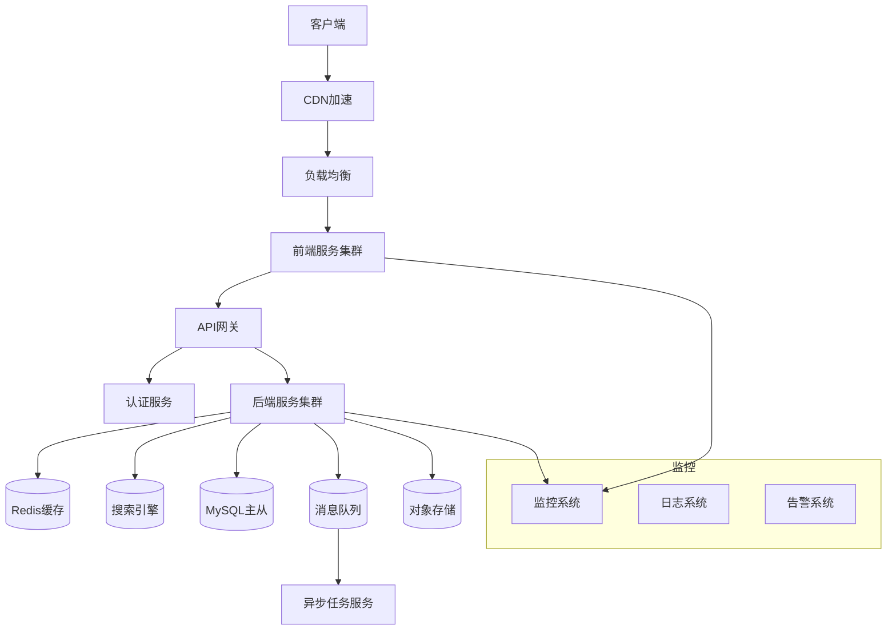

# 系统架构总览

> 系统整体架构设计，包括技术栈、模块划分、数据流等关键信息。

## 架构原则

### 核心原则

1. **高性能**: 支持高并发访问，响应时间在合理范围内
2. **高可用**: 系统可用性达到99.9%以上
3. **可扩展**: 支持水平扩展，应对业务增长
4. **可维护**: 代码清晰，文档完善，易于维护
5. **安全性**: 符合安全规范，保护用户数据

### 技术选型原则

- 成熟稳定的技术栈
- 活跃的社区支持
- 团队熟悉的技术
- 良好的扩展性

## 技术栈概览

| 层级 | 技术 | 版本 | 选择理由 |
|------|------|------|----------|
| **前端** | React | 18.x | 组件化、生态完善 |
| | TypeScript | 4.x | 类型安全 |
| | Ant Design | 4.x | UI组件丰富 |
| **后端** | Spring Boot | 2.7.x | 成熟稳定 |
| | Java | 11 | LTS版本 |
| **数据库** | MySQL | 8.0 | 关系型数据存储 |
| | Redis | 6.x | 缓存和会话 |
| **消息队列** | Kafka | 2.8 | 高吞吐 |
| **部署** | Docker | latest | 容器化 |
| | Kubernetes | 1.24 | 容器编排 |

## 系统架构图

### 整体架构



### 服务模块划分

```
src/
├── user-service      # 用户服务
├── product-service   # 产品服务
├── order-service     # 订单服务
├── payment-service   # 支付服务
└── message-service   # 消息服务
```

## 架构特点

### 微服务架构

- **服务拆分**: 按业务领域拆分服务
- **独立部署**: 各服务可以独立部署
- **技术异构**: 不同服务可以使用不同技术栈
- **容错设计**: 服务降级、熔断机制

### 数据架构

#### 数据库设计

**主数据库**: MySQL主从架构
- 主库: 写操作
- 从库: 读操作
- 分库分表策略: [说明策略]

**缓存策略**: Redis多级缓存
- L1: 本地缓存 (Caffeine)
- L2: 分布式缓存 (Redis)
- 缓存穿透、击穿、雪崩防护

#### 数据一致性

- **强一致性场景**: 使用分布式事务
- **最终一致性**: 使用消息队列异步处理
- **数据同步**: 使用Canal同步数据库变更

### API设计

#### 网关层

**功能**:
- 路由转发
- 认证授权
- 限流降级
- 日志记录

#### 协议

- **RESTful API**: 业务接口
- **HTTP/2**: 支持多路复用
- **JSON**: 数据格式
- **OpenAPI**: 文档规范

### 安全架构

#### 认证授权

- **JWT**: 令牌认证
- **RBAC**: 基于角色的访问控制
- **OAuth2**: 第三方登录
- **双因子认证**: 敏感操作

#### 安全防护

- **WAF**: Web应用防火墙
- **DDoS防护**: 流量清洗
- **数据加密**: 传输加密、存储加密
- **安全审计**: 操作日志记录

## 性能设计

### 性能目标

| 指标 | 目标值 | 测量方式 |
|------|--------|----------|
| 页面加载时间 | < 3秒 | 前端监控 |
| API响应时间 | < 200ms | APM监控 |
| 系统吞吐量 | > 1000 TPS | 压测工具 |
| 系统可用性 | > 99.9% | 监控系统 |

### 性能优化策略

1. **前端优化**
   - 代码分割和懒加载
   - 资源压缩和CDN加速
   - 图片优化和资源缓存

2. **后端优化**
   - 数据库索引优化
   - 查询优化和缓存
   - 异步处理非关键路径

3. **架构优化**
   - 读写分离
   - 服务拆分和水平扩展
   - 热点数据缓存

## 部署架构

### 部署流程

```
代码提交
    ↓
Code Review
    ↓
合并到主分支
    ↓
自动化构建
    ↓
单元测试
    ↓
镜像构建
    ↓
部署测试环境
    ↓
集成测试
    ↓
部署预生产环境
    ↓
发布评审
    ↓
部署生产环境
    ↓
发布验证
```

### 环境配置

| 环境 | 配置 | 用途 |
|------|------|------|
| Dev | 1台2核4G | 开发测试 |
| Test | 2台4核8G | 集成测试 |
| Staging | 2台4核8G | 预发布验证 |
| Prod | 4台8核16G | 生产环境 |

## 监控告警

### 监控指标

**业务指标**:
- 用户注册量
- 订单成交量
- 支付成功率

**技术指标**:
- 服务器CPU/内存
- 接口响应时间
- 错误率
- JVM指标

### 告警策略

| 级别 | 触发条件 | 通知方式 | 响应要求 |
|------|----------|----------|----------|
| P0 | 系统不可用 | 电话+短信 | 15分钟内响应 |
| P1 | 核心功能异常 | 短信+邮件 | 30分钟内响应 |
| P2 | 非核心功能异常 | 邮件 | 2小时内响应 |
| P3 | 优化建议 | 邮件 | 24小时内响应 |

## 扩展性设计

### 水平扩展

- **无状态设计**: 服务不保存状态
- **负载均衡**: 支持动态扩缩容
- **自动扩缩容**: 基于CPU/内存/QPS

### 垂直扩展

- **代码优化**: 提高单实例处理能力
- **资源优化**: 合理使用资源
- **性能调优**: JVM调优等

## 灾备方案

### 备份策略

- **数据库**: 每天全量备份，保留30天
- **配置文件**: 版本控制
- **日志文件**: 保留90天

### 故障恢复

**单点故障**:
- 自动切换
- 健康检查
- 快速恢复

**数据中心故障**:
- 异地多活
- 流量切换
- 降级策略

---

## 相关文档

- [组件图](./component-diagram.md)
- [部署图](./deployment-diagram.md)
- [数据流图](./data-flow-diagram.md)
- [集成架构](./integration-architecture.md)