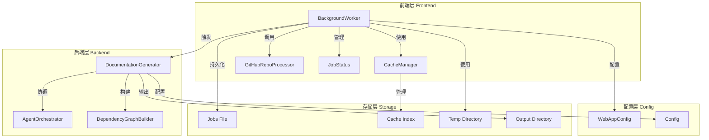
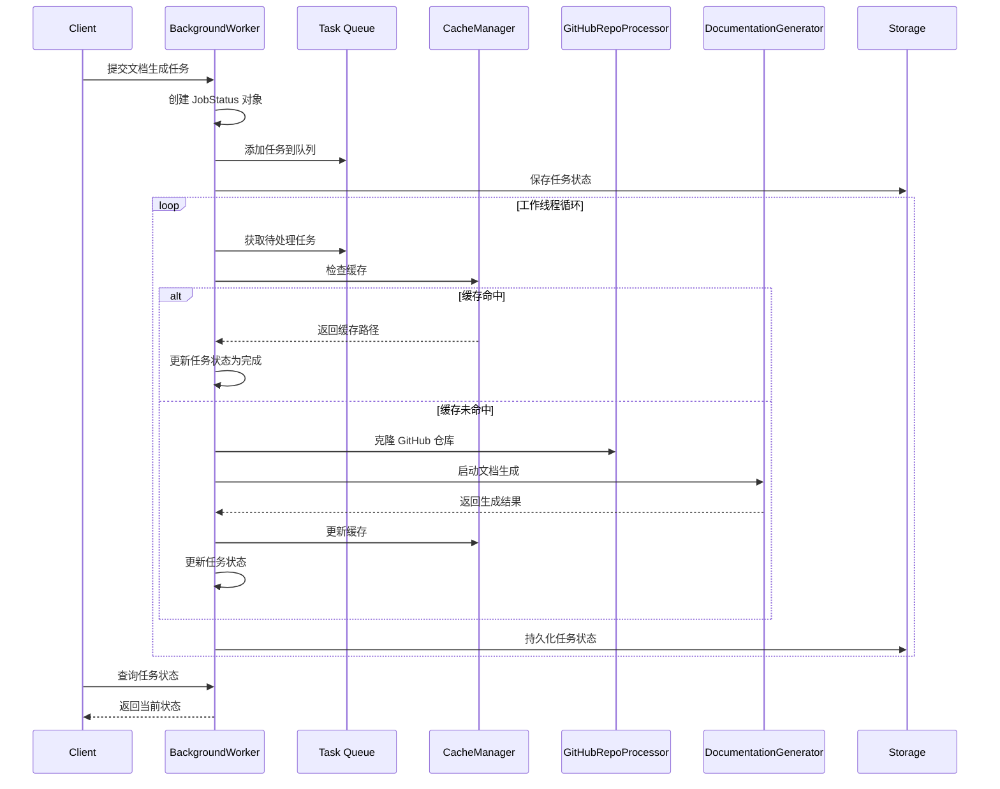
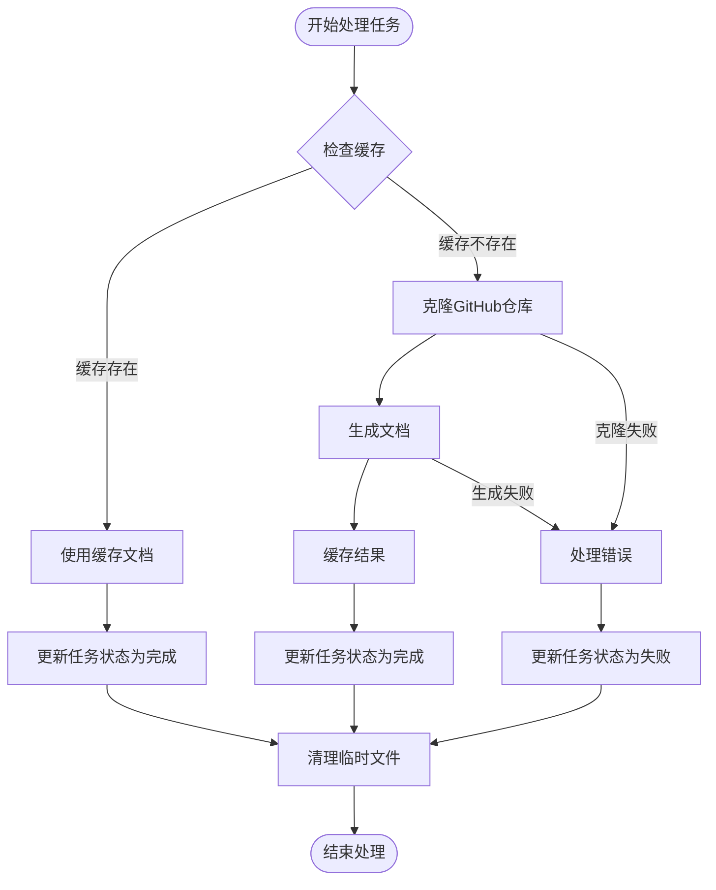

# Background Worker 模块文档

## 简介

Background Worker 模块是 CodeWiki 系统的前端核心组件，负责在后台异步处理文档生成任务。该模块通过队列管理机制，确保文档生成请求能够有序、高效地处理，同时提供任务状态跟踪和持久化功能。

## 核心功能

### 1. 任务队列管理
- 维护一个基于线程安全的任务队列
- 支持任务优先级和并发控制
- 提供任务添加、查询和状态更新功能

### 2. 异步文档生成
- 在独立线程中执行文档生成任务
- 支持 GitHub 仓库的克隆和分析
- 集成完整的文档生成流水线

### 3. 缓存机制集成
- 优先使用缓存的文档结果
- 自动更新缓存索引
- 支持缓存过期管理

### 4. 任务状态持久化
- 实时保存任务执行状态
- 支持系统重启后的状态恢复
- 提供任务历史查询功能

## 架构设计

### 系统架构图



### 组件交互流程



## 核心组件详解

### BackgroundWorker 类

`BackgroundWorker` 是整个模块的核心类，负责协调所有后台任务的处理流程。

#### 主要属性
- `cache_manager`: 缓存管理器实例
- `processing_queue`: 线程安全的任务队列
- `job_status`: 任务状态字典
- `jobs_file`: 任务状态持久化文件路径
- `running`: 工作线程运行标志

#### 关键方法

**任务管理方法**
- `add_job()`: 添加新任务到处理队列
- `get_job_status()`: 查询指定任务的状态
- `get_all_jobs()`: 获取所有任务的状态

**生命周期方法**
- `start()`: 启动后台工作线程
- `stop()`: 停止后台工作线程
- `_worker_loop()`: 主工作循环

**持久化方法**
- `load_job_statuses()`: 从磁盘加载任务状态
- `save_job_statuses()`: 保存任务状态到磁盘
- `_reconstruct_jobs_from_cache()`: 从缓存重建任务状态

### 任务处理流程



## 数据流分析

### 输入数据流
1. **任务提交**: 接收包含仓库URL、任务ID的文档生成请求
2. **配置参数**: 从 WebAppConfig 获取队列大小、临时目录等配置
3. **缓存查询**: 向 CacheManager 查询是否存在缓存的文档

### 处理数据流
1. **仓库克隆**: 调用 GitHubRepoProcessor 克隆指定仓库
2. **文档生成**: 触发 DocumentationGenerator 执行完整的文档生成流程
3. **结果缓存**: 将生成的文档添加到缓存中

### 输出数据流
1. **状态更新**: 实时更新任务执行状态和进度信息
2. **文档路径**: 返回生成文档的存储路径
3. **错误信息**: 在失败情况下记录错误详情

## 错误处理机制

### 异常分类
1. **仓库克隆异常**: 网络问题、权限问题、仓库不存在
2. **文档生成异常**: 代码分析失败、LLM调用失败
3. **系统资源异常**: 磁盘空间不足、权限不足

### 恢复策略
1. **任务状态恢复**: 系统重启后从持久化文件恢复任务状态
2. **缓存重建**: 从现有缓存条目重建任务历史
3. **优雅降级**: 在资源不足时提供适当的错误提示

## 性能优化

### 并发控制
- 单线程处理模型，避免资源竞争
- 队列大小限制，防止内存溢出
- 异步I/O操作，提高处理效率

### 缓存策略
- 优先使用缓存结果，避免重复处理
- 支持缓存过期管理，确保文档时效性
- 智能缓存键生成，提高缓存命中率

### 资源管理
- 临时目录自动清理，防止磁盘空间浪费
- 任务状态定期持久化，避免数据丢失
- 内存使用优化，及时处理大文件

## 集成接口

### 与前端界面集成
BackgroundWorker 通过 [WebRoutes](routes.md) 模块暴露的API接口与前端界面交互，提供任务提交和状态查询功能。

### 与缓存系统集成
详细依赖 [CacheManager](cache_manager.md) 模块进行文档缓存管理，包括缓存查询、更新和过期处理。

### 与文档生成引擎集成
调用 [DocumentationGenerator](documentation_generator.md) 模块执行实际的文档生成工作，该模块进一步协调依赖分析和AI代理处理。

## 配置参数

主要配置参数来自 [WebAppConfig](config.md) 模块：
- `QUEUE_SIZE`: 任务队列最大长度
- `TEMP_DIR`: 临时文件存储目录
- `CACHE_DIR`: 缓存数据存储目录
- `CLONE_TIMEOUT`: 仓库克隆超时时间

## 使用示例

```python
# 初始化 BackgroundWorker
cache_manager = CacheManager()
worker = BackgroundWorker(cache_manager)

# 启动工作线程
worker.start()

# 添加文档生成任务
job = JobStatus(
    job_id="example--repo",
    repo_url="https://github.com/example/repo",
    status="queued",
    created_at=datetime.now()
)
worker.add_job(job.job_id, job)

# 查询任务状态
status = worker.get_job_status(job.job_id)
print(f"Task status: {status.status}")

# 停止工作线程
worker.stop()
```

## 最佳实践

### 部署建议
1. **监控队列长度**: 定期检查任务队列长度，避免任务堆积
2. **磁盘空间管理**: 监控临时目录和输出目录的磁盘使用情况
3. **错误日志分析**: 定期分析错误日志，识别常见问题模式

### 性能调优
1. **队列大小配置**: 根据系统资源调整队列大小
2. **缓存过期时间**: 根据文档更新频率设置合适的缓存过期时间
3. **并发处理**: 在资源允许的情况下考虑多线程处理

## 故障排查

### 常见问题
1. **任务卡住**: 检查工作线程是否正常运行
2. **缓存失效**: 验证缓存文件完整性和权限
3. **仓库克隆失败**: 检查网络连接和GitHub访问权限

### 调试方法
1. **日志分析**: 查看详细的执行日志和错误信息
2. **状态检查**: 使用 get_all_jobs() 方法检查所有任务状态
3. **手动测试**: 单独测试仓库克隆和文档生成功能

---

通过 BackgroundWorker 模块，CodeWiki 系统能够可靠地处理大量的文档生成请求，提供良好的用户体验和系统稳定性。