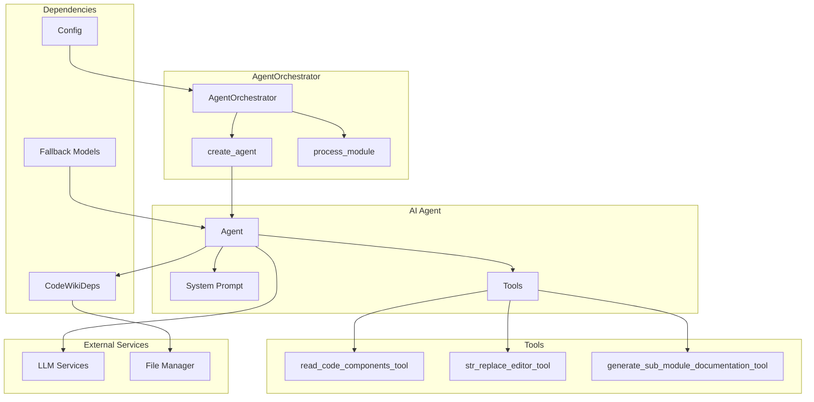
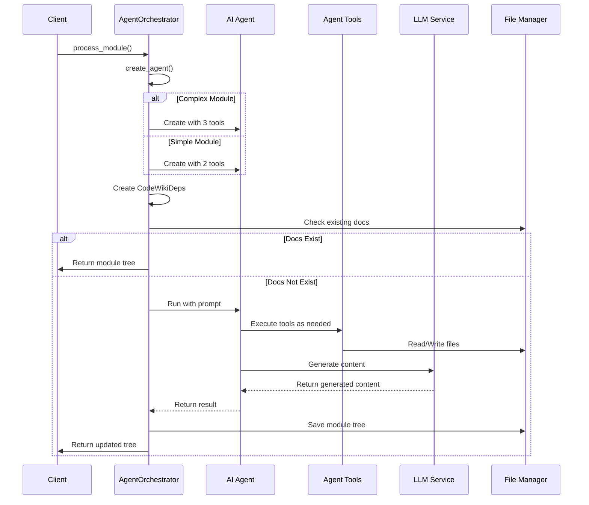
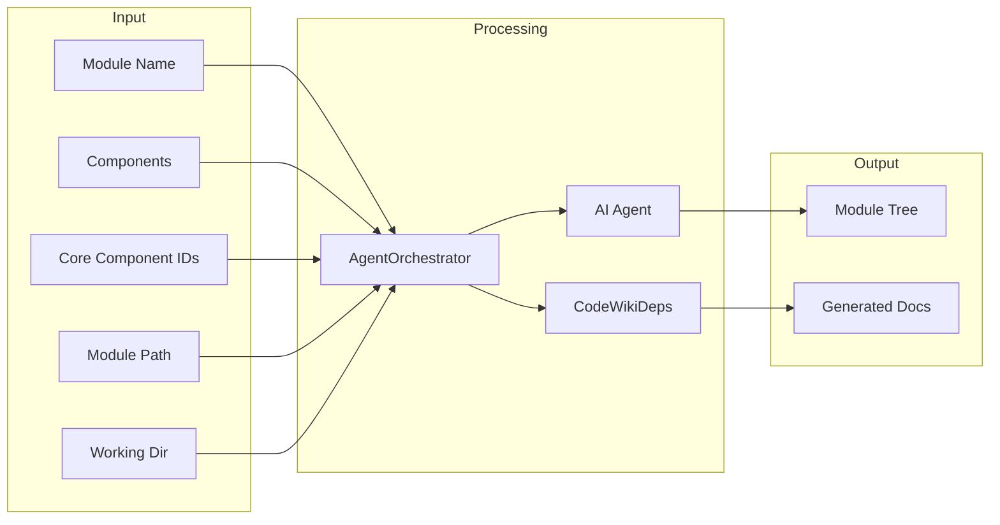

# be.agent_orchestrator 模块文档

## 简介

`be.agent_orchestrator` 模块是 CodeWiki 系统的核心协调器，负责管理和协调 AI 智能体为代码库生成文档。该模块通过智能分析模块复杂度，选择合适的 AI 智能体配置，并协调整个文档生成流程。

## 核心功能

### 1. 智能体协调管理
- 根据模块复杂度创建不同类型的 AI 智能体
- 管理智能体的生命周期和执行流程
- 协调多个工具的组合使用

### 2. 模块复杂度分析
- 自动判断模块是否为复杂模块
- 为复杂模块和简单模块选择不同的处理策略
- 优化文档生成效率和质量

### 3. 依赖注入管理
- 创建和管理 CodeWikiDeps 依赖对象
- 提供智能体运行所需的上下文信息
- 维护模块树和组件注册表

## 架构设计

### 组件关系图



### 处理流程图



## 核心组件详解

### AgentOrchestrator 类

`AgentOrchestrator` 是模块的主要类，负责协调整个文档生成过程。

#### 主要方法

1. **`__init__(self, config: Config)`**
   - 初始化协调器
   - 创建回退模型列表
   - 加载配置信息

2. **`create_agent(self, module_name: str, components: Dict[str, Any], core_component_ids: List[str]) -> Agent`**
   - 根据模块复杂度创建合适的 AI 智能体
   - 复杂模块：使用完整工具集（3个工具）
   - 简单模块：使用基础工具集（2个工具）
   - 配置不同的系统提示词

3. **`process_module(self, module_name: str, components: Dict[str, Node], core_component_ids: List[str], module_path: List[str], working_dir: str) -> Dict[str, Any]`**
   - 处理单个模块的文档生成
   - 检查现有文档避免重复生成
   - 协调智能体执行和结果保存

### 智能体配置策略

#### 复杂模块处理
- **工具集**：`read_code_components_tool`, `str_replace_editor_tool`, `generate_sub_module_documentation_tool`
- **系统提示**：`SYSTEM_PROMPT` - 适用于复杂模块的详细指导
- **特点**：支持子模块文档生成，适合大型复杂模块

#### 简单模块处理
- **工具集**：`read_code_components_tool`, `str_replace_editor_tool`
- **系统提示**：`LEAF_SYSTEM_PROMPT` - 适用于简单模块的简洁指导
- **特点**：轻量级处理，快速生成文档

## 依赖关系

### 内部依赖
- [be.config](be.config.md)：配置管理
- [be.agent_tools](be.agent_tools.md)：智能体工具集
- [be.llm_services](be.llm_services.md)：LLM 服务管理
- [be.utils](be.utils.md)：工具函数

### 外部依赖
- `pydantic_ai`：AI 智能体框架
- `logging`：日志记录
- `os`：系统操作
- `typing`：类型注解

## 数据流



## 使用示例

```python
from codewiki.src.be.agent_orchestrator import AgentOrchestrator
from codewiki.src.config import Config

# 创建配置
config = Config(
    repo_path="/path/to/repo",
    max_depth=3
)

# 初始化协调器
orchestrator = AgentOrchestrator(config)

# 处理模块
result = await orchestrator.process_module(
    module_name="example_module",
    components={...},
    core_component_ids=["component1", "component2"],
    module_path=["parent", "child"],
    working_dir="/path/to/docs"
)
```

## 错误处理

模块实现了完善的错误处理机制：

1. **文档存在检查**：避免重复生成已存在的文档
2. **异常捕获**：捕获并记录处理过程中的异常
3. **日志记录**：详细的日志记录便于调试和监控
4. **回退机制**：通过回退模型确保服务可用性

## 性能优化

1. **智能体复用**：根据模块特征创建最合适的智能体
2. **文档缓存**：检查现有文档避免重复工作
3. **异步处理**：支持异步操作提高并发性能
4. **复杂度分级**：根据模块复杂度采用不同策略

## 扩展性

模块设计具有良好的扩展性：

1. **工具扩展**：可以轻松添加新的智能体工具
2. **模型支持**：支持多种 LLM 模型和回退机制
3. **配置灵活**：通过配置控制各种行为
4. **策略定制**：可以根据需要调整复杂度判断策略

## 相关模块

- [be.agent_tools](be.agent_tools.md)：智能体使用的工具集
- [be.documentation_generator](be.documentation_generator.md)：文档生成器
- [be.dependency_analyzer](be.dependency_analyzer.md)：依赖分析器
- [be.config](be.config.md)：系统配置管理