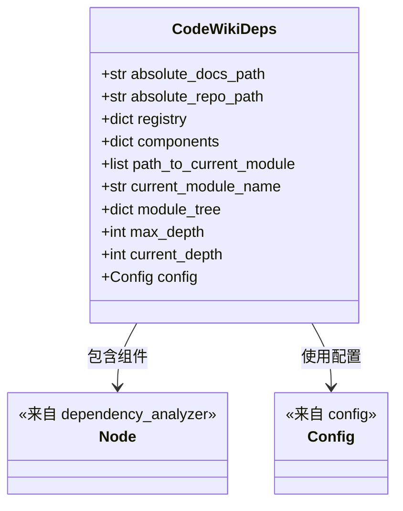
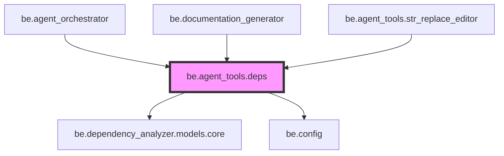
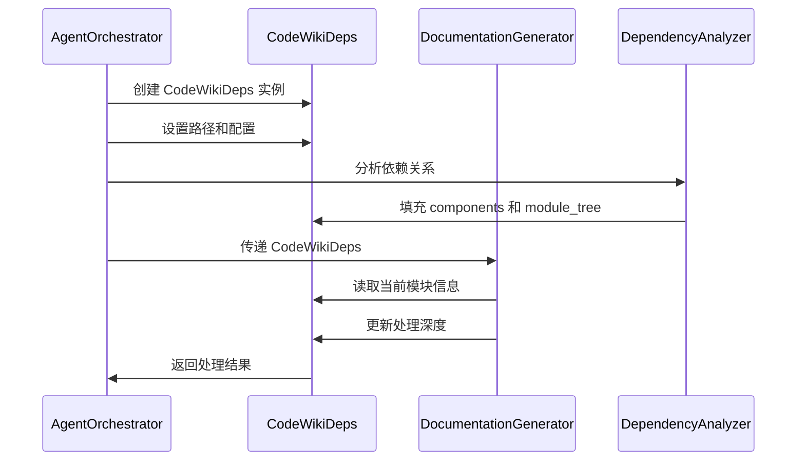

# be.agent_tools.deps 模块文档

## 简介

`be.agent_tools.deps` 模块是 CodeWiki 系统中代理工具的核心依赖管理组件。该模块提供了 `CodeWikiDeps` 类，作为整个系统在文档生成过程中的依赖容器和状态管理器。它封装了文档生成所需的所有关键信息，包括路径配置、组件注册表、模块树结构以及当前处理状态。

## 核心功能

- **依赖管理**：集中管理文档生成过程中的所有依赖项
- **状态跟踪**：跟踪当前处理的模块和深度信息
- **配置管理**：集成系统配置信息
- **组件注册**：维护组件注册表和模块树结构

## 架构设计

### 组件结构图



### 模块依赖关系



## 核心组件详解

### CodeWikiDeps 类

`CodeWikiDeps` 是一个数据类（@dataclass），作为文档生成过程中的中央依赖容器。它封装了以下关键信息：

#### 属性说明

| 属性 | 类型 | 说明 |
|------|------|------|
| `absolute_docs_path` | str | 文档输出的绝对路径 |
| `absolute_repo_path` | str | 代码仓库的绝对路径 |
| `registry` | dict | 组件注册表，存储所有可用的组件 |
| `components` | dict[str, Node] | 当前处理的组件集合，键为组件名称，值为 Node 对象 |
| `path_to_current_module` | list[str] | 当前模块的路径，用于跟踪处理位置 |
| `current_module_name` | str | 当前正在处理的模块名称 |
| `module_tree` | dict[str, any] | 完整的模块树结构 |
| `max_depth` | int | 最大处理深度，用于控制递归深度 |
| `current_depth` | int | 当前处理深度 |
| `config` | Config | 系统配置对象，包含 LLM 等相关配置 |

#### 设计特点

1. **不可变性**：使用 `@dataclass` 装饰器，提供了简洁的数据结构定义
2. **类型安全**：所有属性都有明确的类型注解
3. **依赖注入**：通过构造函数注入所有依赖，便于测试和配置
4. **状态集中**：将所有相关状态集中管理，便于协调各个组件

## 数据流分析

### 文档生成流程中的数据流



## 集成关系

### 与 orchestrator 模块的集成

`CodeWikiDeps` 由 [be.agent_orchestrator](be.agent_orchestrator.md) 创建和管理。Orchestrator 负责：
- 初始化 `CodeWikiDeps` 实例
- 设置所有必要的路径和配置
- 协调整个文档生成流程

### 与 documentation_generator 模块的集成

[be.documentation_generator](be.documentation_generator.md) 使用 `CodeWikiDeps` 来获取：
- 当前处理的模块信息
- 组件依赖关系
- 配置参数
- 输出路径信息

### 与 dependency_analyzer 模块的集成

[be.dependency_analyzer](be.dependency_analyzer.md) 为 `CodeWikiDeps` 提供：
- 代码分析结果（Node 对象）
- 依赖关系图
- 模块结构信息

### 与 str_replace_editor 模块的集成

[be.agent_tools.str_replace_editor](be.agent_tools.str_replace_editor.md) 工具在文件操作过程中使用 `CodeWikiDeps` 来：
- 确定文件路径
- 验证组件存在性
- 维护处理状态

## 使用场景

### 典型使用流程

1. **初始化阶段**：
   ```python
   deps = CodeWikiDeps(
       absolute_docs_path="/path/to/docs",
       absolute_repo_path="/path/to/repo",
       registry={},
       components={},
       path_to_current_module=[],
       current_module_name="",
       module_tree={},
       max_depth=5,
       current_depth=0,
       config=config
   )
   ```

2. **处理阶段**：
   - 更新 `current_module_name` 和 `path_to_current_module`
   - 递增 `current_depth`
   - 填充 `components` 字典

3. **完成阶段**：
   - 重置状态信息
   - 准备处理下一个模块

## 配置管理

`CodeWikiDeps` 通过 `config` 属性与系统的配置管理集成：

- 使用 [be.config](be.config.md) 模块的 `Config` 类
- 包含 LLM 配置、路径设置、处理参数等
- 支持运行时配置更新

## 最佳实践

### 状态管理
- 保持 `CodeWikiDeps` 的不变性，避免直接修改属性
- 使用替换方式更新状态，确保数据一致性
- 在处理复杂嵌套结构时，注意深度控制

### 性能优化
- 合理设置 `max_depth` 参数，避免过深的递归处理
- 及时清理不再使用的组件引用
- 利用 `registry` 缓存常用组件信息

### 错误处理
- 在访问 `components` 前验证键的存在性
- 处理路径相关操作时检查文件系统权限
- 对 `config` 对象进行有效性验证

## 相关模块

- [be.agent_orchestrator](be.agent_orchestrator.md) - 代理协调器，负责创建和管理 CodeWikiDeps
- [be.documentation_generator](be.documentation_generator.md) - 文档生成器，使用 CodeWikiDeps 获取处理信息
- [be.dependency_analyzer](be.dependency_analyzer.md) - 依赖分析器，为 CodeWikiDeps 提供分析数据
- [be.config](be.config.md) - 配置管理模块，提供 Config 类
- [be.agent_tools.str_replace_editor](be.agent_tools.str_replace_editor.md) - 文件编辑工具，使用 CodeWikiDeps 进行状态管理