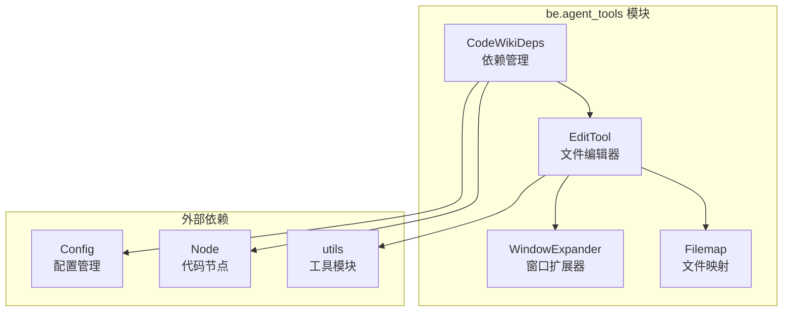
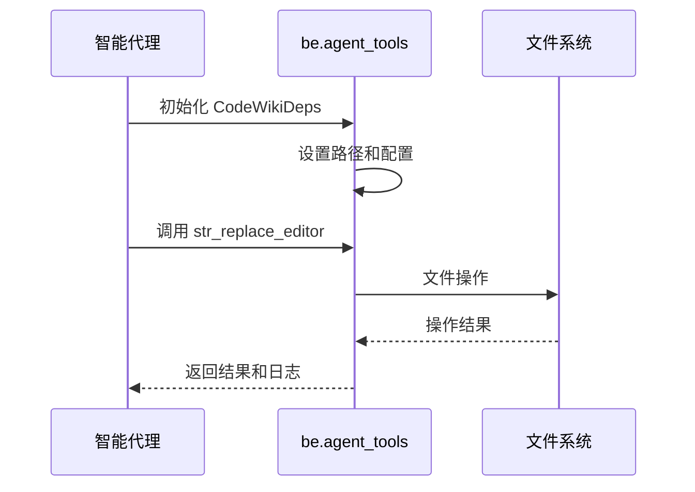

# be.agent_tools 模块文档

## 概述

`be.agent_tools` 模块是 CodeWiki 系统的核心工具模块，为智能文档生成系统提供了文件操作和编辑功能。该模块主要包含两个核心子模块：依赖管理（deps）和字符串替换编辑器（str_replace_editor），它们共同支持文档生成过程中的文件处理需求。

## 架构概览

## 核心功能

### 1. 依赖管理 (deps)

`CodeWikiDeps` 类是整个系统的依赖容器，负责管理和传递文档生成过程中的各种依赖项：

- **路径管理**：维护文档和代码仓库的绝对路径
- **组件注册**：管理代码组件的注册表
- **模块树跟踪**：记录当前处理的模块层次结构
- **配置管理**：包含 LLM 配置等系统设置

详细文档请参考 [deps 子模块](be.agent_tools.deps.md)

### 2. 文件编辑工具 (str_replace_editor)

提供了一套完整的文件操作系统，支持：

- **文件查看**：支持大文件分块查看和语法高亮
- **文件创建**：在指定路径创建新文件
- **内容替换**：精确的字符串替换功能
- **内容插入**：在指定位置插入新内容
- **编辑撤销**：支持操作历史回滚
- **语法检查**：集成 flake8 进行 Python 代码语法检查
- **智能窗口扩展**：自动扩展查看范围以包含完整的函数或类
- **文件映射**：为大型文件提供缩略图视图

详细文档请参考 [str_replace_editor 子模块](be.agent_tools.str_replace_editor.md)

## 模块集成

## 使用场景

1. **文档生成**：在生成文档过程中创建和编辑 Markdown 文件
2. **代码分析**：查看和分析源代码文件
3. **内容管理**：管理生成的文档内容和结构
4. **质量保证**：通过语法检查确保生成内容的正确性

## 配置选项

模块支持以下配置选项：

- `MAX_RESPONSE_LEN`: 最大响应长度限制（默认 16000 字符）
- `MAX_WINDOW_EXPANSION_VIEW`: 查看时的最大窗口扩展
- `MAX_WINDOW_EXPANSION_EDIT_CONFIRM`: 编辑确认时的最大窗口扩展
- `USE_FILEMAP`: 是否启用文件映射功能
- `USE_LINTER`: 是否启用语法检查

## 依赖关系

该模块依赖于以下外部模块：

- `be.dependency_analyzer.models.core`: 代码节点模型
- `be.config`: 系统配置管理
- `be.utils`: 工具函数集合

## 最佳实践

1. **路径处理**：始终使用绝对路径进行文件操作
2. **错误处理**：充分利用工具的内置验证和错误提示
3. **性能优化**：合理使用文件映射和窗口扩展功能处理大文件
4. **质量保证**：启用语法检查功能确保代码质量

## 总结

`be.agent_tools` 模块作为 CodeWiki 系统的核心工具模块，通过提供依赖管理和文件编辑功能，为整个文档生成流程提供了坚实的基础设施支持。其设计特点包括：

- **模块化设计**：清晰的子模块划分，便于维护和扩展
- **智能处理**：窗口扩展和文件映射等智能功能提升用户体验
- **质量保证**：集成语法检查确保生成内容的质量
- **灵活配置**：支持多种配置选项适应不同场景需求

该模块与其他系统组件紧密协作，共同构建了一个高效、可靠的智能文档生成系统。

## 相关文档

- [be.agent_tools.deps](be.agent_tools.deps.md) - 依赖管理子模块详细文档
- [be.agent_tools.str_replace_editor](be.agent_tools.str_replace_editor.md) - 文件编辑工具子模块详细文档
- [be.dependency_analyzer 模块](be.dependency_analyzer.md) - 代码依赖分析
- [be.config 模块](be.config.md) - 系统配置管理
- [be.agent_orchestrator 模块](be.agent_orchestrator.md) - 智能代理协调器