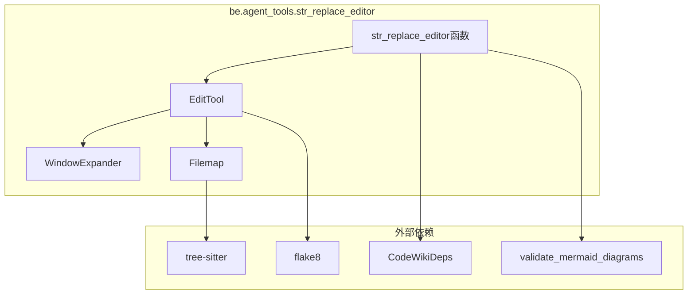
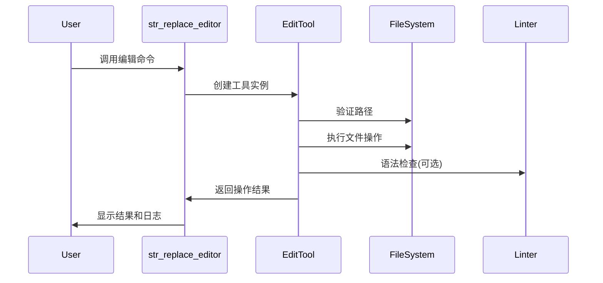
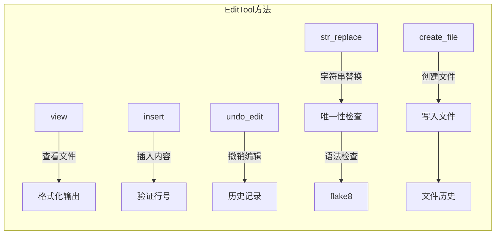
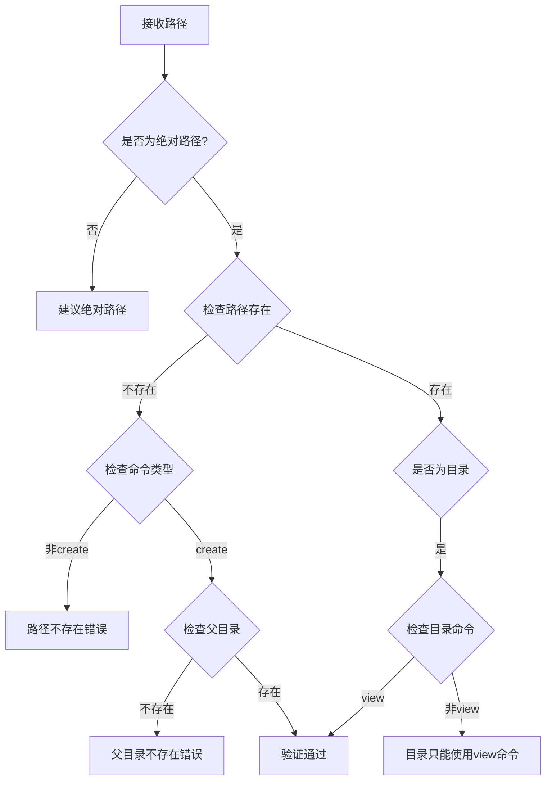
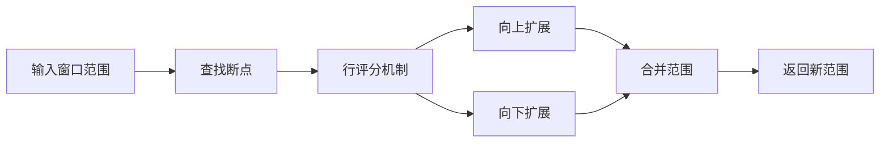
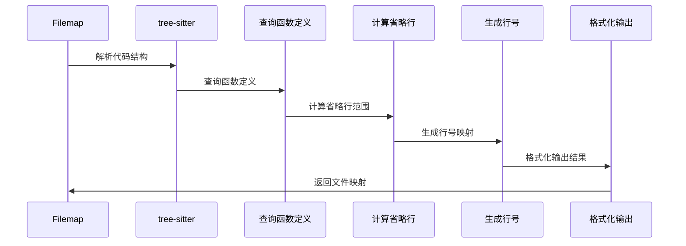
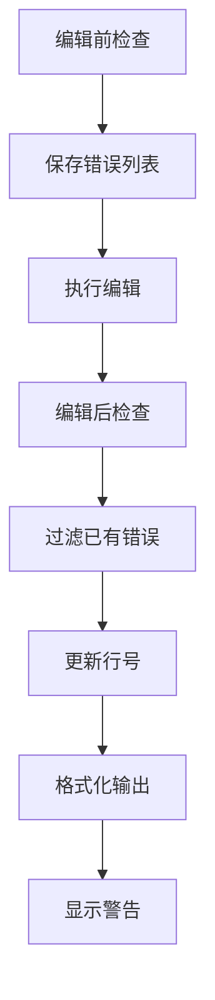
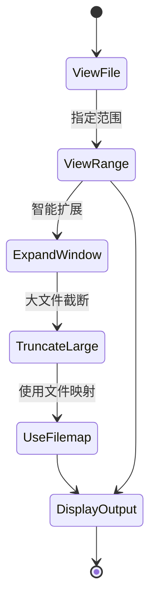
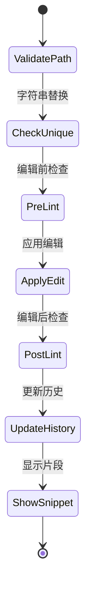
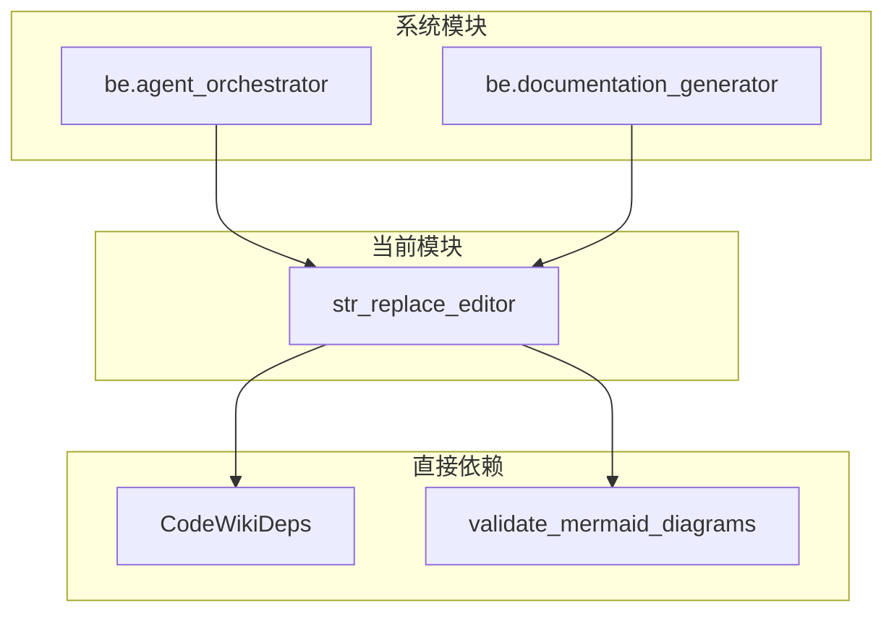

# be.agent_tools.str_replace_editor 模块文档

## 简介

`be.agent_tools.str_replace_editor` 模块是 CodeWiki 系统的核心文件编辑工具，提供了强大的文件查看、创建和编辑功能。该模块基于 SWE-agent 项目开发，专为 AI 代理设计，支持智能代码编辑和文档管理。

## 核心功能

该模块提供了以下主要功能：

- **文件查看**：支持查看文件和目录内容，提供行号显示和范围查看
- **文件创建**：创建新文件并写入内容
- **字符串替换**：精确替换文件中的特定字符串
- **内容插入**：在指定行插入新内容
- **编辑撤销**：支持撤销最近的编辑操作
- **语法检查**：集成 flake8 进行 Python 代码语法检查
- **智能窗口扩展**：自动扩展查看范围以包含完整的函数或类
- **文件映射**：为大型文件提供缩略图视图

## 架构设计

### 组件结构图

### 数据流图

## 核心组件详解

### 1. EditTool 类

`EditTool` 是模块的核心类，提供了完整的文件操作功能。

#### 主要属性

- `REGISTRY`: 用于存储文件历史记录
- `absolute_docs_path`: 文档目录的绝对路径
- `logs`: 操作日志列表
- `_file_history`: 文件编辑历史

#### 核心方法

#### 路径验证机制

### 2. WindowExpander 类

`WindowExpander` 提供智能窗口扩展功能，自动调整查看范围以包含完整的代码结构。

#### 扩展算法

#### 评分规则

- **空行**: 1分，连续空行2分
- **Python定义**: 3分（函数、类、装饰器）
- **文件边界**: 3分（首行或末行）

### 3. Filemap 类

`Filemap` 为大型 Python 文件提供缩略图视图，通过 tree-sitter 解析语法结构。

#### 处理流程

### 4. 语法检查集成

模块集成了 flake8 进行 Python 代码语法检查，支持错误过滤和行号调整。

#### 错误处理流程

## 使用模式

### 1. 文件查看模式

### 2. 文件编辑模式

## 配置选项

模块提供了多个配置常量来控制行为：

| 配置项 | 默认值 | 说明 |
|--------|--------|------|
| `MAX_RESPONSE_LEN` | 16000 | 最大响应长度，超出则截断 |
| `MAX_WINDOW_EXPANSION_VIEW` | 0 | 查看模式下的最大窗口扩展 |
| `MAX_WINDOW_EXPANSION_EDIT_CONFIRM` | 0 | 编辑确认模式下的最大窗口扩展 |
| `USE_FILEMAP` | False | 是否启用文件映射功能 |
| `USE_LINTER` | False | 是否启用语法检查 |
| `SNIPPET_LINES` | 4 | 编辑后显示的代码片段行数 |

## 错误处理

模块实现了完善的错误处理机制：

### 路径相关错误
- 非绝对路径错误
- 路径不存在错误
- 文件已存在错误
- 目录操作限制

### 编辑相关错误
- 字符串不唯一错误
- 插入行号无效错误
- 查看范围无效错误

### 编码相关错误
- Unicode 解码错误处理
- 多编码格式尝试
- 编码回退机制

## 与系统集成

### 依赖关系

### 使用场景

1. **文档生成**: 在文档生成过程中编辑和查看文件
2. **代码分析**: 为代码分析工具提供文件操作能力
3. **AI代理**: 作为 AI 代理的文件系统接口
4. **语法验证**: 集成到文档验证流程中

## 最佳实践

### 1. 路径使用
- 始终使用绝对路径
- 利用 `working_dir` 参数区分 repo 和 docs 目录
- 验证路径存在性

### 2. 编辑操作
- 确保替换字符串的唯一性
- 利用窗口扩展功能查看完整上下文
- 关注语法检查警告

### 3. 大文件处理
- 使用 `view_range` 参数查看特定范围
- 启用文件映射功能获取概览
- 注意响应长度限制

### 4. 错误恢复
- 利用撤销功能恢复错误编辑
- 检查编辑历史记录
- 验证编辑结果

## 相关模块

- [be.agent_orchestrator](be.agent_orchestrator.md): 代理协调器，调用文件编辑工具
- [be.agent_tools.deps](be.agent_tools.deps.md): 依赖管理，提供路径配置
- [be.documentation_generator](be.documentation_generator.md): 文档生成器，使用文件编辑功能
- [utils](utils.md): 工具函数，包含 Mermaid 图表验证等功能