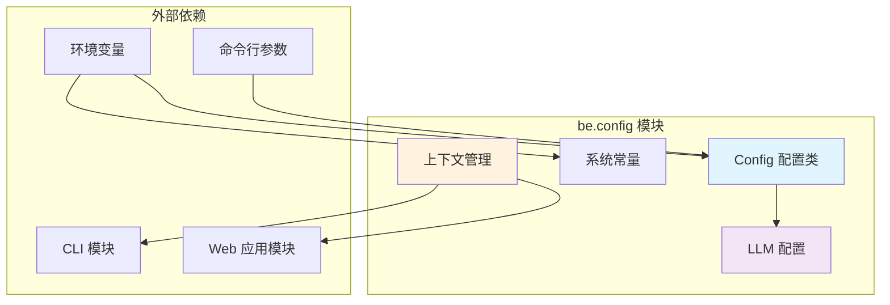
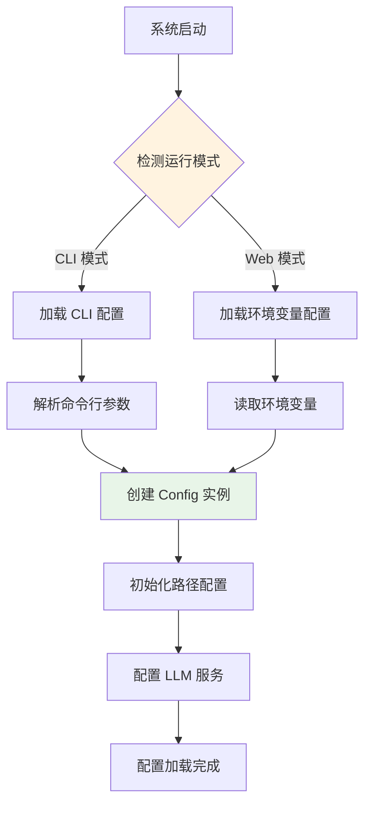
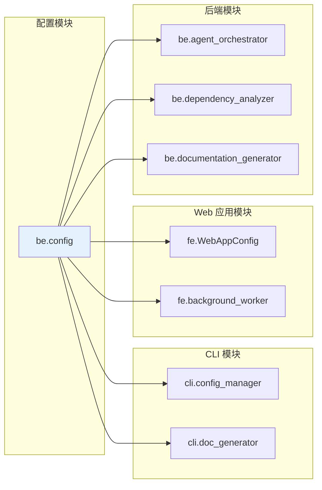

# be.config 模块文档

## 简介

be.config 模块是 CodeWiki 系统的核心配置管理模块，负责统一管理整个系统的配置参数。该模块提供了一个集中化的配置中心，支持 CLI 和 Web 应用两种运行模式，确保系统在不同环境下都能正确加载和使用配置信息。

## 核心功能

### 1. 配置管理
- 统一管理系统常量、路径配置和 LLM 服务配置
- 支持从命令行参数、环境变量和配置文件加载配置
- 提供 CLI 和 Web 应用两种配置模式

### 2. 上下文检测
- 自动检测当前运行环境（CLI 或 Web 应用）
- 根据上下文加载相应的配置策略

### 3. LLM 服务配置
- 支持多模型配置（主模型、聚类模型、备用模型）
- 灵活配置 LLM API 地址和认证信息

## 架构设计

### 组件结构图



### 配置流程图



## 核心组件详解

### Config 类

`Config` 类是配置模块的核心，使用 `@dataclass` 装饰器实现，提供了以下主要功能：

#### 属性说明
- `repo_path`: 代码仓库路径
- `output_dir`: 输出根目录
- `dependency_graph_dir`: 依赖图输出目录
- `docs_dir`: 文档输出目录
- `max_depth`: 最大分析深度
- `llm_base_url`: LLM API 基础地址
- `llm_api_key`: LLM API 密钥
- `main_model`: 主模型名称
- `cluster_model`: 聚类模型名称
- `fallback_model`: 备用模型名称

#### 工厂方法

1. **from_args 方法**
   - 从 `argparse.Namespace` 创建配置实例
   - 主要用于 Web 应用模式
   - 自动处理仓库名称的规范化

2. **from_cli 方法**
   - 专门为 CLI 模式设计的配置创建方法
   - 接受明确的参数列表
   - 支持自定义输出目录结构

### 系统常量

模块定义了以下重要常量：

```python
OUTPUT_BASE_DIR = 'output'                    # 默认输出根目录
DEPENDENCY_GRAPHS_DIR = 'dependency_graphs'   # 依赖图子目录
DOCS_DIR = 'docs'                             # 文档子目录
MAX_DEPTH = 2                                 # 默认最大分析深度
MAX_TOKEN_PER_MODULE = 36_369                 # 每个模块最大 token 数
MAX_TOKEN_PER_LEAF_MODULE = 16_000            # 叶子模块最大 token 数
```

### 上下文管理

模块提供了上下文检测功能：

- `set_cli_context()`: 设置 CLI 上下文状态
- `is_cli_context()`: 检测当前是否为 CLI 上下文

这个功能确保系统在不同运行模式下采用不同的配置策略。

## 与其他模块的关系

### 依赖关系图



### 模块交互说明

1. **CLI 模块** ([cli.md](cli.md))
   - `ConfigManager` 使用 `Config.from_cli()` 创建配置实例
   - `CLIDocumentationGenerator` 依赖配置中的路径和模型信息

2. **Web 应用模块** ([fe.md](fe.md))
   - `WebAppConfig` 使用 `Config.from_args()` 处理用户提交的配置
   - `BackgroundWorker` 使用配置信息初始化处理任务

3. **后端处理模块**
   - `AgentOrchestrator` 使用 LLM 配置进行智能体调度
   - `DependencyAnalyzer` 使用路径配置进行依赖分析
   - `DocumentationGenerator` 使用输出路径配置生成文档

## 使用示例

### CLI 模式使用

```python
from codewiki.src.config import Config

# 创建 CLI 配置
config = Config.from_cli(
    repo_path="/path/to/repo",
    output_dir="/path/to/output",
    llm_base_url="http://localhost:4000",
    llm_api_key="your-api-key",
    main_model="claude-3-sonnet",
    cluster_model="claude-3-haiku"
)
```

### Web 应用模式使用

```python
from codewiki.src.config import Config
import argparse

# 创建参数解析器
args = argparse.Namespace(repo_path="/path/to/repo")

# 创建配置
config = Config.from_args(args)
```

### 上下文检测

```python
from codewiki.src.config import set_cli_context, is_cli_context

# 设置 CLI 上下文
set_cli_context(True)

# 检测当前上下文
if is_cli_context():
    print("Running in CLI mode")
else:
    print("Running in Web app mode")
```

## 配置加载策略

### 环境变量优先级

模块使用 `python-dotenv` 加载环境变量，支持以下配置项：

- `MAIN_MODEL`: 主模型（默认：claude-sonnet-4）
- `FALLBACK_MODEL_1`: 备用模型（默认：glm-4p5）
- `CLUSTER_MODEL`: 聚类模型（默认与主模型相同）
- `LLM_BASE_URL`: LLM API 地址（默认：http://0.0.0.0:4000/）
- `LLM_API_KEY`: LLM API 密钥（默认：sk-1234）

### 路径配置策略

1. **Web 应用模式**：使用固定的输出目录结构
2. **CLI 模式**：支持自定义输出目录，创建临时工作目录

## 最佳实践

1. **配置一致性**：确保在不同环境中使用相同的模型配置，以保证处理结果的一致性

2. **路径管理**：合理配置输出路径，避免权限问题和磁盘空间不足

3. **模型选择**：根据任务复杂度选择合适的模型，平衡质量和成本

4. **环境隔离**：为不同环境（开发、测试、生产）配置独立的输出目录

## 总结

be.config 模块作为 CodeWiki 系统的配置中心，通过统一的管理机制和灵活的加载策略，为整个系统提供了可靠的配置支持。其设计充分考虑了不同运行模式的需求，确保系统在各种环境下都能稳定运行。