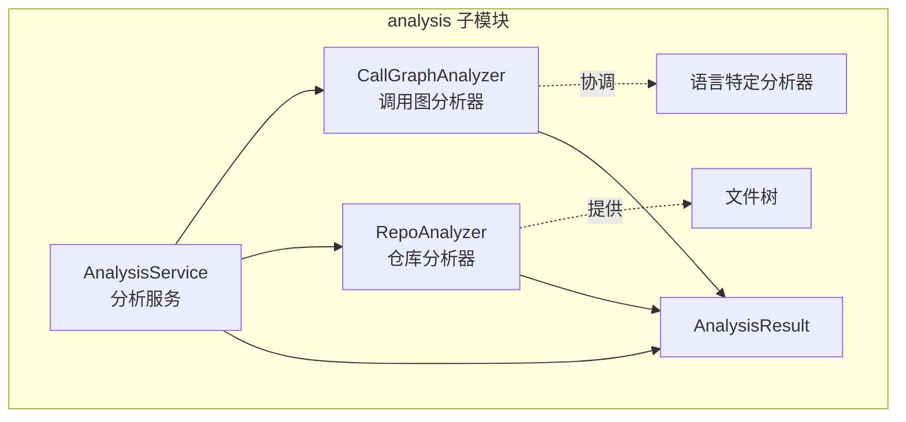
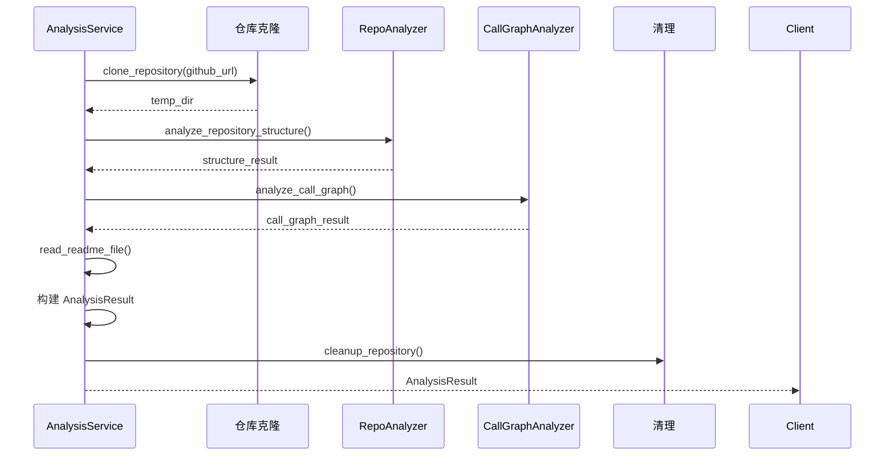
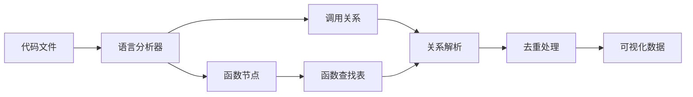

# be.dependency_analyzer.analysis 子模块文档

## 概述

`be.dependency_analyzer.analysis` 子模块是依赖分析器的核心分析引擎，负责协调和管理整个代码分析流程。它提供了从仓库克隆到最终结果生成的完整分析管道。

## 架构图



## 核心组件

### AnalysisService

**文件路径**: `codewiki/src/be/dependency_analyzer/analysis/analysis_service.py`

**主要职责**:
- 作为中央分析服务，协调整个分析流程
- 管理仓库克隆和临时目录
- 处理不同类型的分析请求
- 整合分析结果

**关键功能**:

#### 1. 完整仓库分析
```python
def analyze_repository_full(
    self,
    github_url: str,
    include_patterns: Optional[List[str]] = None,
    exclude_patterns: Optional[List[str]] = None,
) -> AnalysisResult
```

- 克隆 GitHub 仓库到临时目录
- 分析文件结构和代码文件
- 生成调用图和依赖关系
- 提取 README 内容
- 返回完整的 AnalysisResult

#### 2. 本地仓库分析
```python
def analyze_local_repository(
    self,
    repo_path: str,
    max_files: int = 100,
    languages: Optional[List[str]] = None
) -> Dict[str, Any]
```

- 分析本地文件系统上的仓库
- 支持文件数量限制
- 支持语言过滤
- 返回简化的分析结果

#### 3. 结构分析
```python
def analyze_repository_structure_only(
    self,
    github_url: str,
    include_patterns: Optional[List[str]] = None,
    exclude_patterns: Optional[List[str]] = None,
) -> Dict[str, Any]
```

- 仅分析仓库的文件结构
- 不包含代码语义分析
- 适用于快速了解项目结构

**内部工作流程**:



### CallGraphAnalyzer

**文件路径**: `codewiki/src/be/dependency_analyzer/analysis/call_graph_analyzer.py`

**主要职责**:
- 协调多语言代码分析
- 构建统一的调用图
- 处理跨语言调用关系
- 生成可视化数据

**关键功能**:

#### 1. 代码文件分析
```python
def analyze_code_files(
    self, 
    code_files: List[Dict], 
    base_dir: str
) -> Dict
```

- 分析代码文件列表
- 路由到相应的语言分析器
- 整合所有分析结果
- 生成调用图统计信息

#### 2. 代码文件提取
```python
def extract_code_files(self, file_tree: Dict) -> List[Dict]
```

- 从文件树中提取代码文件
- 基于文件扩展名进行过滤
- 排除测试和配置文件

#### 3. 调用关系解析
```python
def _resolve_call_relationships(self)
```

- 匹配函数调用与实际定义
- 处理跨文件调用关系
- 支持方法名和类名解析

#### 4. 可视化数据生成
```python
def _generate_visualization_data(self) -> Dict
```

- 生成 Cytoscape.js 兼容的图数据
- 为节点和边添加样式类
- 提供图统计信息

**支持的编程语言**:

| 语言 | 分析器 | 文件扩展名 |
|------|--------|------------|
| Python | PythonASTAnalyzer | .py, .pyx |
| JavaScript | TreeSitterJSAnalyzer | .js, .jsx, .mjs, .cjs |
| TypeScript | TreeSitterTSAnalyzer | .ts, .tsx |
| Java | TreeSitterJavaAnalyzer | .java |
| C# | TreeSitterCSharpAnalyzer | .cs |
| C | TreeSitterCAnalyzer | .c, .h |
| C++ | TreeSitterCppAnalyzer | .cpp, .cc, .cxx, .hpp, .hxx |

**调用关系处理流程**:



### RepoAnalyzer

**文件路径**: `codewiki/src/be/dependency_analyzer/analysis/repo_analyzer.py`

**主要职责**:
- 分析仓库的文件结构
- 提供文件过滤功能
- 生成文件树表示
- 计算仓库统计信息

**关键功能**:

#### 1. 仓库结构分析
```python
def analyze_repository_structure(self, repo_dir: str) -> Dict
```

- 构建嵌套的文件树结构
- 过滤不需要的文件和目录
- 计算文件大小和数量统计

#### 2. 文件过滤
```python
def _should_exclude_path(self, path: str, filename: str) -> bool
```

- 基于模式匹配排除文件
- 支持通配符和路径前缀
- 处理目录和文件的不同规则

#### 3. 文件包含判断
```python
def _should_include_file(self, path: str, filename: str) -> bool
```

- 基于包含模式筛选文件
- 支持多个包含模式
- 默认包含所有文件（如果没有指定包含模式）

**默认过滤模式**:

```python
DEFAULT_IGNORE_PATTERNS = [
    "*.pyc", "__pycache__", "*.pyo", "*.pyd", ".Python", 
    "build", "develop-eggs", "dist", "downloads", "eggs",
    ".eggs", "lib", "lib64", "parts", "sdist", "var",
    "wheels", "*.egg-info", ".installed.cfg", "*.egg",
    "node_modules", ".npm", ".npmignore", ".yarn",
    ".yarnignore", "package-lock.json", "yarn.lock",
    ".git", ".gitignore", ".gitattributes",
    ".vscode", ".idea", "*.swp", "*.swo", "*~",
    ".DS_Store", "Thumbs.db", ".pytest_cache",
    ".mypy_cache", ".tox", ".coverage", "htmlcov",
    ".tox", "*.cover", ".hypothesis", ".venv",
    "venv", "env", "ENV", "env.bak", "venv.bak"
]
```

## 数据模型

### 分析结果结构

```python
class AnalysisResult(BaseModel):
    repository: Repository          # 仓库信息
    functions: List[Node]           # 函数/类/方法列表
    relationships: List[CallRelationship]  # 调用关系
    file_tree: Dict[str, Any]       # 文件树结构
    summary: Dict[str, Any]         # 统计摘要
    visualization: Dict[str, Any]   # 可视化数据
    readme_content: Optional[str]   # README内容
```

### 统计信息

分析结果包含以下统计信息：

- **文件统计**: 总文件数、代码文件数、各语言文件数
- **组件统计**: 总函数数、类数、方法数
- **关系统计**: 总调用关系数、已解析关系数
- **语言统计**: 支持的语言列表、各语言组件数

## 使用示例

### 基本分析

```python
from codewiki.src.be.dependency_analyzer.analysis.analysis_service import AnalysisService

# 创建分析服务
service = AnalysisService()

# 分析GitHub仓库
result = service.analyze_repository_full(
    "https://github.com/user/repo",
    include_patterns=["*.py", "*.js"],
    exclude_patterns=["test_*", "*_test.py"]
)

# 访问分析结果
print(f"仓库: {result.repository.name}")
print(f"函数数量: {len(result.functions)}")
print(f"调用关系: {len(result.relationships)}")
print(f"文件数量: {result.summary['total_files']}")
```

### 本地仓库分析

```python
# 分析本地仓库
result = service.analyze_local_repository(
    "/path/to/local/repo",
    max_files=50,
    languages=["python", "javascript"]
)

# 处理结果
for func in result["nodes"].values():
    print(f"函数: {func['name']} ({func['language']})")
```

### 仅结构分析

```python
# 快速获取仓库结构
structure = service.analyze_repository_structure_only(
    "https://github.com/user/repo"
)

# 遍历文件树
def print_file_tree(tree, indent=0):
    prefix = "  " * indent
    if tree["type"] == "file":
        print(f"{prefix}📄 {tree['name']}")
    else:
        print(f"{prefix}📁 {tree['name']}")
        for child in tree.get("children", []):
            print_file_tree(child, indent + 1)

print_file_tree(structure["file_tree"])
```

## 错误处理

### 异常类型

- **ValueError**: GitHub URL 格式错误
- **RuntimeError**: 分析过程失败
- **PermissionError**: 文件访问权限问题
- **SyntaxError**: 代码语法解析错误

### 错误恢复

```python
try:
    result = service.analyze_repository_full("https://github.com/invalid/repo")
except ValueError as e:
    print(f"URL格式错误: {e}")
except RuntimeError as e:
    print(f"分析失败: {e}")
    # 可以尝试结构分析作为备选
    structure = service.analyze_repository_structure_only("https://github.com/invalid/repo")
```

## 性能考虑

### 内存管理

- 大文件采用流式读取
- 分析完成后及时清理临时数据
- 支持文件数量限制避免内存溢出

### 并发处理

- 文件分析可以并行化
- 语言分析器相互独立
- 结果整合是串行操作

### 缓存策略

- 仓库克隆可以缓存
- 分析结果可以序列化保存
- 支持增量分析

## 扩展开发

### 添加新语言支持

1. 创建新的语言分析器类
2. 实现节点提取方法
3. 在 CallGraphAnalyzer 中注册
4. 更新文件扩展名映射

### 自定义过滤规则

```python
# 自定义包含和排除模式
include_patterns = ["*.py", "*.js", "src/**/*.ts"]
exclude_patterns = ["test/**", "**/node_modules/**", "*.min.js"]

result = service.analyze_repository_full(
    "https://github.com/user/repo",
    include_patterns=include_patterns,
    exclude_patterns=exclude_patterns
)
```

### 自定义可视化

```python
# 获取可视化数据
viz_data = result.visualization["cytoscape"]

# 自定义节点样式
for element in viz_data["elements"]:
    if element["data"]["type"] == "class":
        element["classes"] += " custom-class-style"
```

## 相关文档

- [语言分析器子模块](be.dependency_analyzer.analyzers.md) - 详细的语言特定分析器文档
- [数据模型子模块](be.dependency_analyzer.models.md) - 数据模型详细说明
- [工具函数子模块](be.dependency_analyzer.utils.md) - 日志和工具函数文档