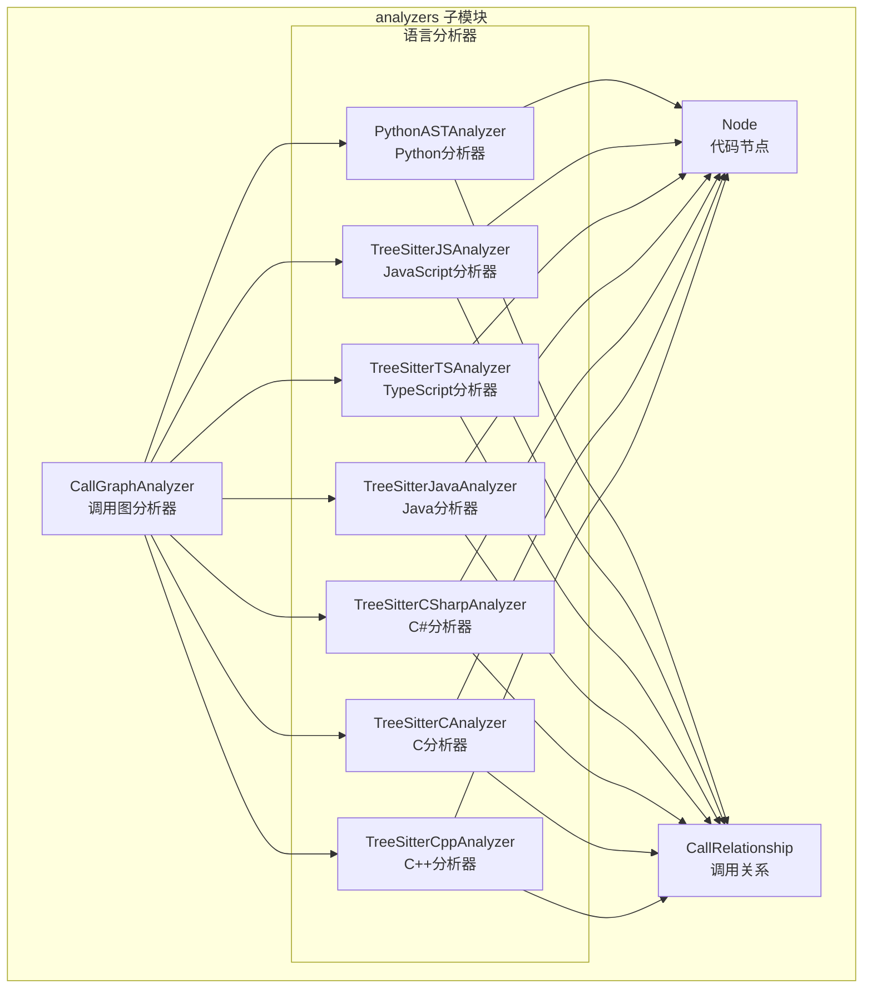
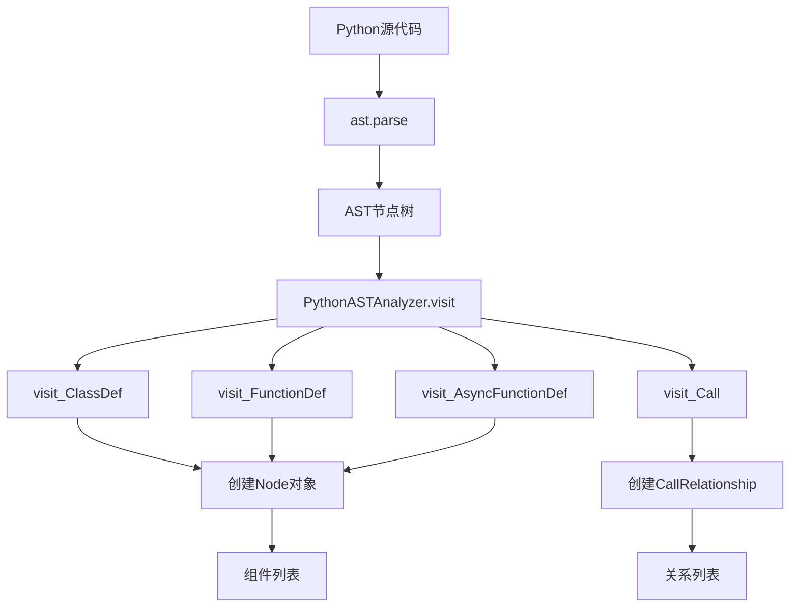
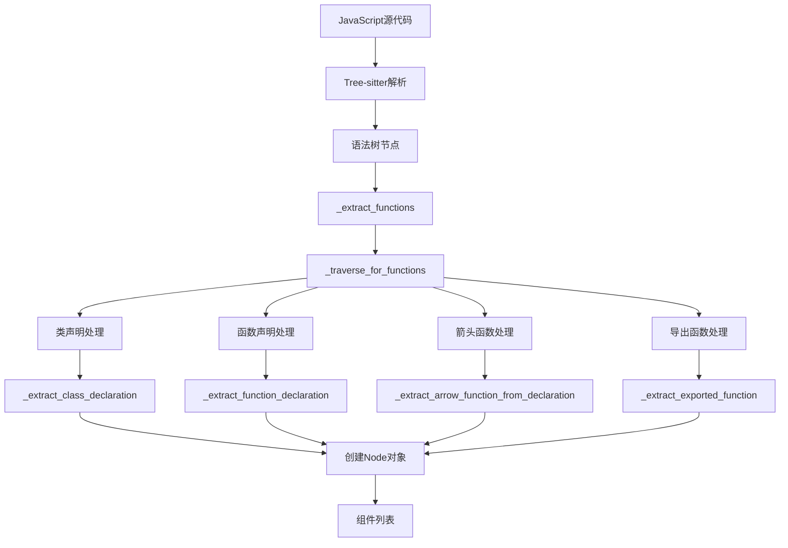

# be.dependency_analyzer.analyzers 子模块文档

## 概述

`be.dependency_analyzer.analyzers` 子模块包含了多种编程语言的专用分析器。每个分析器都针对特定语言的语法特性进行了优化，能够准确提取代码组件和依赖关系。

## 架构图



## 分析器对比

| 分析器 | 技术栈 | 支持语言 | 主要特性 | 复杂度 |
|--------|--------|----------|----------|--------|
| PythonASTAnalyzer | Python AST | Python | 完整AST访问、装饰器、异步函数 | 中等 |
| TreeSitterJSAnalyzer | Tree-sitter | JavaScript | ES6+、JSDoc、类成员 | 高 |
| TreeSitterTSAnalyzer | Tree-sitter | TypeScript | 类型系统、泛型、装饰器 | 很高 |
| TreeSitterJavaAnalyzer | Tree-sitter | Java | 继承体系、泛型、注解 | 高 |
| TreeSitterCSharpAnalyzer | Tree-sitter | C# | 属性、委托、LINQ、泛型 | 高 |
| TreeSitterCAnalyzer | Tree-sitter | C | 函数指针、宏、头文件 | 中等 |
| TreeSitterCppAnalyzer | Tree-sitter | C++ | 类、模板、命名空间、继承 | 很高 |

## PythonASTAnalyzer

**文件路径**: `codewiki/src/be/dependency_analyzer/analyzers/python.py`

### 技术特点
- 使用 Python 内置的 `ast` 模块
- 访问者模式遍历AST节点
- 支持 Python 3.6+ 语法特性

### 支持的语法特性

```python
# 类定义和继承
class MyClass(BaseClass, Mixin):
    """类文档字符串"""
    
# 函数和异步函数
def sync_function(param1: str, param2: int = 10) -> bool:
    """函数文档字符串"""
    return True

async def async_function():
    """异步函数"""
    await some_async_call()

# 装饰器
@decorator
@another_decorator(param="value")
def decorated_function():
    pass
```

### 分析流程



### 关键方法

#### visit_ClassDef
```python
def visit_ClassDef(self, node: ast.ClassDef):
    """处理类定义"""
    # 提取基类信息
    base_classes = [self._extract_base_class_name(base) for base in node.bases]
    
    # 创建Node对象
    class_node = Node(
        id=f"{module_path}.{node.name}",
        name=node.name,
        component_type="class",
        # ... 其他属性
    )
```

#### visit_Call
```python
def visit_Call(self, node: ast.Call):
    """处理函数调用"""
    # 提取调用名称
    call_name = self._get_call_name(node.func)
    
    if call_name and call_name not in PYTHON_BUILTINS:
        # 创建调用关系
        relationship = CallRelationship(
            caller=current_context,
            callee=call_name,
            call_line=node.lineno,
            is_resolved=call_name in self.top_level_nodes
        )
```

### 内置函数过滤

```python
PYTHON_BUILTINS = {
    "print", "len", "str", "int", "float", "bool", 
    "list", "dict", "tuple", "set", "range", "enumerate",
    "isinstance", "hasattr", "getattr", "setattr",
    "open", "super", "type", "max", "min", "sum"
    # ... 更多内置函数
}
```

## TreeSitterJSAnalyzer

**文件路径**: `codewiki/src/be/dependency_analyzer/analyzers/javascript.py`

### 技术特点
- 使用 Tree-sitter 进行语法分析
- 支持现代 JavaScript (ES6+) 语法
- 处理复杂的类结构和继承

### 支持的语法特性

```javascript
// 类声明和继承
class MyClass extends BaseClass {
    constructor(name) {
        super(name);
        this.name = name;
    }
    
    // 方法定义
    method() {
        return this.name;
    }
    
    // 静态方法
    static staticMethod() {
        return "static";
    }
}

// 箭头函数
const arrowFunc = (param1, param2) => {
    return param1 + param2;
};

// 异步函数
async function asyncFunction() {
    await somePromise();
}

// 生成器函数
function* generatorFunction() {
    yield 1;
    yield 2;
}

// 导出函数
export function exportedFunction() {}
export default function() {}
```

### 分析流程



### 关键特性

#### JSDoc 类型依赖提取
```javascript
/**
 * @param {User} user - The user object
 * @returns {Promise<Order>}
 */
async function processUser(user) {
    // 分析器会提取 User 和 Order 类型依赖
}
```

#### 类成员方法识别
```javascript
class MyClass {
    // 实例方法
    method() {}
    
    // 箭头函数属性
    arrowMethod = () => {}
    
    // 计算属性方法
    ["computed" + "Method"]() {}
}
```

## TreeSitterTSAnalyzer

**文件路径**: `codewiki/src/be/dependency_analyzer/analyzers/typescript.py`

### 技术特点
- 基于 Tree-sitter TypeScript 语法
- 完整的 TypeScript 类型系统支持
- 处理复杂的类型依赖关系

### 支持的语法特性

```typescript
// 接口定义
interface User {
    id: number;
    name: string;
    email?: string;
}

// 类型别名
type UserID = number | string;
type UserMap = Map<UserID, User>;

// 泛型接口
interface Repository<T> {
    find(id: UserID): Promise<T>;
    save(entity: T): Promise<void>;
}

// 类实现接口
class UserRepository implements Repository<User> {
    async find(id: UserID): Promise<User> {
        // 实现
    }
}

// 装饰器
@Injectable()
class UserService {
    constructor(@Inject("UserRepository") private repository: Repository<User>) {}
}

// 枚举
enum UserRole {
    ADMIN = "admin",
    USER = "user",
    GUEST = "guest"
}

// 命名空间
namespace Utils {
    export function formatDate(date: Date): string {
        return date.toISOString();
    }
}
```

### 类型依赖分析

#### 接口实现关系
```typescript
interface IService {
    process(data: any): void;
}

class UserService implements IService {
    process(data: any): void {
        // 分析器识别 UserService 依赖 IService
    }
}
```

#### 泛型类型依赖
```typescript
class Container<T extends BaseEntity> {
    private items: T[] = [];
    
    add(item: T): void {
        this.items.push(item);
    }
}

// 分析器识别 Container 依赖 BaseEntity
const userContainer = new Container<User>();
```

#### 构造函数依赖注入
```typescript
class UserController {
    constructor(
        private userService: UserService,
        private authService: AuthService
    ) {}
}
// 分析器识别 UserController 依赖 UserService 和 AuthService
```

### 复杂类型处理

#### 交叉类型和联合类型
```typescript
type AdminUser = User & { role: "admin" };
type StringOrNumber = string | number;
```

#### 条件类型
```typescript
type IsArray<T> = T extends any[] ? true : false;
```

#### 映射类型
```typescript
type Partial<T> = {
    [P in keyof T]?: T[P];
};
```

## TreeSitterJavaAnalyzer

**文件路径**: `codewiki/src/be/dependency_analyzer/analyzers/java.py`

### 技术特点
- 基于 Tree-sitter Java 语法
- 完整的 Java 面向对象特性支持
- 处理复杂的继承和实现关系

### 支持的语法特性

```java
// 类定义和继承
public class UserService extends BaseService implements Serializable {
    private final UserRepository repository;
    
    // 构造函数
    public UserService(UserRepository repository) {
        this.repository = repository;
    }
    
    // 方法
    public User findUser(Long id) {
        return repository.findById(id);
    }
}

// 接口定义
public interface UserRepository {
    User findById(Long id);
    List<User> findAll();
}

// 抽象类
public abstract class AbstractService<T> {
    protected abstract T findById(Long id);
}

// 枚举
public enum UserStatus {
    ACTIVE, INACTIVE, PENDING
}

// 注解
@Entity
@Table(name = "users")
public class User {
    @Id
    @GeneratedValue(strategy = GenerationType.IDENTITY)
    private Long id;
}
```

### 继承体系分析

#### 类继承关系
```java
class Animal {
    void eat() {}
}

class Dog extends Animal {
    void bark() {}
}
// 分析器识别 Dog 继承 Animal
```

#### 接口实现关系
```java
interface Flyable {
    void fly();
}

class Bird implements Flyable {
    public void fly() {}
}
// 分析器识别 Bird 实现 Flyable
```

#### 多继承和多层继承
```java
interface A { void methodA(); }
interface B { void methodB(); }

class C implements A, B {
    public void methodA() {}
    public void methodB() {}
}
// 分析器识别 C 实现 A 和 B
```

### 泛型支持

```java
// 泛型类
public class Container<T> {
    private T item;
    public void set(T item) { this.item = item; }
    public T get() { return item; }
}

// 泛型方法
public <T> T process(T input) {
    return input;
}

// 有界类型参数
public class NumberContainer<T extends Number> {
    private T number;
}
```

## TreeSitterCSharpAnalyzer

**文件路径**: `codewiki/src/be/dependency_analyzer/analyzers/csharp.py`

### 技术特点
- 基于 Tree-sitter C# 语法
- 完整的 .NET 类型系统支持
- 处理属性和委托等特殊成员

### 支持的语法特性

```csharp
// 类定义
public class UserService : IUserService
{
    private readonly IUserRepository _repository;
    
    // 属性
    public string ServiceName { get; set; }
    
    // 构造函数
    public UserService(IUserRepository repository)
    {
        _repository = repository;
    }
    
    // 方法
    public async Task<User> GetUserAsync(int id)
    {
        return await _repository.GetByIdAsync(id);
    }
}

// 接口
public interface IUserService
{
    Task<User> GetUserAsync(int id);
}

// 记录类型 (C# 9.0)
public record User(int Id, string Name);

// 委托
delegate void UserEventHandler(object sender, UserEventArgs e);

// 事件
public class UserManager
{
    public event UserEventHandler UserCreated;
}
```

### 特殊成员分析

#### 属性依赖
```csharp
public class UserController
{
    private readonly IUserService _userService;
    
    // 分析器识别属性类型依赖
    public IUserService UserService => _userService;
}
```

#### 字段依赖
```csharp
public class OrderService
{
    // 分析器识别字段类型依赖
    private readonly IOrderRepository _repository;
    private readonly ILogger<OrderService> _logger;
}
```

#### 方法参数依赖
```csharp
public class ProductService
{
    // 分析器识别参数类型依赖
    public void ProcessOrder(Order order, User user)
    {
        // 实现
    }
}
```

### LINQ 和异步支持

```csharp
public async Task<List<User>> GetActiveUsersAsync()
{
    return await _context.Users
        .Where(u => u.IsActive)
        .OrderBy(u => u.Name)
        .ToListAsync();
}
```

## TreeSitterCAnalyzer

**文件路径**: `codewiki/src/be/dependency_analyzer/analyzers/c.py`

### 技术特点
- 基于 Tree-sitter C 语法
- 处理 C 语言的函数和全局变量
- 识别头文件依赖关系

### 支持的语法特性

```c
// 函数定义
int calculate_sum(int a, int b) {
    return a + b;
}

// 全局变量
int global_counter = 0;

// 结构体
typedef struct {
    int x;
    int y;
} Point;

// 函数指针
typedef int (*Operation)(int, int);

// 宏定义
#define MAX_SIZE 100
#define MIN(a, b) ((a) < (b) ? (a) : (b))
```

### 函数调用分析

```c
// 函数声明
void helper_function(int param);

// 主函数调用其他函数
int main() {
    int result = calculate_sum(10, 20);
    helper_function(result);
    return 0;
}

// 辅助函数实现
void helper_function(int param) {
    printf("Result: %d\n", param);
}
```

### 系统函数过滤

```c
// 这些系统函数调用会被过滤掉
printf("Hello, World!\n");
malloc(sizeof(int) * 10);
strlen("hello");
strcpy(buffer, "text");
```

## TreeSitterCppAnalyzer

**文件路径**: `codewiki/src/be/dependency_analyzer/analyzers/cpp.py`

### 技术特点
- 基于 Tree-sitter C++ 语法
- 完整的 C++ 面向对象特性
- 处理模板和命名空间

### 支持的语法特性

```cpp
// 类定义和继承
class UserService : public BaseService, public IService {
private:
    UserRepository* repository;
    
public:
    // 构造函数
    UserService(UserRepository* repo) : repository(repo) {}
    
    // 虚函数
    virtual User* getUser(int id) override;
    
    // 纯虚函数
    virtual void process() = 0;
};

// 模板类
template<typename T>
class Container {
private:
    std::vector<T> items;
    
public:
    void add(const T& item) {
        items.push_back(item);
    }
};

// 命名空间
namespace Utils {
    template<typename T>
    T max(T a, T b) {
        return (a > b) ? a : b;
    }
}

// 结构体
struct Point {
    double x, y;
    
    // 构造函数
    Point(double x, double y) : x(x), y(y) {}
};
```

### 复杂继承关系

```cpp
// 多重继承
class Derived : public Base1, public Base2 {
public:
    void method() override {
        Base1::method();
        Base2::method();
    }
};

// 虚继承
class A { };
class B : virtual public A { };
class C : virtual public A { };
class D : public B, public C { };
```

### 模板特化

```cpp
// 模板类
template<typename T>
class Comparator {
public:
    bool compare(T a, T b) {
        return a < b;
    }
};

// 完全特化
template<>
class Comparator<std::string> {
public:
    bool compare(std::string a, std::string b) {
        return a.length() < b.length();
    }
};
```

## 分析器通用设计模式

### 1. 统一接口设计

所有分析器都遵循相似的接口：

```python
def analyze_language_file(file_path: str, content: str, repo_path: str = None) -> Tuple[List[Node], List[CallRelationship]]:
    """分析特定语言的文件"""
    analyzer = LanguageAnalyzer(file_path, content, repo_path)
    return analyzer.nodes, analyzer.call_relationships
```

### 2. 组件ID生成

```python
def _get_component_id(self, name: str, parent_class: str = None) -> str:
    """生成统一的组件ID"""
    module_path = self._get_module_path()
    if parent_class:
        return f"{module_path}.{parent_class}.{name}"
    return f"{module_path}.{name}"
```

### 3. 系统函数过滤

每种语言都有内置的系统函数过滤机制：

```python
def _is_system_function(self, func_name: str) -> bool:
    """检查是否为系统函数"""
    system_functions = {
        # C语言系统函数
        "printf", "scanf", "malloc", "free", "strlen",
        # C++系统函数  
        "cout", "cin", "endl", "std", "new", "delete",
        # JavaScript内置对象
        "console", "Array", "Object", "String", "Number"
    }
    return func_name in system_functions
```

### 4. 相对路径计算

```python
def _get_relative_path(self) -> str:
    """计算相对于仓库根目录的路径"""
    if self.repo_path:
        try:
            return os.path.relpath(str(self.file_path), self.repo_path)
        except ValueError:
            return str(self.file_path)
    else:
        return str(self.file_path)
```

## 错误处理和边界情况

### 语法错误处理

```python
try:
    tree = parser.parse(bytes(self.content, "utf8"))
    # 正常分析流程
except Exception as e:
    logger.error(f"解析失败 {self.file_path}: {e}")
    return [], []
```

### 部分分析支持

即使文件有部分语法错误，分析器也会：
- 尽可能提取有效的组件
- 记录错误但继续分析
- 返回部分结果而不是完全失败

### 编码问题处理

```python
def safe_open_text(base_path: Path, file_path: Path, encoding: str = "utf-8") -> str:
    """安全地读取文本文件，处理编码问题"""
    try:
        return file_path.read_text(encoding=encoding)
    except UnicodeDecodeError:
        # 尝试其他编码
        for alt_encoding in ['latin-1', 'cp1252']:
            try:
                return file_path.read_text(encoding=alt_encoding)
            except:
                continue
    return ""
```

## 性能优化

### 增量分析

- 只分析修改的文件
- 缓存已分析的结果
- 支持文件级别的增量更新

### 内存管理

- 大文件采用流式处理
- 及时释放语法树内存
- 限制同时处理的文件数量

### 并行处理

```python
# 可以并行处理多个文件
with concurrent.futures.ThreadPoolExecutor(max_workers=4) as executor:
    futures = [executor.submit(analyze_file, file_info) for file_info in code_files]
    for future in concurrent.futures.as_completed(futures):
        nodes, relationships = future.result()
        # 整合结果
```

## 扩展开发指南

### 添加新语言分析器

1. **创建分析器类**
```python
class NewLanguageAnalyzer:
    def __init__(self, file_path: str, content: str, repo_path: str = None):
        self.file_path = Path(file_path)
        self.content = content
        self.repo_path = repo_path or ""
        self.nodes: List[Node] = []
        self.call_relationships: List[CallRelationship] = []
```

2. **实现核心方法**
```python
def _analyze(self):
    """实现语言特定的分析逻辑"""
    # 解析语法
    # 提取节点
    # 识别关系
    pass
```

3. **注册到 CallGraphAnalyzer**
```python
# 在 CallGraphAnalyzer._analyze_code_file 中添加
elif language == "new_language":
    self._analyze_new_language_file(file_path, content, repo_dir)
```

4. **更新文件扩展名映射**
```python
# 在 utils/patterns.py 中添加
CODE_EXTENSIONS = {
    # ... 现有映射
    ".new_ext": "new_language",
}
```

### 最佳实践

1. **错误隔离**: 单个文件的错误不应影响其他文件
2. **渐进式分析**: 即使部分失败也要返回可用结果
3. **性能考虑**: 避免不必要的重复分析
4. **内存管理**: 及时清理大对象
5. **日志记录**: 详细记录分析过程和错误

## 相关文档

- [分析服务子模块](be.dependency_analyzer.analysis.md) - 分析器协调和使用
- [数据模型子模块](be.dependency_analyzer.models.md) - Node 和 CallRelationship 模型
- [工具函数子模块](be.dependency_analyzer.utils.md) - 日志和工具函数