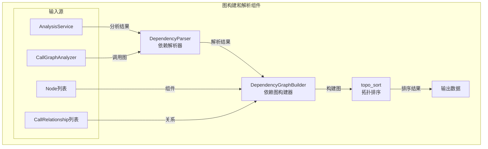
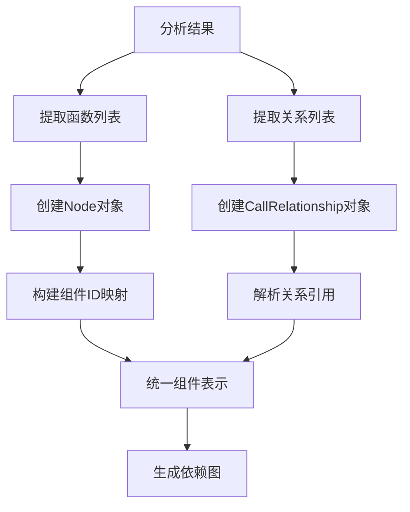

# be.dependency_analyzer 图构建和解析子模块

## 概述

本模块涵盖依赖分析器中的图构建和AST解析功能，包括依赖图构建器、AST解析器以及拓扑排序等高级功能。这些组件负责将代码分析结果转换为结构化的图数据，支持复杂的依赖关系分析和可视化。

## 架构图



## DependencyParser - 依赖解析器

**文件路径**: `codewiki/src/be/dependency_analyzer/ast_parser.py`

### 核心功能

`DependencyParser` 负责将代码分析结果转换为统一的依赖图结构，处理多语言组件的整合和依赖关系映射。

#### 主要职责

1. **组件统一表示**: 将不同语言的代码组件统一表示为 Node 对象
2. **依赖关系映射**: 建立组件间的依赖关系映射
3. **模块路径管理**: 管理组件的模块路径和命名空间
4. **结果序列化**: 支持分析结果的持久化存储

#### 关键方法

```python
class DependencyParser:
    def __init__(self, repo_path: str):
        self.repo_path = os.path.abspath(repo_path)
        self.components: Dict[str, Node] = {}
        self.modules: Set[str] = set()
        self.analysis_service = AnalysisService()
    
    def parse_repository(self, filtered_folders: List[str] = None) -> Dict[str, Node]:
        """解析整个仓库，返回组件映射"""
        # 执行完整的仓库分析
        structure_result = self.analysis_service._analyze_structure(
            self.repo_path, 
            include_patterns=None,
            exclude_patterns=None
        )
        
        # 生成调用图
        call_graph_result = self.analysis_service._analyze_call_graph(
            structure_result["file_tree"], 
            self.repo_path
        )
        
        # 构建统一的组件表示
        self._build_components_from_analysis(call_graph_result)
        
        return self.components
```

#### 组件构建流程



#### 组件ID管理

```python
def _build_components_from_analysis(self, call_graph_result: Dict):
    """从分析结果构建组件映射"""
    functions = call_graph_result.get("functions", [])
    relationships = call_graph_result.get("relationships", [])
    
    # 构建组件ID映射
    component_id_mapping = {}
    
    for func_dict in functions:
        component_id = func_dict.get("id", "")
        if not component_id:
            continue
            
        # 创建统一的Node对象
        node = Node(
            id=component_id,
            name=func_dict.get("name", ""),
            component_type=self._determine_component_type(func_dict),
            file_path=func_dict.get("file_path", ""),
            relative_path=func_dict.get("relative_path", ""),
            source_code=func_dict.get("source_code", ""),
            start_line=func_dict.get("start_line", 0),
            end_line=func_dict.get("end_line", 0),
            has_docstring=func_dict.get("has_docstring", False),
            docstring=func_dict.get("docstring", ""),
            parameters=func_dict.get("parameters", []),
            node_type=func_dict.get("node_type", "function"),
            base_classes=func_dict.get("base_classes"),
            class_name=func_dict.get("class_name"),
            display_name=func_dict.get("display_name", ""),
            component_id=component_id
        )
        
        self.components[component_id] = node
        
        # 维护ID映射关系
        component_id_mapping[component_id] = component_id
        legacy_id = f"{func_dict.get('file_path', '')}:{func_dict.get('name', '')}"
        if legacy_id and legacy_id != component_id:
            component_id_mapping[legacy_id] = component_id
```

#### 依赖关系解析

```python
# 处理依赖关系
for rel_dict in relationships:
    caller_id = rel_dict.get("caller", "")
    callee_id = rel_dict.get("callee", "")
    is_resolved = rel_dict.get("is_resolved", False)
    
    # 解析调用者ID
    caller_component_id = component_id_mapping.get(caller_id)
    
    # 解析被调用者ID
    callee_component_id = component_id_mapping.get(callee_id)
    if not callee_component_id:
        # 尝试通过名称查找
        for comp_id, comp_node in self.components.items():
            if comp_node.name == callee_id:
                callee_component_id = comp_id
                break
    
    # 建立依赖关系
    if caller_component_id and caller_component_id in self.components:
        if callee_component_id:
            self.components[caller_component_id].depends_on.add(callee_component_id)
```

#### 模块路径提取

```python
def _file_to_module_path(self, file_path: str) -> str:
    """将文件路径转换为模块路径"""
    path = file_path
    extensions = ['.py', '.js', '.ts', '.java', '.cs', '.cpp', '.hpp', '.h', '.c', '.tsx', '.jsx', '.cc', '.mjs', '.cxx', '.cc', '.cjs']
    
    # 移除文件扩展名
    for ext in extensions:
        if path.endswith(ext):
            path = path[:-len(ext)]
            break
    
    # 转换路径分隔符为点号
    return path.replace(os.path.sep, ".")
```

### 持久化存储

```python
def save_dependency_graph(self, output_path: str):
    """保存依赖图到文件"""
    result = {}
    
    # 转换组件为字典格式
    for component_id, component in self.components.items():
        component_dict = component.model_dump()
        # 转换 set 为 list 以便JSON序列化
        if 'depends_on' in component_dict and isinstance(component_dict['depends_on'], set):
            component_dict['depends_on'] = list(component_dict['depends_on'])
        result[component_id] = component_dict
    
    # 确保输出目录存在
    dir_name = os.path.dirname(output_path)
    if dir_name:
        os.makedirs(dir_name, exist_ok=True)
    
    # 写入JSON文件
    with open(output_path, 'w', encoding='utf-8') as f:
        json.dump(result, f, indent=2, ensure_ascii=False)
    
    logger.debug(f"保存了 {len(self.components)} 个组件到 {output_path}")
    return result
```

## DependencyGraphBuilder - 依赖图构建器

**文件路径**: `codewiki/src/be/dependency_analyzer/dependency_graphs_builder.py`

### 核心功能

`DependencyGraphBuilder` 负责构建和优化依赖图，提供拓扑排序和叶子节点提取等高级功能。

#### 主要职责

1. **依赖图构建**: 从解析结果构建完整的依赖图
2. **拓扑排序**: 计算组件的依赖顺序
3. **叶子节点提取**: 识别没有依赖的叶子组件
4. **图优化**: 过滤和优化图结构

#### 构建流程

```python
class DependencyGraphBuilder:
    def __init__(self, config: Config):
        self.config = config
    
    def build_dependency_graph(self) -> tuple[Dict[str, Any], List[str]]:
        """构建依赖图，返回组件和叶子节点"""
        # 确保输出目录存在
        file_manager.ensure_directory(self.config.dependency_graph_dir)
        
        # 准备文件路径
        repo_name = os.path.basename(os.path.normpath(self.config.repo_path))
        sanitized_repo_name = ''.join(c if c.isalnum() else '_' for c in repo_name)
        
        dependency_graph_path = os.path.join(
            self.config.dependency_graph_dir, 
            f"{sanitized_repo_name}_dependency_graph.json"
        )
        
        # 创建依赖解析器
        parser = DependencyParser(self.config.repo_path)
        
        # 解析仓库
        components = parser.parse_repository(filtered_folders=None)
        
        # 保存依赖图
        parser.save_dependency_graph(dependency_graph_path)
        
        # 构建图用于遍历
        graph = build_graph_from_components(components)
        
        # 获取叶子节点
        leaf_nodes = get_leaf_nodes(graph, components)
        
        # 过滤叶子节点（只保留类、接口、结构体）
        keep_leaf_nodes = []
        for leaf_node in leaf_nodes:
            # 跳过无效标识符
            if not isinstance(leaf_node, str) or leaf_node.strip() == "":
                continue
            
            # 检查错误关键词
            error_keywords = ['error', 'exception', 'failed', 'invalid']
            if any(keyword in leaf_node.lower() for keyword in error_keywords):
                logger.warning(f"跳过无效叶子节点标识符: '{leaf_node}'")
                continue
            
            # 检查组件是否存在且类型正确
            if leaf_node in components:
                component = components[leaf_node]
                if component.component_type in ["class", "interface", "struct"]:
                    keep_leaf_nodes.append(leaf_node)
        
        return components, keep_leaf_nodes
```

## 拓扑排序模块

**文件路径**: `codewiki/src/be/dependency_analyzer/topo_sort.py`

### 核心功能

提供图的拓扑排序功能，用于确定组件的依赖顺序和识别叶子节点。

#### 图构建

```python
def build_graph_from_components(components: Dict[str, Node]) -> Dict[str, Set[str]]:
    """从组件构建依赖图"""
    graph = {}
    
    for component_id, component in components.items():
        # 确保图中存在该节点
        if component_id not in graph:
            graph[component_id] = set()
        
        # 添加依赖关系
        for dependency_id in component.depends_on:
            if dependency_id in components:  # 只添加存在的依赖
                if dependency_id not in graph:
                    graph[dependency_id] = set()
                graph[component_id].add(dependency_id)
    
    return graph
```

#### 叶子节点识别

```python
def get_leaf_nodes(graph: Dict[str, Set[str]], components: Dict[str, Node]) -> List[str]:
    """获取叶子节点（没有依赖的节点）"""
    leaf_nodes = []
    
    for node_id, dependencies in graph.items():
        if len(dependencies) == 0:  # 没有依赖的节点
            if node_id in components:  # 确保节点存在
                leaf_nodes.append(node_id)
    
    return leaf_nodes
```

#### 拓扑排序

```python
def topological_sort(graph: Dict[str, Set[str]]) -> List[str]:
    """执行拓扑排序"""
    # 计算入度
    in_degree = {}
    for node in graph:
        in_degree[node] = 0
    
    for node, dependencies in graph.items():
        for dep in dependencies:
            if dep in in_degree:
                in_degree[dep] += 1
    
    # 找到入度为0的节点
    queue = [node for node, degree in in_degree.items() if degree == 0]
    result = []
    
    while queue:
        current = queue.pop(0)
        result.append(current)
        
        # 减少依赖当前节点的其他节点的入度
        for node, dependencies in graph.items():
            if current in dependencies:
                in_degree[node] -= 1
                if in_degree[node] == 0:
                    queue.append(node)
    
    # 检查是否有环
    if len(result) != len(graph):
        raise ValueError("图中存在环，无法进行拓扑排序")
    
    return result
```

### 高级图分析

#### 强连通分量检测

```python
def find_strongly_connected_components(graph: Dict[str, Set[str]]) -> List[List[str]]:
    """查找强连通分量"""
    # 使用 Kosaraju 算法
    
    # 第一步：对原图进行深度优先搜索，记录完成时间
    visited = set()
    finish_order = []
    
    def dfs_first(node: str):
        visited.add(node)
        for neighbor in graph.get(node, set()):
            if neighbor not in visited:
                dfs_first(neighbor)
        finish_order.append(node)
    
    for node in graph:
        if node not in visited:
            dfs_first(node)
    
    # 第二步：构建反向图
    reverse_graph = {node: set() for node in graph}
    for node, dependencies in graph.items():
        for dep in dependencies:
            reverse_graph[dep].add(node)
    
    # 第三步：按完成时间逆序对反向图进行DFS
    visited.clear()
    components = []
    
    def dfs_second(node: str, component: List[str]):
        visited.add(node)
        component.append(node)
        for neighbor in reverse_graph.get(node, set()):
            if neighbor not in visited:
                dfs_second(neighbor, component)
    
    for node in reversed(finish_order):
        if node not in visited:
            component = []
            dfs_second(node, component)
            components.append(component)
    
    return components
```

#### 关键路径分析

```python
def find_critical_path(graph: Dict[str, Set[str]], start_node: str, end_node: str) -> List[str]:
    """找到从起始节点到结束节点的关键路径"""
    # 使用动态规划找到最长路径
    
    # 拓扑排序
    sorted_nodes = topological_sort(graph)
    
    # 初始化距离和前驱节点
    distance = {node: 0 for node in graph}
    predecessor = {node: None for node in graph}
    
    # 按拓扑顺序计算最长路径
    for node in sorted_nodes:
        for neighbor in graph.get(node, set()):
            if distance[node] + 1 > distance[neighbor]:
                distance[neighbor] = distance[node] + 1
                predecessor[neighbor] = node
    
    # 重构路径
    path = []
    current = end_node
    while current is not None:
        path.append(current)
        current = predecessor[current]
    
    path.reverse()
    return path if path[0] == start_node else []
```

## 使用示例

### 完整的依赖分析流程

```python
from codewiki.src.be.dependency_analyzer.dependency_graphs_builder import DependencyGraphBuilder
from codewiki.src.be.dependency_analyzer.topo_sort import build_graph_from_components, topological_sort
from codewiki.src.config import Config

def analyze_project_dependencies(repo_path: str):
    """分析项目依赖关系"""
    # 配置
    config = Config()
    config.repo_path = repo_path
    config.dependency_graph_dir = "/tmp/dependency_graphs"
    
    # 构建依赖图
    builder = DependencyGraphBuilder(config)
    components, leaf_nodes = builder.build_dependency_graph()
    
    print(f"项目组件数量: {len(components)}")
    print(f"叶子节点数量: {len(leaf_nodes)}")
    
    # 构建图结构
    graph = build_graph_from_components(components)
    
    # 拓扑排序
    try:
        sorted_components = topological_sort(graph)
        print(f"拓扑排序结果: {sorted_components}")
    except ValueError as e:
        print(f"存在循环依赖: {e}")
        # 查找强连通分量
        sccs = find_strongly_connected_components(graph)
        print(f"强连通分量: {sccs}")
    
    # 分析叶子节点
    print("叶子节点（无依赖的组件）:")
    for leaf in leaf_nodes:
        component = components[leaf]
        print(f"  - {component.name} ({component.component_type}) in {component.relative_path}")
    
    # 分析关键路径
    if leaf_nodes and sorted_components:
        start = sorted_components[0]  # 起始节点
        end = leaf_nodes[0]           # 结束节点
        critical_path = find_critical_path(graph, start, end)
        print(f"关键路径: {critical_path}")
    
    return components, graph, leaf_nodes

# 使用示例
components, graph, leaf_nodes = analyze_project_dependencies("/path/to/python/project")
```

### 依赖关系可视化

```python
def visualize_dependencies(components: Dict[str, Node], graph: Dict[str, Set[str]]):
    """可视化依赖关系"""
    import matplotlib.pyplot as plt
    import networkx as nx
    
    # 创建NetworkX图
    G = nx.DiGraph()
    
    # 添加节点
    for component_id, component in components.items():
        G.add_node(component_id, 
                  name=component.name,
                  type=component.component_type,
                  file=component.relative_path)
    
    # 添加边
    for node_id, dependencies in graph.items():
        for dep_id in dependencies:
            G.add_edge(node_id, dep_id)
    
    # 计算布局
    pos = nx.spring_layout(G, k=3, iterations=50)
    
    # 绘制
    plt.figure(figsize=(12, 8))
    
    # 节点颜色映射
    color_map = {
        "function": "lightblue",
        "class": "lightgreen",
        "method": "lightyellow",
        "interface": "lightcoral"
    }
    
    node_colors = [color_map.get(components[node].component_type, "lightgray") 
                   for node in G.nodes()]
    
    # 绘制节点和边
    nx.draw(G, pos, 
           node_color=node_colors,
           node_size=1000,
           with_labels=True,
           font_size=8,
           arrows=True,
           arrowsize=20)
    
    plt.title("代码依赖关系图")
    plt.axis('off')
    plt.tight_layout()
    plt.show()

# 使用示例
visualize_dependencies(components, graph)
```

### 循环依赖检测

```python
def detect_circular_dependencies(graph: Dict[str, Set[str]]) -> List[List[str]]:
    """检测循环依赖"""
    sccs = find_strongly_connected_components(graph)
    
    # 过滤出真正的循环（大小大于1的强连通分量）
    circular_dependencies = [
        scc for scc in sccs 
        if len(scc) > 1
    ]
    
    return circular_dependencies

def report_circular_dependencies(components: Dict[str, Node], circular_deps: List[List[str]]):
    """报告循环依赖"""
    if not circular_deps:
        print("未发现循环依赖")
        return
    
    print("发现循环依赖:")
    for i, cycle in enumerate(circular_deps, 1):
        print(f"\n循环 {i}:")
        for component_id in cycle:
            component = components[component_id]
            print(f"  - {component.name} ({component.component_type}) in {component.relative_path}")
        
        # 显示具体的依赖关系
        print("  依赖关系:")
        for j, node_id in enumerate(cycle):
            next_node_id = cycle[(j + 1) % len(cycle)]
            component = components[node_id]
            if next_node_id in component.depends_on:
                print(f"    {component.name} -> {components[next_node_id].name}")

# 使用示例
circular_deps = detect_circular_dependencies(graph)
report_circular_dependencies(components, circular_deps)
```

## 性能优化

### 增量图构建

```python
class IncrementalGraphBuilder:
    """增量图构建器，支持高效的图更新"""
    
    def __init__(self, base_components: Dict[str, Node]):
        self.base_components = base_components
        self.graph = build_graph_from_components(base_components)
        self.dirty_nodes = set()
    
    def update_component(self, component_id: str, new_component: Node):
        """更新单个组件"""
        # 标记为脏节点
        self.dirty_nodes.add(component_id)
        
        # 更新组件
        self.base_components[component_id] = new_component
        
        # 更新图中的依赖关系
        self.graph[component_id] = set(new_component.depends_on)
    
    def add_component(self, component: Node):
        """添加新组件"""
        self.base_components[component.id] = component
        self.graph[component.id] = set(component.depends_on)
        self.dirty_nodes.add(component.id)
    
    def remove_component(self, component_id: str):
        """移除组件"""
        if component_id in self.base_components:
            del self.base_components[component_id]
            del self.graph[component_id]
            
            # 从其他节点的依赖中移除
            for node_id, dependencies in self.graph.items():
                if component_id in dependencies:
                    dependencies.remove(component_id)
                    self.dirty_nodes.add(node_id)
    
    def get_affected_nodes(self) -> Set[str]:
        """获取受影响的节点（需要重新计算拓扑排序的节点）"""
        # 简单的实现：返回所有脏节点及其依赖者
        affected = set(self.dirty_nodes)
        
        for node_id, dependencies in self.graph.items():
            if any(dep in self.dirty_nodes for dep in dependencies):
                affected.add(node_id)
        
        return affected
    
    def rebuild_affected_parts(self) -> Dict[str, Any]:
        """只重建受影响的部分"""
        affected_nodes = self.get_affected_nodes()
        
        # 只对这些节点重新计算拓扑排序
        subgraph = {
            node_id: deps for node_id, deps in self.graph.items() 
            if node_id in affected_nodes
        }
        
        try:
            new_order = topological_sort(subgraph)
            return {
                "affected_nodes": affected_nodes,
                "new_order": new_order,
                "full_graph": self.graph
            }
        except ValueError as e:
            # 处理循环依赖
            return {
                "error": str(e),
                "affected_nodes": affected_nodes,
                "full_graph": self.graph
            }
```

### 内存优化

```python
class MemoryEfficientGraphBuilder:
    """内存高效的图构建器"""
    
    def __init__(self, max_memory_mb: int = 500):
        self.max_memory_mb = max_memory_mb
        self.component_cache = {}
        self.graph_cache = {}
    
    def build_graph_chunked(self, components: Dict[str, Node], chunk_size: int = 100) -> Dict[str, Set[str]]:
        """分块构建图，减少内存使用"""
        graph = {}
        component_items = list(components.items())
        
        for i in range(0, len(component_items), chunk_size):
            chunk = dict(component_items[i:i + chunk_size])
            
            # 处理这一批组件
            chunk_graph = build_graph_from_components(chunk)
            graph.update(chunk_graph)
            
            # 清理缓存
            if i > 0 and i % (chunk_size * 5) == 0:
                import gc
                gc.collect()
        
        return graph
    
    def stream_process_components(self, components_file: str):
        """流式处理组件数据"""
        import json
        
        with open(components_file, 'r') as f:
            for line in f:
                component_data = json.loads(line.strip())
                yield Node(**component_data)
    
    def build_graph_streaming(self, components_file: str) -> Dict[str, Set[str]]:
        """流式构建图"""
        graph = {}
        
        for component in self.stream_process_components(components_file):
            # 添加节点
            graph[component.id] = set(component.depends_on)
            
            # 确保依赖节点存在
            for dep_id in component.depends_on:
                if dep_id not in graph:
                    graph[dep_id] = set()
        
        return graph
```

## 高级分析功能

### 依赖影响分析

```python
def analyze_dependency_impact(graph: Dict[str, Set[str]], target_node: str, max_depth: int = 3) -> Dict:
    """分析依赖影响范围"""
    
    def find_affected_nodes(node: str, depth: int, visited: Set[str]) -> Dict[int, Set[str]]:
        if depth > max_depth or node in visited:
            return {}
        
        visited.add(node)
        affected = {depth: set()}
        
        # 查找依赖此节点的其他节点
        for candidate_node, dependencies in graph.items():
            if node in dependencies and candidate_node not in visited:
                affected[depth].add(candidate_node)
                
                # 递归查找更深的影响
                deeper_affected = find_affected_nodes(candidate_node, depth + 1, visited)
                for deeper_depth, deeper_nodes in deeper_affected.items():
                    if deeper_depth not in affected:
                        affected[deeper_depth] = set()
                    affected[deeper_depth].update(deeper_nodes)
        
        return affected
    
    # 分析影响范围
    affected = find_affected_nodes(target_node, 0, set())
    
    # 统计信息
    total_affected = sum(len(nodes) for nodes in affected.values())
    
    return {
        "target_node": target_node,
        "affected_by_depth": affected,
        "total_affected": total_affected,
        "max_depth_reached": max(affected.keys()) if affected else 0
    }
```

### 模块化分析

```python
def analyze_modularity(graph: Dict[str, Set[str]], components: Dict[str, Node]) -> Dict:
    """分析代码模块化程度"""
    
    # 计算模块内依赖和模块间依赖
    internal_deps = 0
    external_deps = 0
    
    # 按文件分组组件
    file_groups = {}
    for component_id, component in components.items():
        file_path = component.file_path
        if file_path not in file_groups:
            file_groups[file_path] = []
        file_groups[file_path].append(component_id)
    
    # 统计依赖关系
    for node_id, dependencies in graph.items():
        node_file = components[node_id].file_path
        
        for dep_id in dependencies:
            dep_file = components[dep_id].file_path
            
            if node_file == dep_file:
                internal_deps += 1
            else:
                external_deps += 1
    
    # 计算模块化指标
    total_deps = internal_deps + external_deps
    modularity_ratio = internal_deps / total_deps if total_deps > 0 else 0
    
    # 分析文件间的依赖复杂度
    file_dependencies = {}
    for node_id, dependencies in graph.items():
        node_file = components[node_id].file_path
        
        for dep_id in dependencies:
            dep_file = components[dep_id].file_path
            
            if node_file != dep_file:
                key = (node_file, dep_file)
                file_dependencies[key] = file_dependencies.get(key, 0) + 1
    
    return {
        "internal_dependencies": internal_deps,
        "external_dependencies": external_deps,
        "modularity_ratio": modularity_ratio,
        "file_dependencies": file_dependencies,
        "total_files": len(file_groups),
        "avg_dependencies_per_file": total_deps / len(file_groups) if file_groups else 0
    }
```

### 质量评估

```python
def assess_dependency_quality(components: Dict[str, Node], graph: Dict[str, Set[str]]) -> Dict:
    """评估依赖关系质量"""
    
    # 统计各种指标
    total_relationships = sum(len(deps) for deps in graph.values())
    resolved_relationships = 0
    unresolved_relationships = 0
    circular_dependencies = 0
    deep_nesting = 0
    
    # 分析已解析和未解析的关系
    for node_id, dependencies in graph.items():
        for dep_id in dependencies:
            if dep_id in components:
                resolved_relationships += 1
            else:
                unresolved_relationships += 1
    
    # 检测循环依赖
    sccs = find_strongly_connected_components(graph)
    circular_dependencies = sum(1 for scc in sccs if len(scc) > 1)
    
    # 检测深层嵌套
    for component in components.values():
        if component.component_type == "function":
            # 简单的嵌套检测：基于模块路径深度
            module_depth = component.id.count(".")
            if module_depth > 5:  # 超过5层嵌套
                deep_nesting += 1
    
    # 计算质量分数
    total_possible = len(components) * (len(components) - 1) / 2  # 完全图的理论边数
    density = total_relationships / total_possible if total_possible > 0 else 0
    
    resolution_rate = resolved_relationships / total_relationships if total_relationships > 0 else 0
    
    # 质量评分 (0-100)
    quality_score = (
        resolution_rate * 40 +  # 解析率权重 40%
        (1 - min(density, 0.3) / 0.3) * 30 +  # 密度控制权重 30%
        (1 - circular_dependencies / max(len(components), 1)) * 20 +  # 无循环依赖权重 20%
        (1 - deep_nesting / max(len(components), 1)) * 10  # 浅层嵌套权重 10%
    ) * 100
    
    return {
        "quality_score": quality_score,
        "total_relationships": total_relationships,
        "resolved_relationships": resolved_relationships,
        "unresolved_relationships": unresolved_relationships,
        "resolution_rate": resolution_rate,
        "circular_dependencies": circular_dependencies,
        "deep_nesting": deep_nesting,
        "graph_density": density
    }
```

## 相关文档

- [分析服务子模块](be.dependency_analyzer.analysis.md) - 图构建器的使用场景
- [语言分析器子模块](be.dependency_analyzer.analyzers.md) - 组件数据的来源
- [数据模型子模块](be.dependency_analyzer.models.md) - Node 和 CallRelationship 模型
- [工具函数子模块](be.dependency_analyzer.utils.md) - 日志和工具函数