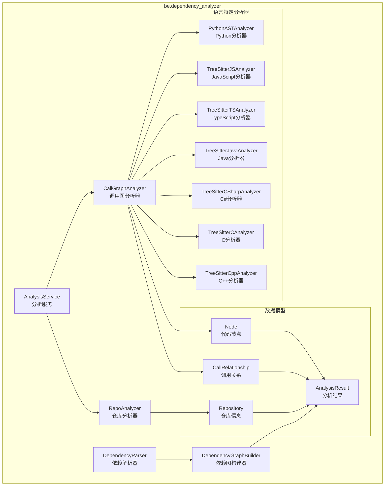
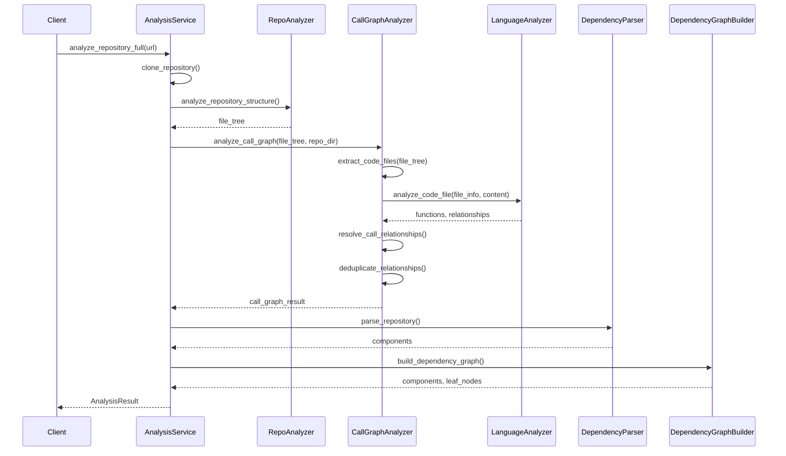

# be.dependency_analyzer 模块文档

## 概述

`be.dependency_analyzer` 是 CodeWiki 系统的核心依赖分析模块，专门用于分析代码仓库的依赖关系、构建调用图，并提取代码组件信息。该模块支持多种编程语言，能够深入理解代码结构，为文档生成和代码理解提供基础数据支撑。

## 模块目的

本模块的主要目标是：
- **多语言代码分析**：支持 Python、JavaScript、TypeScript、Java、C#、C/C++ 等主流编程语言的语法分析
- **依赖关系提取**：识别函数、类、方法之间的调用关系和依赖关系
- **调用图构建**：生成完整的代码调用图，展示代码组件间的交互关系
- **代码结构解析**：提取文件结构、模块组织和代码组件信息
- **可视化数据生成**：为前端展示生成结构化的可视化数据

## 架构概览



## 核心组件

### 1. 分析服务层

#### AnalysisService (`analysis/analysis_service.py`)
- **职责**：中央分析服务，协调整个分析流程
- **功能**：
  - 仓库克隆和管理
  - 文件结构分析
  - 多语言调用图生成
  - 结果整合和清理
- **关键方法**：
  - `analyze_repository_full()`: 完整仓库分析
  - `analyze_local_repository()`: 本地仓库分析
  - `analyze_repository_structure_only()`: 仅结构分析

#### CallGraphAnalyzer (`analysis/call_graph_analyzer.py`)
- **职责**：调用图分析的核心协调器
- **功能**：
  - 多语言代码文件提取
  - 语言特定分析器路由
  - 调用关系解析和去重
  - 可视化数据生成
- **关键方法**：
  - `analyze_code_files()`: 分析代码文件集合
  - `extract_code_files()`: 从文件树提取代码文件
  - `_resolve_call_relationships()`: 解析调用关系

#### RepoAnalyzer (`analysis/repo_analyzer.py`)
- **职责**：仓库文件结构分析
- **功能**：
  - 文件树构建
  - 文件过滤和模式匹配
  - 仓库统计信息生成
- **关键方法**：
  - `analyze_repository_structure()`: 分析仓库结构
  - `_build_file_tree()`: 构建文件树

### 2. 语言特定分析器

每种语言都有专门的分析器，基于相应的语法分析技术：

#### PythonASTAnalyzer (`analyzers/python.py`)
- **技术**：基于 Python AST (抽象语法树)
- **功能**：
  - 类、函数、方法提取
  - 调用关系识别
  - 继承关系分析
  - 装饰器和异步函数支持

#### TreeSitterJSAnalyzer (`analyzers/javascript.py`)
- **技术**：基于 Tree-sitter 语法分析器
- **功能**：
  - ES6+ 语法支持
  - 类声明和方法提取
  - 箭头函数和生成器函数
  - JSDoc 类型依赖提取

#### TreeSitterTSAnalyzer (`analyzers/typescript.py`)
- **技术**：基于 Tree-sitter TypeScript 语法分析器
- **功能**：
  - TypeScript 特有语法支持
  - 接口、类型别名、枚举分析
  - 泛型和装饰器支持
  - 模块系统分析

#### TreeSitterJavaAnalyzer (`analyzers/java.py`)
- **技术**：基于 Tree-sitter Java 语法分析器
- **功能**：
  - Java 类、接口、枚举分析
  - 继承和实现关系
  - 方法调用和字段依赖
  - 泛型类型处理

#### TreeSitterCSharpAnalyzer (`analyzers/csharp.py`)
- **技术**：基于 Tree-sitter C# 语法分析器
- **功能**：
  - C# 类、接口、结构体分析
  - 继承和实现关系
  - 属性和字段依赖
  - 泛型和委托支持

#### TreeSitterCAnalyzer (`analyzers/c.py`)
- **技术**：基于 Tree-sitter C 语法分析器
- **功能**：
  - C 函数和全局变量分析
  - 函数调用关系
  - 头文件依赖
  - 系统函数过滤

#### TreeSitterCppAnalyzer (`analyzers/cpp.py`)
- **技术**：基于 Tree-sitter C++ 语法分析器
- **功能**：
  - C++ 类、结构体、命名空间分析
  - 继承和多态关系
  - 方法调用和成员访问
  - 模板支持

### 3. 依赖解析和图构建

#### DependencyParser (`ast_parser.py`)
- **职责**：依赖关系解析和组件提取
- **功能**：
  - 多语言组件统一表示
  - 依赖关系映射
  - 组件ID管理
  - 结果序列化

#### DependencyGraphBuilder (`dependency_graphs_builder.py`)
- **职责**：依赖图构建和优化
- **功能**：
  - 依赖图构建
  - 拓扑排序
  - 叶子节点提取
  - 图数据持久化

### 4. 数据模型

#### 核心模型 (`models/core.py`)
- **Node**: 代码组件节点（函数、类、方法等）
- **CallRelationship**: 调用关系
- **Repository**: 仓库信息

#### 分析模型 (`models/analysis.py`)
- **AnalysisResult**: 完整的分析结果
- **NodeSelection**: 节点选择配置

## 数据流图



## 支持的编程语言

| 语言 | 分析器 | 语法技术 | 支持特性 |
|------|--------|----------|----------|
| Python | PythonASTAnalyzer | AST | 类、函数、方法、继承、装饰器 |
| JavaScript | TreeSitterJSAnalyzer | Tree-sitter | ES6+、类、箭头函数、JSDoc |
| TypeScript | TreeSitterTSAnalyzer | Tree-sitter | 接口、类型、泛型、装饰器 |
| Java | TreeSitterJavaAnalyzer | Tree-sitter | 类、接口、继承、泛型 |
| C# | TreeSitterCSharpAnalyzer | Tree-sitter | 类、接口、属性、泛型 |
| C | TreeSitterCAnalyzer | Tree-sitter | 函数、全局变量、头文件 |
| C++ | TreeSitterCppAnalyzer | Tree-sitter | 类、继承、模板、命名空间 |

## 配置和扩展

### 文件过滤模式
- 包含模式：指定要分析的文件类型
- 排除模式：过滤掉测试、配置等非核心文件
- 默认忽略：`.git`, `node_modules`, `__pycache__` 等

### 语言扩展
添加新语言支持需要：
1. 创建新的语言分析器类
2. 实现节点提取和关系识别
3. 在 CallGraphAnalyzer 中注册
4. 更新支持语言列表

## 错误处理和日志

### 日志系统
- 使用彩色日志格式化器 (`ColoredFormatter`)
- 分级日志：DEBUG、INFO、WARNING、ERROR
- 模块特定日志配置

### 错误处理策略
- 文件级错误隔离：单个文件失败不影响整体分析
- 语法错误容错：跳过无法解析的文件
- 安全检查：路径验证、符号链接处理
- 资源清理：临时文件和目录的自动清理

## 性能优化

### 分析优化
- 增量分析：只分析修改的文件
- 并行处理：多文件并发分析
- 内存管理：大文件流式处理
- 缓存机制：分析结果缓存

### 结果优化
- 关系去重：消除重复的调用关系
- 节点筛选：基于连接度的重要节点提取
- 数据压缩：可视化数据优化

## 集成和使用

### 基本使用
```python
from codewiki.src.be.dependency_analyzer.analysis.analysis_service import AnalysisService

service = AnalysisService()
result = service.analyze_repository_full("https://github.com/user/repo")
print(f"Found {len(result.functions)} functions")
print(f"Found {len(result.relationships)} relationships")
```

### 本地分析
```python
result = service.analyze_local_repository("/path/to/repo", max_files=100)
```

### 依赖图构建
```python
from codewiki.src.be.dependency_analyzer.dependency_graphs_builder import DependencyGraphBuilder
from codewiki.src.config import Config

config = Config()
builder = DependencyGraphBuilder(config)
components, leaf_nodes = builder.build_dependency_graph()
```

## 相关模块

- [be.agent_orchestrator](be.agent_orchestrator.md) - 代理协调器，使用分析结果进行智能文档生成
- [be.documentation_generator](be.documentation_generator.md) - 文档生成器，基于分析结果生成文档
- [cli](cli.md) - 命令行接口，提供分析服务的CLI访问

## 子模块文档

详细子模块文档：
- [分析服务子模块](be.dependency_analyzer.analysis.md) - 核心分析引擎和协调器
- [语言分析器子模块](be.dependency_analyzer.analyzers.md) - 多语言代码分析器实现
- [数据模型子模块](be.dependency_analyzer.models.md) - 核心数据结构和模型
- [工具函数子模块](be.dependency_analyzer.utils.md) - 日志、安全和模式匹配工具
- [图构建和解析子模块](be.dependency_analyzer.graph_building.md) - 依赖图构建和拓扑排序