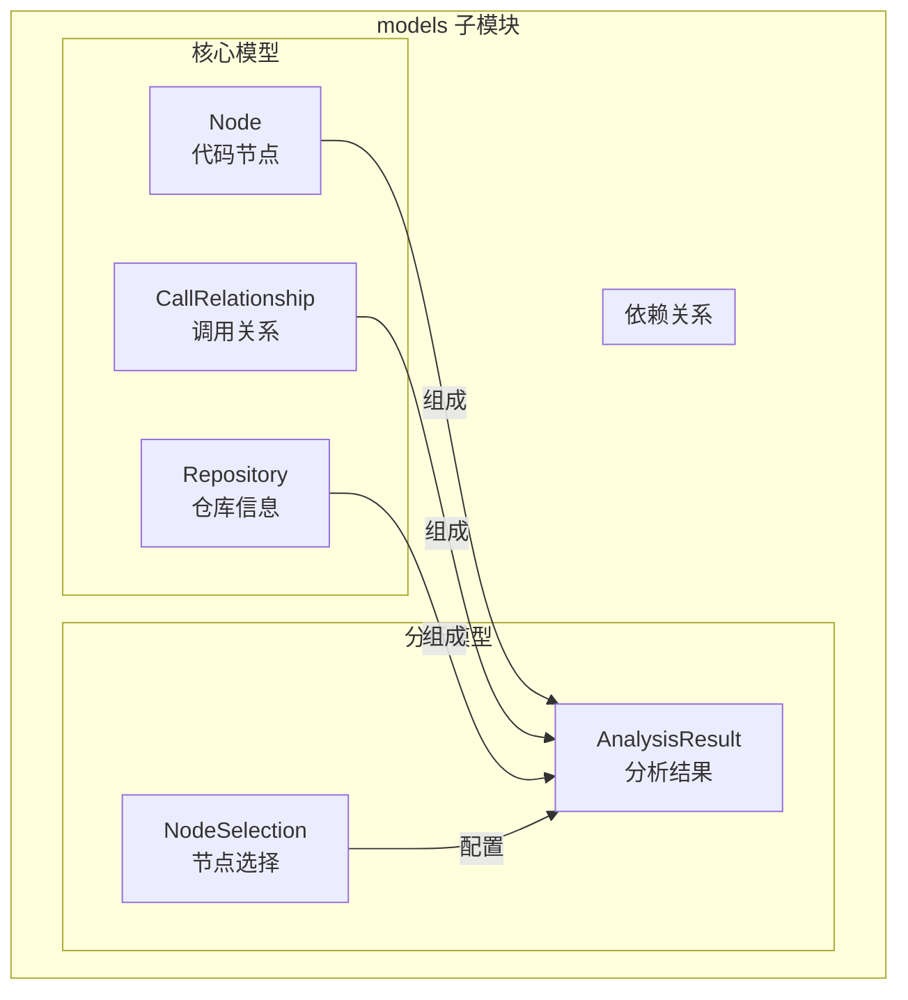

# be.dependency_analyzer.models 子模块文档

## 概述

`be.dependency_analyzer.models` 子模块定义了依赖分析器使用的核心数据模型。这些模型使用 Pydantic 构建，提供了类型安全的数据验证和序列化功能，确保分析结果的一致性和可靠性。

## 架构图



## 核心数据模型

### Node 模型

**文件路径**: `codewiki/src/be/dependency_analyzer/models/core.py`

`Node` 模型表示代码中的一个组件，可以是函数、类、方法、接口等。

#### 字段定义

```python
class Node(BaseModel):
    id: str                                    # 唯一标识符
    name: str                                  # 组件名称
    component_type: str                        # 组件类型 (function, class, method, etc.)
    file_path: str                             # 绝对文件路径
    relative_path: str                         # 相对仓库根目录的路径
    depends_on: Set[str] = set()               # 依赖的其他组件ID集合
    source_code: Optional[str] = None          # 源代码片段
    start_line: int = 0                        # 起始行号
    end_line: int = 0                          # 结束行号
    has_docstring: bool = False                # 是否有文档字符串
    docstring: str = ""                        # 文档字符串内容
    parameters: Optional[List[str]] = None     # 参数列表
    node_type: Optional[str] = None            # 节点类型 (用于前端显示)
    base_classes: Optional[List[str]] = None   # 基类列表 (用于继承关系)
    class_name: Optional[str] = None           # 所属类名 (用于方法)
    display_name: Optional[str] = None         # 显示名称
    component_id: Optional[str] = None         # 组件ID (与id字段相同)
```

#### 组件类型

常见的 `component_type` 值：

| 类型值 | 说明 | 示例 |
|--------|------|------|
| `function` | 函数 | `def process_data():` |
| `class` | 类 | `class UserService:` |
| `method` | 方法 | `def get_user(self):` |
| `interface` | 接口 | `interface Repository` |
| `struct` | 结构体 | `struct Point { int x; int y; }` |
| `enum` | 枚举 | `enum Color { RED, GREEN, BLUE }` |
| `abstract class` | 抽象类 | `abstract class BaseService` |
| `static class` | 静态类 | `static class Utils` |
| `variable` | 变量 | `int global_counter;` |
| `namespace` | 命名空间 | `namespace Utils { }` |

#### 使用示例

```python
# 创建函数节点
function_node = Node(
    id="src.utils.helpers.process_data",
    name="process_data",
    component_type="function",
    file_path="/path/to/repo/src/utils/helpers.py",
    relative_path="src/utils/helpers.py",
    start_line=10,
    end_line=25,
    has_docstring=True,
    docstring="Process input data and return results.",
    parameters=["data", "config"],
    display_name="function process_data"
)

# 创建类节点
class_node = Node(
    id="src.services.UserService",
    name="UserService",
    component_type="class",
    file_path="/path/to/repo/src/services/user_service.py",
    relative_path="src/services/user_service.py",
    base_classes=["BaseService", "IService"],
    start_line=5,
    end_line=50,
    has_docstring=True,
    docstring="Service class for user-related operations."
)

# 创建方法节点
method_node = Node(
    id="src.services.UserService.get_user",
    name="get_user",
    component_type="method",
    file_path="/path/to/repo/src/services/user_service.py",
    relative_path="src/services/user_service.py",
    class_name="UserService",
    start_line=15,
    end_line=20,
    parameters=["self", "user_id"],
    display_name="method get_user"
)
```

#### 依赖关系管理

```python
# 设置依赖关系
user_service.depends_on.add("src.repositories.UserRepository")
user_service.depends_on.add("src.models.User")

# 检查依赖
if "src.repositories.UserRepository" in user_service.depends_on:
    print("UserService depends on UserRepository")

# 获取所有依赖
dependencies = list(user_service.depends_on)
```

### CallRelationship 模型

**文件路径**: `codewiki/src/be/dependency_analyzer/models/core.py`

`CallRelationship` 模型表示代码组件之间的调用或依赖关系。

#### 字段定义

```python
class CallRelationship(BaseModel):
    caller: str                    # 调用者组件ID
    callee: str                    # 被调用者组件ID
    call_line: Optional[int] = None  # 调用发生的行号
    is_resolved: bool = False      # 是否已解析（找到被调用者的定义）
```

#### 关系类型

调用关系可以表示多种依赖类型：

1. **函数调用**: `function_a` → `function_b`
2. **方法调用**: `class.method_a` → `class.method_b`
3. **类实例化**: `function_a` → `ClassName`
4. **继承关系**: `ChildClass` → `ParentClass`
5. **接口实现**: `Implementation` → `Interface`
6. **字段依赖**: `ClassA` → `ClassB` (ClassA 使用 ClassB 的实例)

#### 使用示例

```python
# 创建函数调用关系
call_rel = CallRelationship(
    caller="src.main.process_request",
    callee="src.utils.validate_input",
    call_line=25,
    is_resolved=True
)

# 创建类继承关系
inheritance_rel = CallRelationship(
    caller="src.models.AdminUser",
    callee="src.models.User",
    is_resolved=True
)

# 创建未解析的调用关系（可能是外部依赖）
unresolved_rel = CallRelationship(
    caller="src.services.UserService",
    callee="external_logger",
    call_line=42,
    is_resolved=False
)
```

#### 关系解析

```python
# 在 CallGraphAnalyzer 中解析关系
def _resolve_call_relationships(self):
    # 构建函数查找表
    func_lookup = {}
    for func_id, func_info in self.functions.items():
        func_lookup[func_id] = func_id
        func_lookup[func_info.name] = func_id
    
    # 解析每个关系
    for relationship in self.call_relationships:
        callee_name = relationship.callee
        if callee_name in func_lookup:
            relationship.callee = func_lookup[callee_name]
            relationship.is_resolved = True
```

### Repository 模型

**文件路径**: `codewiki/src/be/dependency_analyzer/models/core.py`

`Repository` 模型表示被分析的代码仓库的基本信息。

#### 字段定义

```python
class Repository(BaseModel):
    url: str                    # 仓库URL（GitHub等）
    name: str                   # 仓库名称
    clone_path: str             # 本地克隆路径
    analysis_id: str            # 分析ID（用于标识此次分析）
```

#### 使用示例

```python
# 创建仓库信息
repository = Repository(
    url="https://github.com/user/project",
    name="project",
    clone_path="/tmp/code_analysis/project_123",
    analysis_id="user-project-20231201"
)
```

## 分析结果模型

### AnalysisResult 模型

**文件路径**: `codewiki/src/be/dependency_analyzer/models/analysis.py`

`AnalysisResult` 模型表示完整的代码分析结果，包含所有提取的信息。

#### 字段定义

```python
class AnalysisResult(BaseModel):
    repository: Repository                      # 仓库信息
    functions: List[Node]                       # 所有代码组件
    relationships: List[CallRelationship]       # 所有调用关系
    file_tree: Dict[str, Any]                   # 文件树结构
    summary: Dict[str, Any]                     # 统计摘要
    visualization: Dict[str, Any] = {}          # 可视化数据
    readme_content: Optional[str] = None        # README内容
```

#### 统计摘要结构

`summary` 字段包含以下统计信息：

```python
{
    "total_files": 150,                    # 总文件数
    "total_size_kb": 1024.5,               # 总大小（KB）
    "total_functions": 75,                 # 总函数数
    "total_classes": 25,                   # 总类数
    "total_relationships": 120,            # 总关系数
    "resolved_relationships": 100,         # 已解析关系数
    "unresolved_relationships": 20,        # 未解析关系数
    "languages_found": ["python", "js"],   # 发现的语言
    "analysis_type": "full",               # 分析类型
    "analysis_duration": 15.3              # 分析耗时（秒）
}
```

#### 可视化数据结构

`visualization` 字段包含 Cytoscape.js 兼容的图数据：

```python
{
    "cytoscape": {
        "elements": [
            # 节点元素
            {
                "data": {
                    "id": "src.utils.helpers",
                    "label": "helpers",
                    "file": "src/utils/helpers.py",
                    "type": "module"
                },
                "classes": "node-function lang-python"
            },
            # 边元素
            {
                "data": {
                    "id": "edge-1",
                    "source": "src.main.process",
                    "target": "src.utils.helpers",
                    "line": 25
                },
                "classes": "edge-call"
            }
        ]
    },
    "summary": {
        "total_nodes": 50,
        "total_edges": 75,
        "unresolved_calls": 5
    }
}
```

#### 使用示例

```python
# 创建分析结果
result = AnalysisResult(
    repository=repository,
    functions=[func1, func2, class1, method1],
    relationships=[rel1, rel2, rel3],
    file_tree={
        "type": "directory",
        "name": "src",
        "children": [
            {
                "type": "file",
                "name": "main.py",
                "path": "src/main.py"
            }
        ]
    },
    summary={
        "total_files": 10,
        "total_functions": 15,
        "total_relationships": 25,
        "languages_found": ["python"]
    },
    visualization={
        "cytoscape": {
            "elements": [...]
        }
    },
    readme_content="# Project README\n\nThis is a sample project."
)

# 访问分析结果
print(f"仓库: {result.repository.name}")
print(f"函数数量: {len(result.functions)}")
print(f"关系数量: {len(result.relationships)}")
print(f"文件数量: {result.summary['total_files']}")
```

### NodeSelection 模型

**文件路径**: `codewiki/src/be/dependency_analyzer/models/analysis.py`

`NodeSelection` 模型用于配置部分导出或分析时的节点选择。

#### 字段定义

```python
class NodeSelection(BaseModel):
    selected_nodes: List[str] = []              # 选中的节点ID列表
    include_relationships: bool = True          # 是否包含相关的关系
    custom_names: Dict[str, str] = {}           # 自定义节点名称映射
```

#### 使用示例

```python
# 选择特定节点进行导出
selection = NodeSelection(
    selected_nodes=[
        "src.services.UserService",
        "src.repositories.UserRepository",
        "src.models.User"
    ],
    include_relationships=True,
    custom_names={
        "src.services.UserService": "用户服务",
        "src.repositories.UserRepository": "用户仓库"
    }
)

# 过滤分析结果
filtered_functions = [
    func for func in result.functions 
    if func.id in selection.selected_nodes
]

filtered_relationships = [
    rel for rel in result.relationships 
    if selection.include_relationships and 
       rel.caller in selection.selected_nodes and 
       rel.callee in selection.selected_nodes
]
```

## 数据验证和序列化

### Pydantic 验证

所有模型都使用 Pydantic 进行数据验证：

```python
# 自动类型验证
try:
    node = Node(
        id=123,  # 错误：应该是字符串
        name="test_function",
        # ...
    )
except ValidationError as e:
    print(f"验证错误: {e}")

# 自动转换
def create_node_safe(data: dict) -> Node:
    try:
        return Node(**data)
    except ValidationError as e:
        logger.error(f"节点数据验证失败: {e}")
        # 返回默认值或抛出异常
        raise
```

### JSON 序列化

```python
# 序列化为 JSON
json_data = result.model_dump_json(indent=2)

# 序列化为字典
data_dict = result.model_dump()

# 自定义序列化
class Config:
    json_encoders = {
        set: lambda v: list(v),  # 将 set 转换为 list
        Path: lambda v: str(v)   # 将 Path 转换为字符串
    }
```

### 模型继承和扩展

```python
# 扩展 Node 模型
class ExtendedNode(Node):
    complexity_score: float = 0.0           # 复杂度评分
    test_coverage: float = 0.0              # 测试覆盖率
    last_modified: datetime = None          # 最后修改时间
    
# 使用扩展模型
extended_node = ExtendedNode(
    id="src.utils.helpers",
    name="helpers",
    component_type="module",
    # ... 基础字段
    complexity_score=8.5,
    test_coverage=0.75,
    last_modified=datetime.now()
)
```

## 数据访问模式

### 批量操作

```python
# 批量创建节点
def create_nodes_from_data(data_list: List[dict]) -> List[Node]:
    return [Node(**data) for data in data_list]

# 批量验证
def validate_nodes(nodes: List[Node]) -> List[str]:
    errors = []
    for node in nodes:
        try:
            node.model_validate(node)
        except ValidationError as e:
            errors.append(f"节点 {node.id} 验证失败: {e}")
    return errors
```

### 查询和过滤

```python
# 按类型过滤
functions = [n for n in result.functions if n.component_type == "function"]
classes = [n for n in result.functions if n.component_type == "class"]

# 按文件过滤
file_nodes = [n for n in result.functions if n.file_path == target_file]

# 按依赖关系查询
def find_dependencies(node_id: str, functions: List[Node]) -> List[Node]:
    node = next((n for n in functions if n.id == node_id), None)
    if not node:
        return []
    
    dependencies = []
    for dep_id in node.depends_on:
        dep_node = next((n for n in functions if n.id == dep_id), None)
        if dep_node:
            dependencies.append(dep_node)
    return dependencies
```

### 数据统计

```python
# 统计不同类型组件的数量
def get_component_stats(functions: List[Node]) -> Dict[str, int]:
    stats = {}
    for func in functions:
        component_type = func.component_type
        stats[component_type] = stats.get(component_type, 0) + 1
    return stats

# 统计文件分布
def get_file_distribution(functions: List[Node]) -> Dict[str, int]:
    file_stats = {}
    for func in functions:
        file_path = func.file_path
        file_stats[file_path] = file_stats.get(file_path, 0) + 1
    return file_stats

# 统计依赖关系
def get_dependency_stats(relationships: List[CallRelationship]) -> Dict[str, int]:
    resolved = sum(1 for rel in relationships if rel.is_resolved)
    unresolved = len(relationships) - resolved
    return {
        "total": len(relationships),
        "resolved": resolved,
        "unresolved": unresolved
    }
```

## 数据持久化

### 数据库存储

```python
# MongoDB 存储示例
from motor.motor_asyncio import AsyncIOMotorClient

async def save_analysis_result(result: AnalysisResult, db_client: AsyncIOMotorClient):
    db = db_client.code_analysis
    
    # 存储分析结果
    result_dict = result.model_dump()
    await db.analysis_results.insert_one(result_dict)
    
    # 存储节点索引
    for node in result.functions:
        await db.nodes.insert_one(node.model_dump())
    
    # 存储关系索引
    for rel in result.relationships:
        await db.relationships.insert_one(rel.model_dump())
```

### 文件存储

```python
# JSON 文件存储
def save_to_json_file(result: AnalysisResult, file_path: str):
    with open(file_path, 'w', encoding='utf-8') as f:
        # 使用 model_dump_json 确保正确的 JSON 序列化
        json_data = result.model_dump_json(indent=2)
        f.write(json_data)

# 从文件加载
def load_from_json_file(file_path: str) -> AnalysisResult:
    with open(file_path, 'r', encoding='utf-8') as f:
        json_data = f.read()
        return AnalysisResult.model_validate_json(json_data)
```

### 缓存策略

```python
import hashlib
from pathlib import Path

class AnalysisCache:
    def __init__(self, cache_dir: Path):
        self.cache_dir = cache_dir
        self.cache_dir.mkdir(exist_ok=True)
    
    def get_cache_key(self, repo_url: str, commit_hash: str = None) -> str:
        """生成缓存键"""
        content = f"{repo_url}:{commit_hash or 'latest'}"
        return hashlib.md5(content.encode()).hexdigest()
    
    def get_cached_result(self, cache_key: str) -> Optional[AnalysisResult]:
        """获取缓存的分析结果"""
        cache_file = self.cache_dir / f"{cache_key}.json"
        if cache_file.exists():
            try:
                return load_from_json_file(str(cache_file))
            except Exception as e:
                logger.warning(f"缓存文件损坏: {e}")
                cache_file.unlink()  # 删除损坏的缓存
        return None
    
    def save_cached_result(self, result: AnalysisResult, cache_key: str):
        """保存分析结果到缓存"""
        cache_file = self.cache_dir / f"{cache_key}.json"
        save_to_json_file(result, str(cache_file))
```

## 数据可视化支持

### Cytoscape.js 格式

```python
def convert_to_cytoscape_format(functions: List[Node], relationships: List[CallRelationship]) -> Dict:
    """转换为 Cytoscape.js 格式"""
    elements = []
    
    # 添加节点
    for node in functions:
        elements.append({
            "data": {
                "id": node.id,
                "label": node.name,
                "type": node.component_type,
                "file": node.file_path
            },
            "classes": f"node-{node.component_type}"
        })
    
    # 添加边
    for rel in relationships:
        if rel.is_resolved:
            elements.append({
                "data": {
                    "id": f"{rel.caller}->{rel.callee}",
                    "source": rel.caller,
                    "target": rel.callee,
                    "line": rel.call_line
                },
                "classes": "edge-call"
            })
    
    return {
        "cytoscape": {
            "elements": elements
        },
        "summary": {
            "total_nodes": len(functions),
            "total_edges": len([r for r in relationships if r.is_resolved])
        }
    }
```

### Graphviz 格式

```python
def convert_to_graphviz_format(functions: List[Node], relationships: List[CallRelationship]) -> str:
    """转换为 Graphviz DOT 格式"""
    lines = ["digraph G {"]
    lines.append("  rankdir=LR;")
    lines.append("  node [shape=box, style=rounded];")
    
    # 添加节点
    for node in functions:
        color = get_node_color(node.component_type)
        lines.append(f'  "{node.id}" [label="{node.name}", fillcolor="{color}", style=filled];')
    
    # 添加边
    for rel in relationships:
        if rel.is_resolved:
            style = "solid" if rel.is_resolved else "dashed"
            lines.append(f'  "{rel.caller}" -> "{rel.callee}" [style={style}];')
    
    lines.append("}")
    return "\n".join(lines)

def get_node_color(component_type: str) -> str:
    """根据组件类型返回颜色"""
    color_map = {
        "function": "lightblue",
        "class": "lightgreen", 
        "method": "lightyellow",
        "interface": "lightcoral",
        "struct": "lightpink"
    }
    return color_map.get(component_type, "lightgray")
```

## 性能优化

### 批量验证

```python
from pydantic import TypeAdapter

def validate_nodes_batch(node_dicts: List[dict]) -> List[Node]:
    """批量验证节点数据"""
    adapter = TypeAdapter(List[Node])
    try:
        return adapter.validate_python(node_dicts)
    except ValidationError as e:
        logger.error(f"批量验证失败: {e}")
        # 逐个验证以找出问题数据
        valid_nodes = []
        for node_dict in node_dicts:
            try:
                node = Node(**node_dict)
                valid_nodes.append(node)
            except ValidationError as node_error:
                logger.warning(f"节点验证失败: {node_dict.get('id', 'unknown')}: {node_error}")
        return valid_nodes
```

### 内存优化

```python
# 使用生成器处理大量数据
def stream_nodes(file_path: str):
    """流式读取节点数据"""
    with open(file_path, 'r') as f:
        for line in f:
            node_data = json.loads(line)
            yield Node(**node_data)

# 批量处理
def process_large_dataset(file_path: str, batch_size: int = 1000):
    """批量处理大量节点数据"""
    batch = []
    for node in stream_nodes(file_path):
        batch.append(node)
        if len(batch) >= batch_size:
            # 处理这批数据
            process_batch(batch)
            batch.clear()
    
    # 处理剩余数据
    if batch:
        process_batch(batch)
```

## 数据一致性保证

### 事务性操作

```python
class AnalysisTransaction:
    """分析事务，确保数据一致性"""
    
    def __init__(self):
        self.nodes = []
        self.relationships = []
        self.errors = []
    
    def add_node(self, node: Node) -> bool:
        """添加节点，验证唯一性"""
        if any(n.id == node.id for n in self.nodes):
            self.errors.append(f"重复节点ID: {node.id}")
            return False
        self.nodes.append(node)
        return True
    
    def add_relationship(self, rel: CallRelationship) -> bool:
        """添加关系，验证端点存在"""
        caller_exists = any(n.id == rel.caller for n in self.nodes)
        callee_exists = any(n.id == rel.callee for n in self.nodes)
        
        if not caller_exists:
            self.errors.append(f"调用者不存在: {rel.caller}")
            return False
        if not callee_exists and rel.is_resolved:
            self.errors.append(f"被调用者不存在: {rel.callee}")
            return False
        
        self.relationships.append(rel)
        return True
    
    def commit(self) -> Optional[AnalysisResult]:
        """提交事务，如果有错误则回滚"""
        if self.errors:
            logger.error(f"事务提交失败: {self.errors}")
            return None
        
        return AnalysisResult(
            repository=Repository(...),  # 需要外部提供
            functions=self.nodes,
            relationships=self.relationships,
            # ... 其他字段
        )
```

### 数据验证管道

```python
class DataValidator:
    """数据验证管道"""
    
    @staticmethod
    def validate_node_consistency(node: Node) -> List[str]:
        """验证节点数据一致性"""
        errors = []
        
        # 验证行号范围
        if node.start_line > node.end_line:
            errors.append(f"行号范围错误: {node.start_line} > {node.end_line}")
        
        # 验证文档字符串一致性
        if node.has_docstring and not node.docstring:
            errors.append(f"标记有文档字符串但实际为空: {node.id}")
        
        # 验证组件类型
        valid_types = {"function", "class", "method", "interface", "struct", "enum"}
        if node.component_type not in valid_types:
            errors.append(f"无效组件类型: {node.component_type}")
        
        return errors
    
    @staticmethod
    def validate_relationship_consistency(rel: CallRelationship, nodes: List[Node]) -> List[str]:
        """验证关系数据一致性"""
        errors = []
        
        node_ids = {node.id for node in nodes}
        
        if rel.caller not in node_ids:
            errors.append(f"调用者不存在: {rel.caller}")
        
        if rel.is_resolved and rel.callee not in node_ids:
            errors.append(f"已解析的被调用者不存在: {rel.callee}")
        
        if not rel.is_resolved and rel.callee in node_ids:
            errors.append(f"未解析的关系但目标存在: {rel.callee}")
        
        return errors
```

## 相关文档

- [分析服务子模块](be.dependency_analyzer.analysis.md) - 数据模型的使用场景
- [语言分析器子模块](be.dependency_analyzer.analyzers.md) - 模型数据的生成过程
- [工具函数子模块](be.dependency_analyzer.utils.md) - 日志和工具函数