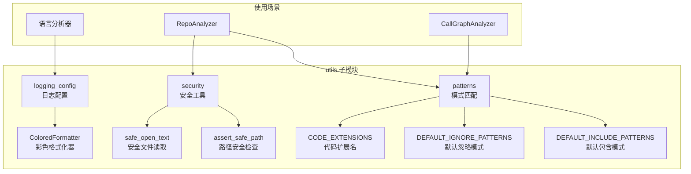

# be.dependency_analyzer.utils 子模块文档

## 概述

`be.dependency_analyzer.utils` 子模块提供了依赖分析器使用的各种工具函数和配置，包括日志系统、安全工具、文件模式匹配等。这些工具函数为分析器提供了稳定、安全、可配置的运行环境。

## 架构图



## 日志配置模块

### ColoredFormatter

**文件路径**: `codewiki/src/be/dependency_analyzer/utils/logging_config.py`

`ColoredFormatter` 是一个自定义的日志格式化器，为不同级别的日志消息添加颜色，提高可读性。

#### 颜色方案

| 日志级别 | 颜色 | 说明 |
|----------|------|------|
| DEBUG | 青色 (Cyan) | 调试信息，开发时使用 |
| INFO | 绿色 (Green) | 正常操作信息 |
| WARNING | 黄色 (Yellow) | 警告信息，需要关注 |
| ERROR | 红色 (Red) | 错误信息 |
| CRITICAL | 亮红色 (Bright Red) | 严重错误，需要立即处理 |

#### 组件颜色

- **时间戳**: 蓝色
- **模块名**: 品红色
- **重置**: 默认终端颜色

#### 使用示例

```python
import logging
from codewiki.src.be.dependency_analyzer.utils.logging_config import ColoredFormatter, setup_logging

# 设置全局日志
setup_logging(level=logging.INFO)

# 获取日志记录器
logger = logging.getLogger(__name__)

# 使用不同级别的日志
logger.debug("这是调试信息")
logger.info("这是正常信息") 
logger.warning("这是警告信息")
logger.error("这是错误信息")
logger.critical("这是严重错误信息")
```

输出效果：
```
[12:34:56] INFO     这是正常信息
[12:34:56] WARNING  这是警告信息
[12:34:56] ERROR    这是错误信息
[12:34:56] CRITICAL 这是严重错误信息
```

#### 模块特定日志配置

```python
from codewiki.src.be.dependency_analyzer.utils.logging_config import setup_module_logging

# 为特定模块配置日志
module_logger = setup_module_logging('codewiki.src.be.dependency_analyzer', level=logging.DEBUG)

# 使用模块日志记录器
module_logger.debug("模块调试信息")
module_logger.info("模块信息")
```

#### 自定义格式化器

```python
# 创建自定义格式化器
formatter = ColoredFormatter()

# 创建处理器
handler = logging.StreamHandler()
handler.setFormatter(formatter)

# 配置日志记录器
logger = logging.getLogger('my_logger')
logger.addHandler(handler)
logger.setLevel(logging.DEBUG)
```

## 安全工具模块

### 安全文件读取

**文件路径**: `codewiki/src/be/dependency_analyzer/utils/security.py`

#### safe_open_text 函数

安全地读取文本文件，处理各种编码问题和路径安全问题。

```python
def safe_open_text(base_path: Path, file_path: Path, encoding: str = "utf-8") -> str:
    """
    安全地读取文本文件
    
    Args:
        base_path: 基础路径，用于安全检查
        file_path: 要读取的文件路径
        encoding: 文件编码，默认为utf-8
        
    Returns:
        文件内容字符串
        
    Raises:
        ValueError: 如果路径不安全
        IOError: 如果文件读取失败
    """
```

#### 使用示例

```python
from pathlib import Path
from codewiki.src.be.dependency_analyzer.utils.security import safe_open_text

# 安全读取文件
base_path = Path("/path/to/repo")
file_path = Path("/path/to/repo/src/main.py")

try:
    content = safe_open_text(base_path, file_path)
    print(f"文件内容长度: {len(content)}")
except ValueError as e:
    print(f"路径安全检查失败: {e}")
except IOError as e:
    print(f"文件读取失败: {e}")
```

#### 编码处理

函数会自动处理多种编码：

1. **首选编码**: UTF-8
2. **备选编码**: Latin-1 (ISO-8859-1)
3. **最后尝试**: CP1252 (Windows-1252)

```python
# 处理不同编码的文件
files = [
    Path("utf8_file.py"),      # UTF-8编码
    Path("latin1_file.py"),    # Latin-1编码  
    Path("windows_file.py")    # Windows-1252编码
]

for file_path in files:
    try:
        content = safe_open_text(base_path, file_path)
        # 处理内容
    except Exception as e:
        logger.warning(f"无法读取文件 {file_path}: {e}")
```

### 路径安全检查

#### assert_safe_path 函数

验证文件路径是否在预期的基础路径内，防止目录遍历攻击。

```python
def assert_safe_path(base_path: Path, target_path: Path) -> bool:
    """
    验证目标路径是否在基础路径内
    
    Args:
        base_path: 基础路径
        target_path: 目标路径
        
    Returns:
        如果路径安全返回 True
        
    Raises:
        ValueError: 如果路径不安全
    """
```

#### 使用示例

```python
from pathlib import Path
from codewiki.src.be.dependency_analyzer.utils.security import assert_safe_path

# 基础路径
base_path = Path("/path/to/safe/directory")

# 安全的路径
try:
    safe_path = Path("/path/to/safe/directory/subdir/file.txt")
    assert_safe_path(base_path, safe_path)
    print("路径安全")
except ValueError as e:
    print(f"路径不安全: {e}")

# 不安全的路径（目录遍历）
try:
    unsafe_path = Path("/path/to/safe/directory/../../../etc/passwd")
    assert_safe_path(base_path, unsafe_path)
except ValueError as e:
    print(f"检测到路径遍历攻击: {e}")
```

#### 安全检查规则

1. **路径解析**: 解析所有符号链接和相对路径
2. **路径比较**: 确保目标路径是基础路径的子路径
3. **异常处理**: 处理路径解析过程中的各种异常

```python
# 复杂路径安全检查示例
test_cases = [
    ("/home/user/project", "/home/user/project/src/main.py"),      # 安全
    ("/home/user/project", "/home/user/project/../config.py"),     # 安全（解析后仍在基础路径内）
    ("/home/user/project", "/home/user/other/file.py"),            # 不安全
    ("/home/user/project", "/etc/passwd"),                          # 不安全
    ("/home/user/project", "../outside/file.py")                    # 不安全
]

for base, target in test_cases:
    try:
        assert_safe_path(Path(base), Path(target))
        print(f"✓ {target} 是安全的")
    except ValueError:
        print(f"✗ {target} 不安全")
```

## 模式匹配模块

**文件路径**: `codewiki/src/be/dependency_analyzer/utils/patterns.py`

### 代码文件扩展名

定义了支持的编程语言及其文件扩展名映射。

```python
CODE_EXTENSIONS = {
    # Python
    ".py": "python",
    ".pyx": "python",
    
    # JavaScript
    ".js": "javascript",
    ".jsx": "javascript", 
    ".mjs": "javascript",
    ".cjs": "javascript",
    
    # TypeScript
    ".ts": "typescript",
    ".tsx": "typescript",
    
    # Java
    ".java": "java",
    
    # C#
    ".cs": "csharp",
    
    # C/C++
    ".c": "c",
    ".h": "c",
    ".cpp": "cpp",
    ".cc": "cpp",
    ".cxx": "cpp",
    ".hpp": "cpp",
    ".hxx": "cpp"
}
```

#### 使用示例

```python
from codewiki.src.be.dependency_analyzer.utils.patterns import CODE_EXTENSIONS

def get_language_from_extension(file_path: str) -> str:
    """根据文件扩展名获取编程语言"""
    from pathlib import Path
    
    ext = Path(file_path).suffix.lower()
    return CODE_EXTENSIONS.get(ext, "unknown")

# 测试
print(get_language_from_extension("main.py"))        # python
print(get_language_from_extension("app.js"))         # javascript  
print(get_language_from_extension("service.ts"))     # typescript
print(get_language_from_extension("User.java"))      # java
print(get_language_from_extension("Program.cs"))     # csharp
```

### 默认忽略模式

定义了分析时默认要忽略的文件和目录模式。

```python
DEFAULT_IGNORE_PATTERNS = [
    # Python
    "*.pyc", "__pycache__", "*.pyo", "*.pyd", ".Python",
    "build", "develop-eggs", "dist", "downloads", "eggs",
    ".eggs", "lib", "lib64", "parts", "sdist", "var",
    "wheels", "*.egg-info", ".installed.cfg", "*.egg",
    
    # Node.js
    "node_modules", ".npm", ".npmignore", ".yarn",
    ".yarnignore", "package-lock.json", "yarn.lock",
    
    # Git
    ".git", ".gitignore", ".gitattributes",
    
    # IDE
    ".vscode", ".idea", "*.swp", "*.swo", "*~",
    
    # OS
    ".DS_Store", "Thumbs.db",
    
    # Python测试
    ".pytest_cache", ".mypy_cache", ".tox", ".coverage", "htmlcov",
    
    # 虚拟环境
    ".venv", "venv", "env", "ENV", "env.bak", "venv.bak"
]
```

#### 使用示例

```python
import fnmatch
from codewiki.src.be.dependency_analyzer.utils.patterns import DEFAULT_IGNORE_PATTERNS

def should_ignore_path(path: str) -> bool:
    """检查路径是否应该被忽略"""
    for pattern in DEFAULT_IGNORE_PATTERNS:
        if fnmatch.fnmatch(path, pattern):
            return True
    return False

# 测试
test_paths = [
    "src/main.py",              # 不忽略
    "__pycache__/module.pyc",   # 忽略
    "node_modules/package",     # 忽略
    ".git/config",              # 忽略
    "venv/bin/python",          # 忽略
    "src/utils.py"              # 不忽略
]

for path in test_paths:
    if should_ignore_path(path):
        print(f"忽略: {path}")
    else:
        print(f"保留: {path}")
```

### 默认包含模式

定义了分析时默认要包含的文件模式（如果没有指定包含模式，则包含所有文件）。

```python
DEFAULT_INCLUDE_PATTERNS = []  # 空列表表示包含所有文件
```

#### 自定义包含模式

```python
# 自定义包含模式
CUSTOM_INCLUDE_PATTERNS = [
    "*.py",                    # 只包含Python文件
    "src/**/*.js",             # 包含src目录下的JS文件
    "lib/*.ts",                # 包含lib目录下的TS文件
    "!test/**",                # 排除test目录
    "!**/*.test.js"            # 排除测试文件
]

def should_include_path(path: str, include_patterns: List[str]) -> bool:
    """检查路径是否应该被包含"""
    if not include_patterns:
        return True  # 如果没有指定包含模式，包含所有文件
    
    for pattern in include_patterns:
        if pattern.startswith("!"):
            # 排除模式
            if fnmatch.fnmatch(path, pattern[1:]):
                return False
        else:
            # 包含模式
            if fnmatch.fnmatch(path, pattern):
                return True
    
    return False  # 没有匹配任何包含模式
```

## 工具函数集成

### 综合使用示例

```python
import logging
from pathlib import Path
from codewiki.src.be.dependency_analyzer.utils.logging_config import setup_logging
from codewiki.src.be.dependency_analyzer.utils.security import safe_open_text, assert_safe_path
from codewiki.src.be.dependency_analyzer.utils.patterns import CODE_EXTENSIONS, DEFAULT_IGNORE_PATTERNS

# 设置日志
setup_logging(level=logging.INFO)
logger = logging.getLogger(__name__)

def analyze_file_safely(repo_path: str, file_path: str) -> dict:
    """安全地分析代码文件"""
    try:
        # 路径安全检查
        base_path = Path(repo_path)
        target_path = Path(file_path)
        
        assert_safe_path(base_path, target_path)
        
        # 检查是否应该忽略
        relative_path = target_path.relative_to(base_path)
        if any(fnmatch.fnmatch(str(relative_path), pattern) for pattern in DEFAULT_IGNORE_PATTERNS):
            logger.info(f"忽略文件: {relative_path}")
            return {"status": "ignored", "reason": "in ignore patterns"}
        
        # 获取文件语言
        language = CODE_EXTENSIONS.get(target_path.suffix.lower(), "unknown")
        if language == "unknown":
            logger.info(f"未知语言文件: {target_path.suffix}")
            return {"status": "skipped", "reason": "unknown language"}
        
        # 安全读取文件内容
        content = safe_open_text(base_path, target_path)
        
        logger.info(f"成功读取文件: {relative_path} ({language})")
        return {
            "status": "success",
            "language": language,
            "content_size": len(content),
            "content": content
        }
        
    except ValueError as e:
        logger.error(f"路径安全检查失败: {e}")
        return {"status": "error", "reason": str(e)}
    except IOError as e:
        logger.error(f"文件读取失败: {e}")
        return {"status": "error", "reason": str(e)}
    except Exception as e:
        logger.error(f"意外错误: {e}")
        return {"status": "error", "reason": str(e)}

# 使用示例
result = analyze_file_safely("/path/to/repo", "/path/to/repo/src/main.py")
print(result)
```

## 配置管理

### 环境变量配置

```python
import os
from codewiki.src.be.dependency_analyzer.utils.logging_config import setup_logging

def configure_from_environment():
    """从环境变量配置工具"""
    # 日志级别
    log_level = os.getenv('CODEWIKI_LOG_LEVEL', 'INFO').upper()
    setup_logging(level=getattr(logging, log_level))
    
    # 安全设置
    max_file_size = int(os.getenv('CODEWIKI_MAX_FILE_SIZE', '10')) * 1024 * 1024  # 10MB
    allowed_extensions = os.getenv('CODEWIKI_ALLOWED_EXTENSIONS', '').split(',')
    
    return {
        'log_level': log_level,
        'max_file_size': max_file_size,
        'allowed_extensions': [ext.strip() for ext in allowed_extensions if ext.strip()]
    }
```

### 配置文件支持

```python
import json
from pathlib import Path

def load_config_from_file(config_path: str) -> dict:
    """从配置文件加载设置"""
    config_file = Path(config_path)
    if not config_file.exists():
        return {}
    
    try:
        with open(config_file, 'r', encoding='utf-8') as f:
            config = json.load(f)
        return config
    except Exception as e:
        logger.error(f"配置文件加载失败: {e}")
        return {}

# 配置文件示例 (config.json)
{
    "logging": {
        "level": "DEBUG",
        "format": "colored"
    },
    "security": {
        "max_file_size": 10485760,
        "allowed_extensions": [".py", ".js", ".ts"],
        "ignore_patterns": ["__pycache__", "node_modules"]
    },
    "analysis": {
        "max_files": 1000,
        "timeout": 300
    }
}
```

## 性能优化

### 缓存机制

```python
import functools
from codewiki.src.be.dependency_analyzer.utils.patterns import CODE_EXTENSIONS

@functools.lru_cache(maxsize=128)
def get_language_from_extension_cached(extension: str) -> str:
    """缓存版本的扩展名到语言映射"""
    return CODE_EXTENSIONS.get(extension.lower(), "unknown")

# 使用缓存版本（更快）
language = get_language_from_extension_cached(".py")
```

### 批量处理

```python
from concurrent.futures import ThreadPoolExecutor
from codewiki.src.be.dependency_analyzer.utils.security import safe_open_text

def batch_read_files(base_path: Path, file_paths: List[Path], max_workers: int = 4) -> List[str]:
    """批量安全读取文件"""
    def read_file(file_path: Path) -> str:
        try:
            return safe_open_text(base_path, file_path)
        except Exception as e:
            logger.warning(f"文件读取失败 {file_path}: {e}")
            return ""
    
    with ThreadPoolExecutor(max_workers=max_workers) as executor:
        contents = list(executor.map(read_file, file_paths))
    
    return contents
```

## 错误处理和监控

### 错误分类

```python
from enum import Enum

class ErrorType(Enum):
    SECURITY_ERROR = "security"
    IO_ERROR = "io"
    PARSE_ERROR = "parse"
    VALIDATION_ERROR = "validation"
    UNKNOWN_ERROR = "unknown"

class AnalysisError:
    def __init__(self, error_type: ErrorType, message: str, file_path: str = None, line_number: int = None):
        self.error_type = error_type
        self.message = message
        self.file_path = file_path
        self.line_number = line_number
        self.timestamp = datetime.now()
    
    def to_dict(self) -> dict:
        return {
            "type": self.error_type.value,
            "message": self.message,
            "file": self.file_path,
            "line": self.line_number,
            "timestamp": self.timestamp.isoformat()
        }
```

### 错误收集和报告

```python
class ErrorCollector:
    """错误收集器，用于收集和报告分析过程中的错误"""
    
    def __init__(self):
        self.errors = []
        self.warnings = []
    
    def add_error(self, error: AnalysisError):
        """添加错误"""
        self.errors.append(error)
        logger.error(f"分析错误: {error.message}")
    
    def add_warning(self, warning: AnalysisError):
        """添加警告"""
        self.warnings.append(warning)
        logger.warning(f"分析警告: {warning.message}")
    
    def get_summary(self) -> dict:
        """获取错误摘要"""
        error_types = {}
        for error in self.errors:
            error_types[error.error_type.value] = error_types.get(error.error_type.value, 0) + 1
        
        return {
            "total_errors": len(self.errors),
            "total_warnings": len(self.warnings),
            "error_types": error_types,
            "files_affected": len(set(e.file_path for e in self.errors if e.file_path))
        }
    
    def generate_report(self) -> str:
        """生成错误报告"""
        summary = self.get_summary()
        report = ["=== 分析错误报告 ===", ""]
        report.append(f"总错误数: {summary['total_errors']}")
        report.append(f"总警告数: {summary['total_warnings']}")
        report.append(f"受影响文件: {summary['files_affected']}")
        report.append("")
        
        if self.errors:
            report.append("错误详情:")
            for error in self.errors:
                location = f"{error.file_path}:{error.line_number}" if error.file_path else "未知位置"
                report.append(f"  - {location}: {error.message}")
        
        return "\n".join(report)
```

## 测试工具

### 模拟数据生成

```python
import random
from codewiki.src.be.dependency_analyzer.models.core import Node, CallRelationship

def generate_test_nodes(count: int = 10) -> List[Node]:
    """生成测试节点"""
    nodes = []
    component_types = ["function", "class", "method", "interface"]
    
    for i in range(count):
        node = Node(
            id=f"test.module.function_{i}",
            name=f"function_{i}",
            component_type=random.choice(component_types),
            file_path=f"/test/module_{i % 3}.py",
            relative_path=f"module_{i % 3}.py",
            start_line=random.randint(1, 100),
            end_line=random.randint(10, 200),
            has_docstring=random.choice([True, False]),
            docstring="Test function" if random.choice([True, False]) else "",
            parameters=[f"param_{j}" for j in range(random.randint(0, 3))]
        )
        nodes.append(node)
    
    return nodes

def generate_test_relationships(nodes: List[Node]) -> List[CallRelationship]:
    """生成测试关系"""
    relationships = []
    
    for _ in range(len(nodes) * 2):  # 每个节点平均2个关系
        caller = random.choice(nodes).id
        callee = random.choice(nodes).id
        
        if caller != callee:  # 避免自调用
            rel = CallRelationship(
                caller=caller,
                callee=callee,
                call_line=random.randint(1, 100),
                is_resolved=random.choice([True, False])
            )
            relationships.append(rel)
    
    return relationships
```

### 性能测试

```python
import time
from codewiki.src.be.dependency_analyzer.utils.security import safe_open_text

def benchmark_file_operations(file_paths: List[Path], iterations: int = 100):
    """基准测试文件操作性能"""
    results = []
    
    for file_path in file_paths:
        times = []
        
        for _ in range(iterations):
            start_time = time.time()
            try:
                content = safe_open_text(file_path.parent, file_path)
                end_time = time.time()
                times.append(end_time - start_time)
            except Exception as e:
                logger.warning(f"文件读取失败: {e}")
                continue
        
        if times:
            avg_time = sum(times) / len(times)
            results.append({
                "file": str(file_path),
                "avg_time": avg_time,
                "min_time": min(times),
                "max_time": max(times),
                "iterations": len(times)
            })
    
    return results
```

## 相关文档

- [分析服务子模块](be.dependency_analyzer.analysis.md) - 工具函数的使用场景
- [语言分析器子模块](be.dependency_analyzer.analyzers.md) - 安全工具在分析器中的应用
- [数据模型子模块](be.dependency_analyzer.models.md) - 数据验证和模型相关工具