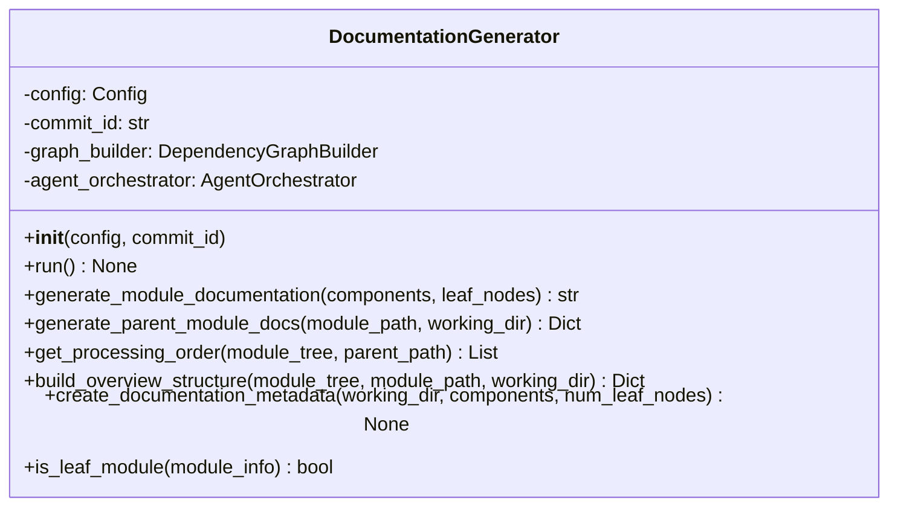
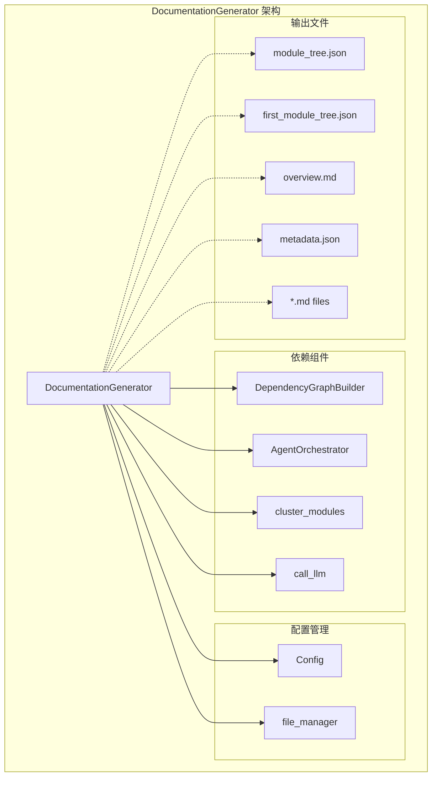
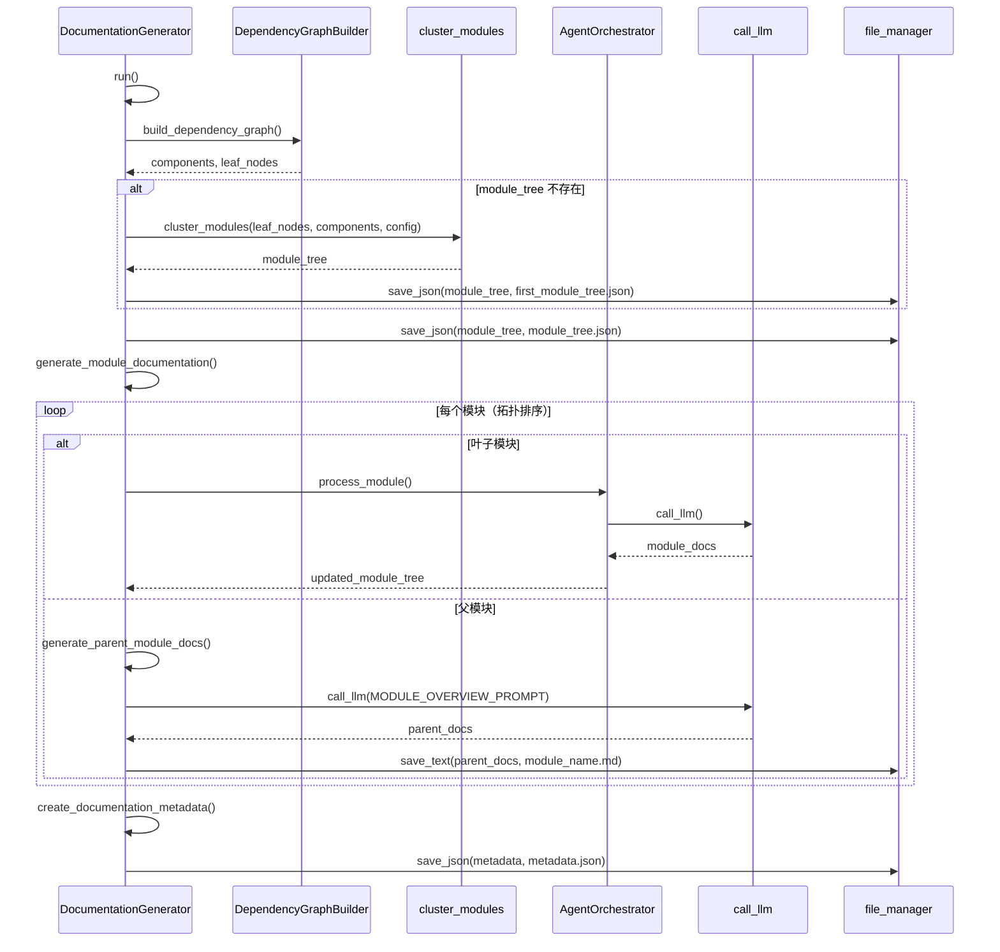
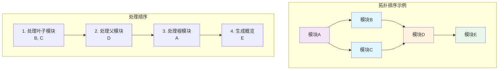
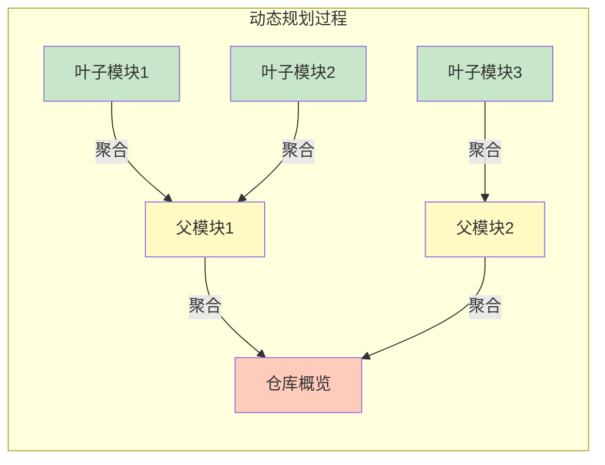

# be.documentation_generator 模块文档

## 简介

`be.documentation_generator` 模块是 CodeWiki 系统的核心文档生成引擎，负责自动化生成代码仓库的完整文档。该模块采用动态规划方法，通过智能的依赖分析和模块聚类，实现从底层组件到高层模块的渐进式文档生成。

## 核心功能

### 1. 智能文档生成
- **动态规划处理**：采用自底向上的方法，先处理叶子模块，再处理父模块
- **依赖感知**：基于代码依赖关系确定最优处理顺序
- **上下文优化**：智能判断模块大小，决定单独处理或整体处理

### 2. 模块聚类与组织
- **自动聚类**：将代码组件智能分组为逻辑模块
- **层次结构**：构建清晰的模块树结构
- **拓扑排序**：确保依赖关系正确的处理顺序

### 3. 多层级文档生成
- **组件级文档**：为单个代码组件生成详细文档
- **模块级文档**：基于子模块文档生成父模块概述
- **仓库级概览**：生成整个仓库的高层概览

## 架构设计

### 核心组件



### 系统架构



## 数据流与处理流程

### 文档生成流程



### 模块处理顺序



## 关键算法

### 1. 拓扑排序算法

```python
def get_processing_order(self, module_tree: Dict[str, Any], parent_path: List[str] = []) -> List[tuple[List[str], str]]:
    """使用拓扑排序获取处理顺序（叶子模块优先）"""
    processing_order = []
    
    def collect_modules(tree: Dict[str, Any], path: List[str]):
        for module_name, module_info in tree.items():
            current_path = path + [module_name]
            
            # 如果该模块有子模块，先处理子模块
            if module_info.get("children") and isinstance(module_info["children"], dict) and module_info["children"]:
                collect_modules(module_info["children"], current_path)
                # 在处理完子模块后添加父模块
                processing_order.append((current_path, module_name))
            else:
                # 这是叶子模块，立即添加
                processing_order.append((current_path, module_name))
    
    collect_modules(module_tree, parent_path)
    return processing_order
```

### 2. 动态规划文档生成



## 配置与依赖

### 配置依赖
- **Config**: 系统配置管理，包含模型设置、路径配置等
- **file_manager**: 文件系统操作工具

### 外部依赖
- **DependencyGraphBuilder**: [be.dependency_analyzer](be.dependency_analyzer.md) 模块，负责构建代码依赖图
- **AgentOrchestrator**: [be.agent_orchestrator](be.agent_orchestrator.md) 模块，协调文档生成代理
- **cluster_modules**: 模块聚类算法
- **call_llm**: LLM 服务调用

### 输出文件结构

```
docs/
├── metadata.json          # 文档生成元数据
├── module_tree.json       # 完整模块树
├── first_module_tree.json # 初始模块树
├── overview.md           # 仓库概览
├── module1.md            # 模块文档
├── module2.md
└── ...
```

## 使用示例

### 基本使用

```python
from codewiki.src.be.documentation_generator import DocumentationGenerator
from codewiki.src.config import Config

# 创建配置
config = Config(
    repo_path="/path/to/repo",
    docs_dir="/path/to/docs",
    main_model="gpt-4"
)

# 初始化生成器
generator = DocumentationGenerator(config, commit_id="abc123")

# 运行文档生成
await generator.run()
```

### 处理流程控制

生成器会自动：
1. 构建依赖图并识别叶子节点
2. 聚类模块并创建模块树
3. 按拓扑顺序处理每个模块
4. 生成父模块文档和仓库概览
5. 创建元数据文件

## 性能优化

### 智能处理策略
- **上下文判断**: 自动判断模块是否适合一次性处理
- **缓存机制**: 复用已存在的模块树文件
- **并行处理**: 支持独立模块的并行生成

### 错误处理
- **模块级容错**: 单个模块失败不影响整体流程
- **详细日志**: 记录每个处理步骤的详细信息
- **异常恢复**: 支持从中间状态重新开始

## 相关模块

- **[be.dependency_analyzer](be.dependency_analyzer.md)**: 提供代码依赖分析功能
- **[be.agent_orchestrator](be.agent_orchestrator.md)**: 协调文档生成代理
- **[be.llm_services](be.llm_services.md)**: LLM 服务调用
- **[be.prompt_template](be.prompt_template.md)**: 提示模板管理

## 总结

`be.documentation_generator` 模块通过智能的算法设计和精心的架构规划，实现了高效、准确的代码文档自动生成。其动态规划方法和拓扑排序算法确保了文档生成的质量和一致性，是 CodeWiki 系统的核心引擎。