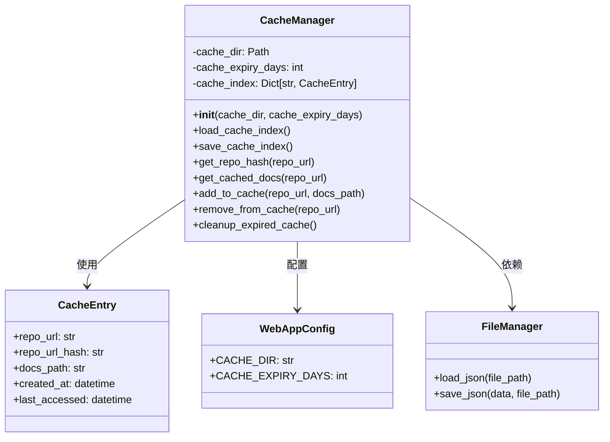
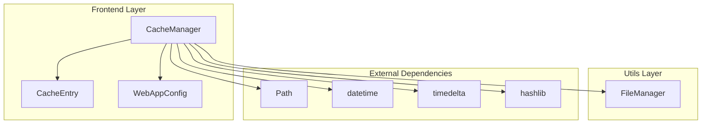
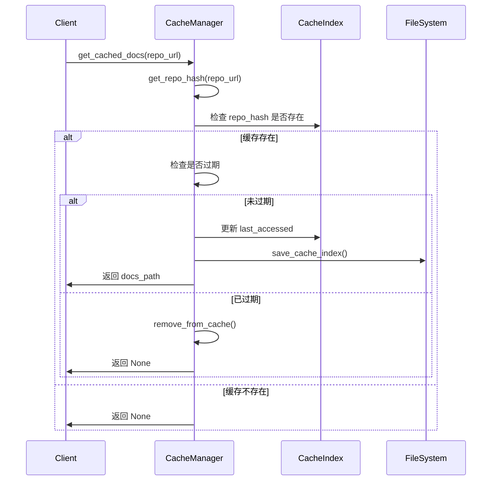
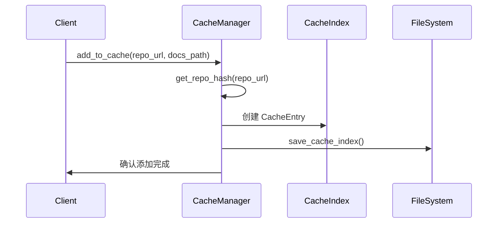

# Cache Manager 模块文档

## 简介

Cache Manager 模块是 CodeWiki 系统前端的重要组成部分，负责管理文档生成结果的缓存。该模块通过缓存已处理的仓库文档，显著提高了系统性能，避免了重复处理相同的 GitHub 仓库，从而优化了用户体验和系统资源利用率。

## 核心功能

Cache Manager 提供以下核心功能：

1. **文档缓存管理**：缓存已生成的文档结果，避免重复处理
2. **缓存索引维护**：维护内存和磁盘上的缓存索引，支持快速查找
3. **缓存过期处理**：自动清理过期缓存，确保数据新鲜度
4. **缓存命中率优化**：通过哈希算法快速定位缓存项

## 架构设计

### 组件结构



### 系统依赖关系



## 数据流图

### 缓存查询流程



### 缓存添加流程



## 核心组件详解

### CacheManager 类

`CacheManager` 是模块的核心类，负责管理整个缓存系统：

#### 初始化参数
- `cache_dir`: 缓存目录路径（可选，默认使用 WebAppConfig.CACHE_DIR）
- `cache_expiry_days`: 缓存过期天数（可选，默认使用 WebAppConfig.CACHE_EXPIRY_DAYS）

#### 关键方法

1. **get_cached_docs(repo_url: str) -> Optional[str]**
   - 根据仓库 URL 查询缓存的文档路径
   - 自动处理缓存过期和访问时间更新
   - 返回文档路径或 None（如果缓存不存在或已过期）

2. **add_to_cache(repo_url: str, docs_path: str)**
   - 将新生成的文档添加到缓存
   - 创建对应的 CacheEntry 并更新索引

3. **cleanup_expired_cache()**
   - 清理所有过期的缓存条目
   - 定期调用以维护缓存健康状态

4. **get_repo_hash(repo_url: str) -> str**
   - 使用 SHA-256 算法生成仓库 URL 的哈希值
   - 取前 16 个字符作为缓存键

### 缓存索引管理

缓存索引采用 JSON 文件持久化存储，包含以下信息：
- 仓库 URL
- 仓库哈希值
- 文档路径
- 创建时间
- 最后访问时间

索引文件路径：`{cache_dir}/cache_index.json`

## 配置集成

Cache Manager 通过 [WebAppConfig](fe.config.md) 获取默认配置：
- `CACHE_DIR`: 缓存根目录
- `CACHE_EXPIRY_DAYS`: 默认缓存过期天数

## 使用场景

### 典型使用流程

1. **文档请求处理**：
   ```python
   # 检查缓存
   cached_path = cache_manager.get_cached_docs(repo_url)
   if cached_path:
       return cached_path  # 直接返回缓存结果
   
   # 生成新文档
   docs_path = generate_documentation(repo_url)
   
   # 添加到缓存
   cache_manager.add_to_cache(repo_url, docs_path)
   return docs_path
   ```

2. **定期维护**：
   ```python
   # 清理过期缓存
   cache_manager.cleanup_expired_cache()
   ```

## 性能优化

1. **内存缓存**：索引加载到内存，避免频繁磁盘 I/O
2. **哈希索引**：使用 SHA-256 哈希快速定位缓存项
3. **延迟保存**：索引修改后统一保存，减少写操作
4. **过期自动清理**：访问时检查过期，避免无效缓存占用空间

## 错误处理

模块实现了健壮的错误处理机制：
- 索引文件损坏时自动重新创建
- I/O 操作失败时记录错误信息
- 异常情况不会中断主流程

## 相关模块

- [fe.models](fe.models.md)：提供 CacheEntry 数据模型
- [fe.config](fe.config.md)：提供缓存配置
- [utils](utils.md)：提供文件操作工具
- [fe.github_processor](fe.github_processor.md)：使用缓存管理器优化仓库处理

## 扩展性

Cache Manager 设计具有良好的扩展性：
- 支持自定义缓存目录和过期时间
- 易于添加新的缓存策略
- 可扩展支持分布式缓存
- 支持缓存统计和监控