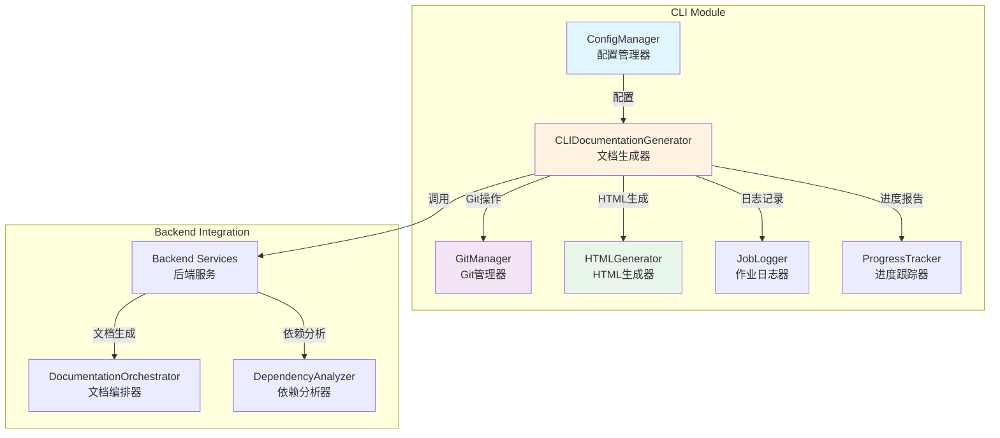
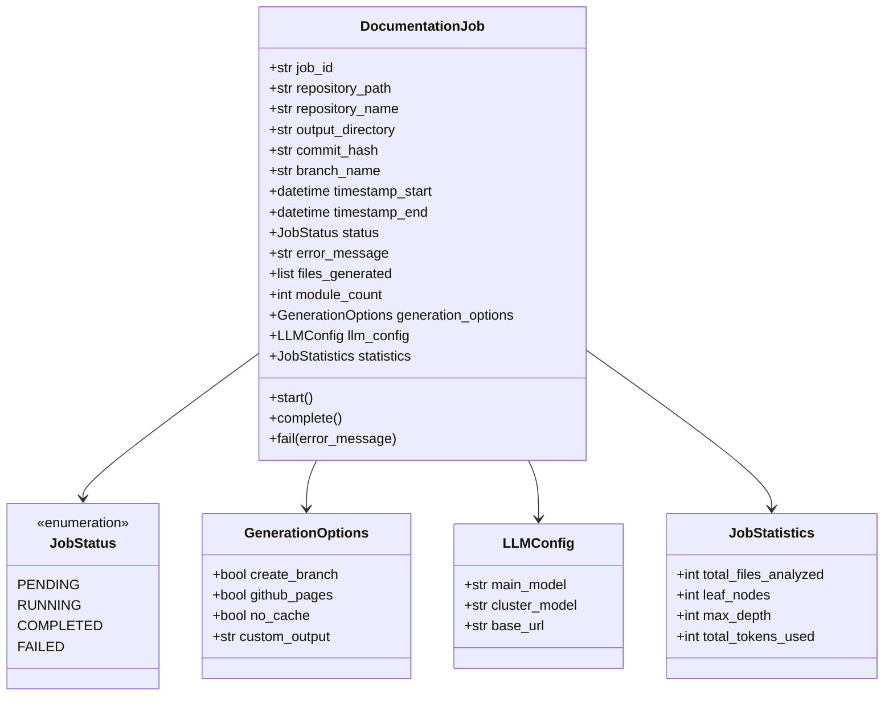

# CLI 模块文档

## 概述

CLI（命令行界面）模块是 CodeWiki 系统的前端接口，为用户提供完整的文档生成工具链。该模块封装了复杂的后端处理逻辑，通过直观的命令行界面使开发者能够轻松地为代码仓库生成高质量的技术文档。

## 核心功能

- **配置管理**：安全的凭证存储和配置持久化
- **文档生成**：集成后端文档生成器，提供进度跟踪
- **Git 集成**：分支管理和文档提交
- **HTML 输出**：生成适用于 GitHub Pages 的静态文档站点
- **进度可视化**：详细的进度跟踪和状态报告

## 架构概览



## 组件详解

### 1. 配置管理 (ConfigManager)

负责管理用户配置和 API 凭证的安全存储：

- **安全存储**：使用系统密钥链（macOS Keychain、Windows Credential Manager、Linux Secret Service）存储 API 密钥
- **配置持久化**：将非敏感配置存储在 `~/.codewiki/config.json`
- **配置验证**：验证 URL 格式、模型名称和 API 密钥有效性

### 2. 文档生成器 (CLIDocumentationGenerator)

CLI 的核心组件，协调整个文档生成流程：

- **五阶段处理**：
  1. 依赖分析（40% 时间权重）
  2. 模块聚类（20% 时间权重）
  3. 文档生成（30% 时间权重）
  4. HTML 生成（5% 时间权重，可选）
  5. 完成处理（5% 时间权重）

- **进度跟踪**：实时显示处理进度和预计完成时间
- **错误处理**：统一的错误处理和状态报告

### 3. Git 管理器 (GitManager)

处理与 Git 仓库的交互：

- **分支管理**：自动创建带时间戳的文档分支
- **状态检查**：验证工作目录是否干净
- **提交管理**：自动提交生成的文档
- **远程检测**：获取 GitHub 仓库信息和 PR 链接

### 4. HTML 生成器 (HTMLGenerator)

生成适用于 GitHub Pages 的静态文档站点：

- **自包含页面**：所有样式和脚本都嵌入在单个 HTML 文件中
- **模块树导航**：基于生成的模块结构创建交互式导航
- **元数据显示**：展示生成统计信息和仓库详情
- **响应式设计**：适配各种设备屏幕

## 数据模型

### 作业模型 (DocumentationJob)

完整记录文档生成作业的生命周期：



## 使用流程

### 1. 初始化配置

```bash
# 首次使用需要配置 API 密钥和模型信息
codewiki config set --api-key YOUR_API_KEY --base-url https://api.openai.com/v1 --main-model gpt-4 --cluster-model gpt-3.5-turbo
```

### 2. 生成文档

```bash
# 基本用法
codewiki generate /path/to/repo

# 创建文档分支并生成 HTML
codewiki generate /path/to/repo --create-branch --github-pages

# 自定义输出目录
codewiki generate /path/to/repo --output ./my-docs
```

### 3. 进度跟踪

CLI 提供两种进度显示模式：

- **标准模式**：简洁的单行进度条
- **详细模式**：完整的多阶段进度报告，包含每个阶段的详细信息和预计完成时间

## 错误处理

CLI 模块实现了完整的错误处理机制：

- **配置错误**：验证失败时提供清晰的错误信息
- **仓库错误**：处理 Git 操作失败的情况
- **API 错误**：LLM 服务调用失败的优雅处理
- **文件系统错误**：权限问题和路径错误的处理

## 安全考虑

- **凭证安全**：API 密钥从不存储在配置文件中，仅保存在系统密钥链
- **路径验证**：所有文件路径都经过验证，防止路径遍历攻击
- **错误信息**：敏感信息不会出现在错误消息中

## 相关文档

### 核心组件文档
- [配置管理器](config_manager.md) - 详细的配置管理文档，包含安全凭证存储和配置验证
- [文档生成器](doc_generator.md) - 文档生成流程详解，五阶段处理管道
- [Git 管理器](git_manager.md) - Git 操作和分支管理，自动化文档分支创建
- [HTML 生成器](html_generator.md) - 静态站点生成，GitHub Pages 优化
- [进度跟踪](progress.md) - 进度显示和 ETA 计算，多阶段进度可视化

### 数据模型文档
- [CLI 数据模型](cli_models.md) - 配置、作业和统计模型的完整说明

## 集成接口

CLI 模块通过以下方式与后端服务集成：

1. **配置转换**：将 CLI 配置转换为后端配置格式
2. **服务调用**：直接调用后端文档生成器
3. **进度回调**：通过进度跟踪器获取实时状态
4. **结果处理**：将后端输出转换为 CLI 友好的格式

这种设计确保了 CLI 的简洁性，同时充分利用了后端服务的强大功能。