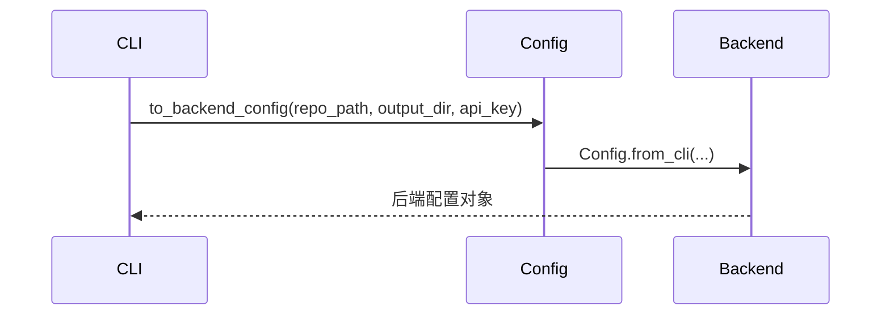
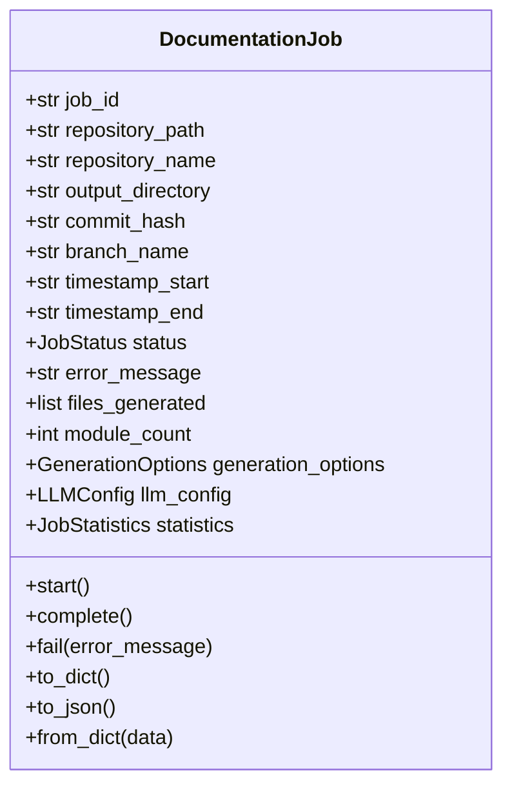
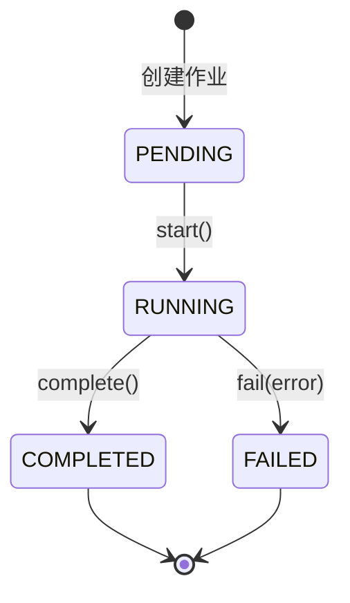

# CLI 数据模型文档

## 概述

CLI 模块使用一系列数据模型来管理配置、作业状态和生成选项。这些模型提供了类型安全的数据结构，确保配置的一致性和作业的可追踪性。

## 配置模型

### Configuration 类

```python
@dataclass
class Configuration:
    base_url: str              # LLM API 基础 URL
    main_model: str            # 主文档生成模型
    cluster_model: str         # 模块聚类模型
    default_output: str = "docs" # 默认输出目录
```

**职责**：
- 管理用户持久化配置
- 提供配置验证机制
- 桥接 CLI 配置和后端配置

**验证规则**：
- `base_url`：必须是有效的 HTTP/HTTPS URL
- `main_model` 和 `cluster_model`：必须符合模型命名规范
- 所有字段都必须为非空字符串（`default_output` 除外）

**配置转换**：


## 作业模型

### DocumentationJob 类

完整记录文档生成作业的生命周期和状态信息。



**作业状态流转**：



**作业统计信息**：
- `total_files_analyzed`：分析的文件总数
- `leaf_nodes`：叶节点数量（独立模块）
- `max_depth`：依赖图最大深度
- `total_tokens_used`：使用的 LLM token 总数

### 生成选项

```python
@dataclass
class GenerationOptions:
    create_branch: bool = False      # 是否创建文档分支
    github_pages: bool = False       # 是否生成 GitHub Pages
    no_cache: bool = False           # 是否禁用缓存
    custom_output: Optional[str] = None  # 自定义输出目录
```

## LLM 配置

### LLMConfig 类

```python
@dataclass
class LLMConfig:
    main_model: str      # 主生成模型
    cluster_model: str   # 聚类模型
    base_url: str        # API 基础 URL
```

**模型选择策略**：
- **主模型**：用于生成详细的模块文档，需要较强的理解和生成能力
- **聚类模型**：用于模块聚类分析，可以使用较轻量的模型

## 作业状态管理

### JobStatus 枚举

```python
class JobStatus(str, Enum):
    PENDING = "pending"      # 等待开始
    RUNNING = "running"      # 正在执行
    COMPLETED = "completed"  # 成功完成
    FAILED = "failed"        # 执行失败
```

**状态转换规则**：

| 当前状态 | 允许操作 | 新状态 |
|---------|---------|--------|
| PENDING | start() | RUNNING |
| RUNNING | complete() | COMPLETED |
| RUNNING | fail(error) | FAILED |
| COMPLETED | - | 终态 |
| FAILED | - | 终态 |

## 数据持久化

### JSON 序列化

所有模型都支持完整的 JSON 序列化和反序列化：

```python
# 序列化
job_dict = job.to_dict()
job_json = job.to_json()

# 反序列化
job = DocumentationJob.from_dict(job_dict)
```

**序列化格式示例**：

```json
{
  "job_id": "550e8400-e29b-41d4-a716-446655440000",
  "repository_path": "/path/to/repo",
  "repository_name": "my-project",
  "output_directory": "/path/to/docs",
  "commit_hash": "abc123def456",
  "branch_name": "docs/codewiki-20240101-120000",
  "timestamp_start": "2024-01-01T12:00:00",
  "timestamp_end": "2024-01-01T12:05:30",
  "status": "completed",
  "error_message": null,
  "files_generated": ["module1.md", "module2.md", "index.html"],
  "module_count": 15,
  "generation_options": {
    "create_branch": true,
    "github_pages": true,
    "no_cache": false,
    "custom_output": null
  },
  "llm_config": {
    "main_model": "gpt-4",
    "cluster_model": "gpt-3.5-turbo",
    "base_url": "https://api.openai.com/v1"
  },
  "statistics": {
    "total_files_analyzed": 127,
    "leaf_nodes": 23,
    "max_depth": 5,
    "total_tokens_used": 45678
  }
}
```

## 错误处理

### 验证错误

配置验证失败时会抛出 `ConfigurationError`：

```python
# URL 验证失败
ConfigurationError: Invalid URL format: 'invalid-url'

# 模型名称验证失败  
ConfigurationError: Invalid model name: 'gpt-4-invalid'
```

### 作业错误

作业执行失败时会记录详细的错误信息：

```python
job.fail("Dependency analysis failed: Unable to parse Python file")
```

错误信息包含：
- 错误类型和描述
- 失败时的上下文信息
- 建议的解决方案

## 性能考虑

### 内存管理

- 大型仓库的作业信息会被及时序列化到磁盘
- 统计数据采用增量更新方式
- 文件列表使用生成器避免内存溢出

### 时间戳处理

- 使用 ISO 8601 格式确保跨平台兼容性
- 时区信息自动包含在序列化中
- 支持毫秒级精度的时间测量

## 扩展性

### 自定义统计字段

`JobStatistics` 类可以轻松扩展新的统计维度：

```python
@dataclass
class JobStatistics:
    total_files_analyzed: int = 0
    leaf_nodes: int = 0
    max_depth: int = 0
    total_tokens_used: int = 0
    # 新增字段
    processing_time_seconds: float = 0.0
    cache_hit_ratio: float = 0.0
```

### 插件化生成选项

`GenerationOptions` 支持添加新的生成模式：

```python
@dataclass
class GenerationOptions:
    create_branch: bool = False
    github_pages: bool = False
    no_cache: bool = False
    custom_output: Optional[str] = None
    # 新增选项
    include_tests: bool = False
    generate_diagrams: bool = True
```

## 相关文档

- [CLI 主文档](cli.md) - CLI 模块整体架构
- [配置管理器](config_manager.md) - 配置持久化详细说明
- [作业管理](doc_generator.md) - 作业执行流程