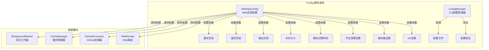
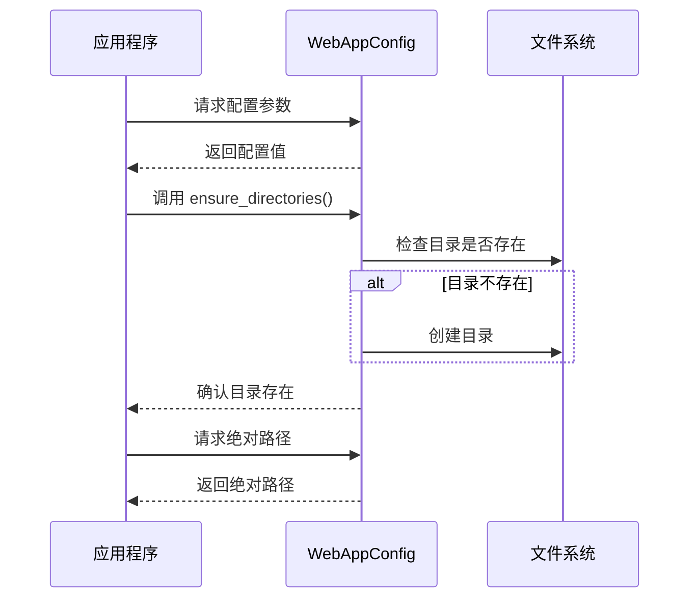
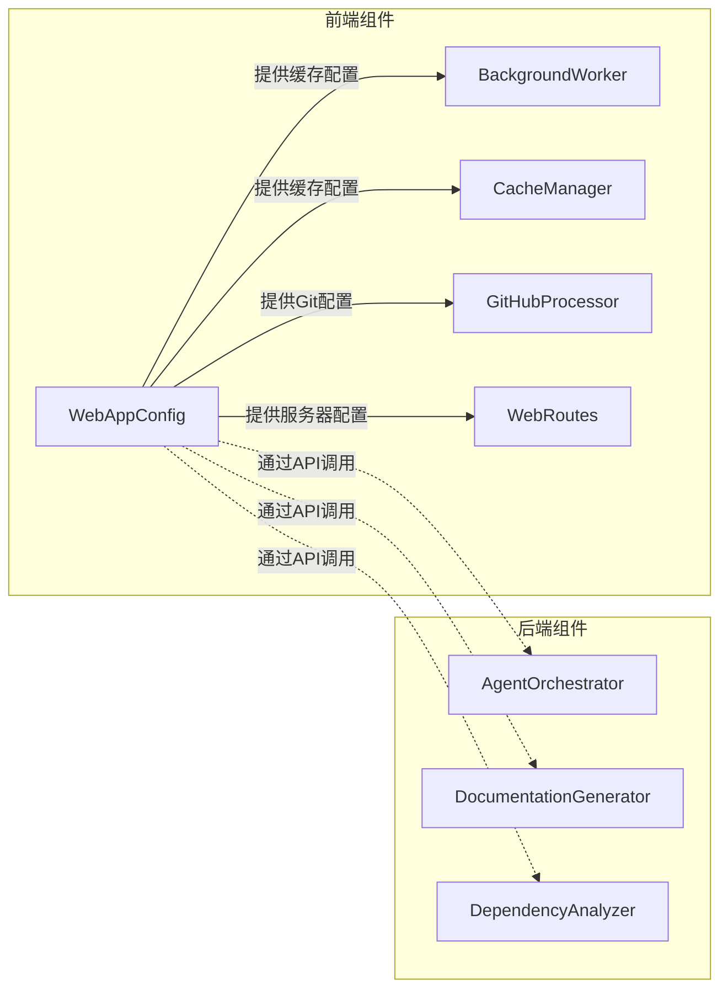
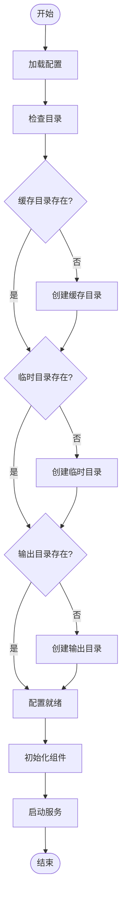

# Config 模块文档

## 简介

Config 模块是 CodeWiki 系统的核心配置管理组件，负责管理整个应用程序的配置设置。该模块提供了统一的配置接口，确保系统的各个组件能够协调一致地工作。

Config 模块包含两个主要的配置子系统：
- **CLI 配置管理器** ([cli.config_manager](cli.config_manager.md))：处理命令行界面的配置
- **Web 应用配置** (WebAppConfig)：管理 Web 应用程序的配置设置

## 架构概览



## 核心组件

### WebAppConfig 类

`WebAppConfig` 是 Web 应用程序的主要配置类，提供了系统运行所需的所有配置参数。

#### 主要配置项

| 配置类别 | 配置项 | 默认值 | 说明 |
|---------|--------|--------|------|
| 目录设置 | CACHE_DIR | "./output/cache" | 缓存文件存储目录 |
| 目录设置 | TEMP_DIR | "./output/temp" | 临时文件存储目录 |
| 目录设置 | OUTPUT_DIR | "./output" | 输出文件主目录 |
| 队列设置 | QUEUE_SIZE | 100 | 作业队列最大容量 |
| 缓存设置 | CACHE_EXPIRY_DAYS | 365 | 缓存过期时间（天） |
| 作业清理 | JOB_CLEANUP_HOURS | 24000 | 作业清理间隔（小时） |
| 作业清理 | RETRY_COOLDOWN_MINUTES | 3 | 重试冷却时间（分钟） |
| 服务器设置 | DEFAULT_HOST | "127.0.0.1" | 默认服务器主机地址 |
| 服务器设置 | DEFAULT_PORT | 8000 | 默认服务器端口 |
| Git设置 | CLONE_TIMEOUT | 300 | Git 克隆超时时间（秒） |
| Git设置 | CLONE_DEPTH | 1 | Git 克隆深度 |

#### 核心方法

##### ensure_directories()
确保所有必需的目录存在，如果不存在则创建它们。

```python
@classmethod
def ensure_directories(cls):
    """确保所有必需的目录存在。"""
```

##### get_absolute_path(path: str) -> str
将相对路径转换为绝对路径。

```python
@classmethod
def get_absolute_path(cls, path: str) -> str:
    """获取给定相对路径的绝对路径。"""
```

## 数据流



## 组件交互



## 配置管理流程



## 相关模块

- [cli.config_manager](cli.config_manager.md) - CLI 配置管理器
- [fe.background_worker](fe.background_worker.md) - 后台工作器
- [fe.cache_manager](fe.cache_manager.md) - 缓存管理器
- [fe.github_processor](fe.github_processor.md) - GitHub 处理器
- [fe.routes](fe.routes.md) - Web 路由

## 使用示例

```python
from codewiki.src.fe.config import WebAppConfig

# 确保所有目录存在
WebAppConfig.ensure_directories()

# 获取配置值
cache_dir = WebAppConfig.CACHE_DIR
queue_size = WebAppConfig.QUEUE_SIZE

# 获取绝对路径
abs_path = WebAppConfig.get_absolute_path("./relative/path")
```

## 注意事项

1. **目录权限**：确保应用程序有权限创建和访问配置的目录
2. **路径格式**：使用 `get_absolute_path()` 方法处理相对路径，确保跨平台兼容性
3. **配置一致性**：修改配置值时，确保相关组件能够正确识别新的配置
4. **缓存管理**：合理设置 `CACHE_EXPIRY_DAYS`，避免缓存无限增长
5. **队列大小**：根据系统资源调整 `QUEUE_SIZE`，避免内存溢出