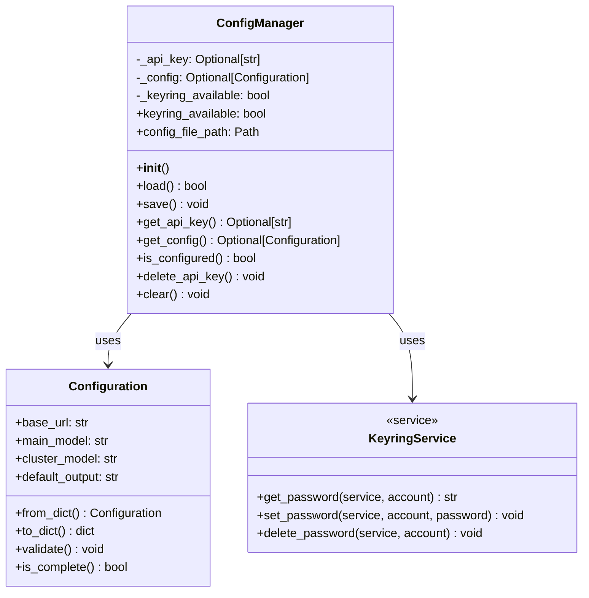
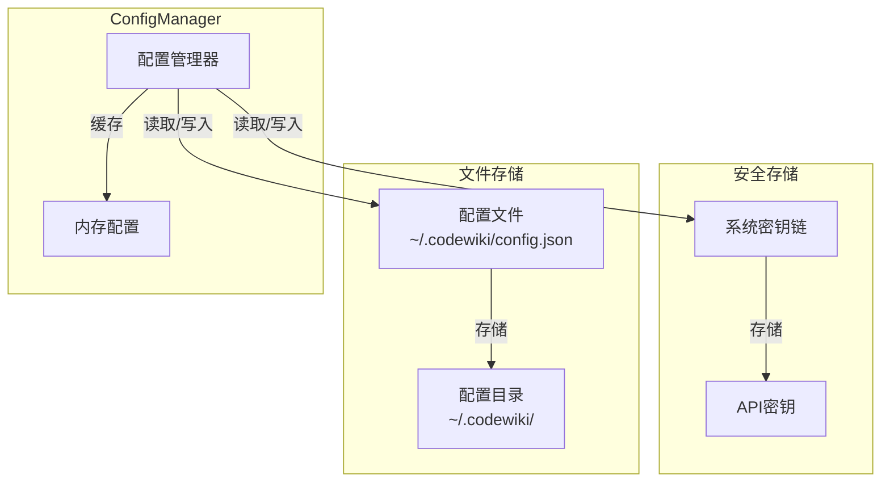
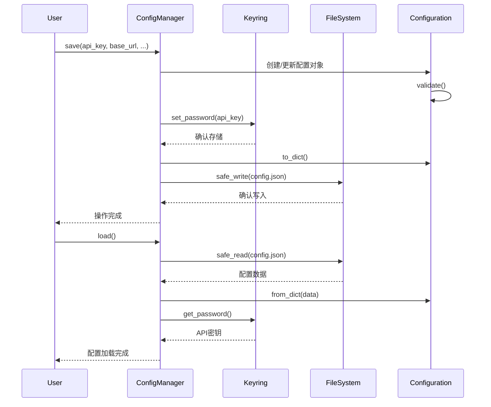
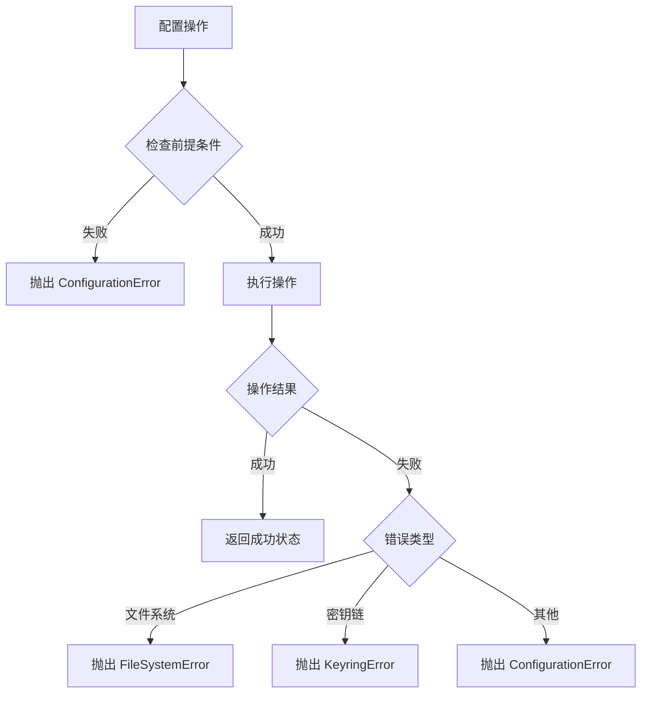

# ConfigManager 模块文档

## 简介

ConfigManager 模块是 CodeWiki CLI 工具的配置管理核心组件，负责管理应用程序的配置设置和安全存储 API 密钥。该模块通过系统密钥链（macOS Keychain、Windows Credential Manager、Linux Secret Service）提供安全的凭据存储，同时管理其他非敏感配置项。

## 核心功能

- **安全凭据管理**：使用系统密钥链安全存储 API 密钥
- **配置文件管理**：管理 JSON 格式的配置文件
- **配置验证**：确保配置项的完整性和有效性
- **版本控制**：支持配置版本管理和迁移
- **错误处理**：提供详细的配置错误信息和处理机制

## 架构设计

### 组件结构



### 数据存储架构



### 配置流程



## 组件详解

### ConfigManager 类

ConfigManager 是模块的核心类，提供配置管理的完整功能：

#### 主要属性

- `_api_key`: 缓存的 API 密钥
- `_config`: Configuration 对象实例
- `_keyring_available`: 系统密钥链可用性状态

#### 核心方法

##### `load()` - 配置加载
从配置文件和密钥链加载配置信息，支持版本验证和错误处理。

##### `save()` - 配置保存
将配置信息保存到文件系统和密钥链，包含完整的验证和错误处理机制。

##### `is_configured()` - 配置状态检查
验证配置是否完整，包括 API 密钥的存在性和配置项的有效性。

### 安全配置管理

#### 密钥链集成

ConfigManager 使用 Python 的 keyring 库与系统密钥链集成：

- **macOS**: Keychain
- **Windows**: Credential Manager  
- **Linux**: Secret Service

#### 安全最佳实践

1. **敏感数据分离**：API 密钥存储在系统密钥链，其他配置存储在文件
2. **错误处理**：密钥链不可用时提供明确的错误信息
3. **权限控制**：依赖系统密钥链的权限管理机制

## 错误处理

### 配置错误类型

- **ConfigurationError**: 配置相关的通用错误
- **FileSystemError**: 文件系统操作错误
- **KeyringError**: 密钥链访问错误

### 错误处理策略



## 依赖关系

### 内部依赖

- **[models.config](models.md)**: Configuration 数据模型定义
- **[utils.errors](utils.md)**: 错误类型定义
- **[utils.fs](utils.md)**: 文件系统工具函数

### 外部依赖

- **keyring**: 系统密钥链访问
- **pathlib**: 路径操作
- **json**: JSON 数据处理

## 使用示例

### 基本配置管理

```python
from codewiki.cli.config_manager import ConfigManager

# 初始化配置管理器
config_manager = ConfigManager()

# 保存配置
config_manager.save(
    api_key="your-api-key",
    base_url="https://api.example.com",
    main_model="gpt-4",
    cluster_model="text-embedding-3-small",
    default_output="./docs"
)

# 加载配置
if config_manager.load():
    config = config_manager.get_config()
    api_key = config_manager.get_api_key()
    print(f"Base URL: {config.base_url}")
    print(f"API Key available: {api_key is not None}")
```

### 配置验证

```python
# 检查配置是否完整
if config_manager.is_configured():
    print("配置已完成")
else:
    print("配置不完整，需要补充")
```

### 安全配置清除

```python
# 清除所有配置（包括密钥链中的 API 密钥）
config_manager.clear()
```

## 集成指南

### 与其他模块的集成

ConfigManager 作为配置管理的核心，被多个模块使用：

- **[doc_generator](doc_generator.md)**: 获取 LLM 配置信息
- **[be.config](be_config.md)**: 后端配置管理
- **[fe.config](fe_config.md)**: 前端配置管理

### 配置项说明

| 配置项 | 类型 | 存储位置 | 说明 |
|--------|------|----------|------|
| api_key | string | 系统密钥链 | LLM API 访问密钥 |
| base_url | string | 配置文件 | LLM API 基础 URL |
| main_model | string | 配置文件 | 主模型名称 |
| cluster_model | string | 配置文件 | 聚类模型名称 |
| default_output | string | 配置文件 | 默认输出目录 |

## 故障排除

### 常见问题

#### 密钥链不可用

**症状**: 保存 API 密钥时抛出 KeyringError

**解决方案**:
1. 确保系统密钥链服务正在运行
2. 检查密钥链访问权限
3. 在 Linux 上确保 Secret Service 已正确配置

#### 配置文件权限问题

**症状**: 无法创建或写入配置文件

**解决方案**:
1. 检查 ~/.codewiki 目录的权限
2. 确保用户有主目录的写入权限
3. 检查磁盘空间是否充足

#### 配置版本不匹配

**症状**: 加载配置时版本验证失败

**解决方案**:
1. 备份现有配置
2. 清除旧配置
3. 重新创建新版本的配置

### 调试信息

ConfigManager 提供以下调试信息：

- `keyring_available`: 密钥链可用性状态
- `config_file_path`: 配置文件路径
- 详细的错误信息和异常堆栈

## 性能考虑

### 优化策略

1. **内存缓存**: 配置加载后缓存在内存中，避免重复读取
2. **延迟加载**: API 密钥按需从密钥链读取
3. **批量操作**: 支持一次性保存多个配置项

### 资源管理

- 配置文件大小限制：建议不超过 1MB
- 密钥链操作：系统密钥链的性能取决于操作系统
- 内存使用：配置对象常驻内存，占用极小

## 安全注意事项

1. **API 密钥保护**: 永远不要将 API 密钥存储在代码或普通文件中
2. **系统密钥链**: 依赖操作系统提供的安全存储机制
3. **配置备份**: 定期备份非敏感配置，API 密钥需要重新配置
4. **权限管理**: 确保配置文件的适当权限设置

---

*本文档基于 CodeWiki 项目的 config_manager 模块生成，详细代码请参考 [config_manager.py](../codewiki/cli/config_manager.py)*