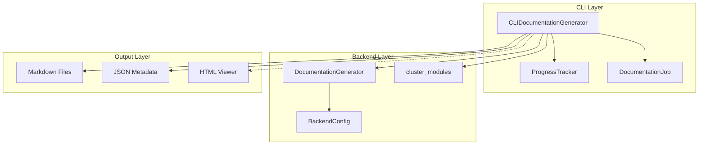
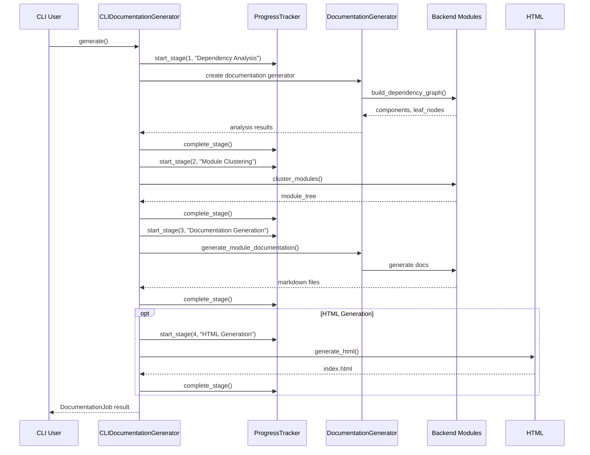
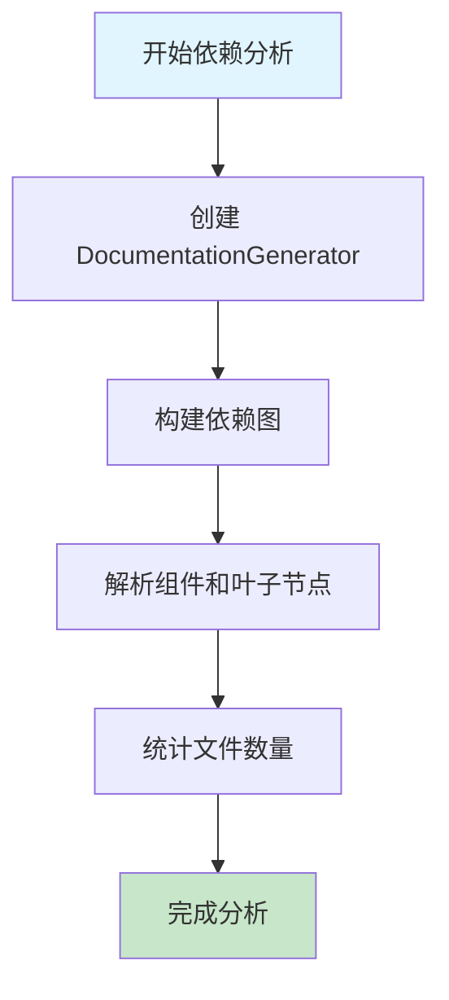
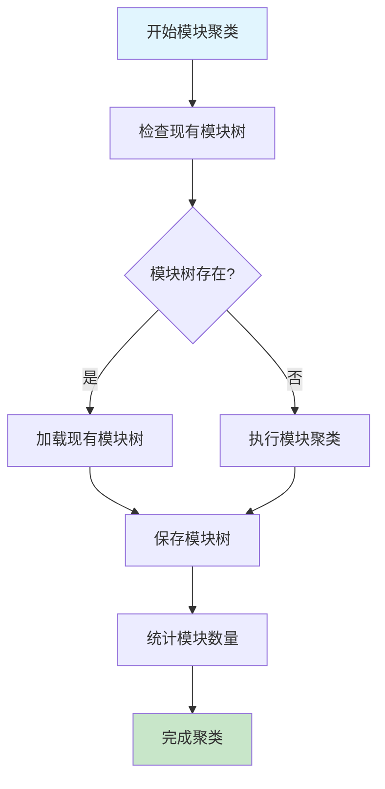
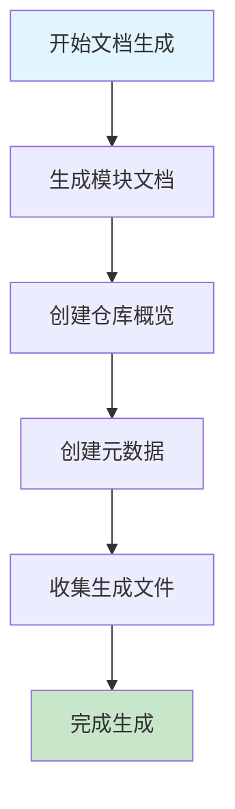

# doc_generator 模块文档

## 简介

doc_generator 模块是 CodeWiki CLI 系统的核心文档生成适配器，负责将后端文档生成功能与命令行界面集成。该模块通过包装后端文档生成器，为 CLI 用户提供进度跟踪、错误处理和日志管理等功能。

## 核心功能

- **文档生成适配**: 将后端文档生成器适配到 CLI 环境
- **进度跟踪**: 提供详细的生成进度报告
- **错误处理**: 统一的错误处理和报告机制
- **日志管理**: 配置后端日志系统以适应 CLI 使用场景
- **HTML 生成**: 可选的 HTML 查看器生成功能

## 架构设计

### 组件结构



### 数据流图



## 核心组件

### CLIDocumentationGenerator

`CLIDocumentationGenerator` 是模块的核心类，负责协调整个文档生成流程。

#### 主要属性

- `repo_path`: 仓库路径
- `output_dir`: 输出目录
- `config`: LLM 配置
- `verbose`: 是否启用详细输出
- `generate_html`: 是否生成 HTML 查看器
- `progress_tracker`: 进度跟踪器
- `job`: 文档生成作业

#### 关键方法

##### `__init__()`
初始化文档生成器，配置日志系统和作业元数据。

##### `generate()`
执行完整的文档生成流程，包含以下阶段：
1. **依赖分析**: 解析源代码依赖关系
2. **模块聚类**: 使用 LLM 对模块进行聚类
3. **文档生成**: 生成模块文档
4. **HTML 生成**: 可选的 HTML 查看器生成
5. **作业完成**: 完成作业并返回结果

##### `_configure_backend_logging()`
配置后端日志系统，根据 verbose 模式调整日志级别和格式。

##### `_run_backend_generation()`
异步执行后端文档生成，包含进度跟踪和错误处理。

##### `_run_html_generation()`
生成 HTML 查看器，提供友好的文档浏览界面。

## 生成流程

### 阶段 1: 依赖分析



### 阶段 2: 模块聚类



### 阶段 3: 文档生成



## 错误处理

模块实现了统一的错误处理机制：

- **APIError**: LLM API 调用失败时抛出
- **异常捕获**: 所有异常都会被捕获并记录到作业状态中
- **作业状态**: 失败时会更新作业状态并保存错误信息

## 配置管理

### 日志配置

根据 verbose 模式配置不同的日志级别：

- **Verbose 模式**: INFO 级别，显示详细进度信息
- **非 Verbose 模式**: WARNING 级别，只显示警告和错误

### 后端配置

通过 `BackendConfig.from_cli()` 方法创建后端配置，包含：
- 仓库路径
- 输出目录
- LLM 配置（URL、API 密钥、模型）

## 依赖关系

### 内部依赖

- [config_manager](config_manager.md): 配置管理
- [progress](progress.md): 进度跟踪
- [html_generator](html_generator.md): HTML 生成

### 后端依赖

- [be.documentation_generator](be.documentation_generator.md): 核心文档生成器
- [be.dependency_analyzer](be.dependency_analyzer.md): 依赖分析器
- [be.config](be.config.md): 后端配置

## 使用示例

```python
from pathlib import Path
from codewiki.cli.adapters.doc_generator import CLIDocumentationGenerator

# 创建文档生成器
generator = CLIDocumentationGenerator(
    repo_path=Path("/path/to/repo"),
    output_dir=Path("/path/to/output"),
    config={
        "main_model": "gpt-4",
        "cluster_model": "gpt-3.5-turbo",
        "base_url": "https://api.openai.com/v1",
        "api_key": "your-api-key"
    },
    verbose=True,
    generate_html=True
)

# 执行文档生成
job = generator.generate()

# 检查结果
print(f"生成状态: {job.status}")
print(f"生成文件: {len(job.files_generated)} 个")
print(f"模块数量: {job.module_count}")
```

## 性能优化

### 缓存机制

- **模块树缓存**: 首次聚类后保存模块树，避免重复聚类
- **文件缓存**: 利用文件系统缓存提高读取性能

### 异步处理

- 使用 `asyncio` 进行异步文档生成
- 支持并发处理多个模块

## 扩展性

### 自定义日志格式

通过 `ColoredFormatter` 提供彩色日志输出，支持自定义格式。

### 插件支持

模块设计支持扩展：
- 自定义进度跟踪器
- 自定义错误处理器
- 自定义输出格式

## 最佳实践

1. **错误处理**: 始终检查作业状态和处理异常
2. **进度跟踪**: 在长时间操作中使用进度跟踪
3. **日志配置**: 根据用户偏好配置日志级别
4. **资源管理**: 及时清理临时文件和资源
5. **性能监控**: 记录生成时间和资源使用情况

## 相关文档

- [CLI 概览](cli.md): CLI 系统整体架构
- [进度跟踪](progress.md): 进度跟踪系统详细说明
- [HTML 生成](html_generator.md): HTML 查看器生成
- [后端文档生成器](be.documentation_generator.md): 核心文档生成逻辑
- [依赖分析器](be.dependency_analyzer.md): 依赖关系分析