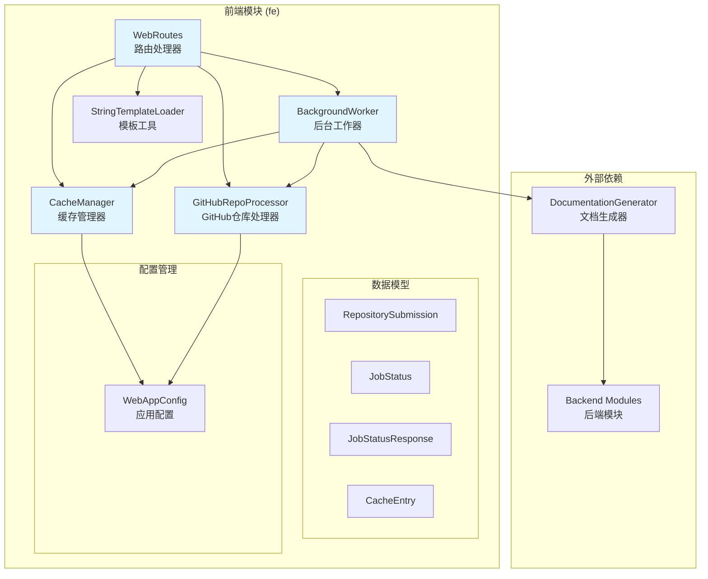
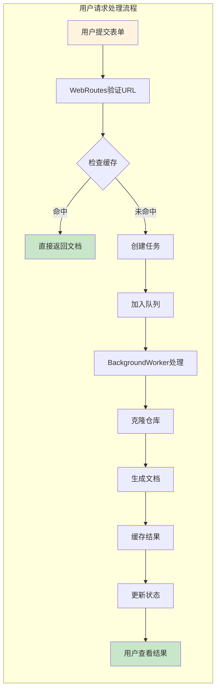
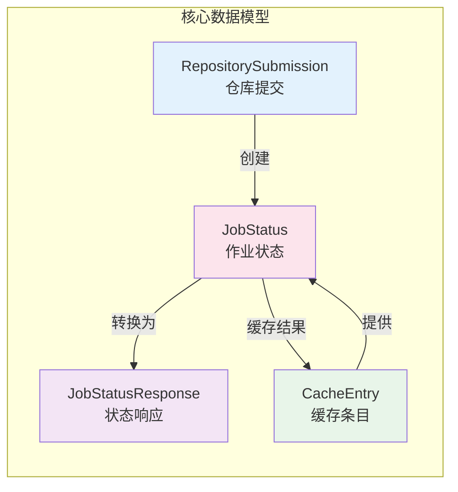
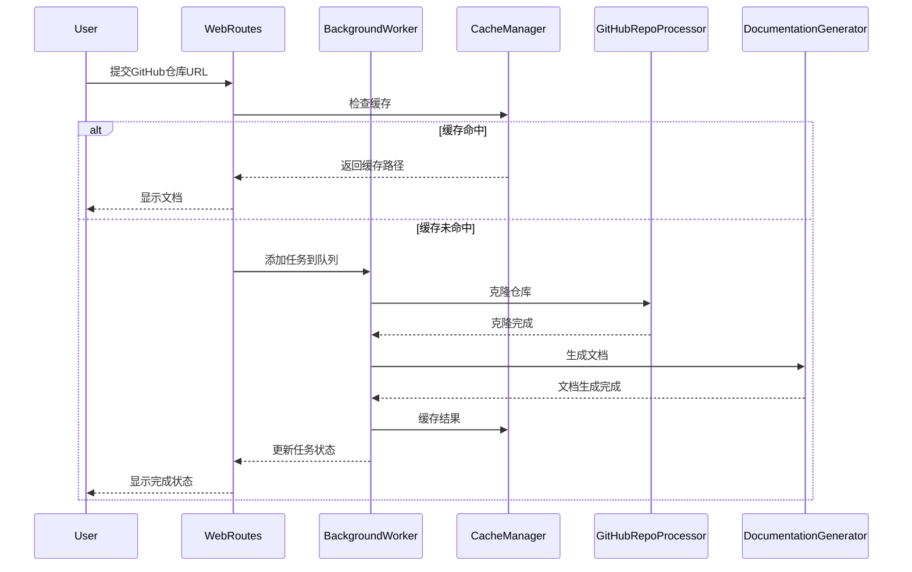

# CodeWiki 前端模块 (fe) 文档

## 概述

CodeWiki 前端模块 (fe) 是一个基于 FastAPI 的 Web 应用程序，提供用户友好的界面来提交 GitHub 仓库并生成文档。该模块处理用户请求、管理后台任务队列、缓存结果，并提供文档查看功能。

## 架构概览

### 整体架构图



### 组件交互流程图



### 数据模型关系图



## 核心功能

### 1. 用户界面与交互
- **WebRoutes**: 处理所有 HTTP 请求和响应
- **模板系统**: 使用 Jinja2 渲染动态 HTML 页面
- **表单处理**: 接收和验证 GitHub 仓库提交

### 2. 后台任务管理
- **BackgroundWorker**: 管理文档生成任务队列
- **任务状态跟踪**: 实时监控任务进度和状态
- **错误处理**: 优雅处理失败任务并提供重试机制

### 3. 缓存系统
- **CacheManager**: 智能缓存生成的文档
- **缓存策略**: 基于时间的过期策略（默认365天）
- **缓存索引**: 维护缓存元数据以提高查找效率

### 4. GitHub 集成
- **GitHubRepoProcessor**: 处理 GitHub 仓库操作
- **URL 验证**: 确保提交的 URL 是有效的 GitHub 仓库
- **仓库克隆**: 支持特定提交的克隆和浅克隆

## 子模块文档

### [后台工作器 (background_worker)](background_worker.md)
负责处理文档生成任务的异步执行，包括任务队列管理、状态跟踪和错误处理。

### [缓存管理器 (cache_manager)](cache_manager.md)
管理生成文档的缓存，提供高效的缓存查找、存储和过期清理功能。

### [配置管理 (config)](config.md)
集中管理 Web 应用程序的所有配置设置，包括目录路径、缓存策略和服务器参数。

### [GitHub 处理器 (github_processor)](github_processor.md)
处理与 GitHub 仓库相关的所有操作，包括 URL 验证、仓库信息提取和克隆操作。

### [数据模型 (models)](models.md)
定义应用程序中使用的所有数据结构和模型，包括作业状态、缓存条目和 API 响应格式。

### [路由系统 (routes)](routes.md)
实现 FastAPI 路由处理器，处理用户请求、表单提交和文档查看功能。

### [模板工具 (template_utils)](template_utils.md)
提供模板渲染和 HTML 生成功能，支持动态内容展示和导航菜单生成。

## 快速开始

### 环境要求
- Python 3.8+
- FastAPI
- Jinja2
- Git

### 基本用法
```python
from codewiki.src.fe import WebRoutes, BackgroundWorker, CacheManager

# 初始化组件
cache_manager = CacheManager()
background_worker = BackgroundWorker(cache_manager)
web_routes = WebRoutes(background_worker, cache_manager)

# 启动后台工作器
background_worker.start()
```

### API 端点
- `GET /` - 主页面，显示提交表单和最近任务
- `POST /` - 提交 GitHub 仓库进行处理
- `GET /api/job/{job_id}` - 获取任务状态
- `GET /docs/{job_id}` - 查看生成的文档
- `GET /static-docs/{job_id}/{filename}` - 提供静态文档文件

## 数据流图



## 配置参数

| 参数 | 默认值 | 说明 |
|------|--------|------|
| CACHE_DIR | "./output/cache" | 缓存目录路径 |
| TEMP_DIR | "./output/temp" | 临时文件目录 |
| QUEUE_SIZE | 100 | 任务队列最大长度 |
| CACHE_EXPIRY_DAYS | 365 | 缓存过期时间（天） |
| CLONE_TIMEOUT | 300 | Git 克隆超时时间（秒） |
| CLONE_DEPTH | 1 | 浅克隆深度 |

## 与其他模块的交互

### 与后端模块集成
- 调用 [be.documentation_generator](be.documentation_generator.md) 生成实际文档
- 使用 [be.config](be.config.md) 中的配置设置
- 依赖 [utils](utils.md) 进行文件操作

### 数据流向
1. 用户通过 Web 界面提交 GitHub 仓库 URL
2. 系统检查缓存，如果命中直接返回结果
3. 如果缓存未命中，将任务加入后台队列
4. 后台工作器克隆仓库并调用文档生成器
5. 生成的文档被缓存并返回给用户

## 错误处理与监控

- **任务失败处理**: 记录错误信息，提供重试冷却期
- **超时控制**: Git 操作和文档生成都有超时限制
- **状态跟踪**: 实时监控任务进度，向用户反馈
- **日志记录**: 详细记录操作日志便于调试

## 性能优化

- **智能缓存**: 避免重复生成相同仓库的文档
- **异步处理**: 后台任务不阻塞用户界面
- **队列管理**: 控制并发任务数量，防止系统过载
- **资源清理**: 自动清理临时文件和过期缓存

## 部署与运维

### 环境配置
```bash
# 安装依赖
pip install fastapi uvicorn jinja2 pydantic

# 创建必要的目录
mkdir -p output/cache output/temp output/docs

# 设置环境变量（可选）
export CODEWIKI_CACHE_DIR="./output/cache"
export CODEWIKI_TEMP_DIR="./output/temp"
```

### 启动服务
```python
from fastapi import FastAPI
from codewiki.src.fe import WebRoutes, BackgroundWorker, CacheManager

app = FastAPI(title="CodeWiki Frontend")

# 初始化组件
cache_manager = CacheManager()
background_worker = BackgroundWorker(cache_manager)
web_routes = WebRoutes(background_worker, cache_manager)

# 启动后台工作器
background_worker.start()

# 注册路由
app.get("/", response_class=HTMLResponse)(web_routes.index_get)
app.post("/", response_class=HTMLResponse)(web_routes.index_post)
app.get("/api/job/{job_id}")(web_routes.get_job_status)
app.get("/docs/{job_id}")(web_routes.view_docs)
app.get("/static-docs/{job_id}/{filename}")(web_routes.serve_generated_docs)
```

### 监控与日志
- **任务监控**: 通过 `/api/job/{job_id}` 接口实时查看任务状态
- **缓存统计**: 监控缓存命中率和存储使用情况
- **错误日志**: 详细记录所有异常和错误信息
- **性能指标**: 跟踪任务处理时间和队列长度

### 故障排除

#### 常见问题
1. **任务长时间处于"processing"状态**
   - 检查后台工作器是否正常运行
   - 查看 Git 克隆是否超时
   - 确认文档生成器是否可用

2. **缓存未命中**
   - 验证缓存目录权限
   - 检查缓存索引文件完整性
   - 确认缓存过期设置

3. **GitHub 仓库克隆失败**
   - 验证 GitHub URL 格式
   - 检查网络连接
   - 确认目标仓库存在且可访问

#### 维护建议
- 定期清理过期缓存
- 监控磁盘空间使用情况
- 定期备份重要配置和缓存索引
- 设置适当的日志轮转策略