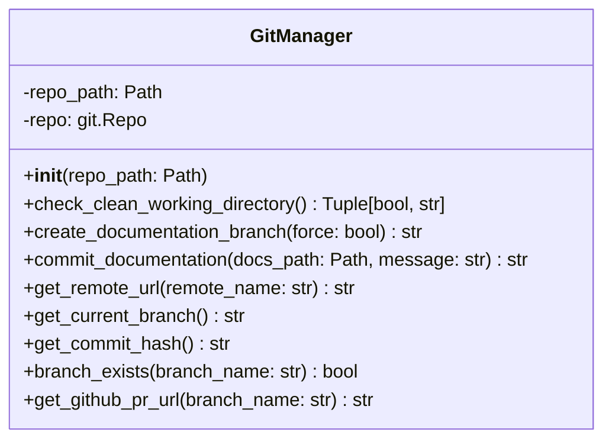
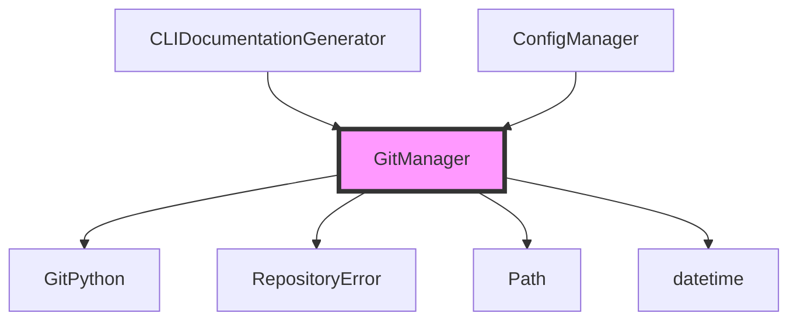
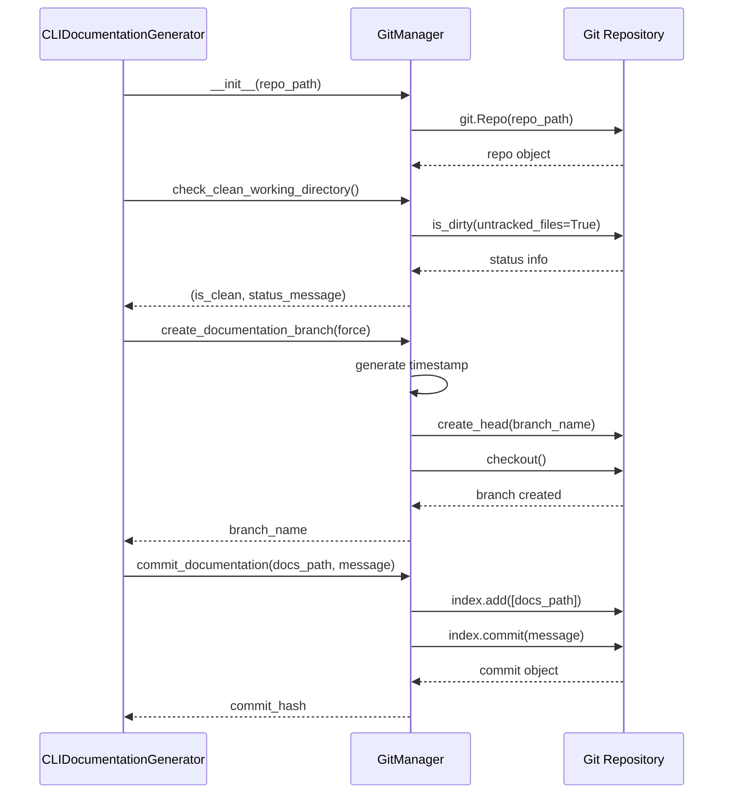

# Git Manager 模块文档

## 简介

Git Manager 模块是 CodeWiki CLI 的核心组件，负责管理文档生成过程中的所有 Git 操作。该模块提供了完整的 Git 工作流支持，包括状态检查、分支创建、文档提交和远程仓库管理等功能。

## 核心功能

GitManager 类封装了以下主要功能：

- **仓库状态管理**：检查工作目录是否干净，识别未提交的更改
- **文档分支管理**：创建带时间戳的专用文档分支
- **文档提交**：将生成的文档文件添加到 Git 并提交
- **远程仓库操作**：获取远程仓库 URL，支持 GitHub PR 链接生成
- **分支操作**：检查分支存在性，获取当前分支信息

## 架构设计

### 组件结构



### 依赖关系



## 数据流图

### 文档生成工作流



## 核心方法详解

### 初始化与验证

```python
def __init__(self, repo_path: Path):
```

初始化 GitManager 时会：
1. 解析并规范化仓库路径
2. 尝试创建 GitPython 的 Repo 对象
3. 如果路径不是有效的 Git 仓库，抛出 RepositoryError

### 工作目录状态检查

```python
def check_clean_working_directory(self) -> Tuple[bool, str]:
```

检查工作目录状态，返回：
- **is_clean**: 布尔值，表示工作目录是否干净
- **status_message**: 状态描述，包含修改和未跟踪的文件信息

### 文档分支创建

```python
def create_documentation_branch(self, force: bool = False) -> str:
```

创建专用的文档分支：
1. 检查工作目录是否干净（除非 force=True）
2. 生成带时间戳的分支名：`docs/codewiki-YYYYMMDD-HHMMSS`
3. 创建并切换到新分支
4. 返回分支名称

### 文档提交

```python
def commit_documentation(self, docs_path: Path, message: Optional[str] = None) -> str:
```

提交生成的文档：
1. 将文档目录添加到 Git 索引
2. 创建提交（使用默认或自定义消息）
3. 返回提交哈希值

## 错误处理

GitManager 使用自定义的 RepositoryError 异常来处理 Git 相关错误：

- **无效仓库**: 初始化时路径不是 Git 仓库
- **脏工作目录**: 创建分支时工作目录有未提交更改
- **Git 命令失败**: 分支创建或提交操作失败

## 与系统其他模块的集成

### CLI 层集成

GitManager 主要被以下 CLI 组件使用：

- **[CLIDocumentationGenerator](doc_generator.md)**: 在文档生成过程中管理 Git 操作
- **[ConfigManager](config_manager.md)**: 获取仓库配置信息

### 使用场景

1. **文档生成工作流**:
   - 检查仓库状态
   - 创建文档分支
   - 提交生成的文档

2. **GitHub 集成**:
   - 获取远程仓库 URL
   - 生成 PR 创建链接

## 最佳实践

### 分支管理

- 使用带时间戳的分支名避免冲突
- 在创建分支前检查工作目录状态
- 提供强制创建选项以处理特殊情况

### 错误处理

- 提供详细的错误信息和建议解决方案
- 区分不同类型的 Git 错误
- 包含 Git 命令建议帮助用户解决问题

### 用户体验

- 清晰的状态报告，显示修改和未跟踪的文件
- 智能的文件列表截断，避免信息过载
- 支持 SSH 和 HTTPS 两种远程 URL 格式

## 配置选项

GitManager 本身不需要额外配置，但会：

- 自动搜索父目录查找 Git 仓库
- 支持自定义远程名称（默认 "origin"）
- 允许自定义提交消息

## 安全考虑

- 路径解析时使用 `resolve()` 避免路径遍历
- 分支名包含时间戳防止预测
- 强制选项需要显式启用

## 性能优化

- 缓存 Repo 对象避免重复初始化
- 使用 GitPython 的原生方法提高效率
- 状态检查时限制显示的文件数量