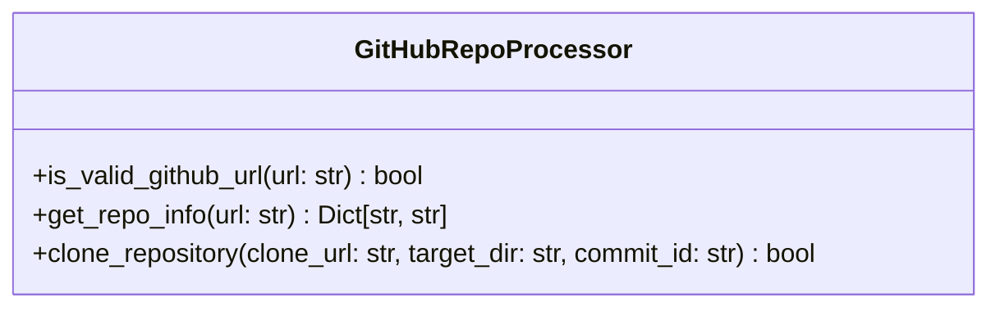
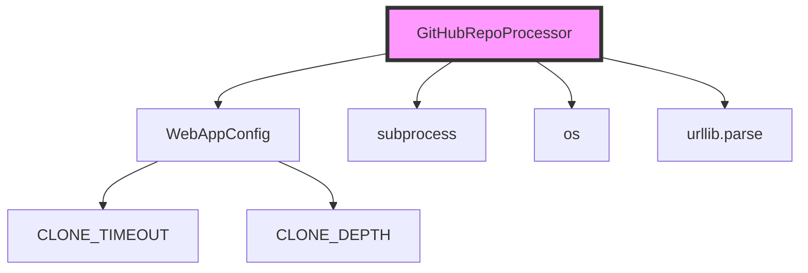
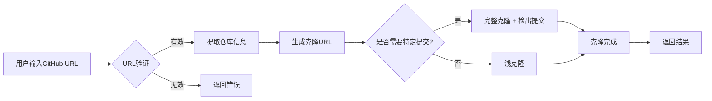
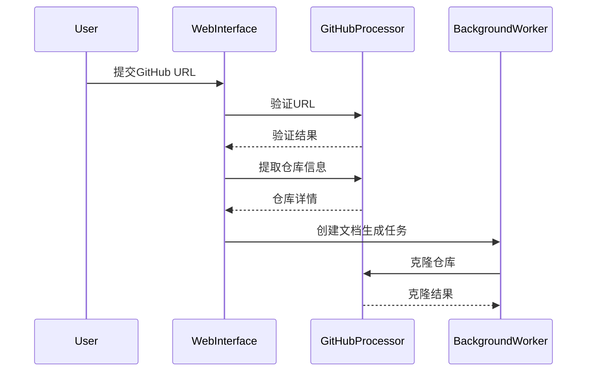
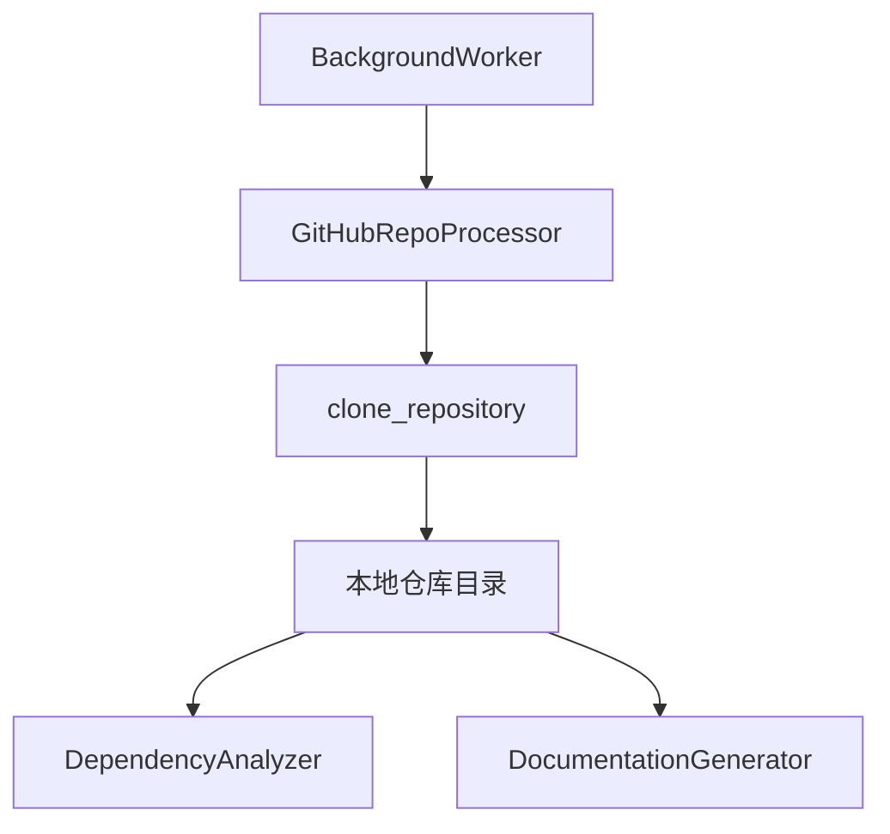

# GitHub 处理器模块文档

## 简介

GitHub 处理器模块是 CodeWiki 系统前端的核心组件，负责处理 GitHub 仓库的验证、信息提取和克隆操作。该模块为整个文档生成流程提供基础支持，确保只有有效的 GitHub 仓库才能进入后续的依赖分析和文档生成阶段。

## 核心功能

### 1. GitHub URL 验证
- 验证输入的 URL 是否为有效的 GitHub 仓库地址
- 支持 `github.com` 和 `www.github.com` 域名
- 确保 URL 格式符合 `owner/repo` 结构

### 2. 仓库信息提取
- 从 GitHub URL 中提取所有者（owner）和仓库名（repo）
- 生成完整的仓库名称和克隆 URL
- 自动处理 `.git` 后缀

### 3. 仓库克隆管理
- 支持浅克隆（shallow clone）以提高效率
- 支持特定提交（commit）的检出
- 提供超时控制和错误处理机制

## 架构设计

### 组件结构



### 系统依赖关系



### 数据流图



## 详细实现

### URL 验证逻辑

```python
def is_valid_github_url(url: str) -> bool:
    # 1. 解析URL
    parsed = urlparse(url)
    
    # 2. 检查域名
    if parsed.netloc.lower() not in ['github.com', 'www.github.com']:
        return False
    
    # 3. 检查路径格式
    path_parts = parsed.path.strip('/').split('/')
    if len(path_parts) < 2:
        return False
    
    # 4. 验证owner/repo结构
    return len(path_parts) >= 2 and all(part for part in path_parts[:2])
```

### 克隆策略

根据是否需要特定提交，模块采用两种不同的克隆策略：

1. **浅克隆（默认）**：使用 `--depth` 参数，只克隆最近的提交历史
2. **完整克隆**：当需要检出特定提交时，克隆完整仓库以获取所有历史记录

### 错误处理

- 网络超时控制（通过 `WebAppConfig.CLONE_TIMEOUT`）
- Git 命令错误捕获和日志记录
- 异常情况的安全处理

## 配置依赖

模块依赖 [WebAppConfig](fe.config.md) 提供的配置参数：

- `CLONE_TIMEOUT`: 克隆操作超时时间（秒）
- `CLONE_DEPTH`: 浅克隆深度

## 使用场景

### 1. 仓库提交处理

当用户通过 Web 界面提交 GitHub 仓库时：



### 2. 与后台工作器集成

GitHub 处理器作为 [BackgroundWorker](background_worker.md) 的依赖组件，为其提供仓库获取能力：



## 性能优化

### 1. 浅克隆机制
- 默认只克隆最近的提交历史
- 显著减少网络传输和存储空间
- 适用于大多数文档生成场景

### 2. 超时控制
- 防止克隆操作无限期挂起
- 可配置的超时参数
- 提供良好的用户体验

### 3. 错误恢复
- 详细的错误信息记录
- 优雅的错误处理机制
- 支持重试操作

## 安全考虑

### 1. URL 验证
- 严格的域名白名单
- 路径格式验证
- 防止恶意 URL 注入

### 2. 命令执行安全
- 使用 subprocess 的安全模式
- 参数化命令构建
- 避免 shell 注入风险

## 扩展性

模块设计考虑了未来的扩展需求：

- 支持其他 Git 托管平台（如 GitLab、Bitbucket）
- 支持私有仓库认证
- 支持 Git LFS（大文件存储）
- 支持子模块处理

## 相关模块

- [WebAppConfig](fe.config.md): 提供配置参数
- [BackgroundWorker](background_worker.md): 使用 GitHub 处理器进行仓库克隆
- [RepositorySubmission](fe.models.md): 仓库提交数据模型
- [CacheManager](cache_manager.md): 缓存已克隆的仓库