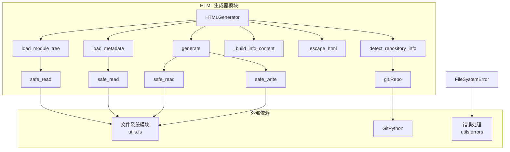
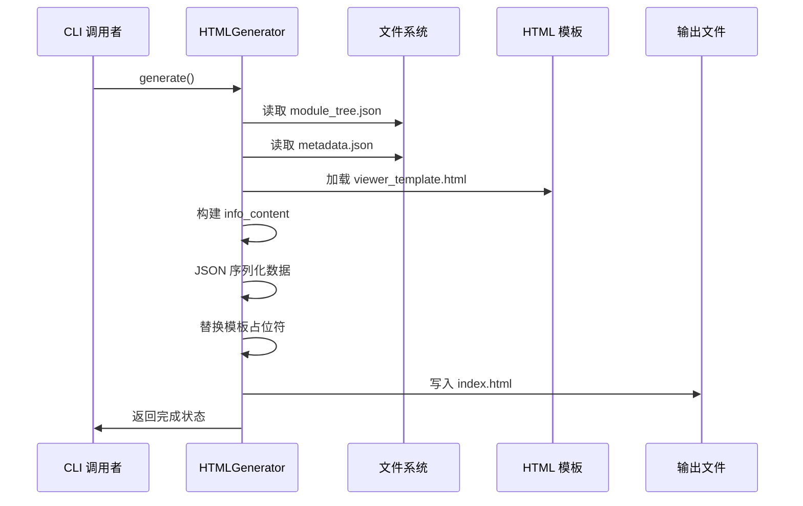
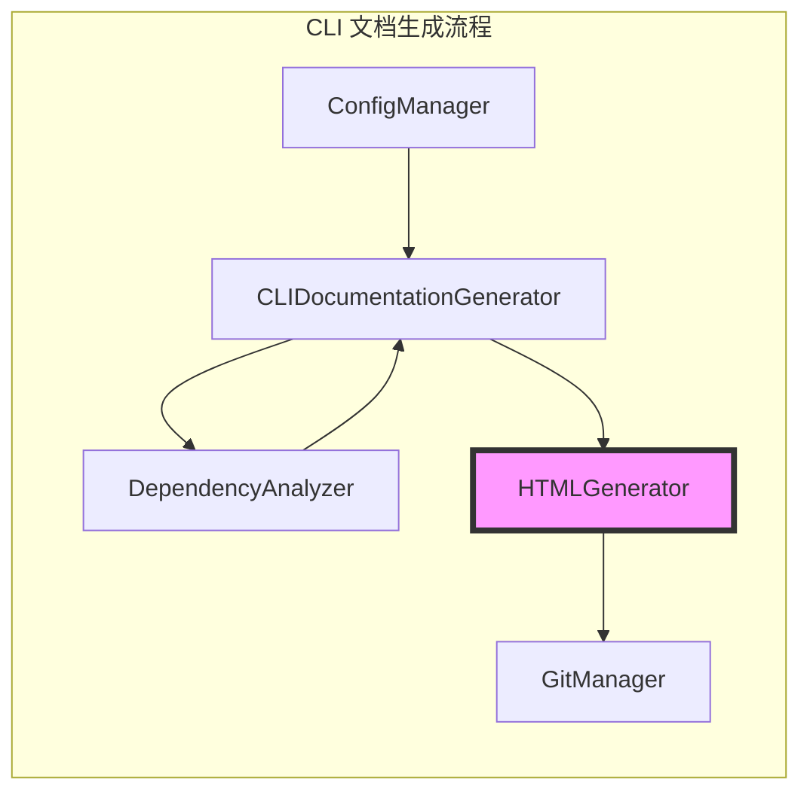

# HTML 生成器模块文档

## 简介

HTML 生成器模块是 CodeWiki CLI 工具的核心组件之一，负责为 GitHub Pages 创建静态 HTML 文档查看器。该模块将生成的文档数据转换为自包含的 HTML 文件，支持客户端 Markdown 渲染和交互式文档浏览。

## 核心功能

- **静态 HTML 生成**：创建自包含的 index.html 文件
- **模块树集成**：加载并嵌入模块结构数据
- **元数据处理**：提取和展示文档生成信息
- **GitHub 集成**：支持仓库链接和 GitHub Pages 部署
- **模板系统**：基于模板的 HTML 生成
- **客户端渲染**：支持浏览器端 Markdown 解析

## 架构设计

### 组件结构



### 数据流图



## 核心组件详解

### HTMLGenerator 类

`HTMLGenerator` 是模块的核心类，提供完整的 HTML 文档生成能力。

#### 主要属性

- `template_dir`: 模板目录路径，默认为包内的 `templates/github_pages` 目录

#### 关键方法

##### `__init__(template_dir: Optional[Path] = None)`
初始化 HTML 生成器，设置模板目录路径。

##### `load_module_tree(docs_dir: Path) -> Dict[str, Any]`
从文档目录加载模块树结构。如果文件不存在，返回默认结构。

##### `load_metadata(docs_dir: Path) -> Optional[Dict[str, Any]]`
加载文档元数据，包含生成信息和统计信息。

##### `generate(...)`
生成 HTML 文档查看器的主要方法，支持多种配置选项。

##### `detect_repository_info(repo_path: Path) -> Dict[str, Optional[str]]`
通过 Git 检测仓库信息，包括名称、URL 和 GitHub Pages URL。

## 模板系统

### 模板结构

HTML 生成器使用预定义的 HTML 模板，包含以下占位符：

- `{{TITLE}}`: 文档标题
- `{{REPO_LINK}}`: 仓库链接 HTML
- `{{SHOW_INFO}}`: 信息面板显示状态
- `{{INFO_CONTENT}}`: 仓库信息内容
- `{{CONFIG_JSON}}`: 配置 JSON 数据
- `{{MODULE_TREE_JSON}}`: 模块树 JSON 数据
- `{{METADATA_JSON}}`: 元数据 JSON
- `{{DOCS_BASE_PATH}}`: 文档基础路径

### 数据嵌入

生成的 HTML 文件包含嵌入式 JSON 数据，支持客户端 JavaScript 访问：

```javascript
// 客户端可访问的数据
window.config = {{CONFIG_JSON}};
window.moduleTree = {{MODULE_TREE_JSON}};
window.metadata = {{METADATA_JSON}};
```

## 使用示例

### 基本用法

```python
from pathlib import Path
from codewiki.cli.html_generator import HTMLGenerator

# 创建生成器实例
generator = HTMLGenerator()

# 生成 HTML 文档
generator.generate(
    output_path=Path("docs/index.html"),
    title="My Project Documentation",
    docs_dir=Path("docs"),
    repository_url="https://github.com/user/repo"
)
```

### 高级配置

```python
# 自定义配置
config = {
    "theme": "dark",
    "showLineNumbers": True,
    "maxDepth": 5
}

# 手动提供数据
generator.generate(
    output_path=Path("output/index.html"),
    title="Custom Documentation",
    module_tree={"modules": {...}},
    metadata={"generation_info": {...}},
    config=config,
    github_pages_url="https://user.github.io/repo/"
)
```

## 错误处理

模块通过 `FileSystemError` 处理文件系统相关的错误：

- 模板文件未找到
- JSON 解析失败
- 文件读写错误

## 依赖关系

### 内部依赖

- **文件系统模块** (`codewiki.cli.utils.fs`): 提供安全的文件读写操作
- **错误处理** (`codewiki.cli.utils.errors`): 定义文件系统错误类型

### 外部依赖

- **GitPython**: 用于检测 Git 仓库信息
- **pathlib**: 路径操作
- **json**: JSON 数据处理

## 集成场景

### 在 CLI 工作流中的位置



### 与相关模块的交互

- **[doc_generator](doc_generator.md)**: 调用 HTML 生成器创建最终输出
- **[config_manager](config_manager.md)**: 提供配置信息
- **[git_manager](git_manager.md)**: 管理 Git 仓库状态

## 部署考虑

### GitHub Pages 优化

- 自动生成 GitHub Pages 兼容的 URL
- 支持相对路径配置
- 嵌入式资源减少 HTTP 请求

### 性能特性

- 自包含 HTML，无需外部依赖
- 客户端渲染减轻服务器负担
- 支持大模块树的高效处理

## 扩展性

### 模板定制

可以通过修改模板目录来自定义 HTML 输出：

```python
custom_generator = HTMLGenerator(template_dir=Path("custom_templates"))
```

### 元数据扩展

支持自定义元数据字段，自动显示在信息面板中。

## 最佳实践

1. **路径管理**: 使用 `Path` 对象确保跨平台兼容性
2. **错误处理**: 捕获 `FileSystemError` 处理文件操作失败
3. **数据验证**: 在调用生成方法前验证输入数据
4. **模板缓存**: 考虑在生产环境中缓存模板内容
5. **Git 集成**: 利用 `detect_repository_info` 自动获取仓库信息

## 故障排除

### 常见问题

1. **模板未找到**: 确保模板目录结构正确
2. **JSON 解析错误**: 验证 module_tree.json 格式
3. **Git 信息检测失败**: 检查 Git 仓库状态和远程配置

### 调试建议

- 启用详细日志记录
- 检查文件权限
- 验证 JSON 文件格式
- 测试 Git 仓库状态