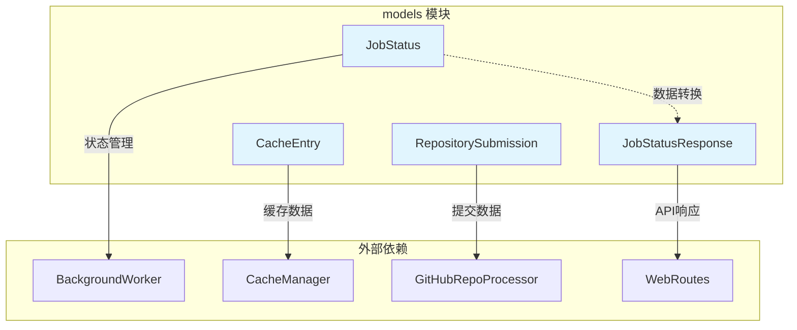
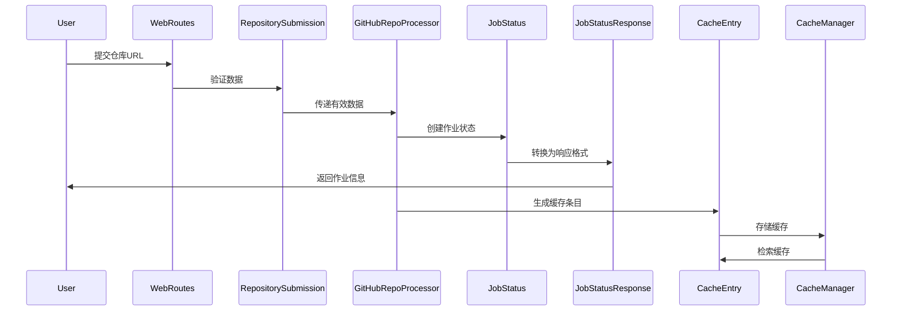
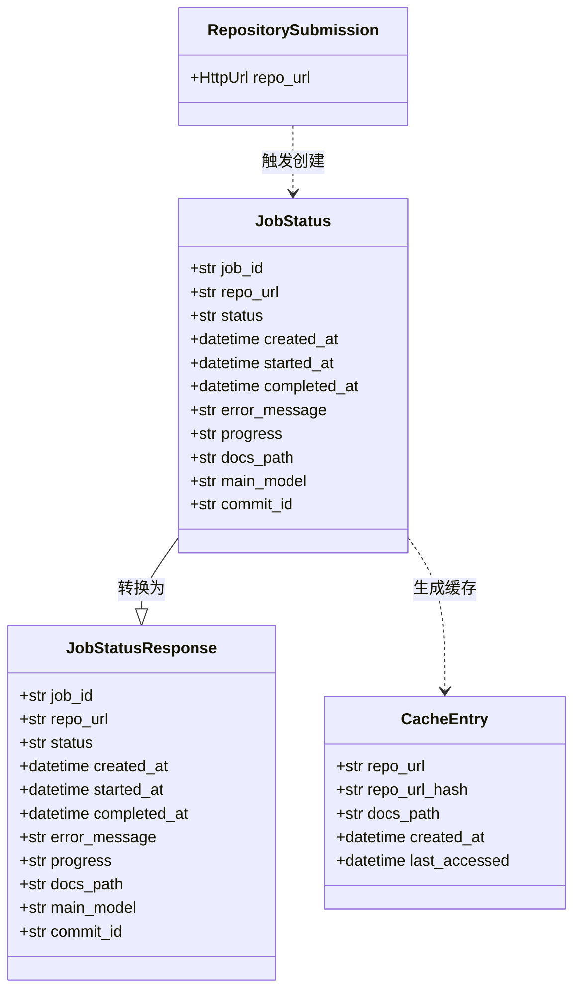

# models 模块文档

## 简介

models 模块是 CodeWiki Web 应用的核心数据模型层，负责定义系统中使用的所有数据结构。该模块提供了前端与后端之间数据交换的标准化模型，确保数据的一致性和类型安全。

## 核心功能

- **数据验证**：使用 Pydantic 模型提供自动数据验证
- **类型安全**：通过 Python 类型注解确保数据类型正确性
- **序列化支持**：支持 JSON 序列化和反序列化
- **缓存管理**：定义缓存条目的数据结构
- **作业状态跟踪**：提供作业生命周期的完整状态管理

## 架构设计

### 组件关系图

### 数据流图

## 核心组件详解

### RepositorySubmission

**用途**：处理用户提交的 GitHub 仓库 URL

**特性**：
- 使用 Pydantic 的 `HttpUrl` 类型自动验证 URL 格式
- 确保提交的 URL 是有效的 HTTP/HTTPS 地址
- 作为前端表单数据的接收模型

**依赖关系**：
- 被 [GitHubRepoProcessor](github_processor.md) 用于接收仓库提交
- 与 [WebRoutes](routes.md) 集成处理用户请求

### JobStatusResponse

**用途**：为 API 响应提供标准化的作业状态数据结构

**特性**：
- 包含作业的完整生命周期信息
- 支持可选字段，处理不同阶段的作业状态
- 提供进度信息和错误详情
- 包含文档生成路径和模型信息

**字段说明**：
- `job_id`: 唯一作业标识符
- `status`: 作业状态（queued/processing/completed/failed）
- `progress`: 进度描述信息
- `docs_path`: 生成的文档路径
- `main_model`: 使用的主要 AI 模型

### JobStatus

**用途**：内部作业状态管理的数据结构

**特性**：
- 使用 `@dataclass` 装饰器提供简洁的数据类定义
- 与 `JobStatusResponse` 结构相似但用于内部处理
- 支持作业时间跟踪（创建、开始、完成时间）
- 提供错误处理和状态转换功能

**使用场景**：
- [BackgroundWorker](background_worker.md) 用于跟踪异步作业状态
- 与 [CacheManager](cache_manager.md) 协调作业生命周期管理

### CacheEntry

**用途**：表示缓存的文档生成结果

**特性**：
- 包含仓库 URL 和其哈希值用于快速查找
- 记录创建时间和最后访问时间支持缓存策略
- 提供文档存储路径信息

**缓存策略**：
- 基于仓库 URL 的哈希值进行索引
- 支持 LRU（最近最少使用）缓存淘汰策略
- 与 [WebAppConfig](config.md) 中的缓存配置协同工作

## 数据模型关系

## 集成与交互

### 与前端路由集成

[WebRoutes](routes.md) 使用这些模型处理 HTTP 请求：
- 接收 `RepositorySubmission` 进行仓库提交验证
- 返回 `JobStatusResponse` 作为 API 响应
- 支持 RESTful API 的数据交换

### 与后台工作器集成

[BackgroundWorker](background_worker.md) 依赖这些模型进行作业管理：
- 使用 `JobStatus` 跟踪异步作业状态
- 通过 `CacheEntry` 管理生成结果缓存
- 支持作业队列和状态持久化

### 与缓存管理器集成

[CacheManager](cache_manager.md) 使用 `CacheEntry` 实现缓存策略：
- 基于仓库 URL 快速查找缓存
- 管理缓存生命周期和访问时间
- 支持缓存失效和更新机制

## 最佳实践

### 数据验证
- 始终使用 Pydantic 模型进行输入验证
- 利用类型注解确保数据类型安全
- 处理可选字段的默认值和验证规则

### 错误处理
- 在模型层面定义清晰的错误字段
- 提供详细的错误信息便于调试
- 支持错误状态的序列化传输

### 性能优化
- 使用哈希值加速缓存查找
- 合理设计数据结构减少内存占用
- 支持增量更新和状态变更通知

## 扩展性考虑

### 模型演进
- 保持向后兼容性，支持字段新增
- 使用版本控制管理模型变更
- 提供数据迁移机制

### 类型扩展
- 支持自定义类型验证器
- 允许模型继承和组合
- 提供灵活的配置选项

## 相关模块

- [WebRoutes](routes.md) - API 路由和请求处理
- [BackgroundWorker](background_worker.md) - 异步作业处理
- [CacheManager](cache_manager.md) - 缓存管理实现
- [GitHubRepoProcessor](github_processor.md) - GitHub 仓库处理
- [WebAppConfig](config.md) - Web 应用配置