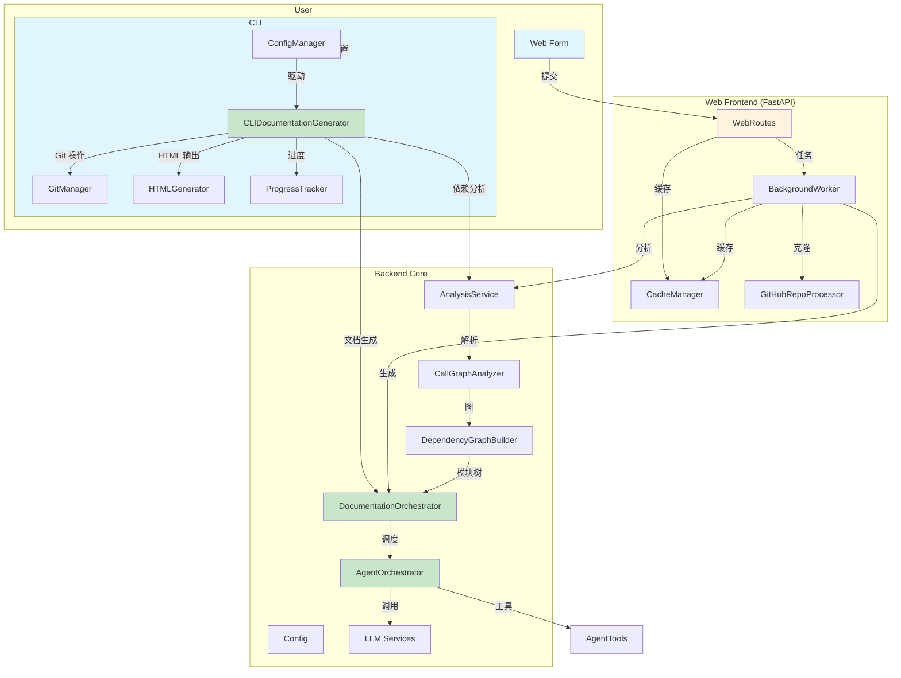

# CodeWiki 仓库概览

## 仓库目的

CodeWiki 是一个端到端的 AI 驱动文档生成平台，能够自动分析任意 GitHub 仓库的代码结构、依赖关系与模块层次，并调用大模型为每个模块生成高质量的技术文档。系统同时提供：

- **CLI 工具**：面向开发者的本地命令行体验，支持一键生成、Git 分支管理、GitHub Pages 静态站点输出  
- **Web 应用**：面向非技术用户的在线服务，输入 GitHub URL 即可在线查看生成的文档  
- **多语言支持**：Python、JavaScript/TypeScript、Java、C#、C/C++ 等主流语言  
- **缓存与增量更新**：避免重复分析，支持秒级返回已缓存结果  

## 端到端架构



## 核心模块速览

| 模块 | 职责 | 关键类/入口 | 文档链接 |
|------|------|-------------|----------|
| **CLI** | 命令行交互、配置管理、Git 集成、进度可视化 | `CLIDocumentationGenerator` | [cli.md](cli.md) |
| **Web Frontend (fe)** | FastAPI 服务、任务队列、缓存、GitHub 集成 | `WebRoutes`, `BackgroundWorker` | [fe.md](fe.md) |
| **依赖分析 (be.dependency_analyzer)** | 多语言 AST/Tree-sitter 解析、调用图构建 | `AnalysisService`, `CallGraphAnalyzer` | [be.dependency_analyzer.md](be.dependency_analyzer.md) |
| **文档生成器 (be.documentation_generator)** | 拓扑排序、模块聚类、渐进式文档生成 | `DocumentationGenerator` | [be.documentation_generator.md](be.documentation_generator.md) |
| **智能体编排 (be.agent_orchestrator)** | 根据模块复杂度调度 AI 智能体与工具 | `AgentOrchestrator` | [be.agent_orchestrator.md](be.agent_orchestrator.md) |
| **智能体工具 (be.agent_tools)** | 文件编辑、依赖注入、语法检查 | `CodeWikiDeps`, `EditTool` | [be.agent_tools.md](be.agent_tools.md) |
| **配置中心 (be.config)** | 统一管理 CLI/Web 两种模式的配置 | `Config` | [be.config.md](be.config.md) |
| **工具库 (utils)** | 统一文件 I/O、JSON 序列化 | `FileManager` | [utils.md](utils.md) |

## 快速开始

```bash
# 1. 安装
pip install -e .

# 2. CLI 一键生成
codewiki config set --api-key <KEY> --base-url <URL>
codewiki generate https://github.com/user/repo --create-branch --github-pages

# 3. Web 服务
python -m codewiki.src.fe.main
# 打开 http://localhost:8000 提交仓库地址
```

## 更多资源

- 各子模块详细文档已随仓库生成，见 `docs/` 目录  
- 示例生成的静态文档站点可直接部署到 GitHub Pages  
- 支持通过环境变量或 `.env` 文件覆盖所有配置项