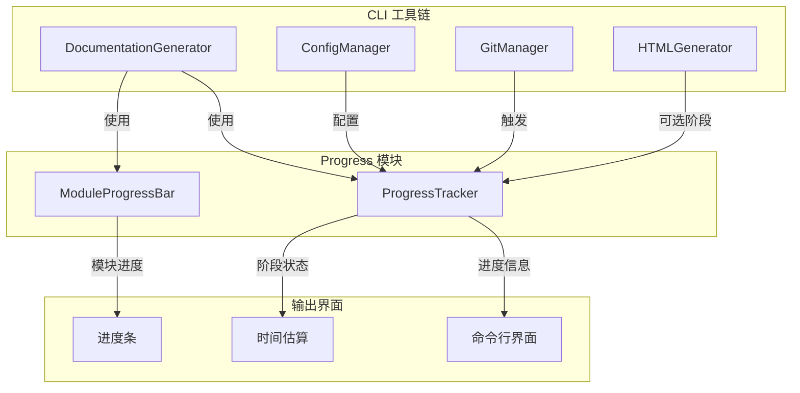
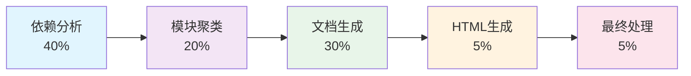
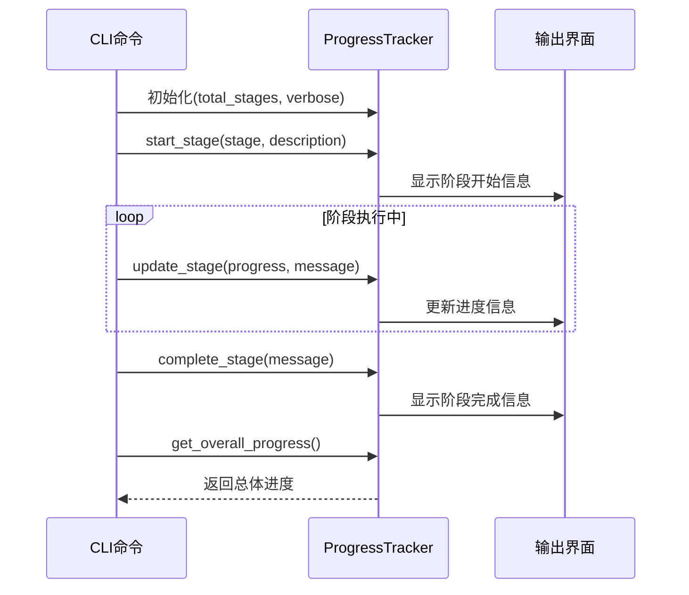
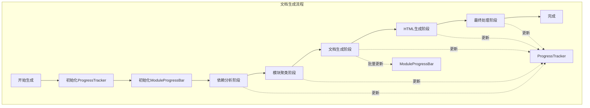

# Progress 模块文档

## 简介

Progress 模块是 CodeWiki CLI 工具中的进度跟踪和可视化组件，专门用于在文档生成过程中提供详细的进度反馈。该模块通过两个核心组件 `ProgressTracker` 和 `ModuleProgressBar`，为用户提供清晰、准确的任务执行进度信息，包括阶段划分、时间估算和模块级进度展示。

## 核心功能

### 1. 多阶段进度跟踪
- **阶段化进度管理**：将文档生成过程划分为5个主要阶段
- **权重分配**：为每个阶段分配时间权重，提供准确的总体进度计算
- **ETA 估算**：基于历史数据估算剩余完成时间

### 2. 模块化进度展示
- **模块级进度条**：为批量模块处理提供可视化进度
- **缓存状态显示**：区分已缓存和新生成的模块
- **详细模式支持**：支持简洁和详细两种输出模式

## 架构设计

### 组件结构



### 进度阶段划分



## 核心组件详解

### ProgressTracker 类

`ProgressTracker` 是整个进度跟踪系统的核心，负责管理多阶段任务的执行进度。

#### 主要特性

1. **阶段权重系统**
   - 预定义5个标准阶段及其时间权重
   - 支持自定义阶段描述
   - 动态进度计算算法

2. **时间估算算法**
   - 基于线性外推的ETA计算
   - 自适应时间格式显示
   - 剩余时间智能格式化

3. **输出格式化**
   - 支持详细和简洁两种模式
   - 彩色终端输出
   - 时间戳和持续时间显示

#### 工作流程



### ModuleProgressBar 类

`ModuleProgressBar` 专门用于处理模块级批量任务的进度展示。

#### 设计特点

1. **双模式支持**
   - 简洁模式：使用 click 进度条
   - 详细模式：逐行输出模块状态

2. **缓存感知**
   - 区分缓存命中和新生成
   - 提供不同的状态标识
   - 优化用户体验

3. **资源管理**
   - 自动清理进度条资源
   - 上下文管理器支持
   - 异常安全设计

## 系统集成

### 与文档生成器的协作



### 配置和初始化

Progress 模块通过 [config_manager](config_manager.md) 获取用户偏好设置，包括：
- 详细输出模式开关
- 进度显示格式配置
- 时间估算算法参数

## 使用示例

### 基本使用模式

```python
# 初始化进度跟踪器
tracker = ProgressTracker(total_stages=5, verbose=True)

# 开始第一阶段
tracker.start_stage(1, "依赖分析")
# 执行依赖分析工作...
tracker.update_stage(0.5, "正在解析Python文件...")
# 继续分析...
tracker.complete_stage("依赖分析完成")

# 获取总体进度
overall_progress = tracker.get_overall_progress()
```

### 模块进度展示

```python
# 初始化模块进度条
module_bar = ModuleProgressBar(total_modules=50, verbose=False)

# 处理每个模块
for module in modules:
    # 检查缓存
    cached = check_cache(module)
    if not cached:
        generate_documentation(module)
    
    # 更新进度
    module_bar.update(module.name, cached=cached)

# 完成进度条
module_bar.finish()
```

## 性能优化

### 时间估算算法

ProgressTracker 使用线性外推算法进行时间估算：

```
总体预计时间 = 已用时间 / 当前进度
剩余时间 = 总体预计时间 - 已用时间
```

该算法在文档生成这种相对稳定的计算任务中表现良好，能够为用户提供合理的完成时间预期。

### 输出性能

- **简洁模式**：最小化终端输出，降低I/O开销
- **详细模式**：提供详细日志，便于调试和监控
- **智能刷新**：避免频繁的进度条重绘操作

## 错误处理

Progress 模块采用防御性编程策略：

1. **进度值边界检查**：确保进度值在0.0-1.0范围内
2. **时间计算保护**：处理除零和负时间情况
3. **资源清理保证**：确保进度条资源正确释放

## 扩展性

### 自定义阶段支持

通过传入自定义描述，可以轻松扩展新的处理阶段：

```python
tracker.start_stage(6, "自定义处理阶段")
```

### 权重调整

可以根据实际使用情况调整各阶段的时间权重：

```python
# 在类定义中修改 STAGE_WEIGHTS
STAGE_WEIGHTS = {
    1: 0.30,  # 减少依赖分析权重
    2: 0.25,  # 增加模块聚类权重
    # ...
}
```

## 相关模块

- [config_manager](config_manager.md) - 配置管理和用户偏好设置
- [doc_generator](doc_generator.md) - 文档生成器，使用进度跟踪
- [html_generator](html_generator.md) - HTML生成阶段的使用者
- [git_manager](git_manager.md) - 触发进度跟踪的Git操作

## 总结

Progress 模块通过精心设计的双组件架构，为 CodeWiki CLI 工具提供了强大而灵活的进度跟踪能力。`ProgressTracker` 负责宏观的多阶段进度管理，而 `ModuleProgressBar` 专注于微观的模块级进度展示。两者协同工作，为用户提供了清晰、准确的执行进度反馈，显著提升了工具的用户体验和可预测性。