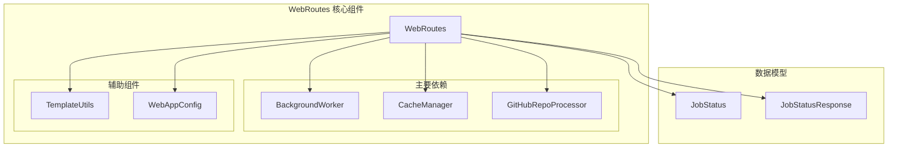
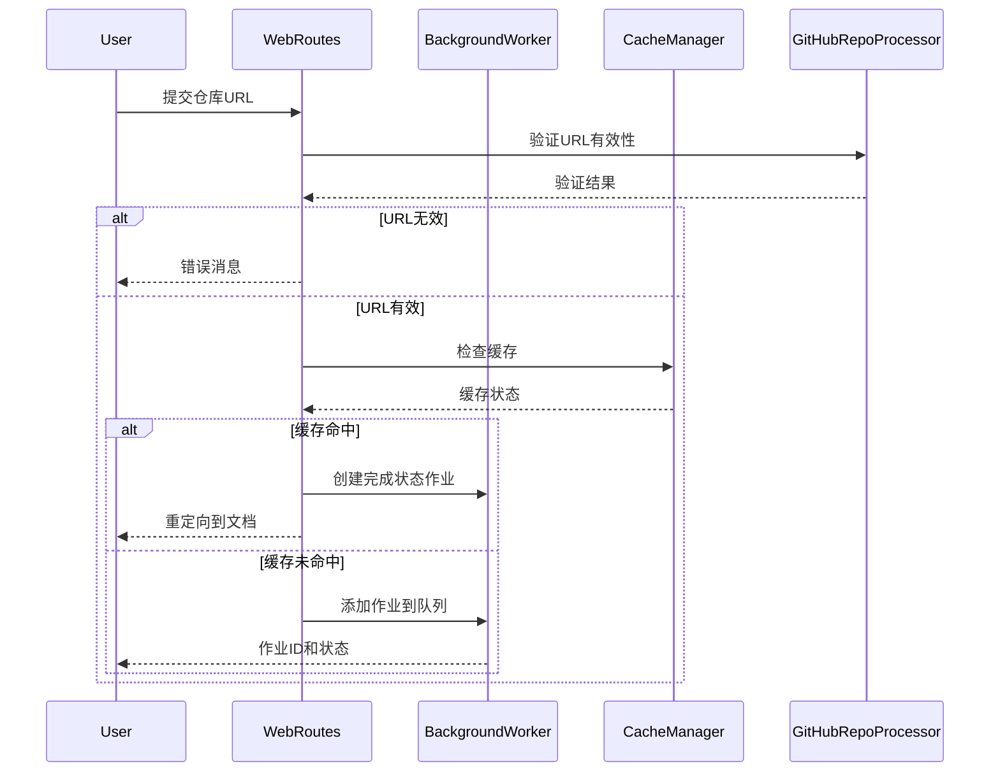
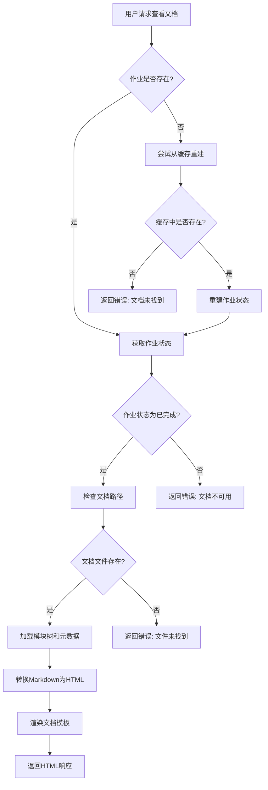
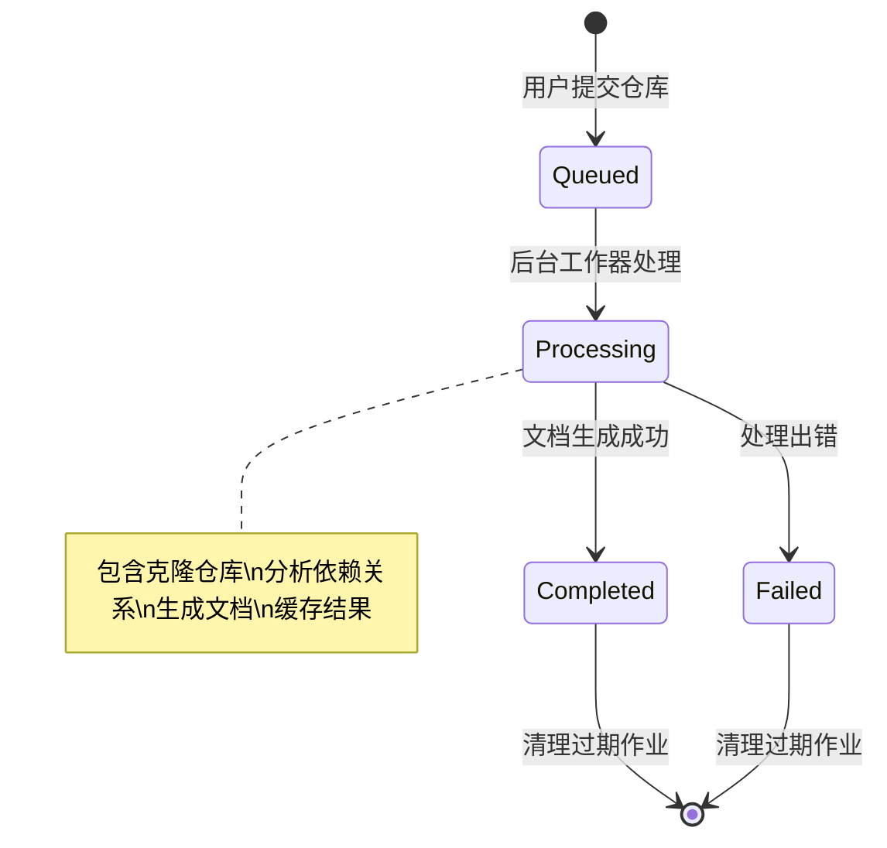
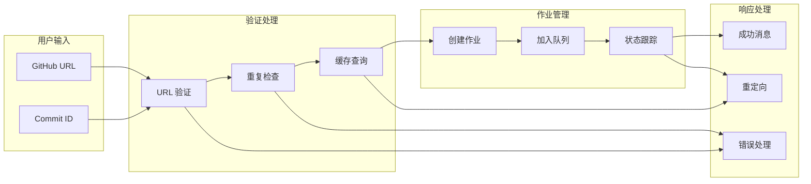
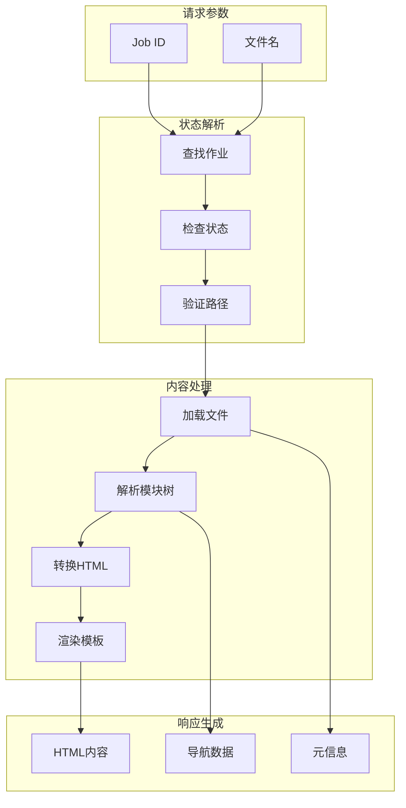

# routes 模块文档

## 概述

routes 模块是 CodeWiki Web 应用的前端路由处理核心，负责处理所有 HTTP 请求和响应。该模块通过 WebRoutes 类提供了完整的 Web 接口，包括仓库提交、作业状态查询、文档查看等功能，是用户与系统交互的主要入口点。

## 核心功能

### 1. 仓库提交处理
- 接收 GitHub 仓库 URL 和可选的提交 ID
- 验证仓库 URL 的有效性
- 检查重复提交和冷却时间
- 管理作业队列和缓存机制

### 2. 作业状态管理
- 实时跟踪文档生成作业的状态
- 提供作业进度查询接口
- 处理作业失败和重试逻辑
- 自动清理过期作业记录

### 3. 文档服务
- 提供生成的文档浏览功能
- 支持 Markdown 到 HTML 的转换
- 实现文档导航和模块树展示
- 处理缓存命中的文档服务

### 4. 缓存集成
- 与缓存管理器协同工作
- 优先从缓存提供已生成的文档
- 管理缓存命中和未命中的处理流程

## 架构设计

### 组件结构



### 请求处理流程



### 文档服务流程



## 核心组件详解

### WebRoutes 类

WebRoutes 是模块的核心类，封装了所有路由处理逻辑：

#### 主要方法

| 方法 | 功能 | HTTP方法 | 路径 |
|------|------|----------|------|
| `index_get` | 显示主页面和最近作业 | GET | / |
| `index_post` | 处理仓库提交 | POST | / |
| `get_job_status` | 获取作业状态 | GET | /api/job/{job_id}/status |
| `view_docs` | 重定向到文档 | GET | /view-docs/{job_id}/ |
| `serve_generated_docs` | 提供文档内容 | GET | /static-docs/{job_id}/{filename} |

#### 关键特性

1. **URL 标准化**: 使用 `_normalize_github_url` 确保 URL 格式一致
2. **作业 ID 生成**: 通过 `_repo_full_name_to_job_id` 将仓库全名转换为安全的作业 ID
3. **重复检测**: 防止同一仓库在短时间内重复提交
4. **缓存优先**: 优先从缓存提供已生成的文档

### 作业生命周期管理



## 数据流设计

### 仓库提交流程



### 文档服务数据流



## 错误处理机制

### 验证错误
- **无效 URL**: 检查 GitHub URL 格式和域名
- **空输入**: 验证必填字段
- **重复提交**: 检查队列中是否已有相同仓库

### 处理错误
- **克隆失败**: Git 操作超时或权限问题
- **文档生成失败**: 依赖分析或生成过程出错
- **文件系统错误**: 缓存或临时文件访问问题

### 用户友好的错误消息
```python
# 错误处理示例
if not GitHubRepoProcessor.is_valid_github_url(repo_url):
    message = "请输入有效的 GitHub 仓库 URL"
    message_type = "error"
```

## 性能优化

### 缓存策略
1. **多级缓存**: 内存中的作业状态 + 磁盘上的文档缓存
2. **智能命中**: 优先使用缓存，避免重复处理
3. **过期管理**: 自动清理过期缓存和作业记录

### 并发处理
1. **异步响应**: 快速响应用户请求，后台处理耗时操作
2. **队列管理**: 有序处理多个仓库的文档生成请求
3. **状态同步**: 实时更新作业进度和状态

### 资源管理
1. **临时文件清理**: 自动删除克隆的仓库文件
2. **内存优化**: 定期清理过期作业状态
3. **磁盘空间**: 管理缓存大小和生命周期

## 配置集成

WebRoutes 与 [WebAppConfig](config.md) 紧密集成，使用以下关键配置：

- `RETRY_COOLDOWN_MINUTES`: 失败重试的冷却时间
- `JOB_CLEANUP_HOURS`: 作业清理的时间窗口
- `CACHE_EXPIRY_DAYS`: 缓存过期时间
- `QUEUE_SIZE`: 作业队列大小限制

## 安全考虑

### 输入验证
- URL 格式验证防止恶意输入
- 文件路径检查防止目录遍历攻击
- 作业 ID 规范化确保安全性

### 错误信息
- 避免暴露内部实现细节
- 提供用户友好的错误消息
- 记录详细错误日志用于调试

## 扩展性设计

### 模块化架构
- 清晰的组件分离便于功能扩展
- 标准化的接口支持新的处理器类型
- 插件化的模板系统支持自定义界面

### 性能扩展
- 支持水平扩展的后台工作器
- 分布式缓存支持
- 异步处理架构

## 相关模块

- [background_worker](background_worker.md): 后台作业处理
- [cache_manager](cache_manager.md): 文档缓存管理
- [github_processor](github_processor.md): GitHub 仓库处理
- [models](models.md): 数据模型定义
- [config](config.md): Web 应用配置