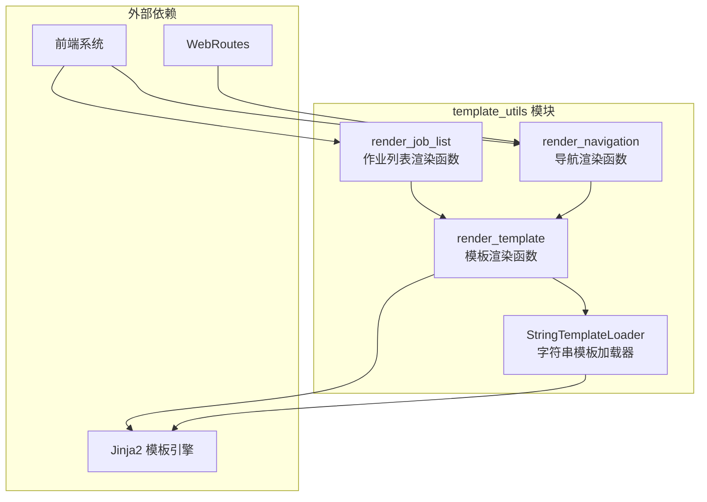
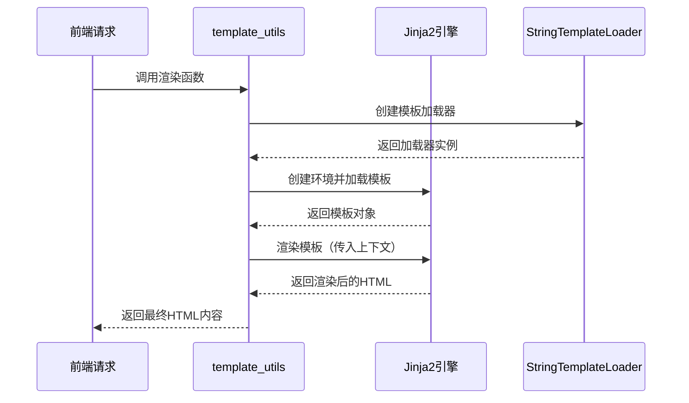
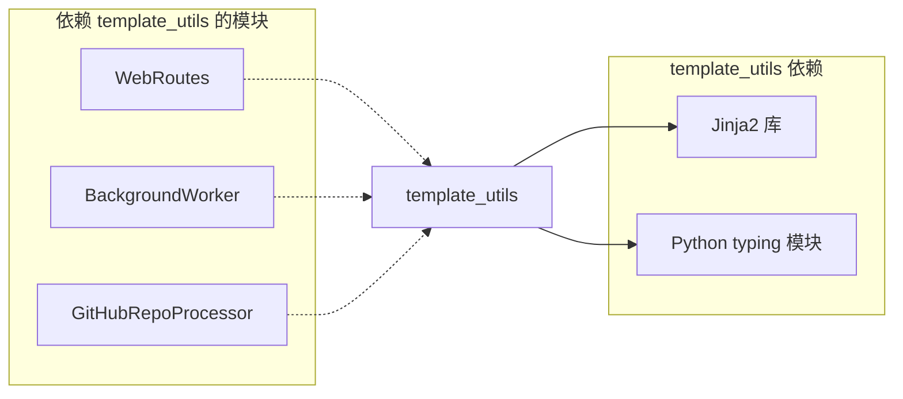

# template_utils 模块文档

## 简介

template_utils 模块是 CodeWiki 前端系统的模板工具模块，专门用于处理 Jinja2 模板渲染。该模块提供了自定义的模板加载器和渲染函数，支持从字符串模板生成 HTML 内容，主要用于构建动态导航菜单和作业列表等界面组件。

## 核心功能

- **字符串模板加载**：自定义 Jinja2 模板加载器，支持直接从字符串加载模板
- **动态内容渲染**：将上下文数据渲染到 HTML 模板中
- **导航菜单生成**：根据模块树结构动态生成导航 HTML
- **作业列表渲染**：渲染作业状态列表的 HTML 内容

## 架构设计

### 组件结构图



### 数据流图



## 核心组件详解

### StringTemplateLoader 类

`StringTemplateLoader` 是自定义的 Jinja2 模板加载器，继承自 `BaseLoader`。它的主要特点包括：

- **直接字符串加载**：无需文件系统，直接从字符串加载模板内容
- **简化模板管理**：适用于动态生成的模板内容
- **线程安全**：支持多线程环境下的并发访问

#### 使用场景

- 动态生成的 HTML 模板
- 配置化的界面组件
- 临时模板渲染需求

### 渲染函数

#### render_template 函数

通用的模板渲染函数，提供以下功能：

- **自动转义**：对 HTML 和 XML 内容自动进行安全转义
- **空白控制**：自动去除多余的空白字符
- **灵活上下文**：支持任意字典类型的上下文数据

#### render_navigation 函数

专门用于生成导航菜单的渲染函数：

- **模块树解析**：递归处理嵌套的模块结构
- **当前页面高亮**：根据当前页面自动设置活动状态
- **层级化展示**：支持多级导航菜单的生成

#### render_job_list 函数

作业列表渲染专用函数：

- **状态显示**：根据作业状态显示不同的样式
- **进度展示**：支持作业进度的可视化显示
- **操作链接**：为完成的作业提供文档查看链接

## 系统集成

### 与前端系统的集成

template_utils 模块主要服务于前端系统，与以下组件协同工作：

- **[WebRoutes](routes.md)**：提供路由处理，调用模板渲染函数生成页面内容
- **[BackgroundWorker](background_worker.md)**：在后台任务中使用模板渲染生成报告
- **[GitHubRepoProcessor](github_processor.md)**：处理 GitHub 仓库时生成状态页面

### 依赖关系



## 使用示例

### 基本模板渲染

```python
from codewiki.src.fe.template_utils import render_template

# 定义模板
template = "<h1>Hello {{ name }}!</h1>"

# 渲染模板
html = render_template(template, {"name": "World"})
# 结果: <h1>Hello World!</h1>
```

### 导航菜单生成

```python
from codewiki.src.fe.template_utils import render_navigation

# 模块树结构
module_tree = {
    "core": {
        "components": ["Component1", "Component2"],
        "children": {
            "submodule": {
                "components": ["SubComponent"]
            }
        }
    }
}

# 生成导航
nav_html = render_navigation(module_tree, "core.md")
```

### 作业列表渲染

```python
from codewiki.src.fe.template_utils import render_job_list

# 作业数据
jobs = [
    {
        "repo_url": "https://github.com/user/repo",
        "status": "completed",
        "progress": "100%",
        "job_id": "12345",
        "docs_path": "/docs/12345"
    }
]

# 渲染作业列表
jobs_html = render_job_list(jobs)
```

## 配置选项

### Jinja2 环境配置

`render_template` 函数使用以下 Jinja2 环境配置：

- **自动转义**：对 HTML/XML 内容启用自动转义
- **空白控制**：启用 `trim_blocks` 和 `lstrip_blocks`
- **模板加载器**：使用自定义的 `StringTemplateLoader`

### 安全特性

- **XSS 防护**：通过自动转义防止跨站脚本攻击
- **模板隔离**：每个渲染调用使用独立的 Jinja2 环境
- **输入验证**：对模板字符串和上下文数据进行基本验证

## 性能考虑

### 优化策略

- **轻量级加载器**：`StringTemplateLoader` 设计简洁，减少内存开销
- **环境复用**：虽然每个调用创建新环境，但配置优化确保快速初始化
- **字符串操作**：使用高效的字符串处理方法

### 扩展性

- **自定义过滤器**：可以轻松扩展以支持自定义 Jinja2 过滤器
- **全局函数**：支持添加全局函数到 Jinja2 环境
- **主题支持**：可以通过上下文数据实现主题化渲染

## 错误处理

### 异常处理

- **模板语法错误**：Jinja2 会抛出 `TemplateSyntaxError`
- **渲染错误**：上下文数据问题会导致 `TemplateError`
- **类型错误**：错误的参数类型会触发 `TypeError`

### 调试支持

- **错误信息**：Jinja2 提供详细的错误信息和位置指示
- **模板追踪**：支持模板调用栈的追踪
- **日志记录**：可以集成日志系统记录渲染问题

## 最佳实践

### 模板设计

1. **保持简单**：模板逻辑应该简单，复杂逻辑应该在 Python 代码中处理
2. **使用继承**：对于复杂页面，考虑使用模板继承机制
3. **命名规范**：使用清晰的变量名和一致的命名约定

### 性能优化

1. **缓存模板**：对于重复使用的模板，考虑缓存渲染结果
2. **减少渲染调用**：合并多个小的渲染调用为大的渲染
3. **优化上下文**：只传递必要的上下文数据

### 安全建议

1. **验证输入**：对所有用户输入进行验证和清理
2. **使用自动转义**：始终启用自动转义功能
3. **限制模板功能**：避免在模板中执行复杂的逻辑或系统调用