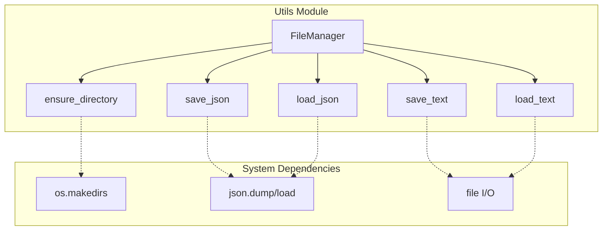
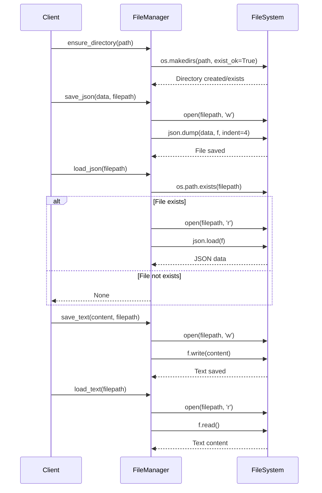
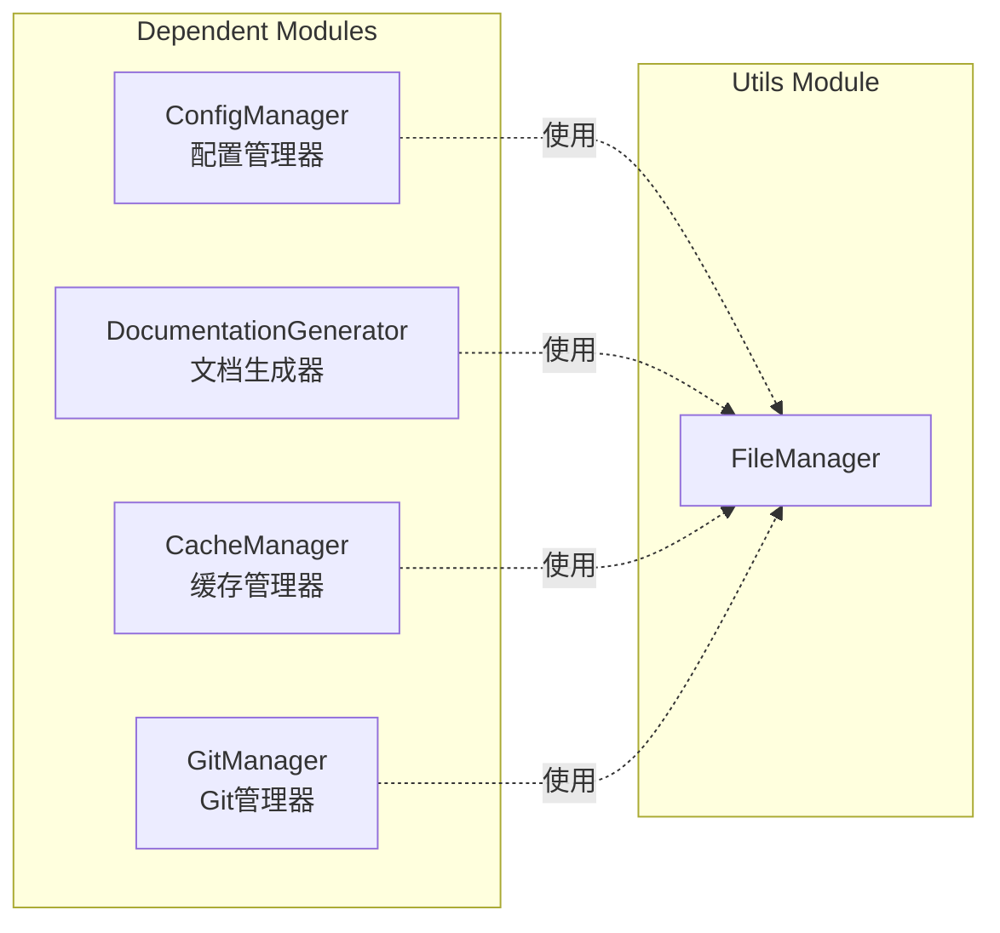

# Utils 模块文档

## 简介

Utils 模块是 CodeWiki 系统的基础工具模块，提供了文件输入输出操作的核心功能。该模块通过 `FileManager` 类封装了常用的文件操作，为整个系统提供统一的文件处理接口。

## 架构概览



## 核心组件

### FileManager 类

`FileManager` 是 utils 模块的核心组件，提供了静态方法来处理各种文件操作。该类设计为静态工具类，无需实例化即可使用其所有功能。

#### 主要功能

1. **目录管理**
   - 自动创建不存在的目录结构
   - 确保文件保存路径的有效性

2. **JSON 文件处理**
   - 将 Python 对象序列化为 JSON 格式并保存
   - 从 JSON 文件反序列化数据
   - 优雅处理文件不存在的情况

3. **文本文件处理**
   - 保存文本内容到文件
   - 从文件加载文本内容

#### 方法详解

| 方法 | 参数 | 返回值 | 描述 |
|------|------|--------|------|
| `ensure_directory(path: str)` | `path`: 目录路径 | `None` | 创建目录（如果不存在） |
| `save_json(data: Any, filepath: str)` | `data`: 要保存的数据<br>`filepath`: 文件路径 | `None` | 将数据以 JSON 格式保存到文件 |
| `load_json(filepath: str)` | `filepath`: 文件路径 | `Optional[Dict[str, Any]]` | 从 JSON 文件加载数据，文件不存在时返回 None |
| `save_text(content: str, filepath: str)` | `content`: 文本内容<br>`filepath`: 文件路径 | `None` | 将文本内容保存到文件 |
| `load_text(filepath: str)` | `filepath`: 文件路径 | `str` | 从文件加载文本内容 |

## 数据流图



## 模块集成

Utils 模块作为基础工具模块，被系统的其他模块广泛引用：



- **[ConfigManager](config_manager.md)**: 使用 FileManager 加载和保存配置文件
- **[DocumentationGenerator](documentation_generator.md)**: 使用 FileManager 保存生成的文档文件
- **[CacheManager](cache_manager.md)**: 使用 FileManager 管理缓存文件的读写
- **[GitManager](git_manager.md)**: 使用 FileManager 处理 Git 相关的文件操作

## 使用示例

### 基本文件操作

```python
from codewiki.src.utils import FileManager

# 确保目录存在
FileManager.ensure_directory("/path/to/directory")

# 保存 JSON 数据
data = {"key": "value", "number": 42}
FileManager.save_json(data, "/path/to/file.json")

# 加载 JSON 数据
loaded_data = FileManager.load_json("/path/to/file.json")
if loaded_data is not None:
    print(f"Loaded data: {loaded_data}")

# 保存文本内容
text_content = "This is some text content"
FileManager.save_text(text_content, "/path/to/file.txt")

# 加载文本内容
loaded_text = FileManager.load_text("/path/to/file.txt")
print(f"Loaded text: {loaded_text}")
```

### 错误处理

```python
# 安全地加载可能不存在的 JSON 文件
config = FileManager.load_json("config.json")
if config is None:
    # 使用默认配置
    config = {"default": "settings"}
    FileManager.save_json(config, "config.json")
```

## 设计特点

1. **静态方法设计**: 所有方法都是静态的，无需实例化即可使用
2. **错误处理**: 对文件不存在的情况提供优雅的处理（返回 None）
3. **JSON 格式化**: 自动使用 4 空格缩进格式化 JSON 输出
4. **目录自动创建**: 自动创建所需的目录结构
5. **类型安全**: 使用类型注解提供良好的 IDE 支持和代码提示

## 扩展性

FileManager 的设计允许轻松扩展以支持更多的文件格式和操作：

- 可以添加对 YAML、XML 等格式的支持
- 可以添加文件压缩、加密等功能
- 可以添加批量文件操作的方法

这种模块化的设计使得 FileManager 成为整个系统的文件操作中心，确保了文件处理的一致性和可靠性。