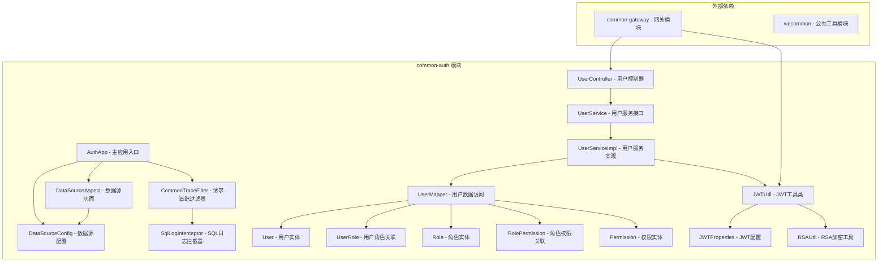
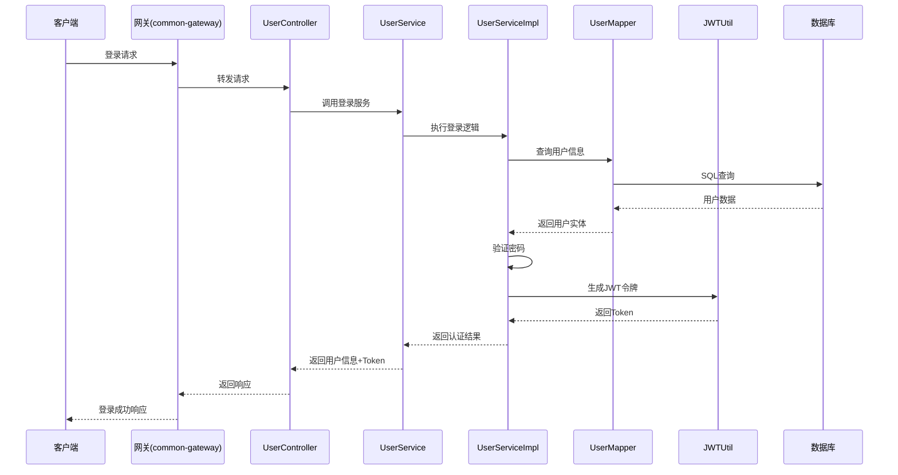
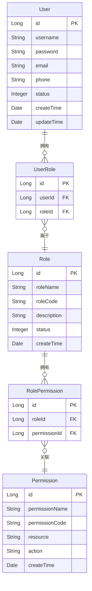

# common-auth 模块文档

## 简介

common-auth 模块是整个系统的核心认证授权中心，提供统一的用户认证、权限管理和 JWT 令牌服务。该模块采用 Spring Boot 框架构建，集成了 RBAC（基于角色的访问控制）模型，为整个微服务架构提供安全认证基础。

## 核心功能

- **用户认证管理**：提供用户注册、登录、注销等基础认证功能
- **权限控制**：基于 RBAC 模型实现细粒度的权限控制
- **JWT 令牌服务**：生成和验证 JSON Web Token
- **角色管理**：支持多角色配置和权限分配
- **数据源配置**：统一的数据源管理和监控
- **安全拦截**：请求过滤和 SQL 注入防护

## 架构设计

### 整体架构图



### 组件交互流程



### RBAC 权限模型



## 核心组件详解

### 1. 应用入口 - AuthApp

AuthApp 是 common-auth 模块的主启动类，负责初始化 Spring Boot 应用并加载相关配置。

**主要功能：**
- 启动 Spring Boot 应用
- 加载数据源配置
- 初始化安全拦截器
- 注册全局过滤器

### 2. 控制层 - UserController

UserController 处理所有与用户相关的 HTTP 请求，提供 RESTful API 接口。

**核心接口：**
- `POST /api/auth/login` - 用户登录
- `POST /api/auth/register` - 用户注册
- `POST /api/auth/logout` - 用户登出
- `GET /api/auth/user/info` - 获取用户信息
- `PUT /api/auth/user/password` - 修改密码
- `GET /api/auth/permission/{userId}` - 获取用户权限

### 3. 服务层 - UserService & UserServiceImpl

UserService 定义用户相关的业务逻辑接口，UserServiceImpl 提供具体实现。

**主要功能：**
- 用户认证逻辑处理
- 密码加密和验证
- JWT 令牌生成和刷新
- 权限计算和缓存
- 用户状态管理

### 4. 数据访问层 - UserMapper

UserMapper 负责用户数据的持久化操作，提供数据库访问接口。

**核心方法：**
- `selectByUsername(String username)` - 根据用户名查询用户
- `selectPermissionsByUserId(Long userId)` - 查询用户权限
- `selectRolesByUserId(Long userId)` - 查询用户角色
- `insertUser(User user)` - 新增用户
- `updatePassword(Long userId, String newPassword)` - 更新密码

### 5. JWT 工具类 - JWTUtil

JWTUtil 提供 JSON Web Token 的生成、解析和验证功能。

**核心功能：**
- 生成用户认证 Token
- 验证 Token 有效性
- 解析 Token 中的用户信息
- Token 刷新机制
- RSA 非对称加密支持

### 6. 安全工具类 - RSAUtil

RSAUtil 提供 RSA 非对称加密算法的实现，用于敏感数据加密。

**主要功能：**
- RSA 密钥对生成
- 公钥加密
- 私钥解密
- 数字签名和验证

### 7. 实体类设计

#### User 实体
```java
public class User {
    private Long id;           // 用户ID
    private String username;   // 用户名
    private String password;   // 密码（加密存储）
    private String email;      // 邮箱
    private String phone;      // 手机号
    private Integer status;    // 状态：0-禁用，1-启用
    private Date createTime;   // 创建时间
    private Date updateTime;   // 更新时间
}
```

#### Role 实体
```java
public class Role {
    private Long id;              // 角色ID
    private String roleName;      // 角色名称
    private String roleCode;      // 角色编码
    private String description;   // 角色描述
    private Integer status;       // 状态：0-禁用，1-启用
    private Date createTime;      // 创建时间
}
```

#### Permission 实体
```java
public class Permission {
    private Long id;                // 权限ID
    private String permissionName;  // 权限名称
    private String permissionCode;  // 权限编码
    private String resource;        // 资源路径
    private String action;          // 操作类型
    private Date createTime;        // 创建时间
}
```

### 8. 数据源管理

#### DataSourceConfig
统一配置数据源连接信息，支持多数据源配置。

#### DataSourceAspect
通过 AOP 切面实现数据源的动态切换和监控。

#### SqlLogInterceptor
拦截 SQL 执行，记录 SQL 日志，便于性能分析和问题排查。

### 9. 请求追踪 - CommonTraceFilter

CommonTraceFilter 实现请求的全链路追踪，记录请求的关键信息。

**主要功能：**
- 生成请求唯一追踪ID
- 记录请求开始和结束时间
- 收集请求性能指标
- 异常信息捕获和记录

## 安全机制

### 1. 密码安全
- 使用 BCrypt 算法进行密码加密
- 每个密码使用不同的盐值
- 支持密码强度校验

### 2. JWT 安全
- 使用 RSA 非对称加密签名
- Token 包含过期时间
- 支持 Token 刷新机制
- 防止 Token 重放攻击

### 3. 接口安全
- 所有敏感接口需要认证
- 基于 RBAC 的权限控制
- SQL 注入防护
- XSS 攻击防护

## 集成关系

### 与 common-gateway 集成
common-gateway 模块通过 Feign 客户端调用 common-auth 的服务：

- **UserClient**: 调用用户认证相关接口
- **TokenFilter**: 验证 JWT Token 有效性
- **LoginRequestFilter**: 处理登录请求转发

### 与 wecommon 集成
common-auth 依赖 wecommon 模块提供的公共工具：

- **WebResult**: 统一响应格式
- **AuthConstant**: 认证相关常量
- **CheckTokenRequestDTO**: Token 验证请求DTO
- **LoginRequestDTO**: 登录请求DTO

## 配置说明

### JWT 配置 (JWTProperties)
```yaml
jwt:
  secret: ${JWT_SECRET:your-secret-key}
  expiration: ${JWT_EXPIRATION:86400}
  header: ${JWT_HEADER:Authorization}
  prefix: ${JWT_PREFIX:Bearer}
  rsa:
    public-key: ${RSA_PUBLIC_KEY:classpath:rsa_public.key}
    private-key: ${RSA_PRIVATE_KEY:classpath:rsa_private.key}
```

### 数据源配置
```yaml
spring:
  datasource:
    url: ${DB_URL:jdbc:mysql://localhost:3306/auth_db}
    username: ${DB_USERNAME:root}
    password: ${DB_PASSWORD:password}
    driver-class-name: com.mysql.cj.jdbc.Driver
    
mybatis:
  mapper-locations: classpath:mapper/*.xml
  type-aliases-package: com.wecommon.auth.entity
```

## 部署和运维

### 健康检查
```bash
GET /actuator/health
```

### 指标监控
```bash
GET /actuator/metrics
```

### 日志配置
日志文件位于：`/logs/auth/auth.log`

## 最佳实践

### 1. 用户注册
- 用户名唯一性校验
- 密码强度要求：至少8位，包含大小写字母、数字和特殊字符
- 邮箱格式验证
- 手机号格式验证

### 2. 登录安全
- 登录失败次数限制
- 验证码防暴力破解
- 异地登录提醒
- 单点登录控制

### 3. 权限设计
- 遵循最小权限原则
- 角色权限定期审计
- 敏感操作二次认证
- 权限变更记录

### 4. 性能优化
- 用户权限缓存
- JWT Token 缓存
- 数据库连接池优化
- SQL 性能监控

## 故障排查

### 常见问题

1. **Token 验证失败**
   - 检查 JWT 配置是否正确
   - 确认 Token 是否过期
   - 验证 RSA 密钥是否匹配

2. **数据库连接异常**
   - 检查数据源配置
   - 确认数据库服务状态
   - 查看连接池配置

3. **权限验证失败**
   - 检查用户角色配置
   - 确认权限数据完整性
   - 验证权限缓存状态

### 监控指标

- 登录成功率
- Token 生成/验证性能
- 数据库查询性能
- 接口响应时间

## 扩展功能

### 1. 多因素认证 (MFA)
支持基于时间的一次性密码 (TOTP) 认证。

### 2. OAuth2 集成
支持第三方登录，如 Google、GitHub、微信等。

### 3. 单点登录 (SSO)
支持跨系统的单点登录功能。

### 4. 审计日志
记录所有认证和授权相关的操作日志。

## 相关文档

- [common-gateway.md](common-gateway.md) - 网关模块文档
- [wecommon.md](wecommon.md) - 公共工具模块文档
- [custodian-core.md](custodian-core.md) - 托管核心模块文档
- [dweb-core.md](dweb-core.md) - 核心模块文档