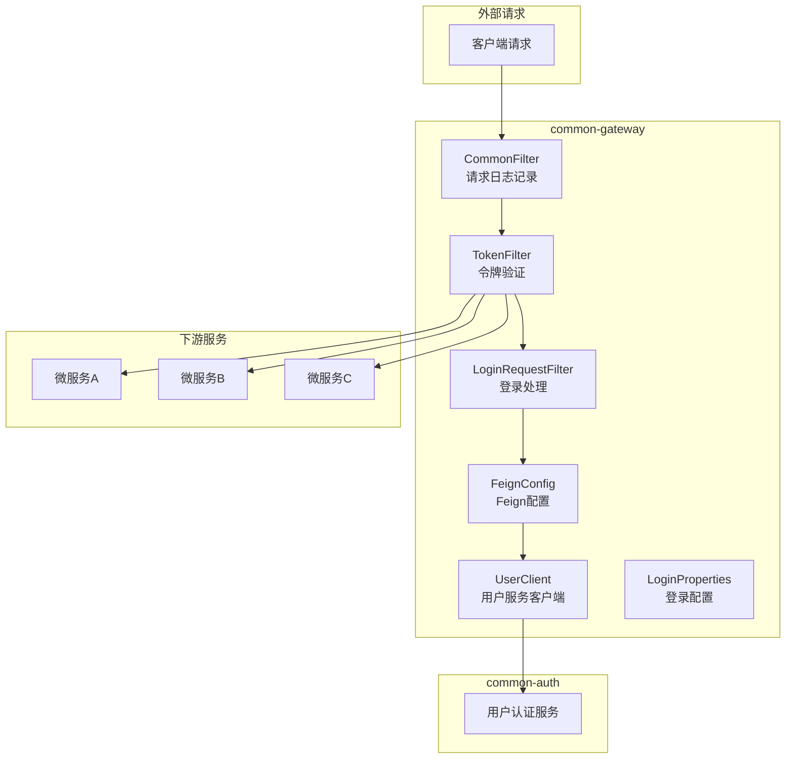
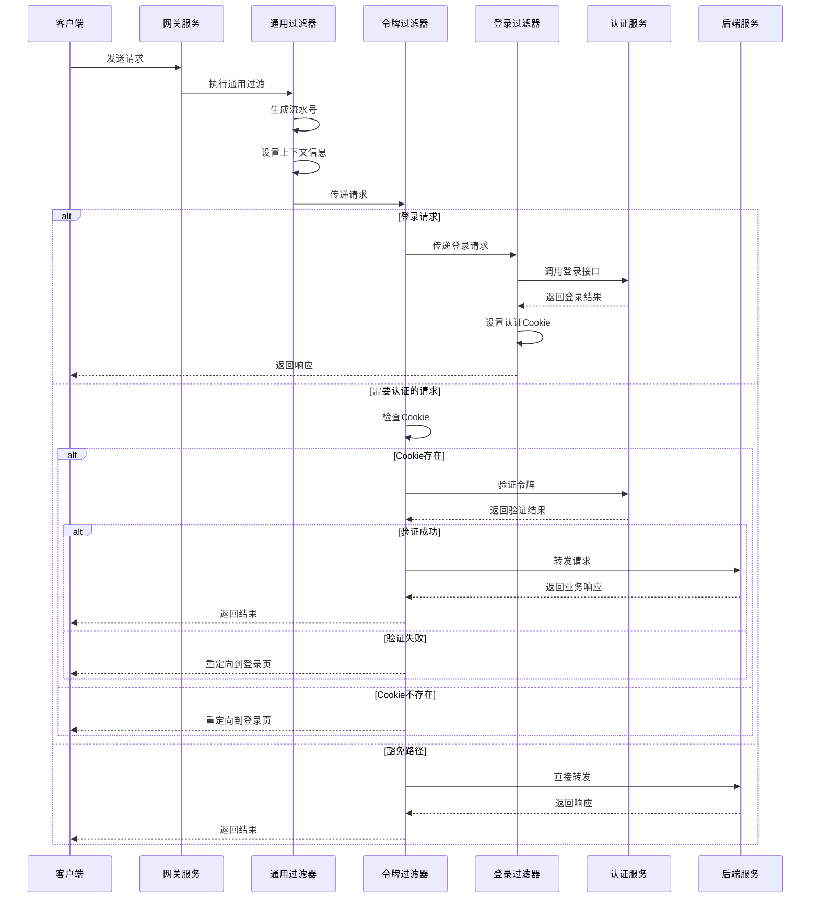
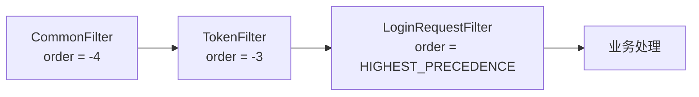
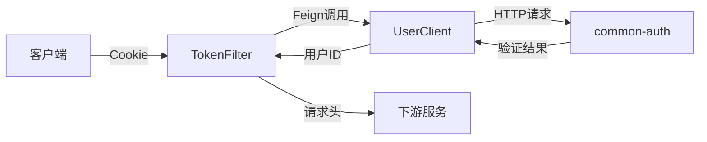
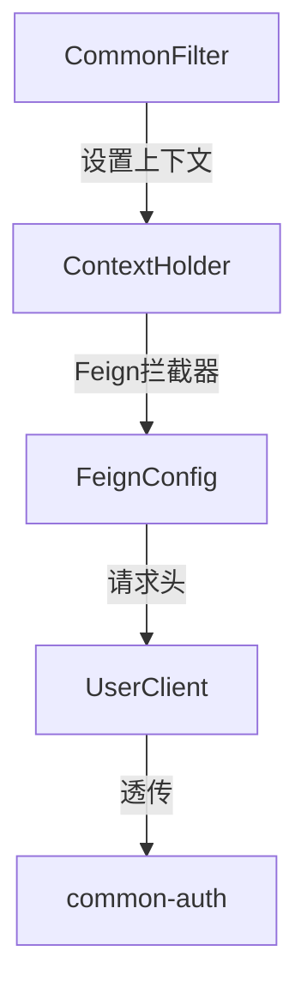

# common-gateway 模块文档

## 简介

common-gateway 模块是系统的统一网关服务，基于 Spring Cloud Gateway 构建，负责所有外部请求的统一入口管理、认证授权、路由转发和跨服务通信。作为微服务架构的核心组件，网关模块提供了请求过滤、用户认证、令牌验证、上下文传递等关键功能，确保系统的安全性和可观测性。

## 核心功能

### 1. 统一请求入口管理
- 所有外部请求通过网关进入系统
- 请求日志记录和性能监控
- 请求上下文信息传递（流水号、语言环境、租户信息）

### 2. 用户认证与授权
- 基于 Cookie 的令牌认证机制
- 与 common-auth 服务集成进行用户验证
- 登录/登出流程处理
- Swagger 文档路径和忘记密码路径的认证豁免

### 3. 路由与负载均衡
- 基于 Nacos 的服务发现和注册
- 动态路由配置
- 客户端负载均衡

### 4. 跨服务通信
- Feign 客户端配置
- 请求上下文透传
- 响应式编程支持（WebFlux）

## 架构设计

### 整体架构图



### 请求处理流程



### 过滤器执行顺序



## 核心组件详解

### GatewayApp - 网关启动类

网关服务的主启动类，负责启动 Spring Boot 应用并启用相关功能：

- `@SpringBootApplication`: 启用 Spring Boot 自动配置
- `@EnableDiscoveryClient`: 启用服务发现功能，注册到 Nacos
- `@EnableFeignClients`: 启用 Feign 客户端，支持服务间调用

### 过滤器组件

#### CommonFilter - 通用请求过滤器

**功能职责：**
- 请求日志记录和性能监控
- 生成全局唯一的请求流水号（reqSeq）
- 提取和设置语言环境、租户信息
- 请求上下文信息传递

**处理流程：**
1. 生成基于时间戳和 UUID 的流水号
2. 从请求头中提取语言环境和租户信息
3. 将上下文信息存储到 ThreadLocal 和 MDC
4. 修改请求头，添加流水号和上下文信息
5. 记录请求开始日志
6. 请求完成后记录耗时日志
7. 清理上下文信息

**执行顺序：** -4（最先执行）

#### TokenFilter - 令牌验证过滤器

**功能职责：**
- Cookie 令牌验证
- 用户身份认证
- 认证失败处理和重定向
- 用户 ID 透传

**认证流程：**
1. 检查请求路径是否需要认证（排除登录、登出、Swagger、忘记密码路径）
2. 从 Cookie 中获取令牌
3. 如果令牌不存在，重定向到登录页面
4. 调用 common-auth 服务验证令牌有效性
5. 验证失败时清除 Cookie 并重定向
6. 验证成功时提取用户 ID 并添加到请求头
7. 继续传递请求到下游服务

**执行顺序：** -3

#### LoginRequestFilter - 登录请求过滤器

**功能职责：**
- 登录成功后的 Cookie 设置
- 登出成功后的 Cookie 清除
- 响应结果装饰处理

**处理逻辑：**
- **登录请求：** 拦截登录响应，如果登录成功，设置认证 Cookie（包含令牌）
- **登出请求：** 拦截登出响应，如果登出成功，清除认证 Cookie

**Cookie 属性：**
- `httpOnly`: true（防止 XSS 攻击）
- `path`: 可配置
- `domain`: 可配置
- `maxAge`: 可配置的超时时间

**执行顺序：** HIGHEST_PRECEDENCE（最高优先级）

### 配置组件

#### FeignConfig - Feign 客户端配置

**功能职责：**
- Feign 客户端的自定义配置
- 请求拦截器配置
- 消息转换器配置

**核心功能：**
- **请求拦截器：** 将当前线程上下文信息（流水号、语言环境、租户信息）添加到 Feign 请求头中，实现跨服务的上下文透传
- **消息转换器：** 配置 HTTP 消息转换器，确保正确的数据格式转换

#### LoginProperties - 登录配置属性

**配置项：**
- `loginPage`: 登录页面地址
- `loginSuccessPage`: 登录成功页面地址
- `loginErrorPage`: 登录错误页面地址
- `loginOutPage`: 登出页面地址
- `cookiePath`: Cookie 路径
- `cookieDomain`: Cookie 域名
- `cookieTimeOut`: Cookie 超时时间（秒）

### 服务客户端

#### UserClient - 用户服务 Feign 客户端

**功能职责：**
- 与 common-auth 服务进行通信
- 提供用户登录、登出、令牌验证等功能

**接口方法：**
- `login()`: 用户登录
- `logout()`: 用户登出
- `checkToken()`: 令牌验证（支持 WebFlux 方式）

## 数据流与交互

### 认证数据流



### 上下文传递流程



## 配置说明

### 应用配置

```properties
# 应用名称
spring.application.name=common-gateway

# Nacos 配置中心
spring.cloud.nacos.config.server-addr=113.46.162.30:8850
spring.cloud.nacos.config.namespace=fusioncore_dev
spring.cloud.nacos.config.username=${NACOS_USERNAME}
spring.cloud.nacos.config.password=${NACOS_PASSWORD}

# Nacos 服务发现
spring.cloud.nacos.discovery.server-addr=${spring.cloud.nacos.config.server-addr}
spring.cloud.nacos.discovery.namespace=fusioncore_dev
spring.cloud.nacos.discovery.username=${NACOS_USERNAME}
spring.cloud.nacos.discovery.password=${NACOS_PASSWORD}

# 配置文件导入
spring.config.import=nacos:common-gateway.properties
```

### JWT 配置

```properties
# JWT相关配置
jwt.loginPage=/login.html
jwt.loginSuccessPage=/index.html
jwt.loginErrorPage=/error.html
jwt.loginOutPage=/logout.html
jwt.cookiePath=/
jwt.cookieDomain=.example.com
jwt.cookieTimeOut=3600
```

## 安全特性

### 1. 认证安全
- **Cookie 安全：** 使用 httpOnly Cookie 防止 XSS 攻击
- **令牌验证：** 所有请求都需要有效的认证令牌
- **路径豁免：** 仅对必要路径开放访问（登录、Swagger 文档）

### 2. 上下文安全
- **请求隔离：** 每个请求都有独立的上下文信息
- **线程安全：** 使用 ThreadLocal 管理上下文，确保线程隔离
- **内存管理：** 及时清理上下文信息，防止内存泄漏

### 3. 通信安全
- **服务认证：** 内部服务调用需要认证
- **上下文透传：** 确保请求链路的一致性
- **错误处理：** 统一的错误处理和重定向机制

## 性能优化

### 1. 过滤器优化
- **执行顺序：** 合理的过滤器执行顺序，减少不必要的处理
- **短路处理：** 认证失败时直接返回，不继续后续处理
- **异步处理：** 使用响应式编程模型，提高并发处理能力

### 2. 缓存策略
- **Cookie 缓存：** 客户端缓存认证信息
- **上下文缓存：** 请求生命周期内缓存上下文信息

### 3. 连接优化
- **连接池：** Feign 客户端使用连接池
- **超时配置：** 合理的超时时间配置

## 监控与日志

### 1. 请求日志
```
收到请求:{timestamp}, Path:{path}, Request IP:{ip}, Language:{language}
完成请求, request_seq:{seq}, Path:{path}, Request IP:{ip}, cost time:{time}ms
```

### 2. 错误日志
- 认证失败日志
- 服务调用异常日志
- 配置错误日志

### 3. 性能指标
- 请求处理时间
- 认证成功率
- 服务调用延迟

## 依赖关系

### 内部依赖
- **wecommon:** 提供公共工具类、常量定义、DTO 对象等
- **common-auth:** 用户认证服务，提供登录、令牌验证等功能

### 外部依赖
- **Spring Cloud Gateway:** 网关核心框架
- **Spring Cloud OpenFeign:** 服务间调用
- **Spring Cloud Alibaba Nacos:** 服务注册与配置中心
- **Reactor:** 响应式编程框架

## 部署与运维

### 1. 部署要求
- Java 21+
- Spring Boot 3.x
- Spring Cloud 2023.x
- Nacos 2.x

### 2. 健康检查
- Spring Boot Actuator 健康端点
- 服务注册中心心跳检测
- 自定义健康检查指标

### 3. 故障排查
- **认证失败：** 检查 Cookie 配置、令牌有效性
- **服务调用失败：** 检查网络连接、服务注册状态
- **性能问题：** 监控过滤器执行时间、服务响应时间

## 最佳实践

### 1. 配置管理
- 使用配置中心统一管理配置
- 敏感信息使用环境变量
- 不同环境使用不同的配置文件

### 2. 安全策略
- 定期更新认证密钥
- 合理设置 Cookie 属性
- 实施最小权限原则

### 3. 性能调优
- 合理设置过滤器顺序
- 优化服务调用链路
- 实施适当的缓存策略

## 相关文档

- [common-auth 模块](common-auth.md) - 用户认证服务详细文档
- [wecommon 模块](wecommon.md) - 公共工具类和常量定义
- [Spring Cloud Gateway 官方文档](https://spring.io/projects/spring-cloud-gateway)