# custodian-common 模块文档

## 简介

custodian-common 模块是数字资产托管系统的核心组件库，提供了统一的托管服务接口和标准化的数据模型。该模块定义了与托管服务提供商交互的抽象层，支持企业钱包管理、地址管理、交易处理、身份验证等核心功能。

作为整个托管系统的基础模块，custodian-common 为上层业务模块提供了统一的 API 契约和数据传输对象（DTO），实现了业务逻辑与具体托管服务提供商实现的解耦。

## 架构概览

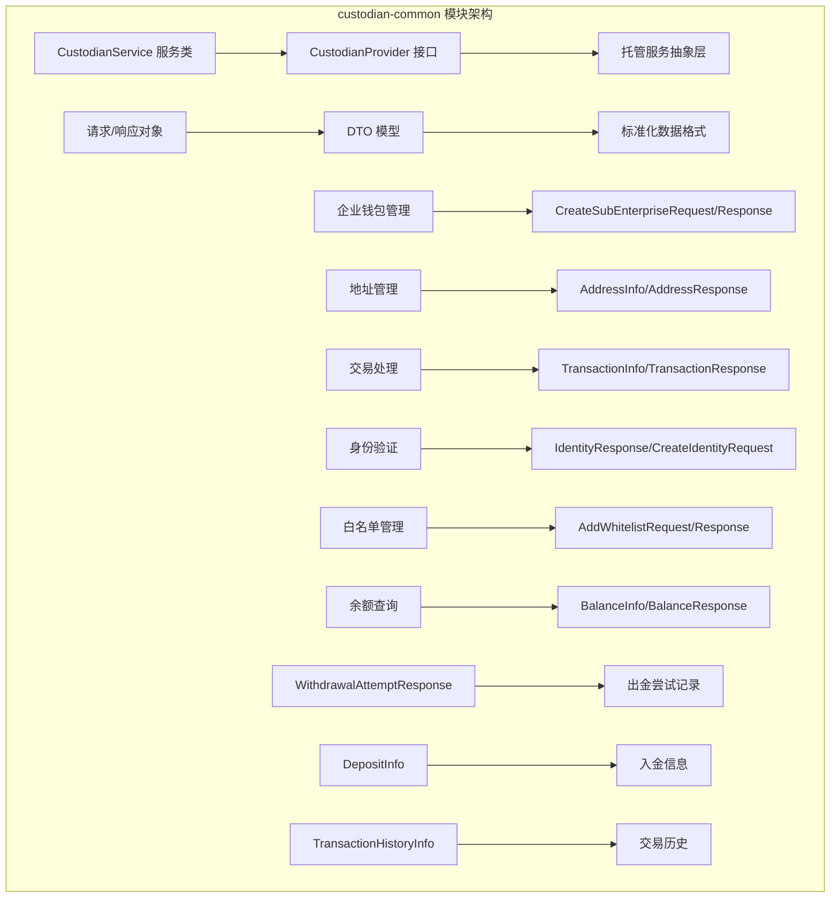

## 核心组件详解

### 1. 托管服务提供商接口

#### CustodianProvider
托管服务提供商的抽象接口，定义了所有托管操作的标准契约：

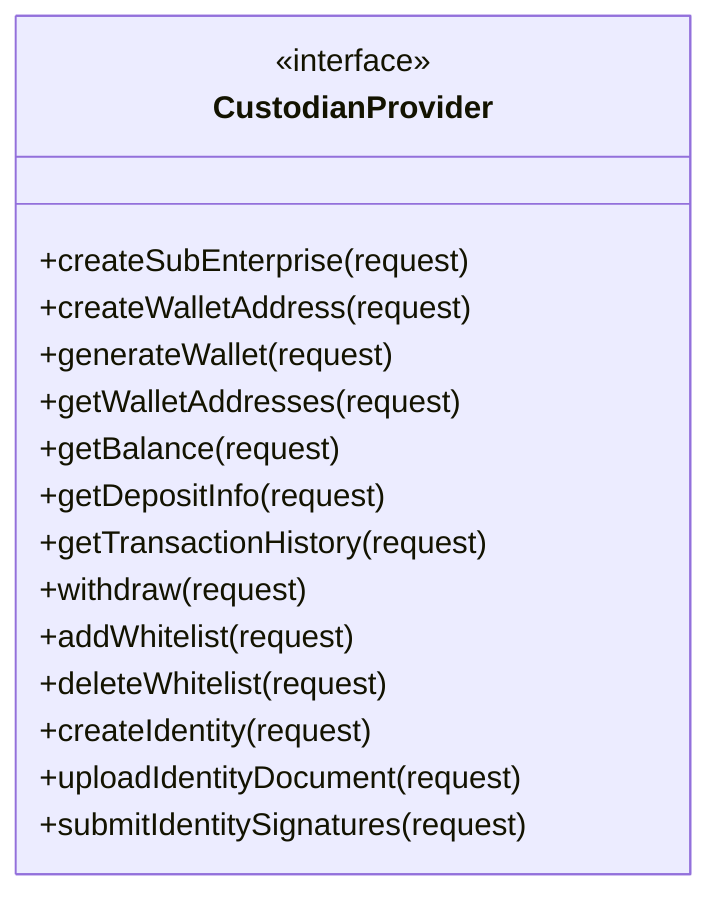

#### CustodianService
服务层实现，封装了托管操作的复杂逻辑，提供业务友好的 API：

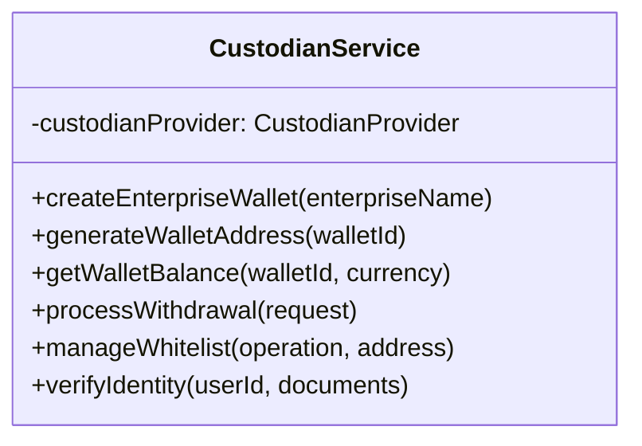

### 2. 数据模型架构

#### 企业钱包模型
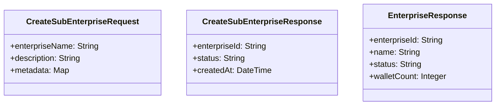

#### 地址管理模型
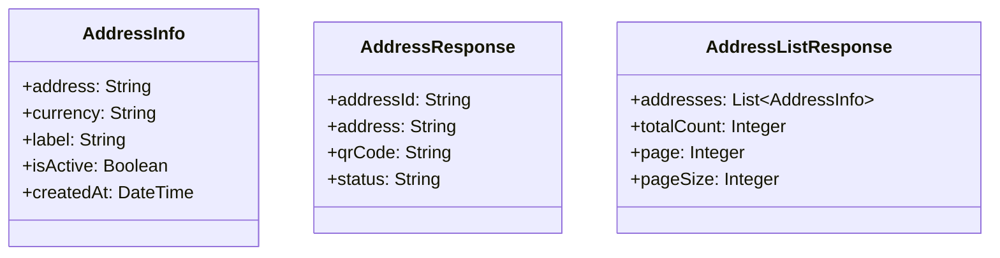

#### 交易处理模型
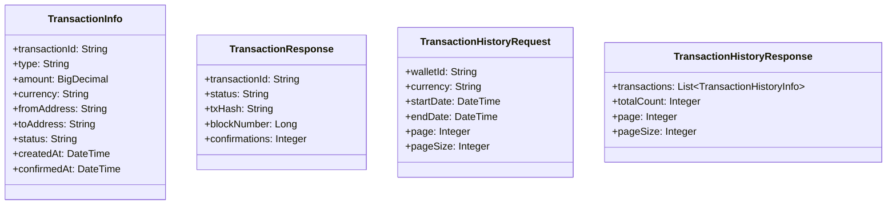

### 3. 白名单管理

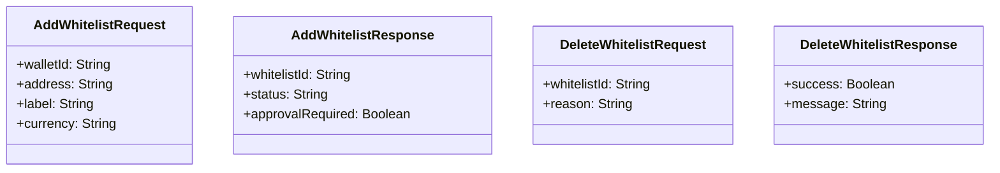

### 4. 身份验证模型

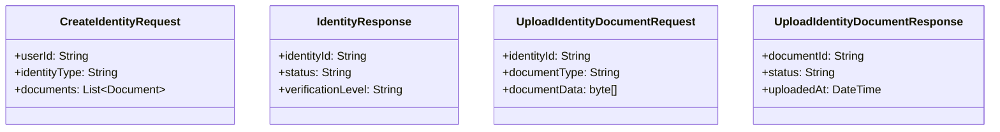

## 数据流架构

### 钱包创建流程
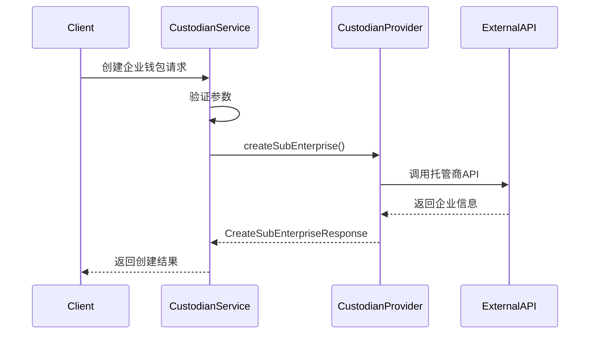

### 交易处理流程
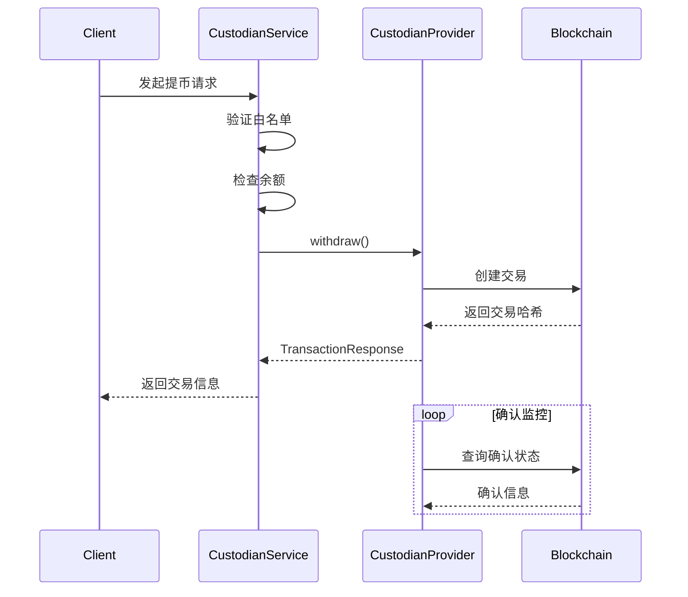

## 模块依赖关系

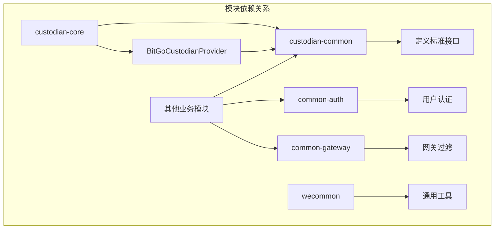

## 集成说明

### 与 custodian-core 模块集成

[custodian-core](custodian-core.md) 模块提供了 custodian-common 的具体实现，主要包含：
- `BitGoCustodianProvider`: BitGo 托管服务的具体实现
- 数据库实体和持久化层
- 控制器层实现

### 与认证模块集成

通过 [common-auth](common-auth.md) 模块进行用户身份验证：
- 使用 JWT token 进行 API 认证
- 基于角色的权限控制
- 用户会话管理

### 与网关模块集成

通过 [common-gateway](common-gateway.md) 模块进行请求过滤：
- Token 验证过滤器
- 登录请求处理
- 统一异常处理

## 使用示例

### 创建企业钱包
```java
// 创建企业钱包请求
CreateSubEnterpriseRequest request = CreateSubEnterpriseRequest.builder()
    .enterpriseName("Tech Corp")
    .description("Technology Company Wallet")
    .metadata(Map.of("industry", "technology"))
    .build();

// 调用服务
CreateSubEnterpriseResponse response = custodianService.createEnterpriseWallet(request);
String enterpriseId = response.getEnterpriseId();
```

### 生成钱包地址
```java
// 生成地址请求
CreateWalletAddressRequest request = CreateWalletAddressRequest.builder()
    .walletId(walletId)
    .currency("BTC")
    .label("Deposit Address")
    .build();

// 获取地址
AddressResponse response = custodianService.generateWalletAddress(request);
String address = response.getAddress();
String qrCode = response.getQrCode();
```

### 查询余额
```java
// 余额查询请求
BalanceRequest request = BalanceRequest.builder()
    .walletId(walletId)
    .currency("ETH")
    .build();

// 获取余额信息
BalanceResponse response = custodianService.getWalletBalance(request);
BalanceInfo balance = response.getBalance();
BigDecimal available = balance.getAvailable();
BigDecimal pending = balance.getPending();
```

### 添加白名单地址
```java
// 白名单添加请求
AddWhitelistRequest request = AddWhitelistRequest.builder()
    .walletId(walletId)
    .address("0x742d35Cc6634C0532925a3b844Bc9e7595f0bEb5")
    .label("Partner Address")
    .currency("ETH")
    .build();

// 添加白名单
AddWhitelistResponse response = custodianService.addWhitelist(request);
boolean approvalRequired = response.isApprovalRequired();
```

## 安全考虑

### 1. 数据加密
- 敏感数据在传输和存储时进行加密
- 使用 RSA 等非对称加密算法保护私钥信息
- 参考 [wecommon](wecommon.md) 模块中的 RSAUtil 工具类

### 2. 访问控制
- 基于角色的权限管理
- API 级别的访问控制
- 白名单地址的审批流程

### 3. 审计日志
- 所有交易操作记录审计日志
- 用户操作轨迹追踪
- 异常操作告警机制

## 错误处理

### 标准错误码
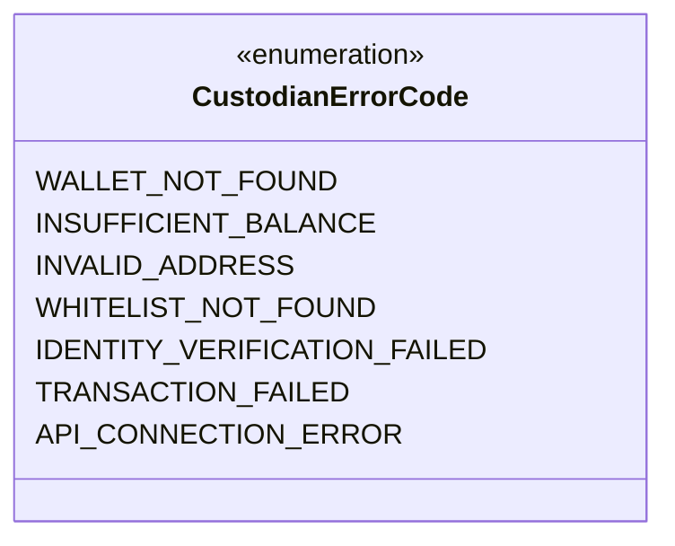

### 异常处理流程
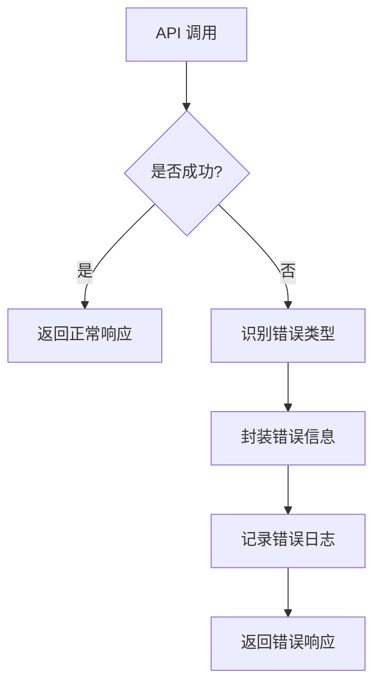

## 性能优化

### 1. 缓存策略
- 余额信息缓存（短时间）
- 白名单列表缓存
- 交易历史分页缓存

### 2. 异步处理
- 大额提币异步审批
- 批量地址生成
- 交易状态异步更新

### 3. 连接池管理
- HTTP 连接池优化
- 数据库连接池配置
- API 调用限流机制

## 监控和运维

### 1. 业务指标监控
- 钱包创建成功率
- 交易处理延迟
- 白名单操作频率

### 2. 系统指标监控
- API 响应时间
- 错误率统计
- 资源使用率

### 3. 告警机制
- 交易失败告警
- 余额异常告警
- 系统连接异常告警

## 扩展性设计

### 1. 多托管商支持
通过 `CustodianProvider` 接口支持多个托管服务提供商：
- BitGo（已实现，见 [custodian-core](custodian-core.md)）
- Coinbase Custody
- Fidelity Digital Assets
- 其他托管商

### 2. 新功能扩展
- 支持新的数字货币类型
- 添加新的交易类型
- 集成新的身份验证方式

### 3. 业务规则扩展
- 自定义白名单审批流程
- 灵活的限额管理
- 多签名支持

## 最佳实践

### 1. API 设计原则
- 统一的请求/响应格式
- 清晰的错误码定义
- 完整的 API 文档

### 2. 数据一致性
- 事务性操作保证
- 状态机管理
- 幂等性设计

### 3. 安全性最佳实践
- 最小权限原则
- 敏感数据脱敏
- 定期安全审计

## 总结

custodian-common 模块作为数字资产托管系统的核心抽象层，通过标准化的接口定义和数据模型，实现了业务逻辑与具体托管服务提供商的解耦。该模块不仅提供了完整的企业钱包管理、交易处理、白名单管理等功能，还通过良好的架构设计支持多托管商接入和业务的灵活扩展。

模块的设计充分考虑了安全性、可扩展性和可维护性，为上层业务模块提供了稳定可靠的基础服务。通过与认证、网关等其他模块的紧密集成，构建了一个完整的数字资产托管解决方案。