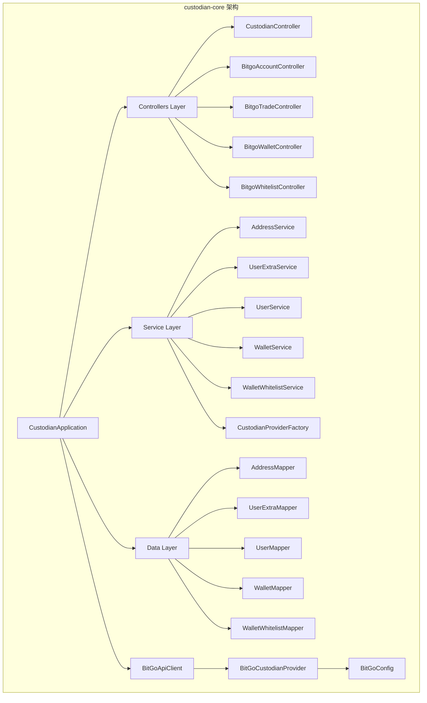
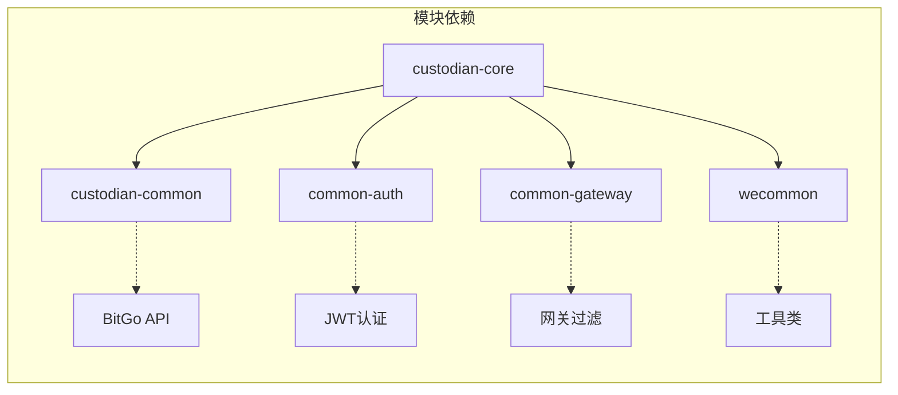
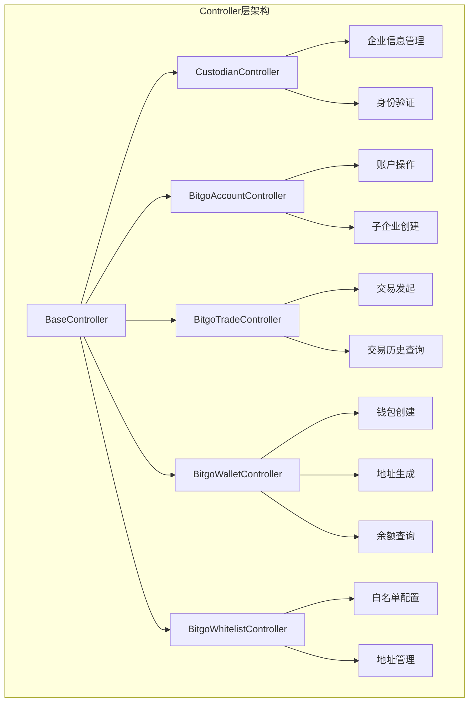
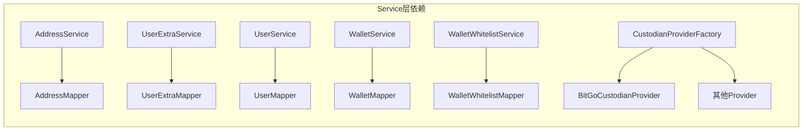
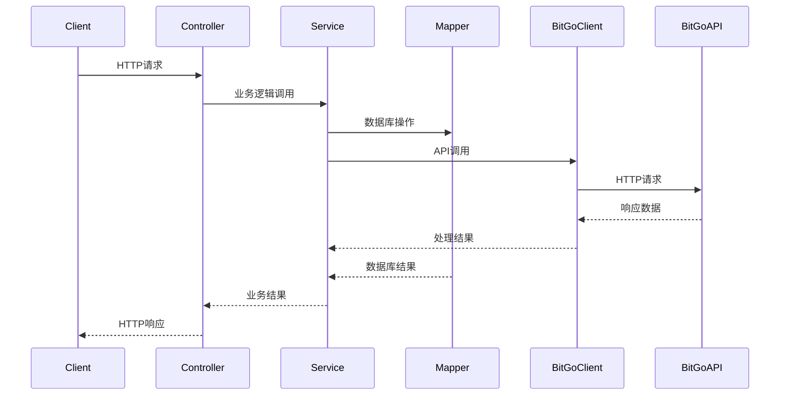
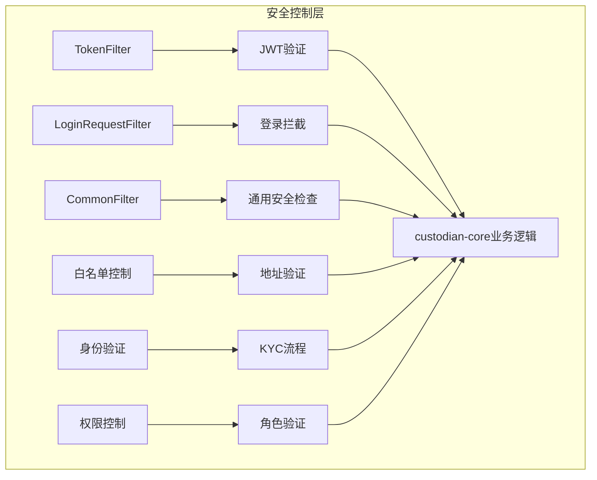
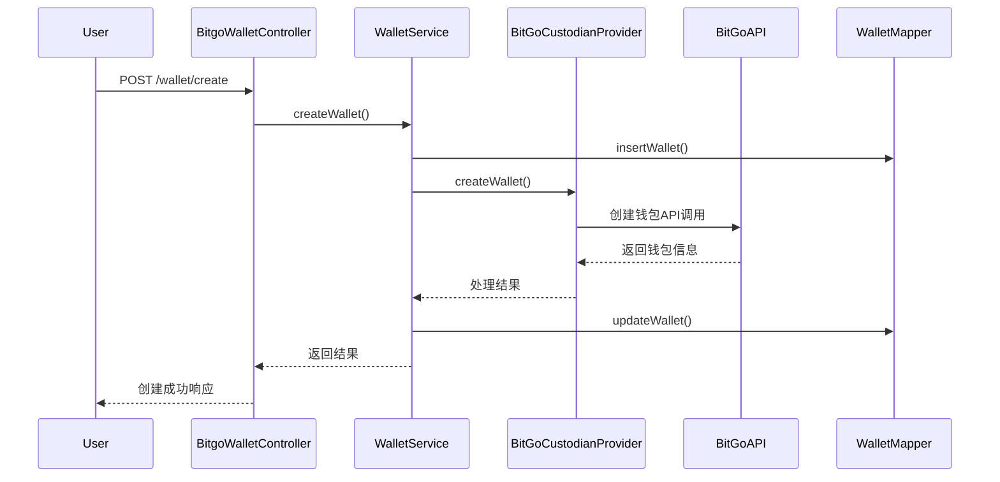
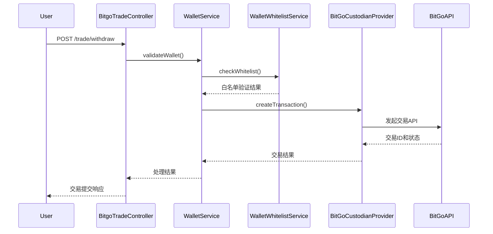
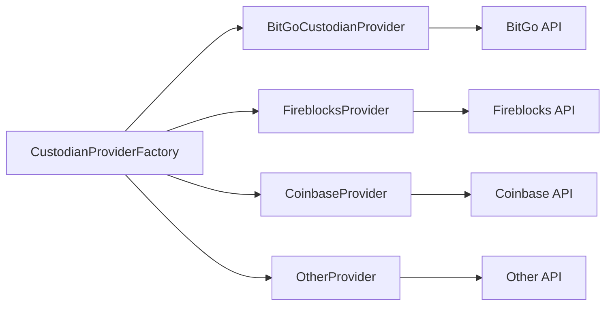

# custodian-core 模块文档

## 简介

custodian-core模块是数字资产托管系统的核心实现模块，基于BitGo API提供企业级数字资产托管服务。该模块负责处理钱包管理、地址生成、交易处理、身份验证、白名单管理等核心业务功能，是整个托管平台的技术核心。

## 核心功能

- **钱包管理**：支持多币种钱包的创建、配置和管理
- **地址管理**：提供钱包地址的生成、查询和管理功能
- **交易处理**：处理数字资产的存取款交易
- **身份验证**：集成KYC（了解你的客户）和身份验证流程
- **白名单管理**：实现地址白名单的安全控制机制
- **企业账户管理**：支持子企业账户的创建和管理

## 架构概览



## 模块依赖关系



## 核心组件详解

### 1. 应用入口

**CustodianApplication**
- 模块的主启动类
- 配置Spring Boot应用上下文
- 集成各种自动配置和组件扫描

### 2. BitGo集成层

**BitGoApiClient**
- BitGo API的核心客户端
- 处理与BitGo服务的所有HTTP通信
- 实现API调用的认证和错误处理

**BitGoCustodianProvider**
- 实现CustodianProvider接口
- 封装所有BitGo特定的业务逻辑
- 提供统一的托管服务接口

**BitGoConfig**
- BitGo连接配置
- API密钥和环境设置
- 连接池和超时配置

### 3. 控制层（Controllers）



#### CustodianController
- 处理企业级托管操作
- 管理企业身份和KYC流程
- 协调各子系统的业务逻辑

#### BitgoAccountController
- 处理BitGo账户相关操作
- 子企业账户创建和管理
- 账户身份验证

#### BitgoTradeController
- 数字资产交易处理
- 存取款操作管理
- 交易历史记录查询

#### BitgoWalletController
- 钱包生命周期管理
- 地址生成和查询
- 余额查询和统计

#### BitgoWhitelistController
- 地址白名单管理
- 安全策略配置
- 地址验证和控制

### 4. 服务层（Services）



#### AddressService
- 地址业务逻辑处理
- 地址有效性验证
- 地址与钱包关系管理

#### UserExtraService
- 用户扩展信息管理
- KYC数据处理
- 用户身份验证辅助

#### UserService
- 用户核心业务逻辑
- 与[common-auth](common-auth.md)模块集成
- 权限和角色管理

#### WalletService
- 钱包业务逻辑
- 钱包配置管理
- 多币种支持

#### WalletWhitelistService
- 白名单策略管理
- 地址安全验证
- 白名单规则引擎

#### CustodianProviderFactory
- 托管服务提供商工厂
- 支持多提供商架构
- 提供商实例管理和切换

### 5. 数据层（Mappers）

所有Mapper组件都继承MyBatis框架，提供数据库CRUD操作：

- **AddressMapper**: 地址数据访问
- **UserExtraMapper**: 用户扩展数据访问
- **UserMapper**: 用户基础数据访问
- **WalletMapper**: 钱包数据访问
- **WalletWhitelistMapper**: 白名单数据访问

### 6. 配置和基础设施

#### 数据源配置
- **DataSourceAspect**: 数据源切换切面
- **DataSourceConfig**: 多数据源配置
- 与[common-auth](common-auth.md)和[dweb-core](dweb-core.md)共享配置模式

#### 日志和监控
- **CommonTraceFilter**: 请求追踪过滤器
- **SqlLogInterceptor**: SQL日志拦截器
- 统一的日志格式和追踪标准

#### Feign配置
- **FeignConfig**: HTTP客户端配置
- 与[common-gateway](common-gateway.md)集成
- 服务间调用优化

## 数据流架构



## 安全架构



## 集成点

### 与common-auth集成
- 用户认证和授权
- JWT令牌验证
- 用户角色和权限管理
- 参考[common-auth模块文档](common-auth.md)

### 与common-gateway集成
- 网关过滤器集成
- 请求路由和负载均衡
- 跨服务调用优化
- 参考[common-gateway模块文档](common-gateway.md)

### 与custodian-common集成
- 共享DTO和接口定义
- 统一的响应格式
- 业务常量定义
- 参考[custodian-common模块文档](custodian-common.md)

### 与wecommon集成
- 工具类复用
- 枚举类型定义
- 响应格式标准化
- 参考[wecommon模块文档](wecommon.md)

## 业务流程示例

### 钱包创建流程



### 交易处理流程



## 配置管理

### BitGo配置
```yaml
bitgo:
  api:
    base-url: https://app.bitgo.com
    timeout: 30000
    retry-count: 3
  enterprise:
    id: ${BITGO_ENTERPRISE_ID}
  webhook:
    secret: ${BITGO_WEBHOOK_SECRET}
```

### 数据源配置
- 主从数据库配置
- 读写分离策略
- 连接池优化

### 安全配置
- JWT密钥管理
- API密钥加密存储
- 敏感数据脱敏

## 监控和运维

### 日志规范
- 统一日志格式：时间戳、追踪ID、模块名、日志级别
- 业务日志和操作日志分离
- 敏感信息脱敏处理

### 指标监控
- API响应时间监控
- BitGo服务可用性监控
- 交易成功率统计
- 钱包余额异常检测

### 告警机制
- 交易失败告警
- API调用异常告警
- 余额异常告警
- 系统资源告警

## 扩展性设计

### 多托管商支持
通过CustodianProviderFactory实现多托管商支持，便于集成其他托管服务：



### 多链支持
- 基于钱包类型的链识别
- 地址格式验证
- 交易格式适配
- 费率计算优化

## 最佳实践

### 1. 错误处理
- 统一的异常处理机制
- 业务异常和系统异常分离
- 友好的错误提示信息
- 完整的错误日志记录

### 2. 性能优化
- 数据库连接池配置
- Redis缓存策略
- API调用限流
- 异步处理机制

### 3. 安全实践
- 输入参数验证
- SQL注入防护
- XSS攻击防护
- 敏感数据加密

### 4. 代码规范
- RESTful API设计
- 统一的命名规范
- 完善的代码注释
- 单元测试覆盖

## 部署指南

### 环境要求
- Java 8+
- Spring Boot 2.x
- MySQL 5.7+
- Redis 3.0+

### 部署步骤
1. 配置数据库连接
2. 配置BitGo API凭证
3. 配置JWT密钥
4. 启动应用程序
5. 验证服务健康状态

### 健康检查
- `/actuator/health`: 应用健康状态
- `/actuator/metrics`: 应用指标
- `/api/v1/ping`: API连通性测试

## 故障排查

### 常见问题
1. **BitGo API连接失败**
   - 检查网络连通性
   - 验证API密钥有效性
   - 确认企业ID配置

2. **交易失败**
   - 检查钱包余额
   - 验证白名单设置
   - 确认交易参数

3. **数据库连接异常**
   - 检查数据库状态
   - 验证连接配置
   - 查看连接池状态

### 日志分析
- 业务日志：`/logs/business/`
- 错误日志：`/logs/error/`
- 访问日志：`/logs/access/`

## 版本历史

### v1.0.0
- 初始版本发布
- 基础钱包管理功能
- BitGo集成实现

### 后续规划
- 多链支持扩展
- DeFi协议集成
- NFT托管支持
- 高级风控系统

---

*本文档基于custodian-core模块的架构设计，详细API文档请参考API文档章节。*