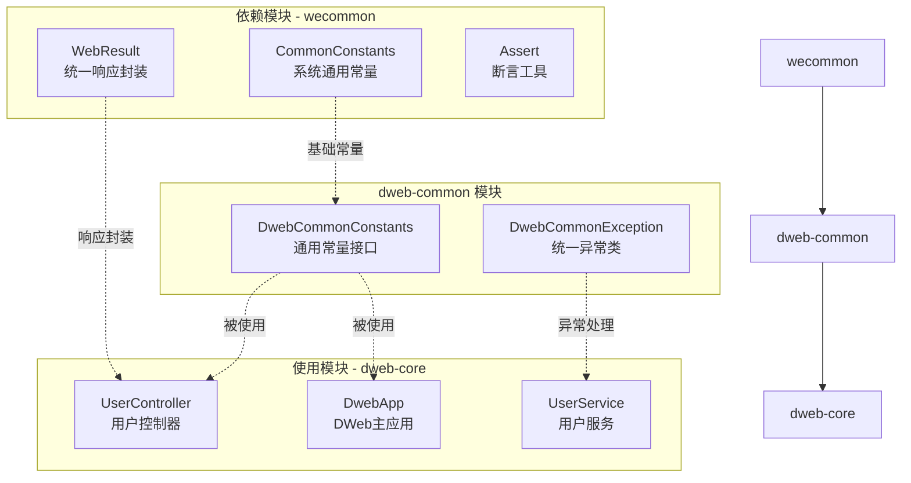
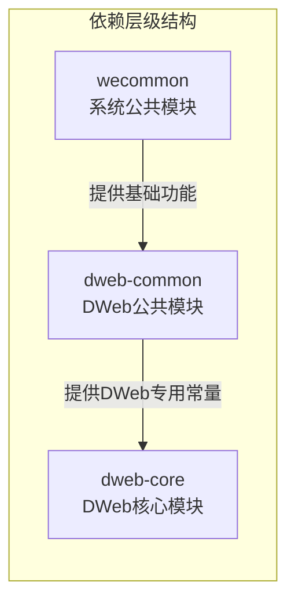
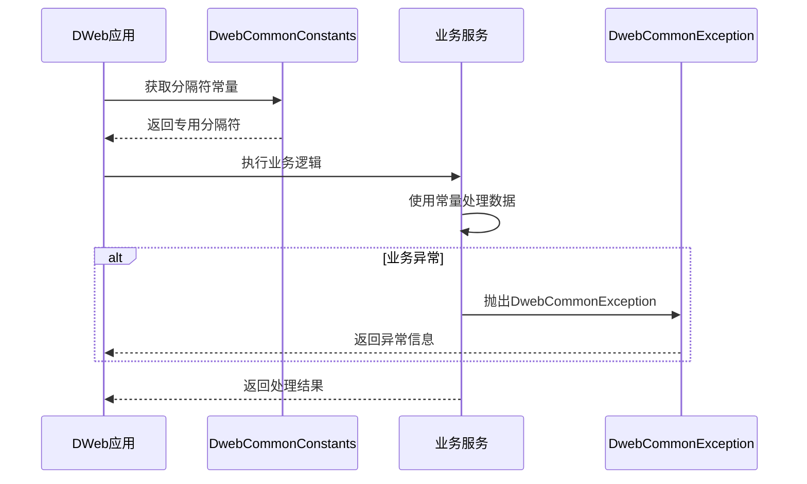
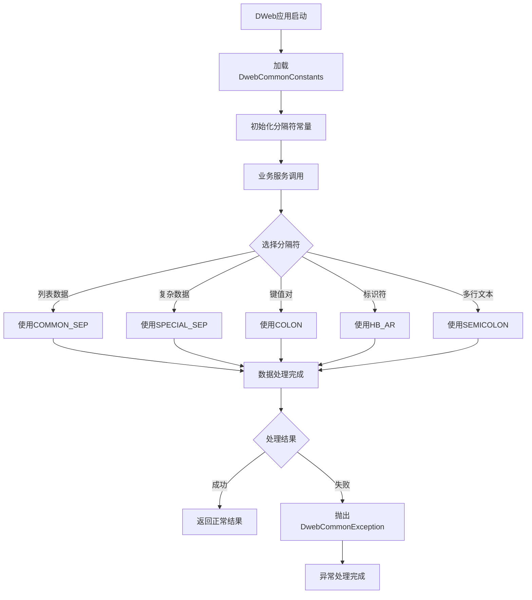
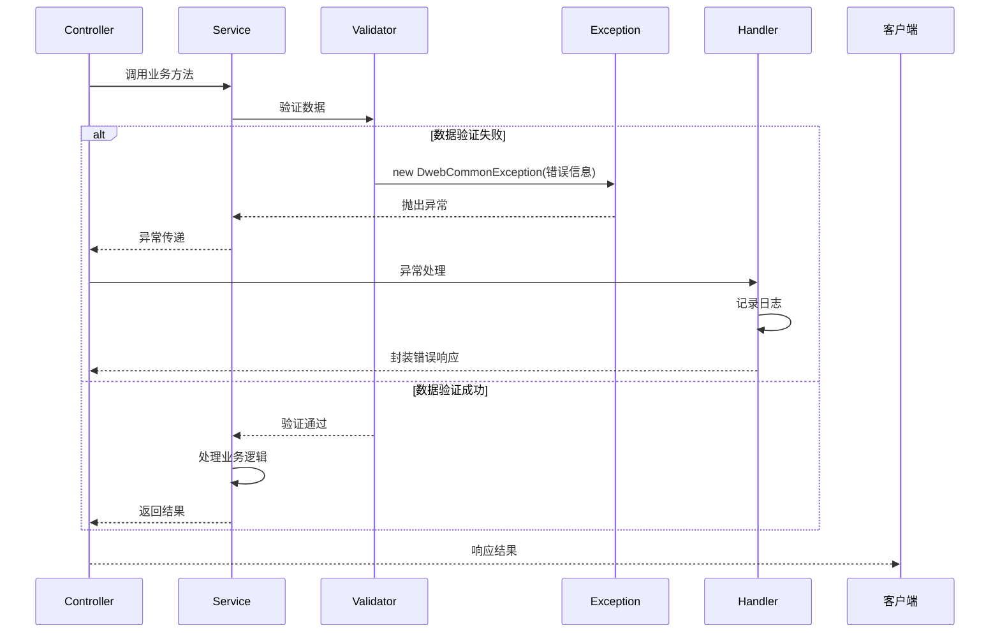
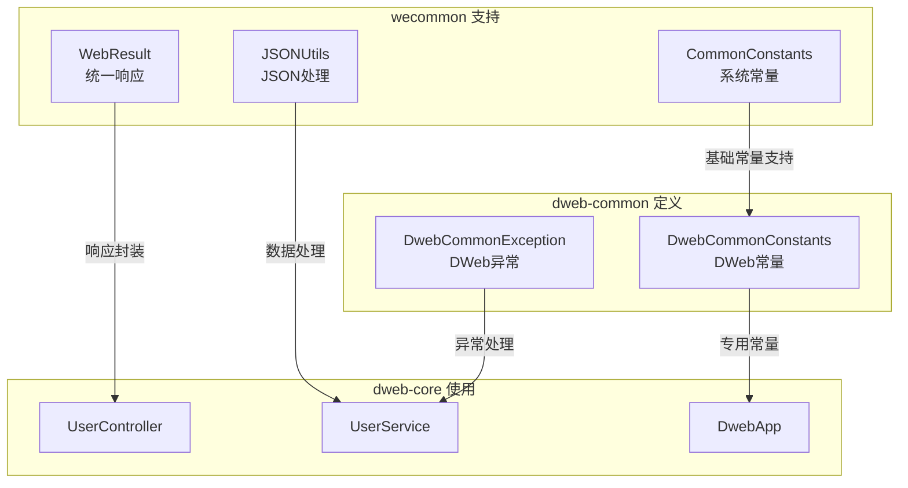
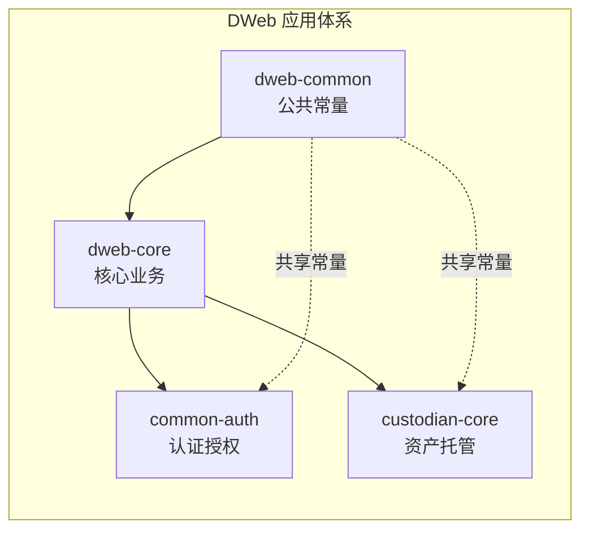
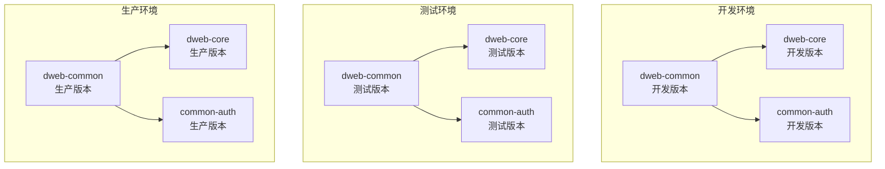

# dweb-common 模块文档

## 简介

dweb-common 模块是 DWeb 应用体系的公共基础模块，专门为 DWeb 相关业务提供通用的常量定义和异常处理机制。作为 dweb-core 模块的依赖基础，dweb-common 提供了 DWeb 应用所需的基础支撑功能，确保了整个 DWeb 应用体系的一致性和标准化。

## 核心功能

- **通用常量定义**：提供 DWeb 应用专用的分隔符常量
- **统一异常处理**：定义 DWeb 模块专用的运行时异常
- **基础依赖支持**：依赖 wecommon 模块获取通用功能
- **标准化规范**：为 DWeb 应用提供统一的编码规范

## 架构设计

### 模块架构图



### 组件依赖关系



### 常量使用流程



## 核心组件详解

### 1. DwebCommonConstants - 通用常量接口

DwebCommonConstants 是 DWeb 应用中最重要的常量定义接口，提供了一系列专用的分隔符常量，用于数据解析、字符串处理等场景。

**核心常量定义：**

```java
public interface DwebCommonConstants {
    // 通用逗号分隔符，用于列表数据分割
    String COMMON_SEP = ",";
    
    // 特殊分隔符，用于复杂数据结构分割
    String SPECIAL_SEP = "#[$]";
    
    // 分号分隔符，用于语句或字段分割
    String SEMICOLON = ";";
    
    // 冒号分隔符，用于键值对分割
    String COLON = ":";
    
    // 连字符分隔符，用于标识符或代码分割
    String HB_AR = "-";
}
```

**使用场景：**
- **COMMON_SEP**: 用户标签、权限列表等简单数组数据的分割
- **SPECIAL_SEP**: 复杂配置项、序列化数据的安全分割
- **SEMICOLON**: SQL 语句、多行文本的处理
- **COLON**: 键值对配置、映射关系的定义
- **HB_AR**: 订单号、流水号等标识符的生成

### 2. DwebCommonException - 统一异常处理

DwebCommonException 是 DWeb 模块的专用运行时异常，提供了完整的异常处理机制，支持各种异常场景的封装和处理。

**异常构造函数：**
- 无参构造：创建默认异常
- 消息构造：携带详细错误信息
- 消息+原因构造：包含异常链信息
- 原因构造：包装其他异常
- 完整构造：支持异常抑制和栈追踪控制

**设计优势：**
- **统一异常处理**：所有 DWeb 相关异常都使用同一异常类型
- **完整异常链**：支持异常原因追踪，便于问题定位
- **灵活构造**：多种构造函数适应不同异常场景
- **运行时异常**：无需强制异常处理，提高代码简洁性

## 数据流图

### 常量使用数据流



### 异常处理流程



## 模块集成

### 与 wecommon 模块集成



### 与其他模块的关联关系



## 配置说明

### Maven 依赖配置

```xml
<dependency>
    <groupId>cn.wetech</groupId>
    <artifactId>wecommon</artifactId>
    <version>1.0.0-SNAPSHOT</version>
</dependency>
```

### 常量使用示例

```java
// 在DWeb应用中使用常量
import cn.wetech.dweb.common.constants.DwebCommonConstants;

public class UserService {
    
    public String buildUserTags(List<String> tags) {
        // 使用通用逗号分隔符合并标签
        return String.join(DwebCommonConstants.COMMON_SEP, tags);
    }
    
    public String generateUserCode(String prefix, String sequence) {
        // 使用连字符生成用户编码
        return prefix + DwebCommonConstants.HB_AR + sequence;
    }
    
    public Map<String, String> parseConfig(String config) {
        // 使用冒号分隔符解析配置
        Map<String, String> result = new HashMap<>();
        String[] pairs = config.split(DwebCommonConstants.SEMICOLON);
        for (String pair : pairs) {
            String[] keyValue = pair.split(DwebCommonConstants.COLON);
            if (keyValue.length == 2) {
                result.put(keyValue[0], keyValue[1]);
            }
        }
        return result;
    }
}
```

### 异常处理示例

```java
// 使用DwebCommonException处理业务异常
public class UserController {
    
    public WebResult<User> getUserById(Long userId) {
        try {
            // 参数验证
            if (userId == null || userId <= 0) {
                throw new DwebCommonException("用户ID不能为空且必须大于0");
            }
            
            // 查询用户
            User user = userService.findById(userId);
            if (user == null) {
                throw new DwebCommonException("用户不存在，ID: " + userId);
            }
            
            return WebResult.success(user);
            
        } catch (DwebCommonException e) {
            // 记录业务异常日志
            log.warn("业务处理异常: {}", e.getMessage());
            return WebResult.error(e.getMessage());
            
        } catch (Exception e) {
            // 包装系统异常
            log.error("系统异常", e);
            throw new DwebCommonException("系统处理异常", e);
        }
    }
}
```

## 最佳实践

### 1. 常量使用最佳实践

- **统一使用**: 所有 DWeb 应用都应该使用 DwebCommonConstants 中定义的常量
- **避免硬编码**: 不要在代码中直接使用字符串字面量作为分隔符
- **文档说明**: 在使用特殊分隔符时，添加清晰的注释说明用途

```java
// 推荐做法
String data = String.join(DwebCommonConstants.SPECIAL_SEP, values);

// 不推荐做法
String data = String.join("#[$]", values);  // 硬编码，不易维护
```

### 2. 异常处理最佳实践

- **业务异常**: 使用 DwebCommonException 封装所有业务相关异常
- **异常信息**: 提供清晰、友好的错误提示信息
- **异常链**: 包装底层异常时，保留原始异常信息
- **日志记录**: 根据异常级别记录相应的日志信息

```java
// 业务异常处理示例
try {
    validateUserData(user);
} catch (IllegalArgumentException e) {
    throw new DwebCommonException("用户数据验证失败: " + e.getMessage(), e);
}
```

### 3. 模块依赖最佳实践

- **单向依赖**: dweb-common 只依赖 wecommon，不依赖其他业务模块
- **版本管理**: 保持与 wecommon 模块的版本一致性
- **依赖最小化**: 只引入必要的依赖，避免过度依赖

## 部署架构



## 性能考虑

### 常量性能优化

- **接口常量**: 使用接口定义常量，编译时直接内联，无运行时开销
- **字符串池**: 利用 Java 字符串池机制，避免重复创建字符串对象
- **不可变性**: 所有常量都是不可变的，保证线程安全

### 异常性能考虑

- **异常开销**: 异常处理有一定的性能开销，不要用于正常业务流程
- **异常缓存**: 对于频繁抛出的业务异常，可以考虑异常对象缓存
- **栈追踪**: 在生产环境中，可以考虑禁用异常栈追踪以提高性能

## 安全性考虑

### 分隔符安全性

- **特殊字符**: SPECIAL_SEP 使用特殊字符组合，避免与用户数据冲突
- **输入验证**: 使用分隔符处理用户输入时，需要进行数据验证
- **SQL注入**: 在构建 SQL 语句时，分隔符不能直接拼接到 SQL 中

### 异常信息安全性

- **敏感信息**: 异常信息中不能包含敏感数据（如密码、密钥等）
- **系统信息**: 避免在异常信息中暴露系统内部结构
- **用户友好**: 对外提供的异常信息应该友好，内部详细信息记录到日志

## 监控和运维

### 常量使用监控

- **使用统计**: 监控各常量的使用频率，优化常量设计
- **性能监控**: 监控分隔符处理的性能指标
- **错误监控**: 监控因分隔符使用不当导致的解析错误

### 异常监控

- **异常统计**: 统计 DwebCommonException 的发生频率和分布
- **异常分类**: 按业务场景对异常进行分类统计
- **告警机制**: 对异常频率设置告警阈值

## 相关文档

- [wecommon模块文档](wecommon.md) - 系统通用工具类和常量定义
- [dweb-core模块文档](dweb-core.md) - DWeb应用核心功能实现
- [common-auth模块文档](common-auth.md) - 认证授权相关功能
- [custodian-core模块文档](custodian-core.md) - 数字资产托管核心功能

## 总结

dweb-common 模块虽然功能简单，但在整个 DWeb 应用体系中发挥着重要的基础支撑作用。通过提供统一的常量定义和异常处理机制，确保了 DWeb 应用的一致性和标准化。模块的设计遵循了简洁、高效、安全的原则，为上层业务模块提供了可靠的基础支撑。

作为 DWeb 应用的公共基础模块，dweb-common 的设计体现了以下几个特点：

1. **职责单一**: 专注于常量和异常的定义，不涉及复杂业务逻辑
2. **依赖清晰**: 只依赖 wecommon 模块，保持依赖关系的简洁性
3. **设计规范**: 遵循接口定义常量的最佳实践，确保代码的可维护性
4. **扩展性强**: 异常设计支持各种业务场景，便于后续功能扩展

通过合理使用 dweb-common 模块提供的功能，可以有效提高 DWeb 应用的开发效率，降低维护成本，确保系统的稳定性和可靠性。