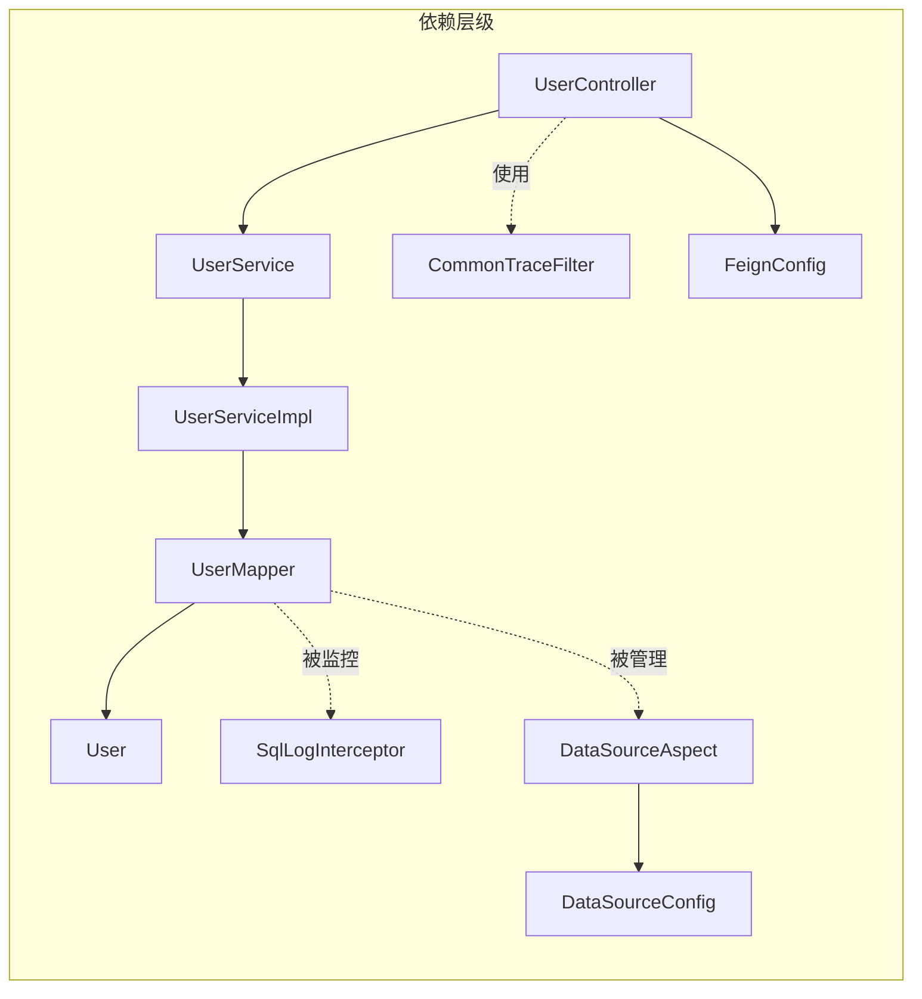

# dweb-core 模块文档

## 简介

dweb-core模块是DWeb应用的核心模块，负责用户管理和基础服务配置。该模块提供了用户相关的核心业务逻辑，包括用户数据访问、用户服务实现以及基础的数据源和配置管理。

## 核心功能

- **用户管理**：提供用户相关的核心业务逻辑和数据访问
- **数据源配置**：统一的数据源配置管理
- **服务配置**：Feign客户端配置和通用服务配置
- **监控追踪**：集成链路追踪和SQL日志拦截

## 架构设计

### 模块架构图


### 组件依赖关系



## 核心组件详解

### 1. DwebApp - 主应用类

DwebApp是dweb-core模块的启动类，负责初始化Spring Boot应用并加载相关配置。

**主要功能：**
- 启动Spring Boot应用
- 加载数据源配置
- 启用Feign客户端
- 集成链路追踪

### 2. 用户管理组件

#### UserController
用户控制器，提供用户相关的REST API接口。

**主要职责：**
- 处理用户相关的HTTP请求
- 调用用户服务层处理业务逻辑
- 返回标准化的响应结果

#### UserService / UserServiceImpl
用户服务接口及其实现，封装用户相关的业务逻辑。

**主要功能：**
- 用户信息的增删改查
- 用户权限验证
- 用户状态管理

#### UserMapper
用户数据访问对象，负责与数据库交互。

**主要职责：**
- 执行用户相关的SQL操作
- 提供用户数据的持久化接口
- 支持复杂的查询需求

#### User
用户实体类，定义用户数据模型。

**主要属性：**
- 用户基本信息（ID、用户名、邮箱等）
- 用户状态信息
- 用户权限信息

### 3. 配置管理组件

#### DataSourceConfig
数据源配置类，统一管理数据库连接配置。

**配置内容：**
- 数据库连接池配置
- 多数据源配置
- 连接参数配置

#### DataSourceAspect
数据源切面，实现数据源的动态切换和监控。

**主要功能：**
- 动态数据源切换
- 数据源连接监控
- 数据库操作统计

#### FeignConfig
Feign客户端配置，用于微服务间的HTTP调用。

**配置内容：**
- Feign客户端超时配置
- 请求拦截器配置
- 错误处理配置

### 4. 监控追踪组件

#### CommonTraceFilter
通用链路追踪过滤器，记录请求链路信息。

**主要功能：**
- 请求链路追踪
- 性能监控
- 异常记录

#### SqlLogInterceptor
SQL日志拦截器，记录和监控SQL执行情况。

**主要功能：**
- SQL执行时间记录
- SQL语句日志输出
- 慢查询监控

## 数据流图


## 模块集成

### 与common-auth模块集成


### 与custodian-core模块集成


## 配置说明

### 数据源配置

```yaml
spring:
  datasource:
    url: jdbc:mysql://localhost:3306/dweb_core
    username: ${DB_USERNAME:dweb_user}
    password: ${DB_PASSWORD:dweb_password}
    driver-class-name: com.mysql.cj.jdbc.Driver
    hikari:
      maximum-pool-size: 20
      minimum-idle: 5
      connection-timeout: 30000
```

### Feign配置

```yaml
feign:
  client:
    config:
      default:
        connectTimeout: 5000
        readTimeout: 10000
        loggerLevel: basic
  hystrix:
    enabled: true
```

### 监控配置

```yaml
logging:
  level:
    com.dweb.core.mapper: DEBUG
  pattern:
    console: "%d{yyyy-MM-dd HH:mm:ss} [%thread] %-5level %logger{36} - %msg%n"
```

## 部署架构


## 最佳实践

### 1. 用户管理最佳实践

- **数据一致性**：使用事务确保用户数据操作的一致性
- **缓存策略**：对频繁查询的用户信息进行合理缓存
- **分页处理**：用户列表查询必须支持分页，避免大数据量查询

### 2. 监控配置最佳实践

- **链路追踪**：为所有用户相关操作添加追踪标识
- **日志级别**：生产环境使用适当的日志级别，避免过度日志输出
- **性能监控**：监控关键用户操作的响应时间

### 3. 安全配置最佳实践

- **数据加密**：敏感用户信息需要加密存储
- **访问控制**：用户数据访问需要权限验证
- **SQL注入**：使用参数化查询防止SQL注入攻击

## 相关文档

- [common-auth模块文档](common-auth.md) - 认证授权相关功能
- [custodian-core模块文档](custodian-core.md) - 数字资产托管核心功能
- [wecommon模块文档](wecommon.md) - 通用工具类和常量定义

## 总结

dweb-core模块作为DWeb应用的核心模块，提供了用户管理和基础服务配置的核心功能。通过合理的设计和配置，确保了系统的可扩展性、可维护性和高性能。模块与其他核心模块紧密集成，共同构建了完整的DWeb应用生态系统。