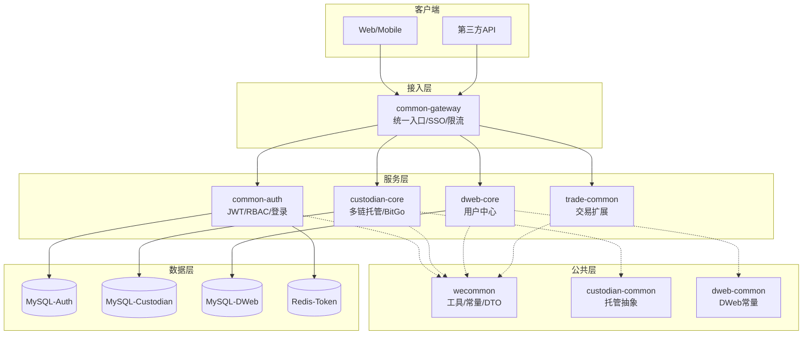

# fusioncore-fork1 仓库概览

## 仓库目的
fusioncore-fork1 是一个基于 Spring Boot 3.x + Spring Cloud 2023.x 构建的微服务底座，面向数字资产托管与 DWeb 场景，提供统一认证、网关路由、链上托管、交易撮合、用户中心等全套能力。仓库采用“公共模块下沉、业务模块垂直”的分层策略，所有服务共享 wecommon 基础工具，通过 Nacos 实现配置+服务治理，以 common-gateway 作为统一入口，common-auth 作为统一认证中心，custodian-core 提供多链托管能力，dweb-core 提供用户业务，trade-common 预留交易扩展，可快速插拔新的业务微服务。

## 端到端架构

## 核心模块速览
| 模块 | 职责 | 关键组件 | 文档入口 |
|----|----|----|----|
| **common-auth** | 统一认证与授权中心 | JWTUtil、RBAC 实体、UserController、Token 刷新 | [common-auth 文档](common-auth.md) |
| **common-gateway** | 统一网关、路由、鉴权 | TokenFilter、LoginRequestFilter、Feign 透传 | [common-gateway 文档](common-gateway.md) |
| **wecommon** | 全局工具 & 枚举 & DTO | WebResult、JSONUtils、KYT 客户端、PageVO | [wecommon 文档](wecommon.md) |
| **custodian-common** | 托管抽象层（DTO/接口） | CustodianProvider、Wallet/Address/Whitelist DTO | [custodian-common 文档](custodian-common.md) |
| **custodian-core** | BitGo 托管实现 | BitGoCustodianProvider、多链钱包、交易、KYC | [custodian-core 文档](custodian-core.md) |
| **dweb-core** | 用户中心微服务 | UserService、用户实体、数据源配置 | [dweb-core 文档](dweb-core.md) |
| **dweb-common** | DWeb 专用常量 | 分隔符常量、DwebCommonException | [dweb-common 文档](dweb-common.md) |
| **trade-common** | 交易公共模块（预留） | Main 启动类、后续扩展工具/常量 | [trade-common 文档](trade-common.md) |

> 各模块完整设计、API 列表、序列图、配置示例请直接点击对应文档链接。