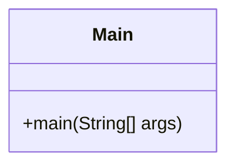
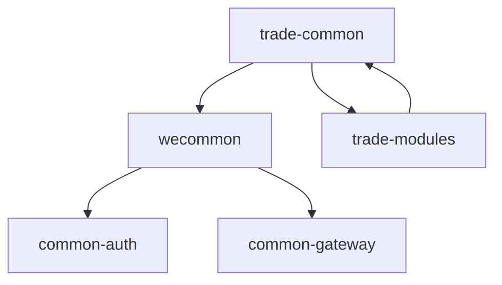
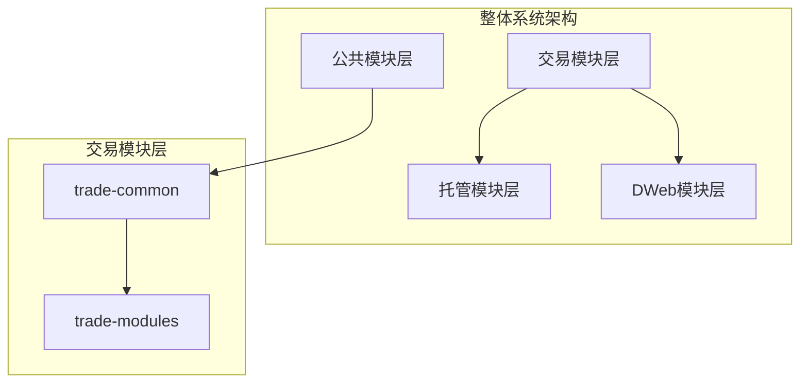

# trade-common 模块文档

## 简介

trade-common 模块是交易系统的公共基础模块，作为整个交易功能的核心依赖库。该模块目前处于初始开发阶段，主要提供交易相关的公共工具类和基础功能支持。

## 模块架构

### 核心组件



### 模块依赖关系



### 系统架构位置



## 功能特性

### 当前功能

1. **基础框架支持**
   - 提供交易模块的启动入口
   - 集成 wecommon 公共工具库

2. **依赖管理**
   - 统一管理交易相关依赖
   - 提供版本控制支持

### 规划功能

1. **交易工具类**
   - 订单处理工具
   - 交易计算工具
   - 价格计算工具

2. **交易常量定义**
   - 交易状态常量
   - 订单类型常量
   - 交易对常量

3. **交易异常处理**
   - 交易相关异常定义
   - 错误码管理

## 技术栈

- **编程语言**: Java 21
- **构建工具**: Maven
- **依赖管理**: 继承自父项目 wecutodian-fusioncore
- **编码标准**: UTF-8

## 模块依赖

### 直接依赖

- **wecommon**: 1.0.0-SNAPSHOT
  - 提供系统通用的工具类、常量、DTO等
  - 包含认证、网关等基础功能支持
  - 详见: [wecommon 模块文档](wecommon.md)

### 间接依赖

通过 wecommon 模块间接依赖：
- common-auth: 认证授权功能
- common-gateway: 网关服务支持

## 使用场景

### 典型应用场景

1. **交易服务开发**
   - 作为交易服务的基础依赖
   - 提供交易相关的公共功能

2. **订单管理**
   - 订单处理逻辑的基础支持
   - 订单状态管理工具

3. **价格计算**
   - 交易价格计算工具
   - 费率计算支持

### 集成方式

```xml
<!-- 在交易模块的pom.xml中添加依赖 -->
<dependency>
    <groupId>cn.wetech</groupId>
    <artifactId>trade-common</artifactId>
    <version>1.0.0-SNAPSHOT</version>
</dependency>
```

## 开发指南

### 模块结构

```
trade-common/
├── src/main/java/cn/wetech/
│   └── Main.java              # 模块启动类
├── pom.xml                    # Maven配置文件
└── target/                    # 编译输出目录
```

### 扩展开发

1. **添加新的工具类**
   - 在 `cn.wetech` 包下创建新的工具类
   - 遵循统一的命名规范

2. **定义交易常量**
   - 创建常量类统一管理交易相关常量
   - 使用枚举类型定义状态值

3. **异常处理**
   - 定义交易相关的业务异常
   - 提供统一的异常处理机制

## 最佳实践

### 1. 代码组织
- 按功能划分包结构
- 使用清晰的类命名
- 提供完整的 JavaDoc 注释

### 2. 依赖管理
- 避免循环依赖
- 合理使用传递依赖
- 保持依赖版本一致性

### 3. 工具类设计
- 使用静态方法提供工具功能
- 确保线程安全性
- 提供完善的单元测试

## 相关文档

- [wecommon 模块文档](wecommon.md) - 通用工具模块
- [common-auth 模块文档](common-auth.md) - 认证授权模块
- [common-gateway 模块文档](common-gateway.md) - 网关服务模块

## 版本历史

### 1.0.0-SNAPSHOT (当前版本)
- 初始版本创建
- 集成 wecommon 依赖
- 提供基础框架支持

## 维护信息

- **维护团队**: 交易开发团队
- **更新频率**: 根据交易业务需求持续迭代
- **支持渠道**: 内部技术讨论组