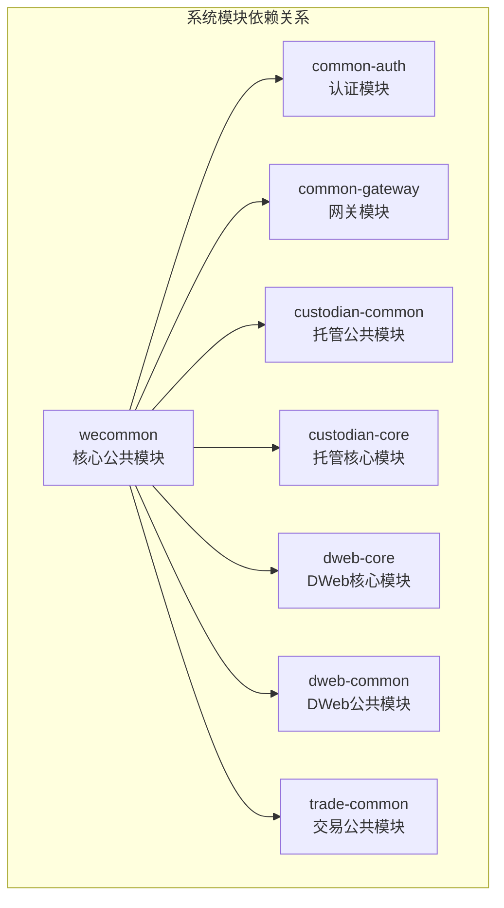
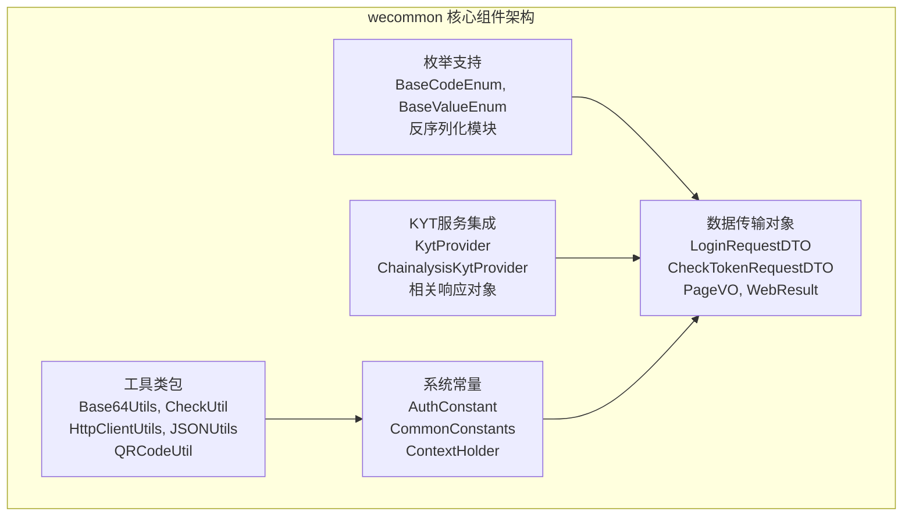
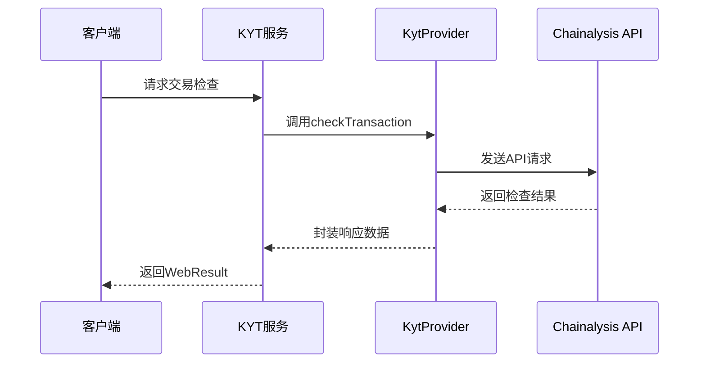

# wecommon 模块文档

## 简介

wecommon 模块是整个系统的核心公共模块，提供了通用的工具类、基础枚举、数据传输对象(DTO)、服务接口以及第三方服务集成等基础功能。该模块被所有其他业务模块依赖，是整个系统的基石。

## 核心功能

### 1. 基础工具类
- **Base64Utils**: Base64 编码解码工具
- **CheckUtil**: 数据校验工具
- **HttpClientUtils**: HTTP 客户端工具
- **JSONUtils**: JSON 处理工具
- **QRCodeUtil**: 二维码生成工具

### 2. 枚举支持
- **BaseCodeEnum**: 基础编码枚举接口
- **BaseValueEnum**: 基础值枚举接口
- **枚举反序列化模块**: 支持枚举的 JSON 反序列化

### 3. 数据传输对象
- **LoginRequestDTO**: 登录请求数据传输对象
- **CheckTokenRequestDTO**: Token 验证请求数据传输对象
- **PageVO**: 分页视图对象
- **WebResult**: Web 响应结果封装

### 4. 第三方服务集成
- **KYT (Know Your Transaction) 服务**:
  - KytProvider 接口
  - ChainalysisKytProvider 实现
  - 相关响应对象：Alert, DirectExposureResponse, WithdrawalAlertsResponse 等

### 5. 系统常量
- **AuthConstant**: 认证相关常量
- **CommonConstants**: 通用常量
- **ContextHolder**: 上下文持有者

## 架构设计

### 模块依赖关系



### 核心组件架构



### KYT 服务数据流



## 组件详细说明

### 工具类组件

#### Base64Utils
提供 Base64 编码解码功能，用于处理二进制数据的文本表示。

#### CheckUtil
提供各种数据校验功能，包括空值检查、格式验证等。

#### HttpClientUtils
封装 HTTP 请求操作，提供统一的 HTTP 客户端调用接口。

#### JSONUtils
提供 JSON 数据的序列化和反序列化功能，支持复杂的对象转换。

#### QRCodeUtil
生成二维码图片，支持自定义尺寸和内容。

### 枚举支持

#### BaseCodeEnum & BaseValueEnum
为系统枚举提供统一的接口规范，支持通过编码或值获取枚举实例。

#### 枚举反序列化模块
通过自定义 Jackson 反序列化器，支持枚举类型的 JSON 反序列化。

### 数据传输对象

#### LoginRequestDTO
封装用户登录请求数据，包含用户名、密码等必要信息。

#### CheckTokenRequestDTO
封装 Token 验证请求数据，用于身份验证。

#### PageVO
统一的分页视图对象，包含分页信息和数据列表。

#### WebResult
统一的 Web 响应结果封装，包含状态码、消息和数据。

### KYT 服务集成

#### KytProvider
KYT 服务提供者接口，定义了交易检查的基本方法。

#### ChainalysisKytProvider
基于 Chainalysis 的 KYT 服务实现，提供交易风险评估功能。

#### 相关响应对象
- **Alert**: 风险警报信息
- **DirectExposureResponse**: 直接风险暴露响应
- **WithdrawalAlertsResponse**: 提现风险警报响应
- **WithdrawalAttemptDetailResponse**: 提现尝试详情响应

## 使用示例

### 1. 使用工具类

```java
// Base64 编码解码
String encoded = Base64Utils.encode("hello world");
String decoded = Base64Utils.decode(encoded);

// JSON 处理
User user = new User("张三", 25);
String json = JSONUtils.toJSONString(user);
User parsedUser = JSONUtils.parseObject(json, User.class);

// 生成二维码
byte[] qrCode = QRCodeUtil.generateQRCode("https://example.com", 200, 200);
```

### 2. 使用枚举反序列化

```java
// 定义枚举实现 BaseCodeEnum
public enum UserStatus implements BaseCodeEnum {
    ACTIVE("A", "活跃"),
    INACTIVE("I", "非活跃");
    
    private String code;
    private String description;
    
    // 构造函数和getter方法
}

// JSON 反序列化支持
ObjectMapper mapper = new ObjectMapper();
mapper.registerModule(new EnumDeserializationModule());
```

### 3. 使用 WebResult 封装响应

```java
// 成功响应
return WebResult.success(data);

// 错误响应
return WebResult.error("错误信息");

// 自定义状态码
return WebResult.result(200, "操作成功", data);
```

### 4. 使用 KYT 服务

```java
@Autowired
private KytService kytService;

// 检查交易风险
WebResult<Alert> result = kytService.checkTransaction(transactionId);
if (result.isSuccess() && result.getData() != null) {
    Alert alert = result.getData();
    // 处理风险警报
}
```

## 配置说明

### 1. KYT 服务配置

KYT 服务需要在配置文件中设置相关参数：

```yaml
kyt:
  chainalysis:
    api-key: your-api-key
    base-url: https://api.chainalysis.com
    timeout: 30000
```

### 2. 枚举反序列化配置

在 Spring Boot 应用中注册枚举反序列化模块：

```java
@Configuration
public class JacksonConfig {
    @Bean
    public ObjectMapper objectMapper() {
        ObjectMapper mapper = new ObjectMapper();
        mapper.registerModule(new EnumDeserializationModule());
        return mapper;
    }
}
```

## 最佳实践

### 1. 工具类使用
- 优先使用 wecommon 提供的工具类，避免重复造轮子
- 工具类方法都是静态的，直接通过类名调用

### 2. 响应封装
- 所有 API 响应都应该使用 WebResult 进行封装
- 保持响应格式的一致性

### 3. 异常处理
- 使用 WebResult 的错误方法来封装异常信息
- 提供清晰的错误提示信息

### 4. KYT 服务调用
- 调用 KYT 服务时要处理网络异常
- 对返回结果进行适当的缓存，避免频繁调用

## 相关模块

- [common-auth](common-auth.md) - 认证模块，使用 wecommon 的 DTO 和工具类
- [common-gateway](common-gateway.md) - 网关模块，依赖 wecommon 的常量和工具类
- [custodian-common](custodian-common.md) - 托管公共模块，使用 wecommon 的基础功能
- [dweb-common](dweb-common.md) - DWeb 公共模块，定义 DWeb 相关的常量

## 总结

wecommon 模块作为系统的核心公共模块，提供了丰富的基础功能支持。通过统一的工具类、枚举支持、数据传输对象和第三方服务集成，为其他业务模块提供了坚实的基础。合理使用 wecommon 模块的功能，可以大大提高开发效率，保持代码的一致性和可维护性。