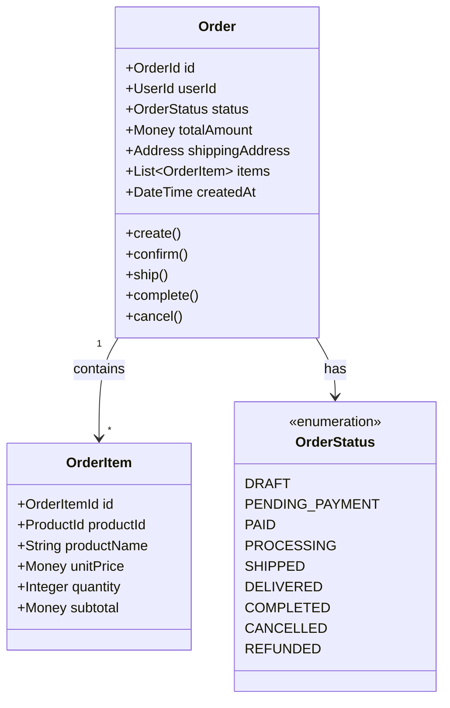
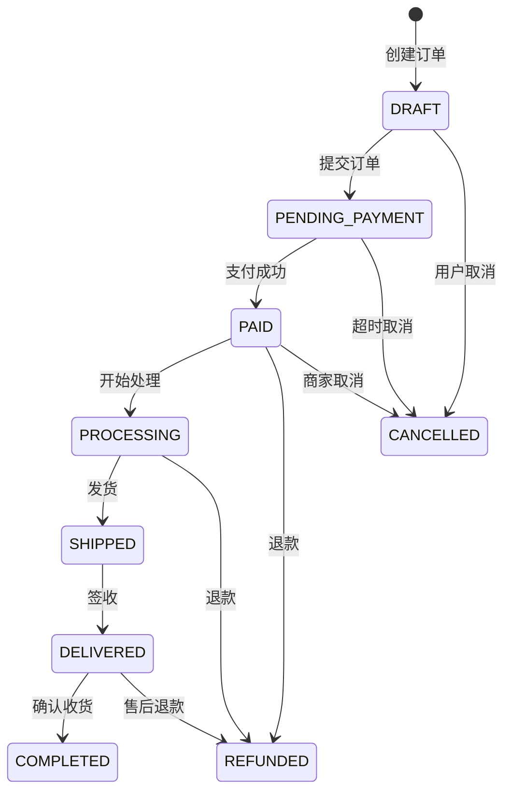
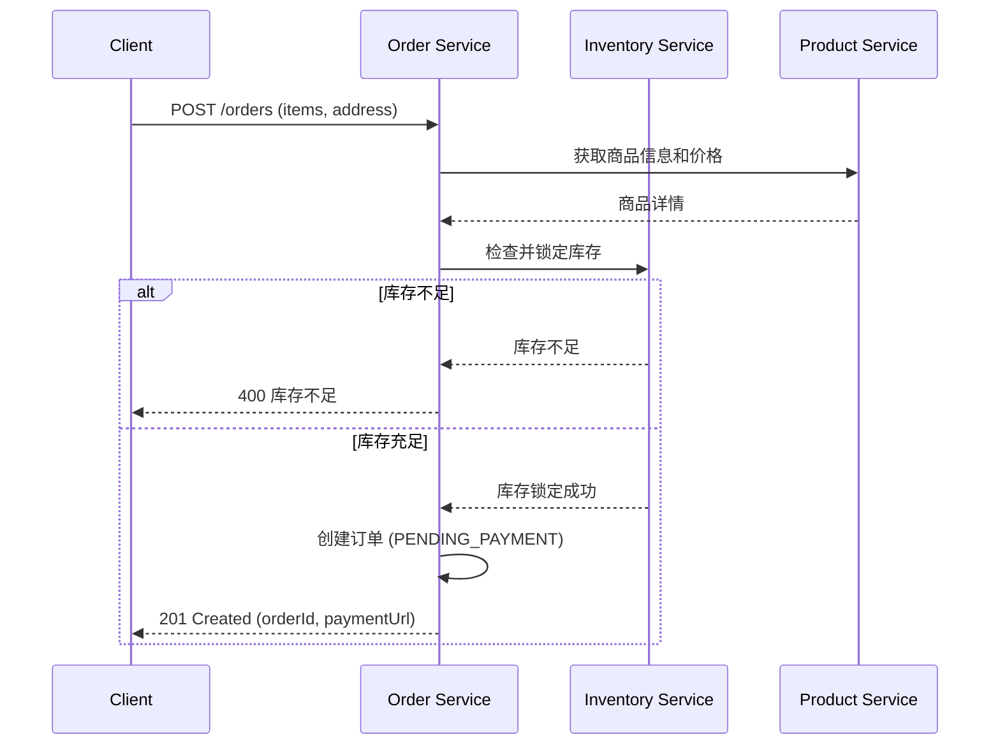

# 领域模型: 订单域 (Order Domain)

**负责人**: @交易平台团队
**最后更新**: 2025-11-30
**版本**: 1.0

---

## 1. 领域概述 (Domain Overview)

订单域负责管理整个订单生命周期，从创建到履约完成。它是电商系统的核心业务领域，协调用户、商品、库存、支付等多个领域。

<!-- AI-CONTEXT
订单域是核心业务领域，处理订单全生命周期。
AI在涉及订单相关功能时应参考此领域模型。
关键概念：Order, OrderItem, OrderStatus
订单是聚合根，所有订单操作必须通过Order实体进行。
-->

---

## 2. 核心概念 / 通用语言 (Ubiquitous Language)

| 术语 | 英文 | 定义 | 示例 |
|------|------|------|------|
| **订单** | Order | 用户的一次完整购买记录，聚合根 | 订单号：ORD-2025001 |
| **订单项** | OrderItem | 订单中的单个商品及数量 | iPhone x 2台 |
| **订单状态** | OrderStatus | 订单在生命周期中的位置 | PENDING, PAID, SHIPPED |
| **履约** | Fulfillment | 从确认到送达的全过程 | 仓储、打包、物流 |
| **退款** | Refund | 将支付金额返还给用户 | 全额退款、部分退款 |

---

## 3. 领域模型图

---

## 4. 状态机

---

## 5. 核心业务流程

### 5.1 创建订单流程

---

## 6. 领域事件

| 事件 | 触发条件 | 消费者 |
|------|----------|--------|
| `OrderCreated` | 订单创建 | 库存服务、分析服务 |
| `OrderPaid` | 支付成功 | 履约服务、通知服务 |
| `OrderShipped` | 发货 | 通知服务、物流服务 |
| `OrderCompleted` | 确认收货 | 积分服务、分析服务 |
| `OrderCancelled` | 取消订单 | 库存服务(释放)、支付服务(退款) |

---

## 7. 依赖关系

### 上游依赖

| 服务 | 用途 |
|------|------|
| 用户服务 | 用户信息、地址 |
| 商品服务 | 商品信息、价格 |
| 库存服务 | 库存检查、锁定 |
| 支付服务 | 支付处理 |

### 下游依赖

| 服务 | 依赖内容 |
|------|----------|
| 履约服务 | 订单信息 |
| 物流服务 | 发货信息 |
| 报表服务 | 订单统计 |

---

## 变更历史

| 版本 | 日期 | 变更内容 | 作者 |
|------|------|----------|------|
| 1.0 | 2025-11-30 | 初始版本 | @交易平台团队 |
