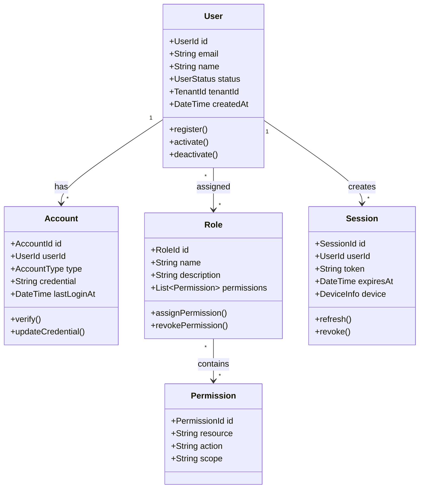
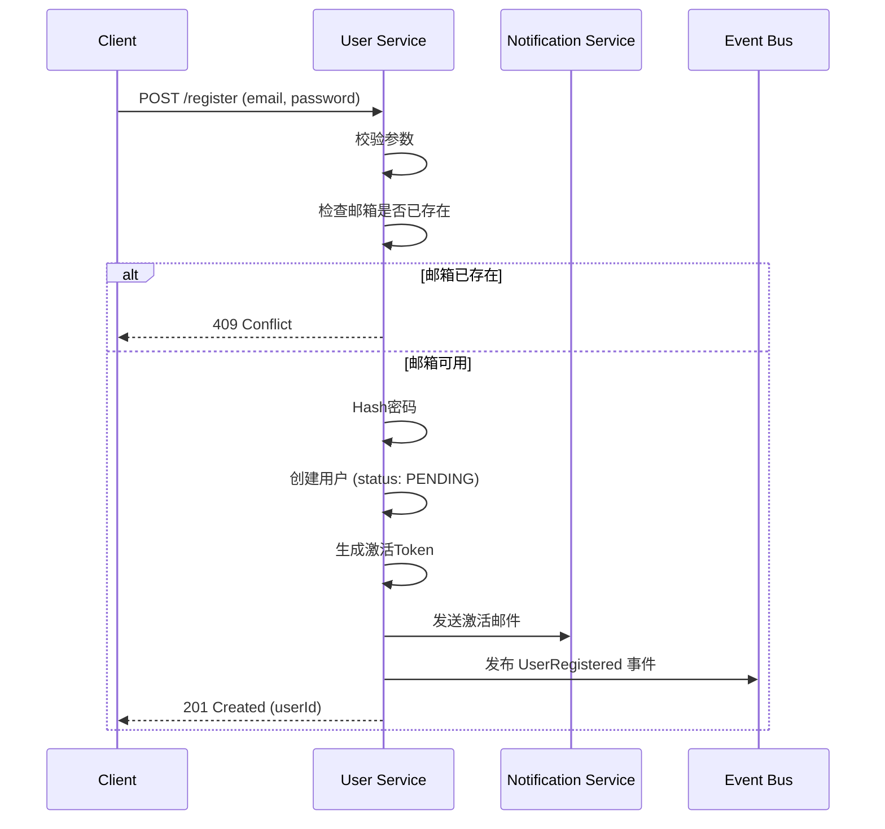
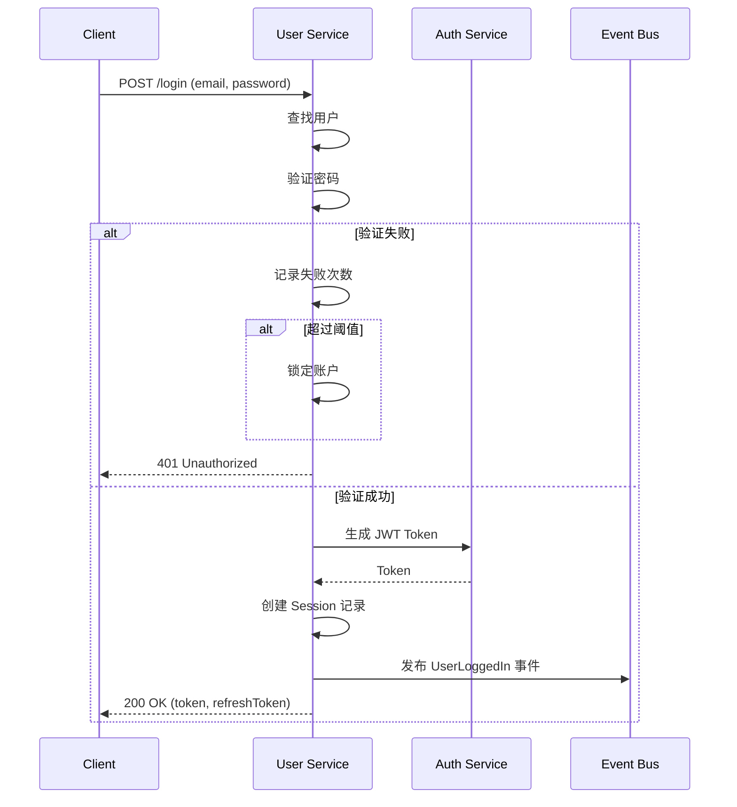

# 领域模型: 用户域 (User Domain)

**负责人**: @用户平台团队
**最后更新**: 2025-11-30
**版本**: 2.0

---

## 1. 领域概述 (Domain Overview)

用户域负责管理平台所有用户的**身份**、**认证**、**授权**和**基本信息**。它是整个系统的基础领域，几乎所有其他领域都依赖用户域提供的身份服务。

<!-- AI-CONTEXT
用户域是核心基础领域，提供身份认证和授权服务。
AI在涉及用户相关功能时应参考此领域模型。
关键概念：User, Role, Permission, Session
依赖此域的服务需通过定义的API契约访问，禁止直接数据库访问。
-->

---

## 2. 核心概念 / 通用语言 (Ubiquitous Language)

| 术语 | 英文 | 定义 | 示例 |
|------|------|------|------|
| **用户** | User | 平台中的独立个体，拥有唯一身份标识 | 一个注册的账号 |
| **账户** | Account | 用户的登录凭证集合 | 邮箱+密码、手机号 |
| **角色** | Role | 定义一组权限的集合 | "管理员", "编辑者", "普通用户" |
| **权限** | Permission | 执行某个特定操作的权力 | `user:read`, `order:create` |
| **会话** | Session | 用户登录后的身份凭证 | JWT Token |
| **租户** | Tenant | 多租户场景下的组织隔离单元 | 企业A, 企业B |
| **身份提供者** | Identity Provider | 第三方认证源 | Google, GitHub, 企业SSO |

---

## 3. 领域模型图



---

## 4. 限界上下文 (Bounded Context)

### 本领域职责 ✅

- [x] 用户注册与登录
- [x] 密码管理（重置、修改）
- [x] 多因素认证 (MFA)
- [x] 角色与权限管理
- [x] 会话管理
- [x] 第三方登录集成
- [x] 用户基本信息维护

### 非本领域职责 ❌ (依赖外部领域)

| 功能 | 所属领域 | 交互方式 |
|------|----------|----------|
| 订单历史 | 订单域 | 通过userId查询 |
| 支付信息 | 支付域 | 通过userId关联 |
| 用户偏好设置 | 设置域 | 独立服务 |
| 用户行为分析 | 分析域 | 事件订阅 |

---

## 5. 核心业务流程 (Core Workflows)

### 5.1 用户注册流程



### 5.2 用户登录流程



---

## 6. 领域事件 (Domain Events)

| 事件 | 触发条件 | 消费者 | 数据 |
|------|----------|--------|------|
| `UserRegistered` | 用户注册成功 | 通知服务、分析服务 | userId, email, registeredAt |
| `UserActivated` | 用户激活账户 | 分析服务 | userId, activatedAt |
| `UserLoggedIn` | 用户登录成功 | 安全服务、分析服务 | userId, ip, device, loginAt |
| `UserPasswordChanged` | 密码修改 | 通知服务 | userId, changedAt |
| `UserRoleAssigned` | 角色分配 | 审计服务 | userId, roleId, assignedBy |
| `UserDeactivated` | 用户停用 | 所有相关服务 | userId, reason, deactivatedAt |

### 事件Schema示例

```json
{
  "eventId": "evt-uuid",
  "eventType": "UserRegistered",
  "timestamp": "2025-11-30T10:15:30Z",
  "version": "1.0",
  "data": {
    "userId": "user-123",
    "email": "user@example.com",
    "registeredAt": "2025-11-30T10:15:30Z"
  },
  "metadata": {
    "correlationId": "req-uuid",
    "source": "user-service"
  }
}
```

---

## 7. 对外暴露的 API

### 公开API

| 方法 | 路径 | 描述 |
|------|------|------|
| `POST` | `/users/register` | 用户注册 |
| `POST` | `/users/login` | 用户登录 |
| `POST` | `/users/logout` | 用户登出 |
| `POST` | `/users/password/reset` | 请求密码重置 |
| `GET` | `/users/me` | 获取当前用户信息 |
| `PATCH` | `/users/me` | 更新当前用户信息 |

### 内部API (服务间调用)

| 方法 | 路径 | 描述 | 调用方 |
|------|------|------|--------|
| `GET` | `/internal/users/{id}` | 获取用户详情 | 订单服务、支付服务 |
| `POST` | `/internal/users/batch` | 批量获取用户 | 报表服务 |
| `GET` | `/internal/users/{id}/permissions` | 获取用户权限 | API网关 |

---

## 8. 数据所有权

| 数据 | 所有者 | 访问权限 |
|------|--------|----------|
| 用户基本信息 | 用户域 | 只读共享 |
| 登录凭证 | 用户域 | 不共享 |
| 角色权限 | 用户域 | 只读共享 |
| 会话信息 | 用户域 | 不共享 |

---

## 9. 依赖关系

### 上游依赖 (本域依赖的服务)

| 服务 | 用途 | 降级策略 |
|------|------|----------|
| 通知服务 | 发送邮件/短信 | 异步重试 |
| 缓存服务 | 会话缓存 | 降级到数据库 |

### 下游依赖 (依赖本域的服务)

| 服务 | 依赖内容 | SLA要求 |
|------|----------|---------|
| 订单服务 | 用户信息、权限校验 | 99.9% |
| 支付服务 | 用户身份验证 | 99.9% |
| API网关 | Token验证 | 99.95% |

---

## 变更历史

| 版本 | 日期 | 变更内容 | 作者 |
|------|------|----------|------|
| 2.0 | 2025-11-30 | 增加AI上下文、事件Schema | @用户平台团队 |
| 1.0 | 2025-01-01 | 初始版本 | @用户平台团队 |
