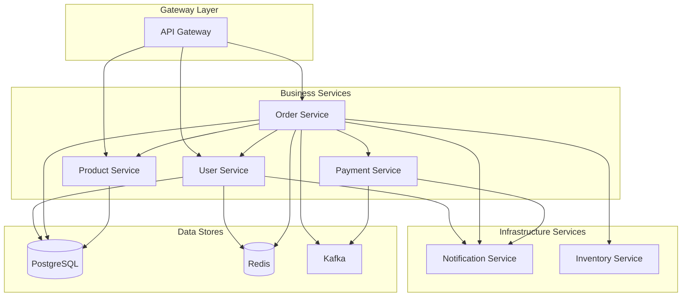

# 服务目录 (Service Catalog)

**最后更新**: 2025-11-30
**负责人**: @平台架构团队

---

## 概述

本文档记录了所有微服务的基本信息、依赖关系和访问方式，便于服务发现和集成。

<!-- AI-CONTEXT
服务目录是了解系统整体架构的入口。
AI在进行跨服务设计或集成时应参考此目录。
-->

---

## 服务总览

---

## 服务详情

### 用户服务 (User Service)

| 属性 | 值 |
|------|-----|
| **服务名** | `user-service` |
| **负责团队** | @用户平台团队 |
| **代码仓库** | `github.com/company/user-service` |
| **技术栈** | Java 17 / Spring Boot 3.2 |
| **端口** | 8001 |
| **健康检查** | `/actuator/health` |
| **API文档** | `/swagger-ui.html` |

**核心功能**: 用户注册、登录、权限管理

**依赖**:
- PostgreSQL (主数据库)
- Redis (会话缓存)
- Notification Service (邮件通知)

---

### 订单服务 (Order Service)

| 属性 | 值 |
|------|-----|
| **服务名** | `order-service` |
| **负责团队** | @交易平台团队 |
| **代码仓库** | `github.com/company/order-service` |
| **技术栈** | Java 17 / Spring Boot 3.2 |
| **端口** | 8002 |
| **健康检查** | `/actuator/health` |

**核心功能**: 订单创建、支付、履约

**依赖**:
- User Service (用户信息)
- Product Service (商品信息)
- Inventory Service (库存)
- Payment Service (支付)
- PostgreSQL, Redis, Kafka

---

### 商品服务 (Product Service)

| 属性 | 值 |
|------|-----|
| **服务名** | `product-service` |
| **负责团队** | @商品团队 |
| **代码仓库** | `github.com/company/product-service` |
| **技术栈** | Java 17 / Spring Boot 3.2 |
| **端口** | 8003 |

**核心功能**: 商品管理、分类、搜索

**依赖**:
- PostgreSQL
- Elasticsearch (搜索)
- Redis (缓存)

---

### 支付服务 (Payment Service)

| 属性 | 值 |
|------|-----|
| **服务名** | `payment-service` |
| **负责团队** | @支付团队 |
| **代码仓库** | `github.com/company/payment-service` |
| **技术栈** | Java 17 / Spring Boot 3.2 |
| **端口** | 8004 |
| **安全级别** | 高 (PCI-DSS) |

**核心功能**: 支付处理、退款

**依赖**:
- PostgreSQL
- Kafka (事件)
- 第三方支付网关

---

## 服务间通信矩阵

| 调用方 \ 被调方 | User | Order | Product | Payment | Inventory |
|-----------------|------|-------|---------|---------|-----------|
| **API Gateway** | ✅ | ✅ | ✅ | - | - |
| **User** | - | - | - | - | - |
| **Order** | ✅ | - | ✅ | ✅ | ✅ |
| **Product** | - | - | - | - | ✅ |
| **Payment** | ✅ | ✅ | - | - | - |

---

## 环境配置

| 环境 | API网关地址 | 用途 |
|------|------------|------|
| **开发** | `https://api-dev.example.com` | 开发测试 |
| **测试** | `https://api-staging.example.com` | 集成测试 |
| **生产** | `https://api.example.com` | 生产环境 |

---

## 变更历史

| 日期 | 变更 | 作者 |
|------|------|------|
| 2025-11-30 | 初始版本 | @平台架构团队 |
