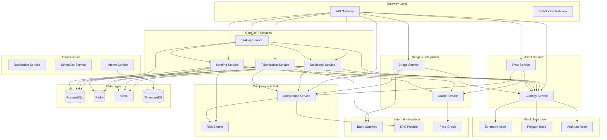

# Web3金融服务目录 (Web3 Financial Service Catalog)

**最后更新**: 2025-11-30
**负责人**: @平台架构团队

---

## 概述

本文档记录了Web3金融服务平台所有微服务的基本信息、依赖关系和访问方式，便于服务发现和集成。

<!-- AI-CONTEXT
服务目录是了解系统整体架构的入口。
AI在进行跨服务设计或集成时应参考此目录。
核心服务包括：稳定币、代币化、托管、RWA、Staking、Lending、Bridge、Compliance
-->

---

## 服务架构总览

---

## 核心DeFi服务

### 稳定币服务 (Stablecoin Service)

| 属性 | 值 |
|------|-----|
| **服务名** | `stablecoin-service` |
| **负责团队** | @稳定币团队 |
| **代码仓库** | `github.com/company/stablecoin-service` |
| **技术栈** | Go 1.21 / Gin |
| **端口** | 8101 |
| **健康检查** | `/health` |
| **API文档** | `/docs` |
| **安全级别** | 高 |

**核心功能**:
- 稳定币铸造/销毁
- 储备金管理
- 储备证明发布
- 锚定机制维护

**依赖服务**:
- Custody Service (资产托管)
- Compliance Service (合规检查)
- Oracle Service (价格喂价)
- Notification Service (通知)

**对外API**:
- `POST /api/v1/stablecoins/{id}/mint` - 铸币
- `POST /api/v1/stablecoins/{id}/redeem` - 赎回
- `GET /api/v1/stablecoins/{id}/reserve` - 储备信息

---

### 代币化服务 (Tokenization Service)

| 属性 | 值 |
|------|-----|
| **服务名** | `tokenization-service` |
| **负责团队** | @代币化团队 |
| **代码仓库** | `github.com/company/tokenization-service` |
| **技术栈** | Java 21 / Spring Boot 3.2 |
| **端口** | 8102 |
| **健康检查** | `/actuator/health` |

**核心功能**:
- 存款代币化
- 利息分发
- 对账管理
- 银行集成

**依赖服务**:
- Custody Service (代币托管)
- Compliance Service (合规)
- Bridge Service (银行网关)

**对外API**:
- `POST /api/v1/tokenization/deposit` - 存款代币化
- `POST /api/v1/tokenization/redeem` - 赎回
- `GET /api/v1/deposit-tokens/{id}/rate` - 利率查询

---

### 质押服务 (Staking Service)

| 属性 | 值 |
|------|-----|
| **服务名** | `staking-service` |
| **负责团队** | @DeFi团队 |
| **代码仓库** | `github.com/company/staking-service` |
| **技术栈** | Rust / Actix-web |
| **端口** | 8103 |
| **健康检查** | `/health` |

**核心功能**:
- 质押池管理
- 收益计算
- 奖励分发
- 流动性质押代币

**依赖服务**:
- Custody Service (资产托管)
- Stablecoin Service (奖励支付)
- Scheduler Service (定时任务)

**对外API**:
- `POST /api/v1/staking/stake` - 质押
- `POST /api/v1/staking/unstake` - 解质押
- `GET /api/v1/staking/pools` - 质押池列表
- `GET /api/v1/staking/positions` - 我的仓位

---

### 借贷服务 (Lending Service)

| 属性 | 值 |
|------|-----|
| **服务名** | `lending-service` |
| **负责团队** | @DeFi团队 |
| **代码仓库** | `github.com/company/lending-service` |
| **技术栈** | Rust / Actix-web |
| **端口** | 8104 |
| **健康检查** | `/health` |
| **安全级别** | 高 (清算风险) |

**核心功能**:
- 抵押借贷
- 利率模型
- 清算执行
- 风险监控

**依赖服务**:
- Custody Service (资产托管)
- Oracle Service (价格喂价)
- Risk Engine (风险评估)
- Scheduler Service (利息累计)

**对外API**:
- `POST /api/v1/lending/deposit` - 存款
- `POST /api/v1/lending/borrow` - 借款
- `POST /api/v1/lending/repay` - 还款
- `GET /api/v1/lending/account/health` - 健康因子

---

## 资产服务

### 托管服务 (Custody Service)

| 属性 | 值 |
|------|-----|
| **服务名** | `custody-service` |
| **负责团队** | @安全团队 |
| **代码仓库** | `github.com/company/custody-service` |
| **技术栈** | Go 1.21 / Gin |
| **端口** | 8201 |
| **健康检查** | `/health` |
| **安全级别** | 最高 (密钥管理) |

**核心功能**:
- 保险库管理
- 钱包创建
- 多签交易
- 密钥管理 (HSM/MPC)

**依赖服务**:
- Compliance Service (交易审核)
- Blockchain Nodes (链上交互)

**对外API**:
- `POST /api/v1/vaults` - 创建保险库
- `POST /api/v1/wallets/{id}/transactions` - 创建交易
- `POST /api/v1/transactions/{id}/sign` - 签名

**安全措施**:
- HSM密钥存储
- MPC签名
- 多签审批
- 策略引擎

---

### RWA服务 (RWA Service)

| 属性 | 值 |
|------|-----|
| **服务名** | `rwa-service` |
| **负责团队** | @资产团队 |
| **代码仓库** | `github.com/company/rwa-service` |
| **技术栈** | Java 21 / Spring Boot 3.2 |
| **端口** | 8202 |
| **健康检查** | `/actuator/health` |

**核心功能**:
- 资产代币化
- 发行管理
- 分红分发
- 合规转让

**依赖服务**:
- Custody Service (代币托管)
- Compliance Service (投资者认证)
- Oracle Service (估值)
- Stablecoin Service (分红支付)

**对外API**:
- `POST /api/v1/rwa/assets` - 资产入驻
- `GET /api/v1/rwa/offerings` - 发行列表
- `POST /api/v1/rwa/offerings/{id}/subscribe` - 认购

---

## 桥接与集成

### 桥接服务 (Bridge Service)

| 属性 | 值 |
|------|-----|
| **服务名** | `bridge-service` |
| **负责团队** | @支付团队 |
| **代码仓库** | `github.com/company/bridge-service` |
| **技术栈** | Node.js / Fastify |
| **端口** | 8301 |
| **健康检查** | `/health` |

**核心功能**:
- 法币出入金
- 银行账户管理
- 汇率报价
- 对账管理

**依赖服务**:
- Custody Service (加密资产)
- Compliance Service (AML)
- Stablecoin Service (代币铸造/销毁)
- External: Bank Gateway

**对外API**:
- `POST /api/v1/bridge/onramp/order` - 入金订单
- `POST /api/v1/bridge/offramp/order` - 出金订单
- `GET /api/v1/bridge/bank-accounts` - 银行账户

---

### 预言机服务 (Oracle Service)

| 属性 | 值 |
|------|-----|
| **服务名** | `oracle-service` |
| **负责团队** | @数据团队 |
| **代码仓库** | `github.com/company/oracle-service` |
| **技术栈** | Go 1.21 |
| **端口** | 8302 |
| **健康检查** | `/health` |

**核心功能**:
- 价格聚合
- 汇率服务
- 资产估值
- 价格异常检测

**数据源**:
- Chainlink
- Pyth
- CoinGecko
- 银行汇率接口

**对外API**:
- `GET /api/v1/prices/{asset}` - 获取价格
- `GET /api/v1/rates/{from}/{to}` - 获取汇率

---

## 合规与风控

### 合规服务 (Compliance Service)

| 属性 | 值 |
|------|-----|
| **服务名** | `compliance-service` |
| **负责团队** | @合规团队 |
| **代码仓库** | `github.com/company/compliance-service` |
| **技术栈** | Java 21 / Spring Boot 3.2 |
| **端口** | 8401 |
| **健康检查** | `/actuator/health` |
| **安全级别** | 最高 (敏感数据) |

**核心功能**:
- KYC验证
- AML筛查
- 交易监控
- SAR报告
- 制裁筛查

**依赖服务**:
- Risk Engine (风险评估)
- External: KYC Providers (Jumio, Onfido)
- External: AML Providers (Chainalysis, Elliptic)

**对外API**:
- `POST /api/v1/compliance/kyc/initiate` - 发起KYC
- `GET /api/v1/compliance/kyc/status` - KYC状态
- `GET /api/v1/compliance/limits` - 交易限额

**内部API**:
- `POST /internal/v1/compliance/screen/transaction` - 交易筛查
- `POST /internal/v1/compliance/freeze` - 冻结账户

---

### 风控引擎 (Risk Engine)

| 属性 | 值 |
|------|-----|
| **服务名** | `risk-engine` |
| **负责团队** | @风控团队 |
| **代码仓库** | `github.com/company/risk-engine` |
| **技术栈** | Python / FastAPI |
| **端口** | 8402 |
| **健康检查** | `/health` |

**核心功能**:
- 风险评分
- 异常检测
- 清算预警
- 系统风险监控

**依赖服务**:
- Oracle Service (价格数据)
- Lending Service (仓位数据)
- 机器学习模型

**对外API**:
- `GET /api/v1/risk/account/{id}/assessment` - 账户风险评估
- `GET /api/v1/risk/system/health` - 系统风险状况

---

## 基础设施服务

### 通知服务 (Notification Service)

| 属性 | 值 |
|------|-----|
| **服务名** | `notification-service` |
| **端口** | 8501 |
| **技术栈** | Node.js / Fastify |

**功能**: 邮件、短信、推送、Webhook通知

---

### 调度服务 (Scheduler Service)

| 属性 | 值 |
|------|-----|
| **服务名** | `scheduler-service` |
| **端口** | 8502 |
| **技术栈** | Go / Temporal |

**功能**: 定时任务、利息累计、奖励分发、对账

---

### 索引服务 (Indexer Service)

| 属性 | 值 |
|------|-----|
| **服务名** | `indexer-service` |
| **端口** | 8503 |
| **技术栈** | Rust / TheGraph |

**功能**: 链上事件索引、历史数据查询

---

## 服务间通信矩阵

| 调用方 \ 被调方 | Custody | Stablecoin | Tokenization | Staking | Lending | RWA | Bridge | Compliance | Oracle | Risk |
|-----------------|---------|------------|--------------|---------|---------|-----|--------|------------|--------|------|
| **API Gateway** | ✅ | ✅ | ✅ | ✅ | ✅ | ✅ | ✅ | ✅ | - | - |
| **Stablecoin** | ✅ | - | - | - | - | - | - | ✅ | ✅ | - |
| **Tokenization** | ✅ | - | - | - | - | - | ✅ | ✅ | - | - |
| **Staking** | ✅ | ✅ | - | - | ✅ | - | - | - | - | - |
| **Lending** | ✅ | - | - | ✅ | - | ✅ | - | - | ✅ | ✅ |
| **RWA** | ✅ | ✅ | - | - | ✅ | - | - | ✅ | ✅ | - |
| **Bridge** | ✅ | ✅ | - | - | - | - | - | ✅ | ✅ | - |
| **Compliance** | - | - | - | - | - | - | - | - | - | ✅ |

---

## 环境配置

| 环境 | API网关地址 | 用途 | 区块链网络 |
|------|------------|------|-----------|
| **开发** | `https://api-dev.web3fin.io` | 开发测试 | Sepolia, Mumbai |
| **测试** | `https://api-staging.web3fin.io` | 集成测试 | Goerli, Mumbai |
| **生产** | `https://api.web3fin.io` | 生产环境 | Mainnet, Polygon |

---

## 监控与告警

| 服务 | 关键指标 | 告警阈值 |
|------|---------|---------|
| Custody | 签名延迟, 交易成功率 | >5s, <99.9% |
| Stablecoin | 储备率, 价格偏离 | <100%, >1% |
| Lending | 清算率, 系统健康因子 | >5%/日, <1.1 |
| Bridge | 入金成功率, 出金延迟 | <98%, >24h |
| Compliance | 筛查延迟, 告警积压 | >1s, >100 |

---

## 变更历史

| 日期 | 变更 | 作者 |
|------|------|------|
| 2025-11-30 | Web3金融服务架构 | @平台架构团队 |
