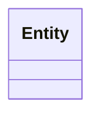
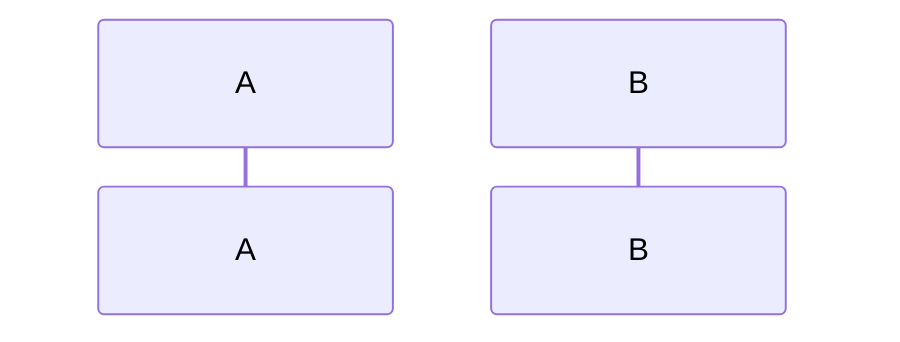
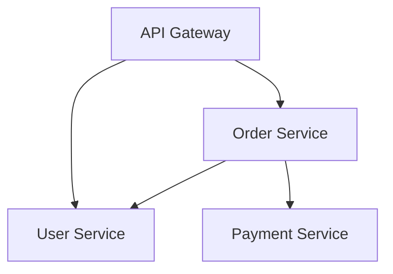

# 五层知识架构设计方案

**版本**: 1.0
**创建日期**: 2025-11-30
**作者**: 架构团队
**状态**: 已发布

---

## 目录

1. [概述](#1-概述)
2. [设计背景](#2-设计背景)
3. [架构设计](#3-架构设计)
   - 3.1 [整体架构图](#31-整体架构图)
   - 3.2 [层级关系](#32-层级关系)
   - 3.2.1 [L3与L3.5的关系](#321-l3与l35的关系)
4. [各层详细设计](#4-各层详细设计)
   - 4.1 [L0: 企业技术宪法层](#41-l0-企业技术宪法层)
   - 4.2 [L1: 领域知识层](#42-l1-领域知识层)
   - 4.3 [L2: 项目基座层](#43-l2-项目基座层)
   - 4.4 [L3: 实施执行层](#44-l3-实施执行层)
   - 4.5 [L4: 知识演进层](#45-l4-知识演进层)
   - 4.6 [L3.5: 代码衍生知识层](#46-l35-代码衍生知识层)
5. [跨层级机制](#5-跨层级机制)
6. [AI协作设计](#6-ai协作设计)
7. [实施指南](#7-实施指南)
8. [最佳实践](#8-最佳实践)
9. [附录](#9-附录)

---

## 1. 概述

### 1.1 文档目的

本文档详细描述了"五层知识架构"(5-Layer Knowledge Architecture)的设计方案，旨在构建一个**分层的、跨仓库的、AI友好的**企业知识库体系。该体系将隐性知识显性化、结构化，为AI编码助手、RAG系统和自动化工具提供高质量的上下文"燃料"。

### 1.2 核心价值

| 价值维度 | 描述 |
|----------|------|
| **知识复用** | 通过分层设计，实现企业→领域→项目的知识继承和复用 |
| **AI赋能** | 结构化的知识便于AI理解和应用，提升AI辅助开发效率 |
| **一致性保障** | 统一的规范从企业层传递到项目层，确保技术一致性 |
| **持续演进** | 内置知识沉淀机制，促进团队持续学习和改进 |

### 1.3 适用范围

- 中大型软件开发组织
- 多团队、多仓库的微服务架构
- 采用AI辅助开发的团队
- 需要标准化技术治理的企业

---

## 2. 设计背景

### 2.1 现状分析

#### 2.1.1 传统知识库的问题

| 问题 | 表现 | 影响 |
|------|------|------|
| **知识孤岛** | 各项目独立维护文档，无法共享 | 重复造轮子，规范不一致 |
| **缺乏分层** | 所有文档平铺，无优先级区分 | 新人不知从何入手 |
| **跨仓库割裂** | 依赖仓库的知识无法获取 | 集成时缺乏上下文 |
| **AI不友好** | 文档格式随意，缺乏结构 | AI无法有效理解和应用 |
| **更新滞后** | 文档与代码脱节 | 文档失去参考价值 |

#### 2.1.2 融合两种方案

本设计融合了两种知识库方案的优势：

**方案一：实践型知识库 (full_documents)**
- ✅ 完整覆盖项目全周期
- ✅ 强制规范执行
- ✅ AI协作优化
- ❌ 未考虑跨仓库复用
- ❌ 无依赖仓库知识设计

**方案二：分层架构设计 (知识库设计方案.md)**
- ✅ L0-L3分层清晰
- ✅ 跨仓库设计理念
- ✅ AI友好模板
- ❌ 缺乏AI协作专项
- ❌ 无案例/培训体系

### 2.2 设计目标

```
┌─────────────────────────────────────────────────────────────┐
│                      设计目标                                │
├─────────────────────────────────────────────────────────────┤
│  1. 建立清晰的知识分层体系 (L0-L4)                           │
│  2. 实现跨仓库知识继承和复用                                  │
│  3. 支持依赖仓库知识自动聚合                                  │
│  4. 为AI提供结构化的上下文输入                                │
│  5. 内置知识沉淀和持续改进机制                                │
└─────────────────────────────────────────────────────────────┘
```

---

## 3. 架构设计

### 3.1 整体架构图

```
┌─────────────────────────────────────────────────────────────────┐
│                    L0: 企业技术宪法层                            │
│         (Enterprise Constitution - 全局强制, 跨组织统一)          │
│                                                                  │
│   ┌──────────────┐ ┌──────────────┐ ┌──────────────┐            │
│   │  架构原则     │ │  编码规范     │ │  技术雷达     │            │
│   │  安全基线     │ │  API指南     │ │  治理流程     │            │
│   └──────────────┘ └──────────────┘ └──────────────┘            │
├─────────────────────────────────────────────────────────────────┤
│                    L1: 领域知识层                                │
│         (Domain Knowledge - 跨仓库共享, 业务边界定义)             │
│                                                                  │
│   ┌──────────────┐ ┌──────────────┐ ┌──────────────┐            │
│   │  用户域模型   │ │  订单域模型   │ │  支付域模型   │            │
│   │  API契约     │ │  领域事件     │ │  服务目录     │            │
│   └──────────────┘ └──────────────┘ └──────────────┘            │
├─────────────────────────────────────────────────────────────────┤
│                    L2: 项目基座层                                │
│         (Project Foundation - 仓库级规范, 架构决策)               │
│                                                                  │
│   ┌──────────────┐ ┌──────────────┐ ┌──────────────┐            │
│   │  项目章程     │ │  系统架构     │ │  技术栈      │            │
│   │  术语词典     │ │  ADR记录     │ │  分层定义     │            │
│   └──────────────┘ └──────────────┘ └──────────────┘            │
├─────────────────────────────────────────────────────────────────┤
│                    L3: 实施执行层                                │
│         (Implementation - 开发规范, AI协作, 技术文档)             │
│                                                                  │
│   ┌──────────────┐ ┌──────────────┐ ┌──────────────┐            │
│   │  编码约定     │ │  测试策略     │ │  AI协作      │            │
│   │  Git工作流   │ │  部署指南     │ │  Prompt模板   │            │
│   └──────────────┘ └──────────────┘ └──────────────┘            │
├ ─ ─ ─ ─ ─ ─ ─ ─ ─ ─ ─ ─ ─ ─ ─ ─ ─ ─ ─ ─ ─ ─ ─ ─ ─ ─ ─ ─ ─ ─ ─ ┤
│              L3.5: 代码衍生知识层 (Code-Derived)                  │
│         (AI生成文档 - 代码分析, 架构推断, 自动更新)               │
│                                                                  │
│   ┌──────────────┐ ┌──────────────┐ ┌──────────────┐            │
│   │  仓库概览     │ │  模块文档     │ │  API摘要     │            │
│   │  组件关系     │ │  数据流图     │ │  依赖图谱     │            │
│   └──────────────┘ └──────────────┘ └──────────────┘            │
├─────────────────────────────────────────────────────────────────┤
│                    L4: 知识演进层                                │
│         (Evolution - 案例沉淀, 培训体系, 持续改进)                │
│                                                                  │
│   ┌──────────────┐ ┌──────────────┐ ┌──────────────┐            │
│   │  架构案例     │ │  经验教训     │ │  质量指标     │            │
│   │  培训资料     │ │  改进待办     │ │  回顾记录     │            │
│   └──────────────┘ └──────────────┘ └──────────────┘            │
└─────────────────────────────────────────────────────────────────┘
```

> **注意**: L3.5 使用虚线边框表示它是 L3 的扩展子层，由 AI 自动生成而非人工编写。

### 3.2 层级关系

```
                    ┌─────────────┐
                    │     L0      │  ← 企业级，独立仓库，强制继承
                    │  企业宪法   │
                    └──────┬──────┘
                           │ 继承
                    ┌──────▼──────┐
                    │     L1      │  ← 跨项目，独立仓库，按需引用
                    │  领域知识   │
                    └──────┬──────┘
                           │ 引用
          ┌────────────────┼────────────────┐
          │                │                │
   ┌──────▼──────┐  ┌──────▼──────┐  ┌──────▼──────┐
   │   项目A     │  │   项目B     │  │   项目C     │
   │L2+L3+L3.5+L4│  │L2+L3+L3.5+L4│  │L2+L3+L3.5+L4│
   └─────────────┘  └─────────────┘  └─────────────┘
         ↑                ↑                ↑
         └────── 依赖仓库知识传递 ─────────┘
```

### 3.2.1 L3与L3.5的关系

```
┌─────────────────────────────────────────────────────────────────┐
│                        L3 实施执行层                              │
│                     (人工编写，规范性文档)                         │
│                                                                   │
│  描述：应该怎么做 (How it SHOULD be done)                         │
│  ┌─────────────┐  ┌─────────────┐  ┌─────────────┐              │
│  │ 编码规范     │  │ 测试策略     │  │ 部署指南     │              │
│  └─────────────┘  └─────────────┘  └─────────────┘              │
├ ─ ─ ─ ─ ─ ─ ─ ─ ─ ─ ─ ─ ─ ┬ ─ ─ ─ ─ ─ ─ ─ ─ ─ ─ ─ ─ ─ ─ ─ ─ ─ ┤
│                           │                                       │
│                    AI 自动分析                                    │
│                           │                                       │
│                    ┌──────▼──────┐                               │
│                    │   代码仓库   │                               │
│                    └──────┬──────┘                               │
│                           │                                       │
│                    AI 自动生成                                    │
│                           │                                       │
├ ─ ─ ─ ─ ─ ─ ─ ─ ─ ─ ─ ─ ─ ▼ ─ ─ ─ ─ ─ ─ ─ ─ ─ ─ ─ ─ ─ ─ ─ ─ ─ ┤
│                     L3.5 代码衍生层                               │
│                  (AI生成，反映实际状态)                            │
│                                                                   │
│  描述：实际是怎样的 (How it ACTUALLY is)                          │
│  ┌─────────────┐  ┌─────────────┐  ┌─────────────┐              │
│  │ 模块架构     │  │ API文档      │  │ 数据流图     │              │
│  └─────────────┘  └─────────────┘  └─────────────┘              │
└─────────────────────────────────────────────────────────────────┘
```

**关系说明**:
| 维度 | L3 实施执行层 | L3.5 代码衍生层 |
|------|--------------|----------------|
| **生成方式** | 人工编写 | AI自动生成 |
| **更新频率** | 按需更新 | 随代码自动更新 |
| **内容性质** | 规范性、指导性 | 描述性、反映性 |
| **信息来源** | 设计决策、规范要求 | 代码实现、运行逻辑 |
| **验证方式** | 人工审核 | 代码一致性校验 |
| **主要用途** | 指导开发 | 理解现状、快速上手 |

### 3.3 存储位置

| 层级 | 存储位置 | 管理方式 |
|------|----------|----------|
| **L0** | 独立仓库 `enterprise-standards` | 架构委员会统一管理 |
| **L1** | 独立仓库 `domain-knowledge` | 领域团队协作管理 |
| **L2** | 项目仓库 `.knowledge/` 目录 | 项目团队管理 |
| **L3** | 项目仓库 `.knowledge/` 目录 | 项目团队管理 |
| **L3.5** | 项目仓库 `.knowledge/code-derived/` 或独立 `codewiki/` | AI自动生成+人工审核 |
| **L4** | 项目仓库 `.knowledge/evolution/` | 项目团队持续积累 |

---

## 4. 各层详细设计

### 4.1 L0: 企业技术宪法层

#### 4.1.1 定位与职责

| 属性 | 描述 |
|------|------|
| **范围** | 跨组织、跨项目的全局规范 |
| **强制性** | 强制执行，所有项目必须遵循 |
| **管理者** | 架构委员会 |
| **更新频率** | 季度评审，按需更新 |
| **版本控制** | 语义化版本 (v1.0.0) |

#### 4.1.2 目录结构

```
enterprise-standards/
├── constitution/                  # 核心宪法
│   ├── architecture-principles.md # 架构原则
│   ├── security-baseline.md       # 安全基线
│   └── compliance-requirements.md # 合规要求
│
├── standards/                     # 编码规范
│   ├── coding-standards/
│   │   ├── java-standards.md
│   │   ├── typescript-standards.md
│   │   ├── python-standards.md
│   │   └── go-standards.md
│   ├── api-design-guide.md        # API设计指南
│   └── observability-standards.md # 可观测性规范
│
├── technology-radar/              # 技术雷达
│   ├── adopt.md                   # 推荐采用
│   ├── trial.md                   # 试验阶段
│   ├── assess.md                  # 评估中
│   └── hold.md                    # 暂缓使用
│
└── governance/                    # 治理流程
    ├── review-process.md          # 评审流程
    └── exception-handling.md      # 例外申请
```

#### 4.1.3 核心内容详解

##### 架构原则 (architecture-principles.md)

| 原则 | 核心要求 | 检查点 |
|------|----------|--------|
| **12-Factor App** | 无状态进程、环境变量配置、结构化日志 | CI/CD检查 |
| **领域驱动设计** | 限界上下文、通用语言、聚合根 | 架构评审 |
| **API优先** | OpenAPI契约先行 | PR检查 |
| **可观测性设计** | 日志/指标/追踪三支柱 | 部署检查 |
| **安全内建** | OAuth2.0、最小权限、输入验证 | 安全扫描 |

##### 技术雷达分类

```
┌─────────────────────────────────────────────────────────────┐
│                        技术雷达                              │
├──────────────┬──────────────┬──────────────┬───────────────┤
│    ADOPT     │    TRIAL     │    ASSESS    │     HOLD      │
│   推荐采用    │   试验阶段    │    评估中    │    暂缓使用    │
├──────────────┼──────────────┼──────────────┼───────────────┤
│ Java 17/21   │ Rust         │ Deno         │ Java 8/11     │
│ Spring Boot  │ Go           │ Bun          │ Maven         │
│ React 18     │ Astro        │ Qwik         │ jQuery        │
│ PostgreSQL   │ ClickHouse   │              │ MongoDB*      │
│ Kubernetes   │ Pulumi       │              │ Jenkins       │
└──────────────┴──────────────┴──────────────┴───────────────┘
```

#### 4.1.4 AI上下文标记

所有L0文档必须包含AI上下文标记：

```markdown
<!-- AI-CONTEXT
本文档是L0层企业级强制规范，所有项目必须遵循。
AI在进行架构审查或代码生成时，应验证是否符合以下原则。
违规检测关键词：硬编码配置、有状态进程、跨边界直接调用
-->
```

---

### 4.2 L1: 领域知识层

#### 4.2.1 定位与职责

| 属性 | 描述 |
|------|------|
| **范围** | 跨仓库共享的业务领域知识 |
| **强制性** | 按需引用，领域内强制 |
| **管理者** | 领域专家团队 |
| **更新频率** | 领域变更时更新 |
| **版本控制** | 分支+标签 |

#### 4.2.2 目录结构

```
domain-knowledge/
├── bounded-contexts/              # 限界上下文
│   ├── user-domain/
│   │   ├── domain-model.md       # 领域模型
│   │   ├── workflows.md          # 业务流程
│   │   ├── api-contracts.md      # API契约
│   │   ├── events.md             # 领域事件
│   │   └── dependencies.md       # 依赖声明
│   ├── order-domain/
│   ├── payment-domain/
│   └── product-domain/
│
├── service-mesh/                  # 服务网格
│   ├── service-catalog.md        # 服务目录
│   ├── dependency-map.md         # 依赖关系图
│   └── integration-patterns.md   # 集成模式
│
├── shared-assets/                 # 共享资产
│   ├── common-libraries.md       # 共享库
│   ├── shared-schemas/           # 共享数据模型
│   └── cross-cutting-concerns.md # 横切关注点
│
└── glossary/
    └── enterprise-glossary.md    # 企业术语词典
```

#### 4.2.3 领域模型模板

```markdown
# 领域模型: [领域名称]

**负责人**: @领域专家
**最后更新**: YYYY-MM-DD

## 1. 领域概述
[一段话描述核心职责和价值]

## 2. 核心概念 / 通用语言
| 术语 | 英文 | 定义 | 示例 |
|------|------|------|------|
| **用户** | User | ... | ... |

## 3. 领域模型图


## 4. 限界上下文边界
### 本领域职责 ✅
- [x] 职责1
### 非本领域职责 ❌
- [ ] 职责2 (依赖: 其他领域)

## 5. 核心业务流程


## 6. 领域事件
| 事件 | 触发条件 | 消费者 |
|------|----------|--------|

## 7. 对外API契约
[API列表和链接]

## 8. 依赖关系
### 上游依赖
### 下游依赖
```

#### 4.2.4 服务目录

服务目录提供所有微服务的全局视图：

```markdown
# 服务目录

## 服务拓扑图


## 服务详情

| 服务名 | 负责团队 | 技术栈 | 端口 | 健康检查 |
|--------|----------|--------|------|----------|
| user-service | @用户团队 | Java/Spring | 8001 | /actuator/health |
```

---

### 4.3 L2: 项目基座层

#### 4.3.1 定位与职责

| 属性 | 描述 |
|------|------|
| **范围** | 单个项目/仓库的架构和决策 |
| **强制性** | 项目内强制 |
| **管理者** | 项目技术负责人 |
| **更新频率** | 架构变更时更新 |
| **存储位置** | 项目仓库 `.knowledge/` |

#### 4.3.2 目录结构

```
{repo-root}/
├── CLAUDE.md                      # AI助手入口
└── .knowledge/
    ├── inheritance.yaml           # ⭐ 继承配置
    ├── ai-context.md              # ⭐ AI上下文摘要
    ├── project-charter.md         # 项目章程
    ├── glossary.md                # 项目术语
    │
    ├── architecture/              # 架构设计
    │   ├── system-architecture.md # 系统架构图
    │   ├── layer-summary.md       # 代码分层定义
    │   ├── design-patterns.md     # 采用的设计模式
    │   └── adr/                   # 架构决策记录
    │       ├── ADR-001-xxx.md
    │       └── ADR-002-xxx.md
    │
    └── technology/
        ├── tech-stack.md          # 技术栈规范
        └── dependencies.md        # 依赖管理策略
```

#### 4.3.3 核心文档模板

##### 项目章程 (project-charter.md)

```markdown
# 项目章程

**项目名称**: [名称]
**项目代号**: [代号]
**创建日期**: YYYY-MM-DD

## 1. 项目概述
### 1.1 背景
### 1.2 目标
| 目标 | 指标 | 达成标准 |
|------|------|----------|

### 1.3 范围
**包含**:
**不包含**:

## 2. 技术概览
### 2.1 技术栈
### 2.2 架构图

## 3. 项目团队
## 4. 里程碑
## 5. 风险管理
```

##### ADR模板 (Architecture Decision Record)

```markdown
# ADR-XXX: [决策标题]

- **状态**: [提议中 | 已接受 | 已弃用 | 已取代]
- **日期**: YYYY-MM-DD
- **决策者**: @xxx

## Context (背景)
[描述问题和驱动因素]

## Decision (决策)
[描述做出的决定]

## Consequences (后果)
### 正面影响 ✅
### 负面影响 ⚠️
### 风险与缓解

## Alternatives Considered (备选方案)
## References (参考)
```

---

### 4.4 L3: 实施执行层

#### 4.4.1 定位与职责

| 属性 | 描述 |
|------|------|
| **范围** | 日常开发所需的规范和指南 |
| **强制性** | 开发流程强制 |
| **管理者** | 开发团队 |
| **更新频率** | 持续更新 |
| **存储位置** | 项目仓库 `.knowledge/` |

#### 4.4.2 目录结构

```
.knowledge/
├── implementation/
│   ├── coding/
│   │   ├── coding-conventions.md  # 编码约定
│   │   ├── git-workflow.md        # Git工作流
│   │   └── review-checklist.md    # Review清单
│   ├── api/
│   │   ├── api-guidelines.md      # API设计指南
│   │   └── openapi-specs/         # OpenAPI定义
│   ├── database/
│   │   ├── schema-conventions.md  # 数据库规范
│   │   └── migration-guide.md     # 迁移指南
│   ├── testing/
│   │   ├── test-strategy.md       # 测试策略
│   │   └── test-templates/        # 测试模板
│   └── deployment/
│       ├── deployment-guide.md    # 部署手册
│       └── runbooks/              # 运维手册
│
├── ai-collaboration/              # ⭐ AI协作专区
│   ├── sdd-template.md            # SDD规范模板
│   ├── ai-principles.md           # AI协作原则
│   ├── quality-gates.md           # AI输出质量门禁
│   └── prompt-library/            # Prompt模板库
│       ├── code-generation.md
│       ├── code-review.md
│       ├── refactoring.md
│       └── testing.md
│
└── module-docs/                   # 模块级文档
    ├── {module-a}/README.md
    └── {module-b}/README.md
```

#### 4.4.3 AI协作设计

##### SDD模板 (Software Design Document)

SDD是AI代码生成的核心输入：

```markdown
# [功能名称] 设计文档

## 1. 概述
### 1.1 功能描述
### 1.2 需求来源
### 1.3 范围

## 2. 技术设计
### 2.1 设计模式
| 模式 | 应用场景 | 说明 |
|------|----------|------|
| **Builder** | 复杂对象构建 | ... |

### 2.2 类设计 (Mermaid)
### 2.3 数据结构 (Entity/DTO)

## 3. API设计
### 3.1 接口定义
### 3.2 请求/响应示例

## 4. 业务流程 (Mermaid)
## 5. 业务规则
## 6. 异常处理
## 7. 测试要点

## 8. AI代码生成提示
[具体的生成要求和约束]
```

##### AI协作五原则

| 原则 | 描述 | 实践 |
|------|------|------|
| **清晰性** | 明确表达意图 | 避免模糊描述 |
| **上下文** | 提供充分背景 | 技术栈、规范、约束 |
| **结构化** | 明确格式组织 | 使用模板 |
| **分步** | 复杂任务分解 | 逐步完成 |
| **示例** | 提供期望输出 | 代码风格示例 |

---

### 4.5 L4: 知识演进层

#### 4.5.1 定位与职责

| 属性 | 描述 |
|------|------|
| **范围** | 知识沉淀和持续改进 |
| **强制性** | 建议性，鼓励贡献 |
| **管理者** | 全团队 |
| **更新频率** | 持续积累 |
| **存储位置** | 项目仓库 `.knowledge/evolution/` |

#### 4.5.2 目录结构

```
.knowledge/evolution/
├── cases/                         # 案例库
│   ├── architecture-reviews/      # 架构评审案例
│   │   └── case-001-xxx.md
│   ├── refactoring/               # 重构案例
│   ├── incidents/                 # 故障复盘
│   └── ai-collaboration/          # AI协作案例
│
├── lessons-learned/               # 经验教训
│   ├── what-worked.md             # 成功经验
│   └── what-didnt.md              # 失败教训
│
├── training/                      # 培训资料
│   ├── onboarding/                # 入职培训
│   │   └── developer-onboarding.md
│   ├── advanced/                  # 进阶培训
│   └── workshops/                 # 工作坊记录
│
├── metrics/                       # 度量分析
│   ├── quality-metrics.md         # 质量指标
│   └── ai-effectiveness.md        # AI效果度量
│
└── continuous-improvement/        # 持续改进
    ├── retrospectives/            # 回顾记录
    └── improvement-backlog.md     # 改进待办
```

#### 4.5.3 案例模板

```markdown
# 案例: [案例名称]

**案例编号**: CASE-XXX
**日期**: YYYY-MM-DD
**参与者**: @xxx

## 1. 背景
### 1.1 问题描述
### 1.2 业务驱动

## 2. 方案设计
### 2.1 架构方案
### 2.2 关键决策

## 3. 实施过程
### 3.1 阶段划分
### 3.2 关键代码

## 4. 结果评估
### 4.1 量化指标
| 指标 | 改造前 | 改造后 | 提升 |
|------|--------|--------|------|

### 4.2 定性评估

## 5. 经验教训
### 5.1 成功因素
### 5.2 改进建议

## 6. 参考资料
```

---

### 4.6 L3.5: 代码衍生知识层

#### 4.6.1 定位与职责

| 属性 | 描述 |
|------|------|
| **范围** | 从代码自动生成的文档，反映实际实现状态 |
| **强制性** | 推荐性，对缺乏文档的存量项目尤为重要 |
| **管理者** | AI自动生成，人工审核 |
| **更新频率** | 随代码变更自动更新（增量/全量） |
| **存储位置** | 项目仓库 `.knowledge/code-derived/` 或 `codewiki/` |

#### 4.6.2 核心价值

| 场景 | 价值 |
|------|------|
| **存量项目** | 快速生成缺失文档，降低理解成本 |
| **新人上手** | 自动生成的架构图和模块说明加速入职 |
| **文档同步** | 代码变更后自动更新，消除文档滞后 |
| **AI上下文** | 为RAG系统提供精准的代码知识索引 |
| **差异检测** | L3规范 vs L3.5实际 → 发现偏差和技术债务 |

#### 4.6.3 目录结构

```
.knowledge/code-derived/
├── README.md                      # 生成说明和使用指南
├── generation-config.yaml         # 生成配置
├── metadata.json                  # 生成元数据
│
├── overview/                      # 仓库级概览
│   ├── repository-overview.md     # 仓库整体架构
│   ├── architecture-diagram.md    # 自动生成的架构图
│   ├── module-tree.json          # 模块层级树
│   └── tech-stack-detected.md    # 检测到的技术栈
│
├── modules/                       # 模块级文档
│   ├── {module-a}/
│   │   ├── module-doc.md         # 模块文档
│   │   ├── components.json       # 组件列表
│   │   └── dependencies.md       # 依赖关系
│   └── {module-b}/
│       └── ...
│
├── cross-cutting/                 # 横切关注点
│   ├── api-summary.md            # API摘要(所有端点)
│   ├── data-flow.md              # 数据流分析
│   ├── error-patterns.md         # 错误处理模式
│   └── security-patterns.md      # 安全模式分析
│
└── ai-index/                      # AI专用索引
    ├── semantic-index.json        # 语义索引
    ├── code-chunks.json          # 代码块索引
    └── query-hints.md            # 查询提示
```

#### 4.6.4 生成策略

##### 自底向上聚合

```
┌─────────────────────────────────────────────────────────────────┐
│                      生成策略：自底向上聚合                        │
├─────────────────────────────────────────────────────────────────┤
│                                                                  │
│  Level 1: 代码文件分析                                           │
│  ┌─────────────────────────────────────────────────────────────┐│
│  │  file.ts → AST解析 → 提取类/函数/接口 → 生成代码块摘要       ││
│  └──────────────────────────────┬──────────────────────────────┘│
│                                 │                                │
│  Level 2: 组件/类聚合                                            │
│  ┌──────────────────────────────▼──────────────────────────────┐│
│  │  相关文件 → 组件边界识别 → 职责分析 → 组件文档               ││
│  └──────────────────────────────┬──────────────────────────────┘│
│                                 │                                │
│  Level 3: 模块聚合                                               │
│  ┌──────────────────────────────▼──────────────────────────────┐│
│  │  组件集合 → 模块边界 → 接口识别 → 模块文档 + 依赖图          ││
│  └──────────────────────────────┬──────────────────────────────┘│
│                                 │                                │
│  Level 4: 仓库聚合                                               │
│  ┌──────────────────────────────▼──────────────────────────────┐│
│  │  模块集合 → 架构模式识别 → 数据流分析 → 仓库概览文档         ││
│  └─────────────────────────────────────────────────────────────┘│
│                                                                  │
└─────────────────────────────────────────────────────────────────┘
```

##### 更新模式

| 模式 | 触发条件 | 范围 | 适用场景 |
|------|----------|------|----------|
| **增量更新** | Git commit | 变更文件相关模块 | 日常开发 |
| **模块更新** | 目录结构变更 | 单个模块重新生成 | 重构后 |
| **全量更新** | 手动触发/定期 | 整个仓库 | 首次生成/季度维护 |

#### 4.6.5 生成内容模板

##### 模块文档模板

```markdown
# 模块: {module-name}

<!-- AUTO-GENERATED: 由AI从代码分析生成，请勿手动编辑 -->
<!-- 生成时间: {timestamp} | 代码版本: {git-hash} -->

## 1. 模块概述

### 1.1 职责描述
[AI分析得出的模块职责]

### 1.2 技术栈
| 技术 | 版本 | 用途 |
|------|------|------|
| [检测到的技术] | [版本] | [推断用途] |

## 2. 架构图

```mermaid
graph TB
    subgraph {module-name}
        [AI生成的组件关系图]
    end
```

## 3. 核心组件

| 组件 | 类型 | 职责 | 位置 |
|------|------|------|------|
| [组件名] | [类/函数/服务] | [职责] | [文件:行号] |

## 4. API摘要

### 4.1 对外接口
| 端点 | 方法 | 描述 |
|------|------|------|

### 4.2 内部接口
[模块间通信接口]

## 5. 数据流

```mermaid
sequenceDiagram
    [AI生成的数据流图]
```

## 6. 依赖关系

### 6.1 上游依赖
- [依赖模块列表]

### 6.2 下游消费者
- [消费者模块列表]

## 7. 代码质量指标

| 指标 | 值 | 说明 |
|------|-----|------|
| 文件数 | {count} | |
| 代码行数 | {loc} | |
| 复杂度 | {complexity} | 圈复杂度 |
| 测试覆盖 | {coverage} | 如有测试 |
```

##### 仓库概览模板

```markdown
# 仓库概览: {repo-name}

<!-- AUTO-GENERATED -->

## 1. 项目概述
[AI从代码和配置推断的项目描述]

## 2. 技术架构

```mermaid
graph TB
    [AI生成的整体架构图]
```

## 3. 模块结构

| 模块 | 职责 | 组件数 | 代码行 |
|------|------|--------|--------|
| [模块名] | [职责] | {n} | {loc} |

## 4. 依赖拓扑

```mermaid
graph LR
    [模块依赖关系图]
```

## 5. 入口点

| 类型 | 入口 | 说明 |
|------|------|------|
| HTTP API | [端点列表] | |
| CLI | [命令列表] | |
| 定时任务 | [任务列表] | |

## 6. 快速导航

- **核心业务**: [链接]
- **数据层**: [链接]
- **API层**: [链接]
```

#### 4.6.6 与其他层的集成

##### 继承配置扩展 (inheritance.yaml)

```yaml
# 代码衍生知识配置
code_derived:
  enabled: true
  source_paths:
    - "src/"
    - "lib/"
  exclude_paths:
    - "**/*.test.ts"
    - "**/node_modules/**"
  output_path: ".knowledge/code-derived"

  generation:
    model: "gpt-4" # 或其他LLM
    strategy: "bottom-up"
    update_mode: "incremental"

  # 与L3规范对比
  compliance_check:
    enabled: true
    reference_paths:
      - ".knowledge/implementation/coding/coding-conventions.md"
    output: ".knowledge/code-derived/compliance-report.md"
```

##### AI上下文聚合

```yaml
ai_context:
  include:
    - l0: ["architecture-principles.md"]
    - l1: ["domain-model.md"]
    - l2: ["tech-stack.md"]
    - l3: ["coding-conventions.md"]
    - l3.5: ["overview/repository-overview.md", "ai-index/query-hints.md"]  # 新增
    - l4: ["lessons-learned/what-worked.md"]
```

#### 4.6.7 工具链支持

| 阶段 | 工具 | 用途 |
|------|------|------|
| **代码解析** | Tree-sitter, TSMorph | 多语言AST解析 |
| **AI分析** | GPT-4, Claude, 本地LLM | 代码理解和文档生成 |
| **图表生成** | Mermaid, D2 | 架构图和流程图 |
| **索引构建** | Embeddings API | 语义搜索索引 |
| **CI集成** | GitHub Actions, GitLab CI | 自动触发更新 |

#### 4.6.8 质量保障

| 检查项 | 方法 | 频率 |
|--------|------|------|
| **准确性** | 代码对比验证 | 每次生成 |
| **完整性** | 模块覆盖率检查 | 每次生成 |
| **时效性** | Git hash比对 | 持续 |
| **可读性** | 人工抽检 | 每周 |
| **规范符合** | L3规范对比 | 每次生成 |

---

## 5. 跨层级机制

### 5.1 继承配置 (inheritance.yaml)

```yaml
# 知识库继承配置
version: "1.0"
updated: "2025-11-30"

# L0层继承
l0_enterprise:
  source: "git@github.com:company/enterprise-standards.git"
  ref: "v2.1"                    # 固定版本，确保稳定
  paths:
    - "constitution/*"
    - "standards/coding-standards/java-standards.md"
    - "standards/api-design-guide.md"
    - "technology-radar/*"

# L1层引用
l1_domains:
  source: "git@github.com:company/domain-knowledge.git"
  ref: "main"
  contexts:
    - name: "user-domain"
      paths: ["bounded-contexts/user-domain/*"]
    - name: "order-domain"
      paths: ["bounded-contexts/order-domain/*"]
  shared:
    - "service-mesh/service-catalog.md"
    - "glossary/enterprise-glossary.md"

# 本地覆盖
local_overrides:
  overrides:
    - source: "standards/coding-standards/java-standards.md"
      target: "./implementation/coding/coding-conventions.md"
      reason: "项目特定包结构"

# 依赖仓库
dependencies:
  repositories:
    - name: "user-service"
      url: "git@github.com:company/ecp-user-service.git"
      knowledge_path: ".knowledge"

# AI上下文聚合
ai_context:
  auto_generate: true
  output_path: "./ai-context.md"
  include:
    - l0: ["architecture-principles.md", "security-baseline.md"]
    - l1: ["domain-model.md", "api-contracts.md"]
    - l2: ["tech-stack.md", "layer-summary.md"]
    - l3: ["coding-conventions.md", "ai-principles.md"]

# 同步配置
sync:
  check_interval: "weekly"
  auto_merge: false
  notify:
    - channel: "slack"
      webhook: "${SLACK_WEBHOOK_URL}"
```

### 5.2 知识继承流程

```
┌─────────────────────────────────────────────────────────────┐
│                    知识继承流程                              │
├─────────────────────────────────────────────────────────────┤
│                                                              │
│  1. 项目初始化                                               │
│     ┌─────────────────┐                                     │
│     │ 读取inheritance │                                     │
│     │     .yaml       │                                     │
│     └────────┬────────┘                                     │
│              │                                               │
│  2. 拉取上层知识                                             │
│     ┌────────▼────────┐                                     │
│     │  拉取L0规范     │ ──→ enterprise-standards@v2.1       │
│     │  拉取L1领域     │ ──→ domain-knowledge@main           │
│     └────────┬────────┘                                     │
│              │                                               │
│  3. 应用本地覆盖                                             │
│     ┌────────▼────────┐                                     │
│     │  合并本地覆盖   │ ──→ local_overrides配置             │
│     └────────┬────────┘                                     │
│              │                                               │
│  4. 聚合AI上下文                                             │
│     ┌────────▼────────┐                                     │
│     │ 生成ai-context  │ ──→ 各层关键信息聚合                │
│     │     .md         │                                     │
│     └─────────────────┘                                     │
│                                                              │
└─────────────────────────────────────────────────────────────┘
```

### 5.3 依赖仓库知识传递

当服务A调用服务B时，需要了解服务B的知识：

```
┌──────────────┐     调用     ┌──────────────┐
│  order-repo  │ ──────────→ │  user-repo   │
│  .knowledge/ │             │  .knowledge/ │
└──────────────┘             └──────────────┘
       │                            │
       │  配置依赖                   │
       ▼                            │
┌─────────────────────────────────────────┐
│  inheritance.yaml                        │
│  dependencies:                           │
│    - name: user-service                  │
│      knowledge_path: .knowledge          │
└─────────────────────────────────────────┘
       │
       │  自动获取
       ▼
┌─────────────────────────────────────────┐
│       AI Context (聚合视图)              │
│  - order-domain context                 │
│  - user-domain API contracts  ← 自动获取 │
│  - enterprise standards                 │
└─────────────────────────────────────────┘
```

---

## 6. AI协作设计

### 6.1 AI入口设计

#### CLAUDE.md (AI助手入口)

```markdown
# Claude Code 入口

## 快速导航
| 优先级 | 文档 | 用途 |
|--------|------|------|
| ⭐⭐⭐ | [AI上下文摘要](.knowledge/ai-context.md) | 核心入口 |
| ⭐⭐⭐ | [技术栈规范](.knowledge/technology/tech-stack.md) | 技术选型 |
| ⭐⭐ | [编码约定](.knowledge/implementation/coding/coding-conventions.md) | 编码规范 |

## AI协作规则
### 必须遵循
1. ✅ 遵循项目编码规范
2. ✅ 使用指定技术栈
3. ✅ 遵循分层架构

### 禁止事项
1. ❌ 使用Maven
2. ❌ 硬编码配置
```

### 6.2 AI上下文聚合

#### ai-context.md (自动生成)

```markdown
# AI 上下文摘要

<!-- AI-CONTEXT
这是AI理解项目的核心入口文档。
-->

## 1. 企业规范摘要 (L0)
### 1.1 核心架构原则
| 原则 | 要求 |
|------|------|
| 12-Factor | 无状态、环境变量配置 |
| DDD | 限界上下文、聚合根 |

### 1.2 技术雷达要点
**ADOPT**: Java 17, Spring Boot, React 18
**HOLD**: Maven, jQuery

## 2. 领域上下文摘要 (L1)
### 2.1 用户域
**核心概念**: User, Role, Permission
**主要API**: POST /register, POST /login

## 3. 项目规范摘要 (L2)
### 3.1 技术栈
- 后端: Java 17 + Spring Boot 3.2 + MyBatis
- 前端: React 18 + TypeScript

### 3.2 代码分层
Controller → Service → Repository → Database

## 4. 编码规范摘要 (L3)
### 4.1 命名约定
| 类型 | 规范 | 示例 |
|------|------|------|
| 类 | UpperCamelCase + 后缀 | UserController |

## 5. AI协作要点
### 质量检查清单
- [ ] 符合编码规范
- [ ] 遵循分层架构
- [ ] 异常处理完善
```

### 6.3 Prompt模板库

#### 代码生成模板

```markdown
## 任务
根据以下规范生成[层级]代码

## 上下文
- 技术栈: [从ai-context.md获取]
- 编码规范: 参见[链接]

## 功能需求
[描述]

## 数据结构
```java
// Entity/DTO定义
```

## 业务规则
1. [规则1]
2. [规则2]

## 输出要求
1. [要求1]
2. [要求2]
```

### 6.4 AI质量门禁

| 检查项 | 描述 | 工具 |
|--------|------|------|
| 规范符合 | 代码符合编码规范 | ESLint/Checkstyle |
| 分层正确 | 遵循分层架构 | 架构检查工具 |
| 安全检查 | 无安全漏洞 | SAST扫描 |
| 测试覆盖 | 有对应测试 | JaCoCo |

---

## 7. 实施指南

### 7.1 实施路线图

```
Phase 1: 基础建设 (2周)
├── 创建L0企业规范仓库
├── 定义核心架构原则
├── 制定编码规范
└── 建立技术雷达

Phase 2: 领域知识 (2周)
├── 识别核心限界上下文
├── 编写领域模型文档
├── 定义API契约
└── 建立服务目录

Phase 3: 项目落地 (1周/项目)
├── 创建.knowledge目录结构
├── 配置inheritance.yaml
├── 编写项目级文档
└── 生成AI上下文

Phase 4: 持续演进 (持续)
├── 沉淀案例和教训
├── 完善培训资料
├── 跟踪质量指标
└── 推进改进项
```

### 7.2 新项目接入流程

```
1. 复制模板
   ┌─────────────────────────────────────┐
   │ cp -r template/.knowledge/ .       │
   │ cp template/CLAUDE.md .            │
   └─────────────────────────────────────┘

2. 配置继承
   ┌─────────────────────────────────────┐
   │ 编辑 .knowledge/inheritance.yaml   │
   │ - 配置L0继承版本                    │
   │ - 配置L1领域引用                    │
   │ - 配置依赖仓库                      │
   └─────────────────────────────────────┘

3. 填充内容
   ┌─────────────────────────────────────┐
   │ - 编写项目章程                      │
   │ - 定义技术栈                        │
   │ - 配置编码约定                      │
   │ - 创建ADR记录                       │
   └─────────────────────────────────────┘

4. 生成AI上下文
   ┌─────────────────────────────────────┐
   │ 运行知识聚合脚本                    │
   │ 生成 ai-context.md                  │
   └─────────────────────────────────────┘

5. 验证
   ┌─────────────────────────────────────┐
   │ - AI助手能否理解项目                │
   │ - 生成的代码是否符合规范            │
   └─────────────────────────────────────┘
```

### 7.3 维护流程

#### 日常维护

| 触发条件 | 动作 | 负责人 |
|----------|------|--------|
| 代码变更 | 同步更新相关文档 | 开发者 |
| 功能完成 | 补充案例(如有价值) | 开发者 |
| Sprint结束 | Review文档准确性 | TL |
| 新技术引入 | 更新技术雷达 | 架构师 |

#### 定期Review

| 频率 | 内容 | 负责人 |
|------|------|--------|
| 每周 | 检查改进项进度 | TL |
| 每月 | Review质量指标 | TL |
| 每季度 | Review L0规范 | 架构委员会 |
| 每季度 | 回顾经验教训 | 全团队 |

---

## 8. 最佳实践

### 8.1 文档编写原则

| 原则 | 描述 | 示例 |
|------|------|------|
| **简洁优先** | 避免冗长，突出重点 | 用表格代替大段文字 |
| **示例驱动** | 提供具体示例 | 代码片段、Mermaid图 |
| **保持更新** | 文档与代码同步 | PR必须包含文档更新 |
| **AI友好** | 添加AI上下文标记 | `<!-- AI-CONTEXT -->` |
| **可追溯** | 记录变更历史 | 变更历史表格 |

### 8.2 AI协作最佳实践

| 实践 | 描述 |
|------|------|
| **使用SDD模板** | 结构化的设计输入提高AI代码质量 |
| **提供上下文** | 总是引用相关规范文档 |
| **分步生成** | 复杂功能分步骤生成 |
| **Review必须** | AI生成代码必须人工Review |
| **持续优化** | 收集反馈，优化Prompt模板 |

### 8.3 常见问题解决

| 问题 | 解决方案 |
|------|----------|
| 文档与代码脱节 | PR检查包含文档更新 |
| 新人找不到入口 | 强化CLAUDE.md和README |
| AI生成代码不符合规范 | 完善ai-context.md，添加更多约束 |
| 知识库过于庞大 | 严格分层，控制各层文档数量 |
| 更新不及时 | 自动化检查，CI集成 |

---

## 9. 附录

### 9.1 目录结构总览

```
企业级 (独立仓库)
├── enterprise-standards/          # L0: 技术宪法
│   ├── constitution/
│   ├── standards/
│   ├── technology-radar/
│   └── governance/
│
└── domain-knowledge/              # L1: 领域知识
    ├── bounded-contexts/
    ├── service-mesh/
    ├── shared-assets/
    └── glossary/

项目仓库
└── {repo-root}/
    ├── CLAUDE.md                  # AI入口
    └── .knowledge/                # 知识库根
        ├── inheritance.yaml       # 继承配置
        ├── ai-context.md          # AI上下文
        ├── project-charter.md     # L2: 项目章程
        ├── glossary.md
        ├── architecture/          # L2: 架构
        │   ├── system-architecture.md
        │   ├── layer-summary.md
        │   └── adr/
        ├── technology/            # L2: 技术
        │   └── tech-stack.md
        ├── implementation/        # L3: 实施
        │   ├── coding/
        │   ├── testing/
        │   └── deployment/
        ├── ai-collaboration/      # L3: AI协作
        │   ├── sdd-template.md
        │   ├── ai-principles.md
        │   └── prompt-library/
        ├── code-derived/          # L3.5: 代码衍生 (AI生成)
        │   ├── README.md
        │   ├── generation-config.yaml
        │   ├── metadata.json
        │   ├── overview/          # 仓库级概览
        │   │   ├── repository-overview.md
        │   │   ├── architecture-diagram.md
        │   │   └── module-tree.json
        │   ├── modules/           # 模块级文档
        │   │   └── {module}/
        │   │       ├── module-doc.md
        │   │       └── components.json
        │   ├── cross-cutting/     # 横切关注点
        │   │   ├── api-summary.md
        │   │   └── data-flow.md
        │   └── ai-index/          # AI专用索引
        │       ├── semantic-index.json
        │       └── query-hints.md
        └── evolution/             # L4: 演进
            ├── cases/
            ├── lessons-learned/
            ├── training/
            ├── metrics/
            └── continuous-improvement/
```

### 9.2 与原方案对比

| 维度 | full_documents | 设计方案.md | 五层架构 |
|------|---------------|-------------|----------|
| 跨仓库支持 | ❌ | ✅ 理论 | ✅ 实现 |
| 依赖仓库知识 | ❌ | ❌ | ✅ 自动聚合 |
| AI协作专区 | ✅ 完整 | ❌ | ✅ 专项设计 |
| 案例/培训 | ✅ 完整 | ❌ | ✅ L4层 |
| 继承/覆盖机制 | ❌ | ❌ | ✅ inheritance.yaml |
| 分层清晰度 | 🔸 按周期 | ✅ 按范围 | ✅ 5层架构 |
| 实践落地性 | ✅ 强 | 🔸 模板化 | ✅ 融合 |
| **代码衍生文档** | ❌ | ❌ | ✅ L3.5层 |
| **存量项目支持** | ❌ | ❌ | ✅ AI自动生成 |

### 9.3 关键创新总结

| 创新点 | 描述 | 价值 |
|--------|------|------|
| **五层分层** | L0-L4清晰分层 | 知识有序组织 |
| **继承机制** | inheritance.yaml | 规范自动传递 |
| **AI上下文聚合** | ai-context.md自动生成 | AI理解项目 |
| **依赖知识传递** | 跨仓库知识获取 | 服务集成上下文 |
| **知识演进层** | L4专门沉淀 | 持续学习改进 |
| **代码衍生层** | L3.5 AI自动生成 | 存量项目快速文档化 |
| **规范-实际对比** | L3 vs L3.5 差异检测 | 发现技术债务和偏差 |

### 9.4 参考资源

- [12-Factor App](https://12factor.net/)
- [Domain-Driven Design](https://domainlanguage.com/ddd/)
- [Architecture Decision Records](https://adr.github.io/)
- [Diátaxis Documentation Framework](https://diataxis.fr/)
- [C4 Model](https://c4model.com/)

---

## 变更历史

| 版本 | 日期 | 变更内容 | 作者 |
|------|------|----------|------|
| 1.0 | 2025-11-30 | 初始版本，完整五层架构设计 | @架构团队 |
| 1.1 | 2025-11-30 | 新增 L3.5 代码衍生知识层，支持AI自动从代码生成文档 | @架构团队 |

---

**文档结束**
