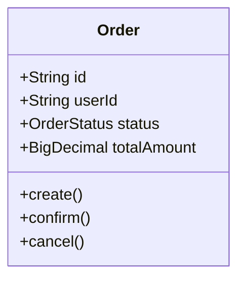
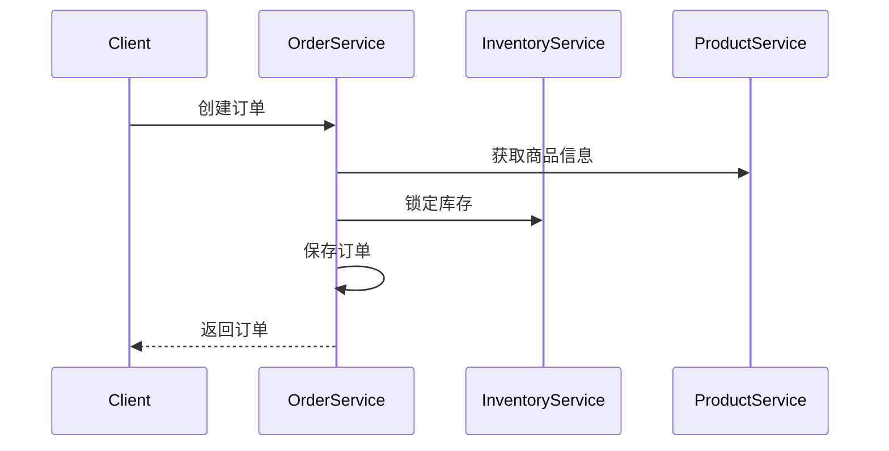

# SDD 模板 (Software Design Document Template)

**用途**: 为AI代码生成提供结构化的设计输入

---

## 使用说明

本模板用于编写软件设计文档(SDD)，作为AI代码生成的输入。填写完整的SDD可以让AI生成更准确、符合规范的代码。

<!-- AI-CONTEXT
SDD是AI代码生成的主要输入。
AI应根据SDD中的设计决策生成代码，包括：
- 遵循指定的设计模式
- 使用定义的数据结构
- 实现描述的业务流程
- 生成对应的测试用例
-->

---

## SDD 模板

```markdown
# [功能名称] 设计文档

**版本**: 1.0
**作者**: @开发者
**日期**: YYYY-MM-DD
**状态**: 草稿 | 评审中 | 已批准

---

## 1. 概述

### 1.1 功能描述
<!-- 一段话描述功能的核心目的和价值 -->

### 1.2 需求来源
- **需求单号**: PRD-XXX
- **用户故事**: 作为[角色]，我想要[功能]，以便[价值]

### 1.3 范围
**包含**:
- [ ] 功能点1
- [ ] 功能点2

**不包含**:
- [ ] 排除项1

---

## 2. 技术设计

### 2.1 设计模式
<!-- AI会根据这里指定的模式生成代码 -->

| 模式 | 应用场景 | 说明 |
|------|----------|------|
| **Builder** | 复杂对象构建 | 用于构建OrderRequest |
| **Strategy** | 支付方式选择 | 支持多种支付渠道 |
| **Observer** | 状态变更通知 | 订单状态变更事件 |

### 2.2 类设计



### 2.3 数据结构

**实体定义**:
```java
@Entity
public class Order {
    @Id
    private String id;

    @Column(nullable = false)
    private String userId;

    @Enumerated(EnumType.STRING)
    private OrderStatus status;

    @Column(precision = 10, scale = 2)
    private BigDecimal totalAmount;

    private LocalDateTime createdAt;
    private LocalDateTime updatedAt;
}
```

**请求/响应DTO**:
```java
@Data
public class CreateOrderRequest {
    @NotBlank
    private String userId;

    @NotEmpty
    private List<OrderItemRequest> items;

    @NotNull
    private AddressRequest shippingAddress;
}

@Data
public class OrderResponse {
    private String id;
    private String userId;
    private String status;
    private BigDecimal totalAmount;
    private LocalDateTime createdAt;
}
```

---

## 3. API 设计

### 3.1 接口定义

| 方法 | 路径 | 描述 |
|------|------|------|
| POST | /api/v1/orders | 创建订单 |
| GET | /api/v1/orders/{id} | 获取订单 |
| PUT | /api/v1/orders/{id}/cancel | 取消订单 |

### 3.2 请求/响应示例

**创建订单**:
```http
POST /api/v1/orders
Content-Type: application/json

{
  "userId": "user-123",
  "items": [
    {
      "productId": "prod-001",
      "quantity": 2
    }
  ],
  "shippingAddress": {
    "province": "浙江省",
    "city": "杭州市",
    "detail": "西湖区xxx路xxx号"
  }
}

Response 201:
{
  "id": "order-456",
  "userId": "user-123",
  "status": "PENDING_PAYMENT",
  "totalAmount": 199.00,
  "createdAt": "2025-11-30T10:15:30Z"
}
```

---

## 4. 业务流程

### 4.1 流程图



### 4.2 业务规则

| 规则 | 描述 | 验证点 |
|------|------|--------|
| BR-001 | 订单金额必须大于0 | Service层 |
| BR-002 | 库存充足才能创建订单 | 调用库存服务 |
| BR-003 | 待支付订单30分钟后自动取消 | 定时任务 |

---

## 5. 异常处理

| 异常场景 | 错误码 | HTTP状态码 | 处理方式 |
|----------|--------|------------|----------|
| 商品不存在 | PRODUCT_NOT_FOUND | 400 | 返回错误信息 |
| 库存不足 | STOCK_INSUFFICIENT | 400 | 返回错误信息 |
| 订单不存在 | ORDER_NOT_FOUND | 404 | 返回错误信息 |

---

## 6. 测试要点

### 6.1 单元测试

- [ ] 正常创建订单
- [ ] 商品不存在时抛出异常
- [ ] 库存不足时抛出异常
- [ ] 订单金额计算正确

### 6.2 集成测试

- [ ] API接口正常响应
- [ ] 数据库数据正确保存
- [ ] 库存服务调用成功

---

## 7. AI 代码生成提示

### 7.1 生成要求

```markdown
请根据以上SDD生成代码，要求：

1. **代码结构**:
   - Controller: OrderController.java
   - Service: OrderService.java, OrderServiceImpl.java
   - Repository: OrderRepository.java
   - Entity: Order.java
   - DTO: CreateOrderRequest.java, OrderResponse.java

2. **设计模式**:
   - 使用Builder模式构建Order对象
   - 使用Strategy模式处理不同支付方式

3. **代码规范**:
   - 遵循项目编码规范
   - 添加必要的Javadoc注释
   - 使用Lombok简化代码

4. **测试代码**:
   - 为每个Service方法生成单元测试
   - 使用JUnit 5 + Mockito
```

---

## 8. 评审检查清单

- [ ] 需求覆盖完整
- [ ] 接口设计合理
- [ ] 异常处理完善
- [ ] 设计模式适用
- [ ] 测试用例充分
```

---

## 变更历史

| 版本 | 日期 | 变更内容 | 作者 |
|------|------|----------|------|
| 1.0 | 2025-11-30 | 初始版本 | @架构师 |
