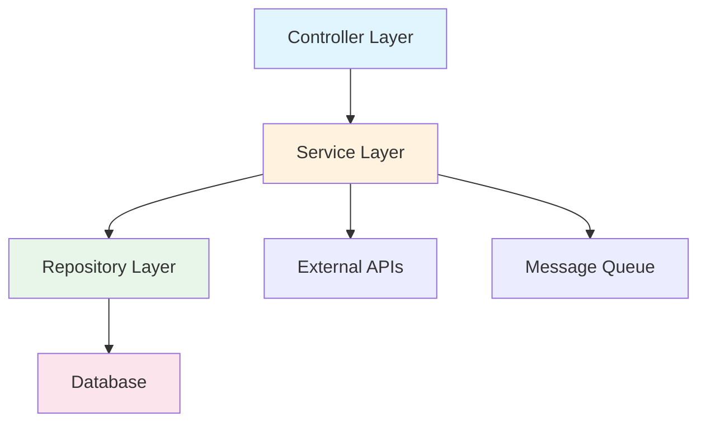

# 代码分层架构总结 (Layer Summary)

**版本**: 1.0
**最后更新**: 2025-11-30

---

## 1. 整体架构图



---

## 2. 目录结构

```
src/main/java/com/company/project/
├── config/                 # 配置类
│   ├── SecurityConfig.java
│   ├── RedisConfig.java
│   └── WebMvcConfig.java
├── controller/             # Controller层
│   ├── UserController.java
│   └── OrderController.java
├── service/                # Service层
│   ├── UserService.java
│   ├── UserServiceImpl.java
│   └── OrderService.java
├── repository/             # Repository层
│   ├── UserRepository.java
│   └── OrderRepository.java
├── entity/                 # 实体类
│   ├── User.java
│   └── Order.java
├── vo/                     # 值对象
│   ├── request/
│   │   ├── CreateUserRequest.java
│   │   └── CreateOrderRequest.java
│   └── response/
│       ├── UserResponse.java
│       └── OrderResponse.java
├── mapper/                 # MyBatis Mapper
│   ├── UserMapper.java
│   └── OrderMapper.java
├── exception/              # 异常类
│   ├── BusinessException.java
│   └── GlobalExceptionHandler.java
└── util/                   # 工具类
    └── DateUtils.java
```

---

## 3. 各层详解

### 3.1 Controller / API 层

**路径**: `src/main/java/com/company/project/controller`

**职责**:
1. 接收和解析 HTTP 请求
2. 参数校验（DTO Validation）
3. 调用 Service 层处理业务逻辑
4. 将 Service 返回结果封装成 HTTP 响应

**禁止**:
- ❌ 包含任何业务逻辑
- ❌ 直接调用 Repository 层
- ❌ 处理事务
- ❌ 直接操作数据库

**示例**:

```java
@RestController
@RequestMapping("/api/v1/users")
@RequiredArgsConstructor
public class UserController {

    private final UserService userService;

    @PostMapping
    public ResponseEntity<UserResponse> createUser(
            @Valid @RequestBody CreateUserRequest request) {
        User user = userService.createUser(request);
        return ResponseEntity.status(HttpStatus.CREATED)
            .body(UserResponse.from(user));
    }

    @GetMapping("/{id}")
    public ResponseEntity<UserResponse> getUser(@PathVariable String id) {
        User user = userService.getUserById(id);
        return ResponseEntity.ok(UserResponse.from(user));
    }
}
```

---

### 3.2 Service / Business Logic 层

**路径**: `src/main/java/com/company/project/service`

**职责**:
1. 编排核心业务逻辑
2. 管理数据库事务 (`@Transactional`)
3. 聚合来自不同 Repository 或外部 API 的数据
4. 处理权限校验
5. 发布领域事件

**禁止**:
- ❌ 处理 HTTP 相关的任何对象（如 `HttpServletRequest`）
- ❌ 返回 HTTP 状态码或响应体结构
- ❌ 直接依赖其他服务的 Controller

**示例**:

```java
@Service
@RequiredArgsConstructor
public class UserServiceImpl implements UserService {

    private final UserRepository userRepository;
    private final PasswordEncoder passwordEncoder;
    private final ApplicationEventPublisher eventPublisher;

    @Override
    @Transactional
    public User createUser(CreateUserRequest request) {
        // 业务规则校验
        if (userRepository.existsByEmail(request.getEmail())) {
            throw new BusinessException("EMAIL_EXISTS", "邮箱已被注册");
        }

        // 创建用户
        User user = User.builder()
            .email(request.getEmail())
            .name(request.getName())
            .password(passwordEncoder.encode(request.getPassword()))
            .status(UserStatus.PENDING)
            .build();

        User saved = userRepository.save(user);

        // 发布事件
        eventPublisher.publishEvent(new UserRegisteredEvent(saved));

        return saved;
    }
}
```

---

### 3.3 Repository / Data Access 层

**路径**: `src/main/java/com/company/project/repository`

**职责**:
1. 与数据持久化层（数据库、缓存）交互
2. 提供原子化的数据读写接口
3. 封装查询逻辑

**禁止**:
- ❌ 包含业务逻辑
- ❌ 管理事务（应由 Service 层管理）
- ❌ 调用外部服务

**示例** (Spring Data JPA):

```java
public interface UserRepository extends JpaRepository<User, String> {

    Optional<User> findByEmail(String email);

    boolean existsByEmail(String email);

    @Query("SELECT u FROM User u WHERE u.status = :status")
    List<User> findByStatus(@Param("status") UserStatus status);
}
```

**示例** (MyBatis Mapper):

```java
@Mapper
public interface UserMapper {

    @Select("SELECT * FROM users WHERE id = #{id}")
    User findById(String id);

    @Insert("INSERT INTO users (id, email, name, password, status) " +
            "VALUES (#{id}, #{email}, #{name}, #{password}, #{status})")
    void insert(User user);
}
```

---

### 3.4 Domain / Entity 层

**路径**: `src/main/java/com/company/project/entity`

**职责**:
1. 定义核心领域对象（Entities, Value Objects）
2. 包含对象自身的业务规则和状态转换
3. 保持领域逻辑的内聚性

**禁止**:
- ❌ 依赖任何其他层（最独立的一层）
- ❌ 包含持久化逻辑
- ❌ 依赖框架注解（除JPA注解）

**示例**:

```java
@Entity
@Table(name = "users")
@Data
@Builder
@NoArgsConstructor
@AllArgsConstructor
public class User {

    @Id
    private String id;

    @Column(unique = true, nullable = false)
    private String email;

    @Column(nullable = false)
    private String name;

    @Column(nullable = false)
    private String password;

    @Enumerated(EnumType.STRING)
    private UserStatus status;

    @Column(name = "created_at")
    private LocalDateTime createdAt;

    // 领域行为
    public void activate() {
        if (this.status != UserStatus.PENDING) {
            throw new IllegalStateException("只有待激活状态的用户可以激活");
        }
        this.status = UserStatus.ACTIVE;
    }

    public void deactivate(String reason) {
        this.status = UserStatus.INACTIVE;
    }
}
```

---

## 4. 数据流向

```
Request → Controller → Service → Repository → Database
                ↓           ↓
           Validation   Transaction
                ↓           ↓
Response ← Controller ← Service ← Repository ← Database
```

---

## 5. 层间依赖规则

| 层 | 可依赖 | 不可依赖 |
|----|--------|----------|
| Controller | Service, VO | Repository, Entity直接 |
| Service | Repository, Entity, 其他Service | Controller |
| Repository | Entity | Service, Controller |
| Entity | 无 | 所有其他层 |

---

## 变更历史

| 版本 | 日期 | 变更内容 | 作者 |
|------|------|----------|------|
| 1.0 | 2025-11-30 | 初始版本 | @技术负责人 |
