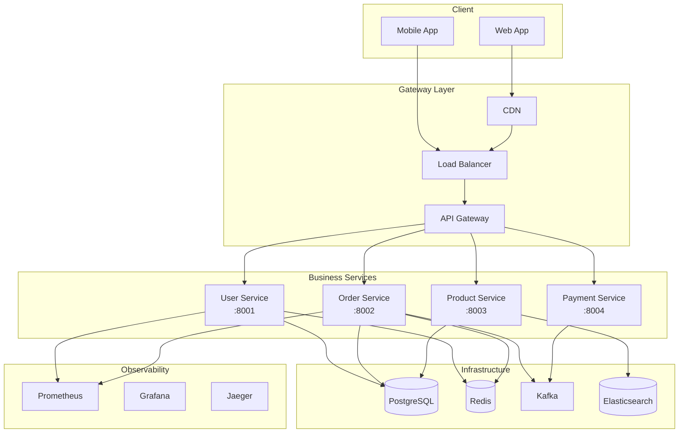
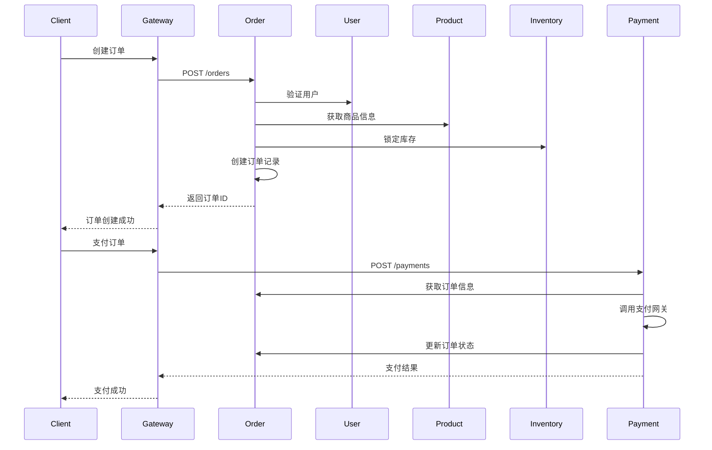

# 系统架构文档 (System Architecture)

**版本**: 1.0
**最后更新**: 2025-11-30
**负责人**: @技术负责人

---

## 1. 架构概述

本系统采用微服务架构，通过API网关统一入口，各服务独立部署、独立扩展。

<!-- AI-CONTEXT
这是项目的系统架构文档。
AI在进行功能开发或架构决策时应参考此文档。
核心服务包括：用户服务、订单服务、商品服务、支付服务。
-->

---

## 2. 架构图

### 2.1 整体架构



### 2.2 服务交互



---

## 3. 分层架构

### 3.1 代码分层

```
┌─────────────────────────────────────────┐
│           Controller Layer              │  ← HTTP请求处理
├─────────────────────────────────────────┤
│            Service Layer                │  ← 业务逻辑
├─────────────────────────────────────────┤
│           Repository Layer              │  ← 数据访问
├─────────────────────────────────────────┤
│            Domain Layer                 │  ← 领域模型
└─────────────────────────────────────────┘
```

### 3.2 各层职责

| 层 | 职责 | 禁止事项 |
|----|------|----------|
| **Controller** | 接收请求、参数校验、返回响应 | 业务逻辑、直接调用Repository |
| **Service** | 业务逻辑、事务管理、编排调用 | HTTP对象、跨服务直接调用 |
| **Repository** | 数据访问、SQL执行 | 业务逻辑、事务管理 |
| **Domain** | 实体定义、领域行为 | 依赖其他层 |

---

## 4. 技术决策

### 4.1 数据库选型

**选择**: PostgreSQL 15

**原因**:
- ACID事务支持，数据一致性要求高
- JSON支持，灵活的数据结构
- 丰富的索引类型
- 开源，无许可费用

### 4.2 缓存策略

**选择**: Redis 7

**使用场景**:
- 会话缓存 (TTL: 30分钟)
- 热点数据缓存 (商品信息，TTL: 5分钟)
- 分布式锁
- 限流计数器

### 4.3 消息队列

**选择**: Kafka

**使用场景**:
- 订单状态变更事件
- 支付回调处理
- 库存同步
- 日志收集

---

## 5. 部署架构

### 5.1 Kubernetes部署

```yaml
# 副本数配置
user-service: 3 replicas
order-service: 5 replicas (核心服务)
product-service: 3 replicas
payment-service: 3 replicas

# 资源配置
resources:
  requests:
    memory: "512Mi"
    cpu: "250m"
  limits:
    memory: "1Gi"
    cpu: "500m"
```

### 5.2 环境配置

| 环境 | 用途 | 数据库 | 副本数 |
|------|------|--------|--------|
| **dev** | 开发测试 | 共享 | 1 |
| **staging** | 集成测试 | 独立 | 2 |
| **production** | 生产环境 | 独立集群 | 3+ |

---

## 6. 非功能性需求

### 6.1 性能指标

| 指标 | 目标 |
|------|------|
| API响应时间 (P99) | < 200ms |
| 吞吐量 | > 1000 QPS |
| 并发用户 | > 10000 |

### 6.2 可用性

| 指标 | 目标 |
|------|------|
| 系统可用性 | 99.9% |
| RTO | < 1小时 |
| RPO | < 5分钟 |

### 6.3 安全性

- 所有API通过HTTPS
- 敏感数据加密存储
- 定期安全扫描
- 访问日志审计

---

## 变更历史

| 版本 | 日期 | 变更内容 | 作者 |
|------|------|----------|------|
| 1.0 | 2025-11-30 | 初始版本 | @技术负责人 |
