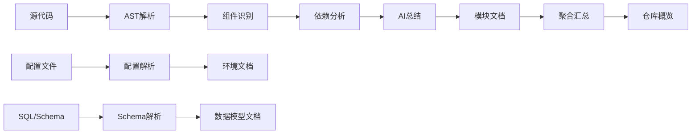

# 代码衍生知识层 (Code-Derived Knowledge Layer)

**版本**: 1.0
**最后更新**: 2025-11-30
**生成工具**: CodeWiki Generator v1.0

---

## 概述

代码衍生知识层是从源代码自动提取、总结和结构化的知识库，专门解决存量项目文档缺失的问题。通过AI分析代码结构、依赖关系和业务逻辑，自动生成可供人类和AI阅读的文档。

<!-- AI-CONTEXT
代码衍生知识层的核心价值：
1. 自动化：从代码自动生成，降低文档维护成本
2. 准确性：直接反映代码实际状态，避免文档过时
3. 结构化：提供统一的组织形式，便于检索和理解
4. 渐进式：支持增量更新，代码变更自动同步
关键原则：代码是唯一真相来源，文档是代码的镜像
-->

---

## 在五层架构中的定位

```
┌─────────────────────────────────────────────────────────────────┐
│                    L0: 企业技术宪法层                            │
│              (Enterprise Constitution)                          │
├─────────────────────────────────────────────────────────────────┤
│                    L1: 领域知识层                                │
│              (Domain Knowledge)                                 │
├─────────────────────────────────────────────────────────────────┤
│                    L2: 项目基座层                                │
│              (Project Foundation)                               │
├─────────────────────────────────────────────────────────────────┤
│                    L3: 实施执行层                                │
│              (Implementation)                                   │
│  ┌─────────────────────────────────────────────────────────┐   │
│  │           L3.5: 代码衍生知识层 (Code-Derived)            │   │
│  │  - 模块文档 (Module Docs)                                │   │
│  │  - 组件关系 (Component Relations)                        │   │
│  │  - API摘要 (API Summary)                                 │   │
│  │  - 数据流图 (Data Flow)                                  │   │
│  └─────────────────────────────────────────────────────────┘   │
├─────────────────────────────────────────────────────────────────┤
│                    L4: 知识演进层                                │
│              (Evolution)                                        │
└─────────────────────────────────────────────────────────────────┘
```

### 为什么放在L3.5?

1. **L3的延伸**: 代码衍生知识是实施执行层的具体产物
2. **连接L3和L4**: 既是当前实现的记录，也是演进的基础
3. **实时性**: 比L3人工文档更新更快，比L4案例更细粒度
4. **互补关系**:
   - L3人工文档: 规范、指南、最佳实践 (应该怎么做)
   - L3.5代码衍生: 模块结构、组件关系、实际实现 (实际是怎么做的)

---

## 知识层级结构

```
code-derived/
├── README.md                    # 本文件
├── generation-config.yaml       # 生成配置
├── metadata.json               # 生成元数据
│
├── overview/                   # 仓库级概览
│   ├── repo-overview.md        # 仓库整体架构
│   ├── module-tree.json        # 模块树结构
│   └── dependency-graph.md     # 依赖关系图
│
├── modules/                    # 模块级文档
│   ├── {module-name}/
│   │   ├── module-doc.md       # 模块文档
│   │   ├── components.json     # 组件清单
│   │   ├── api-summary.md      # API摘要
│   │   └── data-flow.md        # 数据流说明
│   └── ...
│
├── cross-cutting/              # 横切关注点
│   ├── security-patterns.md    # 安全模式
│   ├── error-handling.md       # 异常处理
│   ├── logging-patterns.md     # 日志模式
│   └── config-patterns.md      # 配置模式
│
└── ai-index/                   # AI专用索引
    ├── component-index.json    # 组件索引
    ├── api-index.json          # API索引
    ├── entity-index.json       # 实体索引
    └── pattern-index.json      # 模式索引
```

---

## 生成策略

### 1. 自底向上聚合

```
代码文件 → 类/函数 → 组件 → 模块 → 子系统 → 仓库
   ↓          ↓         ↓        ↓        ↓        ↓
  AST     组件摘要   模块文档  子系统文档  概览文档  架构图
```

### 2. 生成流程



### 3. 增量更新策略

```yaml
update_strategy:
  trigger:
    - git_commit           # 代码提交时
    - scheduled: "daily"   # 定时任务
    - manual               # 手动触发

  scope:
    - changed_files        # 变更文件相关模块
    - dependent_modules    # 依赖该模块的上游

  validation:
    - syntax_check         # 语法检查
    - link_check           # 链接有效性
    - consistency_check    # 与代码一致性
```

---

## 与其他层的交互

### 向上继承 (从L0-L2)

```yaml
# 代码衍生文档会引用上层规范
inheritance:
  l0_principles:
    - "遵循12-Factor原则"
    - "符合安全基线要求"

  l1_domain:
    - "实现领域模型中的聚合根"
    - "遵循领域事件规范"

  l2_architecture:
    - "符合分层架构约定"
    - "使用指定技术栈"
```

### 向下支撑 (为L4提供素材)

```yaml
# 代码衍生知识作为演进层的输入
evolution_support:
  case_studies:
    - "模块重构前后对比"
    - "性能优化效果"

  lessons_learned:
    - "技术债识别"
    - "架构改进点"

  metrics:
    - "代码复杂度变化"
    - "依赖关系健康度"
```

### 双向同步 (与L3)

```yaml
# 与人工文档的同步机制
sync_with_l3:
  # 代码衍生 → 人工文档
  code_to_manual:
    - "发现规范偏离时通知"
    - "补充缺失的API文档"

  # 人工文档 → 代码衍生
  manual_to_code:
    - "规范变更时验证代码"
    - "指南更新时检查实现"
```

---

## AI集成接口

### 1. 结构化索引

```json
{
  "component_index": {
    "format": "json",
    "purpose": "快速定位组件",
    "query_examples": [
      "找到所有Controller",
      "查找实现CustodianProvider接口的类",
      "列出所有Mapper"
    ]
  },

  "api_index": {
    "format": "json",
    "purpose": "API快速查询",
    "query_examples": [
      "GET /wallet/* 的所有接口",
      "需要认证的接口列表",
      "返回PageVO的接口"
    ]
  }
}
```

### 2. AI上下文注入

```markdown
<!-- AI-CONTEXT
模块: custodian-core
职责: BitGo托管服务实现
关键组件: BitGoCustodianProvider, WalletService, AddressService
依赖: custodian-common, wecommon, common-auth
API前缀: /api/v1/custodian/*
数据库: MySQL-Custodian
-->
```

### 3. 查询接口示例

```yaml
# AI可用的查询模式
ai_queries:
  find_implementation:
    query: "找到{interface}的实现类"
    example: "找到CustodianProvider的实现类"

  trace_data_flow:
    query: "追踪{entity}的数据流"
    example: "追踪Wallet实体从Controller到Mapper的流程"

  find_dependencies:
    query: "查找{module}的依赖模块"
    example: "查找custodian-core依赖的所有模块"

  search_pattern:
    query: "搜索{pattern}模式的代码"
    example: "搜索使用了Redis缓存的代码"
```

---

## 生成配置示例

```yaml
# generation-config.yaml
version: "1.0"

# 仓库信息
repository:
  name: "fusioncore-fork1"
  type: "monorepo"
  language: "java"
  framework: "spring-boot"

# 生成策略
generation:
  # AI模型配置
  model:
    provider: "kimi"
    model_id: "kimi-k2-turbo-preview"
    max_tokens: 4096

  # 分析深度
  depth:
    max_level: 3              # 最大层级深度
    include_private: false    # 是否包含私有成员
    include_tests: false      # 是否包含测试代码

  # 输出配置
  output:
    format: "markdown"
    language: "zh-CN"
    include_diagrams: true
    include_examples: true

# 模块配置
modules:
  include:
    - "common/*"
    - "custodian/*"
    - "dweb/*"
    - "trade/*"
  exclude:
    - "**/test/**"
    - "**/generated/**"

# 增量更新
incremental:
  enabled: true
  trigger: "git-hook"
  diff_threshold: 0.3        # 变更超过30%重新生成

# 质量检查
validation:
  check_links: true
  check_consistency: true
  check_completeness: true
```

---

## 使用指南

### 对于开发者

1. **快速了解项目**: 从`overview/repo-overview.md`开始
2. **定位具体模块**: 查看`modules/{module-name}/module-doc.md`
3. **理解数据流**: 参考`modules/{module-name}/data-flow.md`
4. **查找API**: 使用`ai-index/api-index.json`

### 对于AI助手

1. **首先阅读**: `overview/repo-overview.md`获取全局理解
2. **按需查找**: 根据任务类型选择相关模块文档
3. **使用索引**: 利用`ai-index/`快速定位组件
4. **交叉引用**: 结合L3人工文档理解设计意图

### 对于架构师

1. **技术债评估**: 分析代码衍生文档与规范的偏差
2. **演进规划**: 基于现状设计重构方案
3. **知识传承**: 利用自动生成降低新人上手成本

---

## 与人工文档的差异

| 维度 | 人工文档 (L3) | 代码衍生文档 (L3.5) |
|------|--------------|-------------------|
| **生成方式** | 人工编写 | AI自动生成 |
| **更新频率** | 低（易过时）| 高（可自动同步）|
| **内容焦点** | 规范、指南、最佳实践 | 实际结构、组件关系 |
| **准确性** | 可能与代码不一致 | 直接反映代码状态 |
| **深度** | 设计意图、决策背景 | 实现细节、技术描述 |
| **适用场景** | 理解"为什么" | 理解"是什么" |
| **维护成本** | 高 | 低 |

### 互补策略

```
理想状态:
人工文档 (WHY) + 代码衍生 (WHAT) = 完整知识体系

人工文档告诉你:
- 为什么这样设计
- 应该遵循什么规范
- 最佳实践是什么

代码衍生告诉你:
- 实际是怎么实现的
- 组件之间如何交互
- 数据如何流转
```

---

## 变更历史

| 版本 | 日期 | 变更内容 | 作者 |
|------|------|----------|------|
| 1.0 | 2025-11-30 | 初始版本 | @架构师 |
