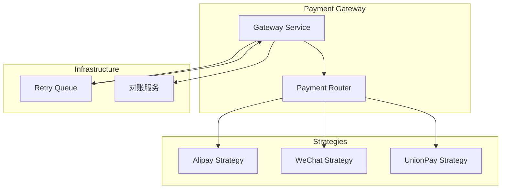

# 架构评审案例: 支付模块重构

**案例编号**: ARCH-CASE-001
**日期**: 2025-11-30
**参与者**: @技术负责人, @支付团队, @架构委员会

---

## 1. 背景

### 1.1 问题描述

原支付模块存在以下问题：
- 单体架构，所有支付渠道逻辑耦合在一起
- 添加新支付渠道需要修改核心代码
- 支付失败重试逻辑分散，难以维护
- 没有统一的对账机制

### 1.2 业务驱动

- 需要快速接入新的支付渠道（银联、Apple Pay）
- 支付成功率需要从95%提升到99%
- 监管要求加强资金安全审计

---

## 2. 方案设计

### 2.1 架构方案

**选择**: 策略模式 + 独立支付网关服务



### 2.2 关键决策

| 决策 | 选择 | 原因 |
|------|------|------|
| 架构模式 | 策略模式 | 支持灵活添加支付渠道 |
| 重试机制 | 消息队列 | 可靠的异步重试 |
| 对账方式 | T+1批量对账 | 符合行业标准 |

---

## 3. 实施过程

### 3.1 阶段划分

| 阶段 | 内容 | 时间 |
|------|------|------|
| Phase 1 | 接口抽象，策略模式改造 | 2周 |
| Phase 2 | 异步重试机制 | 1周 |
| Phase 3 | 对账服务开发 | 2周 |
| Phase 4 | 新渠道接入 | 1周 |

### 3.2 关键代码

```java
// 支付策略接口
public interface PaymentStrategy {
    PaymentResult pay(PaymentRequest request);
    RefundResult refund(RefundRequest request);
    PaymentStatus query(String transactionId);
}

// 策略工厂
@Component
public class PaymentStrategyFactory {
    private final Map<PaymentChannel, PaymentStrategy> strategies;

    public PaymentStrategy getStrategy(PaymentChannel channel) {
        return strategies.get(channel);
    }
}

// 支付服务
@Service
public class PaymentService {
    private final PaymentStrategyFactory factory;

    public PaymentResult pay(PaymentRequest request) {
        PaymentStrategy strategy = factory.getStrategy(request.getChannel());
        return strategy.pay(request);
    }
}
```

---

## 4. 结果评估

### 4.1 量化指标

| 指标 | 改造前 | 改造后 | 提升 |
|------|--------|--------|------|
| 支付成功率 | 95% | 99.2% | +4.2% |
| 新渠道接入时间 | 2周 | 3天 | 78%↓ |
| 代码复杂度 | 高 | 中 | - |

### 4.2 定性评估

**优点**:
- ✅ 扩展性显著提升
- ✅ 代码职责清晰
- ✅ 故障隔离改善

**不足**:
- ⚠️ 服务拆分增加了运维复杂度
- ⚠️ 需要额外的服务发现配置

---

## 5. 经验教训

### 5.1 成功因素

1. **充分的方案评审**: 架构委员会提前识别了风险
2. **渐进式迁移**: 分阶段上线，降低风险
3. **完善的监控**: 全程监控关键指标

### 5.2 改进建议

1. 应该更早进行压测
2. 回滚方案需要更详细
3. 文档应该同步更新

---

## 6. 参考资料

- [ADR-005: 支付架构重构](../../architecture/adr/ADR-005-payment-refactoring.md)
- [支付领域模型](../../../../domain-knowledge/bounded-contexts/payment-domain/domain-model.md)

---

## 变更历史

| 日期 | 变更 | 作者 |
|------|------|------|
| 2025-11-30 | 初始版本 | @技术负责人 |
